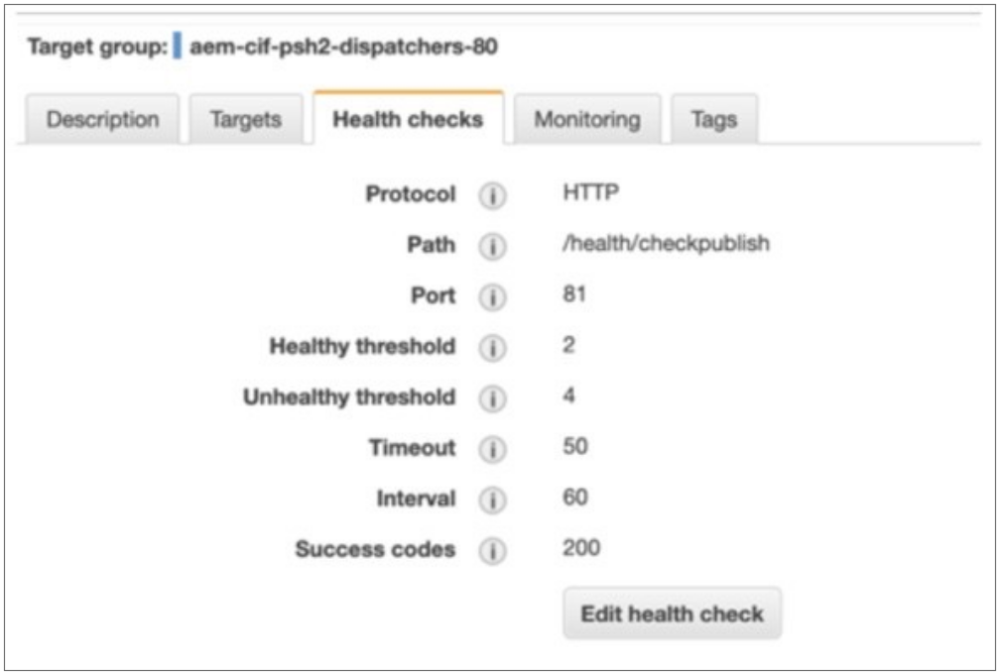
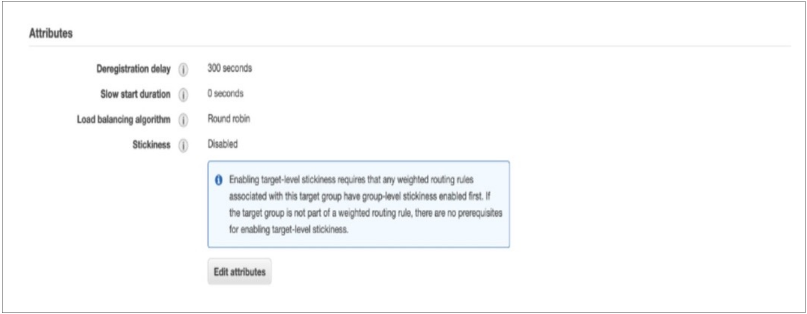
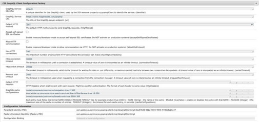
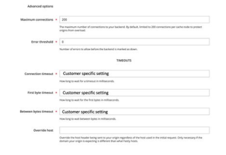

# インフラストラクチャの整合（タイムアウトと接続の制限）

連携が必要なロードバランサーなど、AEMとAdobeコマースおよび周辺のインフラストラクチャには、接続の制限とタイムアウトの設定に関連する設定があります。

これらの制限間のずれは、接続がAEM側で調整され、Adobeコマースではより多くの接続を処理できる一方で、接続が調整される可能性があることを意味します。 同様に、タイムアウト設定では、ずれが生じると、AEM側でタイムアウトエラーが発生し、Adobeコマースが要求を処理中に発生する可能性があります。

タイムアウトの設定については、設定を確認し、整列して、負荷時に503タイムアウトエラーが表示されないようにする必要があります。 確認するインフラストラクチャとアプリケーションのタイムアウト設定はいくつかあります。

## AEMロードバランサー

インフラストラクチャにAWSアプリケーションロードバランサーが存在し、複数のDispatcher/パブリッシャーがあると仮定します。ロードバランサーの場合は、次の設定を考慮する必要があります。

1. パブリッシャーのヘルスチェックは、ディスパッチャーが不必要に早く負荷のサージを受けるのを防ぐために確認する必要があります。 ロードバランサーのヘルスチェックのタイムアウト設定は、パブリッシャーのタイムアウト設定と整合させる必要があります。

   

1. Dispatcherのターゲットグループのスティッキネスを無効にしたり、ラウンドロビンロードバランシングアルゴリズムを使用したりできます。 これは、セッションの定着度を設定する必要があるAEM固有の機能やAEMユーザーセッションが使用されていないと仮定しています。 ユーザーログインとセッション管理は、GraphQLを介したAdobeコマースでのみおこなわれることを前提としています。

   

1. セッションの定着を有効にした場合、Fastlyに対する要求がキャッシュされない可能性があります。これは、デフォルトではFastlyはSet-Cookiesヘッダーを含むページをキャッシュしないからです。 Adobeコマースは、キャッシュ可能なページ(TTL > 0)でもcookieを設定しますが、デフォルトのFastly VCLでは、Fastlyキャッシュが機能するように、キャッシュ可能なページでこれらのcookieを削除します。 ページがキャッシュされていない場合は、使用しているカスタムcookieを確認し、Fastly VCLもアップロードしてサイトを再確認します。

## Dispatcherのタイムアウト設定

Dispatcherの「renders」オプションの/timeoutは、AEMパブリッシュインスタンスにアクセスする接続タイムアウトをミリ秒単位で指定します。 これを確認し、タイムアウト設定を処理する別のロードバランサーが存在する場合は、デフォルト設定の「0」（無期限のタイムアウト）を使用する必要があります。

インフラストラクチャにロードバランサーがない場合は、代わりにdispatcher /timeout設定でタイムアウト設定を指定し、パブリッシャーのGraphQLタイムアウト設定と一致する値を指定する必要があります。

## 発行者

パブリッシャーGraphQL接続の制限とタイムアウト：最初に、AdobeコマースCIF GraphQLクライアント設定ファクトリのOSGI設定の最大HTTP接続数を、デフォルトの最大接続数制限（現在は200に設定）に設定する必要があります。 AEMファームに複数の発行者が存在する場合でも、各発行者で制限を同じに設定し、Fastly設定に一致させる必要があります。 この理由は、関連するDispatcherがファームから取り出された場合など、場合によっては、1つのパブリッシャーが他のパブリッシャーより多くのトラフィックを処理する可能性があるためです。 これは、残りの1つのDispatcherおよびパブリッシャーを通じてすべてのトラフィックがルーティングされることを意味します。この場合、単一のパブリッシャーがすべてのHTTP接続を必要とする可能性があります。

「デフォルトのHTTPメソッド」は、「POST」から「GET」に設定する必要があります。 GETリクエストのみがAdobeコマースGraphQLキャッシュにキャッシュされるので、デフォルトの方法は常にGETに設定する必要があります。

http接続のタイムアウトとhttpソケットのタイムアウトは、Fastlyタイムアウトと一致する値に設定する必要があります。

次の画像は、CIF GraphQL Client Configuration FactoryMagentoを示しています。 以下に示す設定は例のみで、ケースバイケースで調整する必要があります。

次の画像は、Fastlyのバックエンド設定を示しています。 以下に示す設定は例のみで、ケースバイケースで調整する必要があります。

