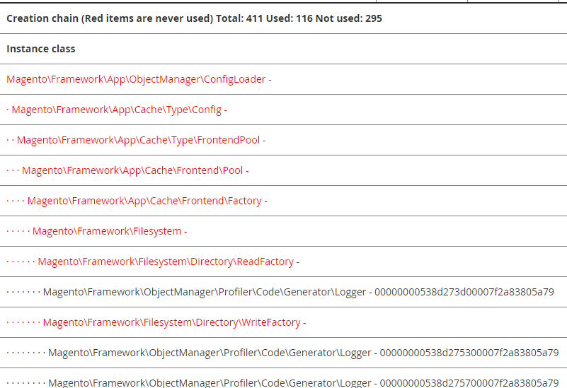

# プロファイルを有効にする

Commerceを使用すると、次のことが可能になります。

- 組み込みのプロファイラーを有効にする。

  Commerceに組み込まれているプロファイラーを使用して、パフォーマンスの分析などのタスクを実行できます。 プロファイリングの性質は、使用する分析ツールによって異なります。 HTMLを含む複数のフォーマットに対応しています。 プロファイラーを有効にすると、プロファイラーが有効になっていて設定されていることを示す`var/profiler.flag` ファイルが生成されます。 無効にすると、このファイルは削除されます。

- Commerce ページに依存関係グラフを表示します。

  _依存関係グラフ_&#x200B;は、オブジェクトの依存関係とそのすべての依存関係、およびそれらの依存関係のすべての依存関係のリストです。

  _未使用の依存関係_&#x200B;のリストに特に関心を持つ必要があります。この依存関係は、あるコンストラクターでリクエストされたために作成されたものの、使用されなかった（つまり、どのメソッドも呼び出されなかった）オブジェクトです。 その結果、これらの依存関係を作成するために費やされたプロセッサ時間とメモリが無駄になります。

Commerceは、[`Magento\Framework\Profiler`](https://github.com/magento/magento2/blob/2.4.8/lib/internal/Magento/Framework/Profiler.php)でベース機能を提供します。

MAGE_PROFILER変数またはコマンドラインを使用して、プロファイラーを有効にして設定できます。

## MAGE_PROFILERを設定

`MAGE_PROFILER`の値は、[ ブートストラップパラメーターの値を設定](../bootstrap/set-parameters.md)で説明したいずれかの方法で設定できます。

`MAGE_PROFILER`は次の値をサポートしています：

- `1`を使用して、特定のプロファイラーの出力を有効にします。

  次のいずれかの値を使用して、特定のプロファイラーを有効にできます。

   - [`Magento\Framework\Profiler\Driver\Standard\Output\Csvfile`](https://github.com/magento/magento2/blob/2.4.8/lib/internal/Magento/Framework/Profiler/Driver/Standard/Output/Csvfile.php)を使用する`csvfile`
   - [`Magento\Framework\Profiler\Driver\Standard\Output\Html`](https://github.com/magento/magento2/blob/2.4.8/lib/internal/Magento/Framework/Profiler/Driver/Standard/Output/Html.php)を使用する空の値を含む、その他の値（`2`を除く）

- `2`を使用して依存関係グラフを有効にします。

  依存関係グラフは通常、ページの下部に表示されます。 次の図は、出力の一部を示しています。

  

## CLI コマンド

CLI コマンドを使用して、プロファイラーを有効または無効にできます。

- `dev:profiler:enable <type>`は、`type`/`html` （デフォルト）または`csvfile`のプロファイラーを有効にします。 有効にすると、フラグファイル `var/profiler.flag`が作成されます。
- `dev:profiler:disable`はプロファイラーを無効にします。 無効にすると、フラグファイル `var/profiler.flag`が削除されます。

依存関係グラフを有効にするには、「変数」オプションを使用します。

**プロファイラーを有効または無効にするには**:

1. Commerce サーバーにログインします。
1. Commerceのインストールディレクトリに移動します。
1. ファイルシステムの所有者として、プロファイラーを有効にします。

   タイプ `html`を使用してプロファイラーを有効にし、フラグファイルを作成するには：

   ```shell
   bin/magento dev:profiler:enable html
   ```

   タイプ `csvfile`を使用してプロファイラーを有効にし、フラグファイルを作成するには：

   ```shell
   bin/magento dev:profiler:enable csvfile
   ```

   出力は`<project-root>/var/log/profiler.csv`に保存されます。 `profiler.csv`は、ページ更新のたびに上書きされます。

   プロファイラーを無効にしてフラグファイルを削除するには：

   ```shell
   bin/magento dev:profiler:disable
   ```

