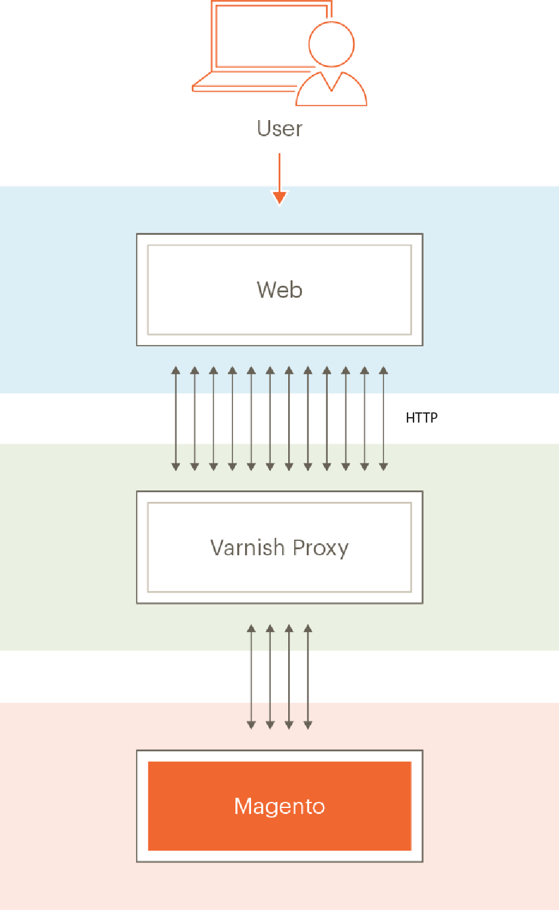
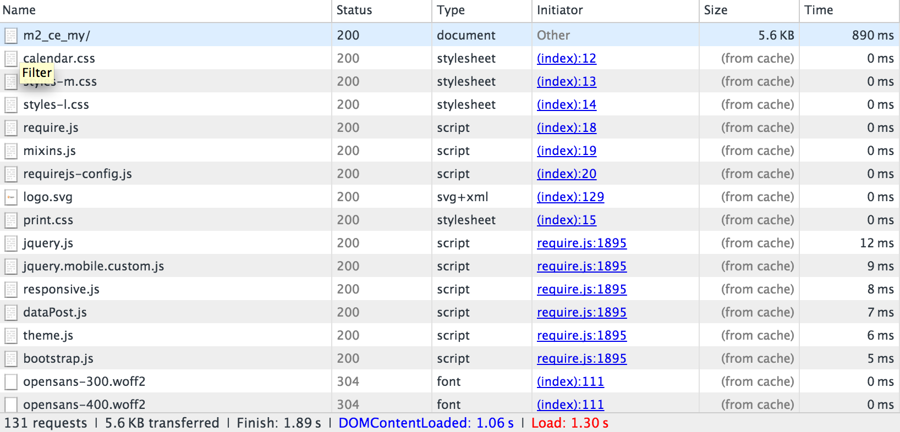

# Varnishの設定と使用

[Varnish Cache](https://www.varnish.org/)は、オープンソースのweb アプリケーションアクセラレータです（_HTTP アクセラレータ_&#x200B;または&#x200B;_キャッシュ HTTP リバースプロキシ_&#x200B;とも呼ばれます）。 Varnishは、ファイルまたはファイルのフラグメントをメモリに保存（またはキャッシュ）します。これにより、Varnishは、将来の同等のリクエストでの応答時間とネットワーク帯域幅の消費を削減できます。 nginxのようなウェブサーバーとは異なり、VarnishはHTTP プロトコルでのみ使用できるように設計されています。

[必要システム構成](../../installation/system-requirements.md)には、サポートされているバージョンのVarnishが一覧表示されます。

>[!WARNING]
>
>本番環境でVarnishを使用することを&#x200B;_強くお勧めします_。 組み込みのフルページキャッシュ（ファイルシステムまたは[&#x200B; データベース &#x200B;](https://developer.adobe.com/commerce/php/development/cache/partial/database-caching/)のいずれか）は、Varnishよりもはるかに低速で、VarnishはHTTP トラフィックを高速化するように設計されています。

Varnishについて詳しくは、次を参照してください。

- [大きなニスの写真](https://www.varnish.org/docs/users-guide/intro/#users-intro)
- [Varnish スタートアップオプション](https://www.varnish.org/docs/users-guide/running/#users-running)
- [VarnishとWeb サイトのパフォーマンス](https://www.varnish.org/docs/users-guide/performance/)

## ニス トポロジ ダイアグラム

次の図は、Commerce トポロジでのVarnishの基本的なビューを示しています。



上記の図では、インターネット経由のユーザーのHTTP リクエストは、CSS、HTML、JavaScript、および画像（総称して&#x200B;_assets_&#x200B;と呼ばれます）に対する多数のリクエストになります。 Varnishはweb サーバーの前に配置され、これらのリクエストをweb サーバーにプロキシします。

Web サーバーがアセットを返す際、キャッシュ可能なアセットはVarnishに保存されます。 これらのアセットに対する後続のリクエストは、Varnishによって処理されます（つまり、リクエストはweb サーバーに到達しません）。 Varnishは、キャッシュされたコンテンツを非常に迅速に返します。 これにより、コンテンツをユーザーに返す応答時間が短縮され、Commerceで処理する必要があるリクエストの数が減りました。

VarnishによってキャッシュされたAssetsは、設定可能な間隔で期限切れになるか、同じアセットの新しいバージョンに置き換えられます。 管理者または[`magento cache:clean`](../cli/manage-cache.md#clean-and-flush-cache-types) コマンドを使用して、キャッシュを手動でクリアすることもできます。

## プロセスの概要

このトピックでは、最小限のパラメーターのセットを使用してVarnishを最初にインストールし、それが機能することをテストする方法について説明します。 次に、Commerce管理者からVarnish設定を書き出して、もう一度テストします。

このプロセスは、次のように要約できます。

1. Varnishをインストールし、任意のCommerce ページにアクセスしてテストし、Varnishが動作していることを示すHTTP レスポンスヘッダーを取得しているかどうかを確認します。
1. Commerce ソフトウェアをインストールし、Adminを使用してVarnish設定ファイルを作成します。
1. 既存のVarnish設定ファイルを、管理者が生成したVarnish設定ファイルに置き換えます。
1. すべてを再テスト。

   `<magento_root>/var/page_cache` ディレクトリに何も含まれていない場合は、CommerceでVarnishを正常に設定しました。

>[!NOTE]
>
>記載されている場合を除き、このトピックで説明されているすべてのコマンドを`root`権限を持つユーザーとして入力する必要があります。

## 既知の問題

Varnishには次の問題があります。

- [VarnishはSSLをサポートしていません](https://www.varnish-cache.org/docs/3.0/phk/ssl.html)

  代わりに、SSL ターミネーションまたはSSL ターミネーション プロキシを使用します。

- `<magento_root>/var/cache` ディレクトリの内容を手動で削除する場合は、Varnishを再起動する必要があります。

- Commerceのインストール中に発生する可能性のあるエラー：

  ```text
  Error 503 Service Unavailable
  Service Unavailable
  XID: 303394517
  Varnish cache server
  ```

  このエラーが発生した場合は、次のように`default.vcl`を編集し、`backend` スタンザにタイムアウトを追加します。

  ```conf
  backend default {
      .host = "127.0.0.1";
      .port = "8080";
      .first_byte_timeout = 600s;
  }
  ```

## Varnish キャッシュの概要

一般的なnginx ベースのデプロイメントでは、Varnishはポート 80で受信HTTP トラフィックを受け入れ、8080などのバックエンドポートでnginxにリクエストを転送します。 Adobe Commerceは、オリジン web サーバーに`nginx.conf.sample`を提供し、管理者からVarnish `default.vcl`を生成します。

- [`nginx.conf.sample`](https://github.com/magento/magento2/blob/2.4/nginx.conf.sample)がAdobe Commerceで提供されました
- [管理者](../cache/configure-varnish-commerce.md)から`default.vcl`が生成されました

>[!INFO]
>
>このトピックでは、前のリストのデフォルトオプションのみを取り上げます。 複雑なシナリオ（コンテンツ配信ネットワークの使用など）でキャッシュを設定する方法は、他にも数多くあります。これらの方法は、このガイドの範囲を超えています。

最初のブラウザーリクエストでは、キャッシュ可能なアセットがVarnishからクライアントブラウザーに配信され、ブラウザーにキャッシュされます。

さらに、Varnishでは、静的アセットにエンティティタグ（ETag）を使用しています。 ETagは、静的ファイルがサーバー上で変更されたかどうかを判断する方法を提供します。 その結果、静的アセットは、ブラウザーからの新しいリクエストまたはクライアントがブラウザーのキャッシュを更新する際（通常はF5またはControl+F5を押す）に、サーバー上で変更されたときにクライアントに送信されます。

詳細については、後の節を参照してください。

## ブラウザーリクエストによるキャッシュ

このセクションでは、ブラウザーインスペクターを使用して、最初のリクエストでアセットがブラウザーに配信され、その後ローカルブラウザーキャッシュから読み込まれる方法を示します。

### 最初のブラウザーリクエスト

`nginx.conf.sample`と`.htaccess`は、クライアント キャッシュ用のオプションを提供します。 キャッシュ可能なオブジェクトに対してブラウザから最初のリクエストが行われると、Varnishはそれをクライアントに配信します。

次の図は、ブラウザーインスペクターを使用した例を示しています。


前述の例は、ストアフロントのメインページ （`m2_ce_my`）に対するリクエストを示しています。 CSSおよびJavaScript アセットは、クライアントブラウザーにキャッシュされます。

>[!NOTE]
>
>ほとんどの静的アセットには、HTTP 200 （OK）ステータスコードがあり、アセットがサーバーから取得されたことを示します。

### 2回目のブラウザーリクエスト

同じブラウザーが同じページを再度要求した場合、これらのアセットはローカルブラウザーキャッシュから配信されます（次の図を参照）。



1回目と2回目のリクエストの応答時間の違いに注意してください。 繰り返しますが、静的アセットは200 （OK）の応答コードを持ちます。これは、ローカルキャッシュから初めて配信されるからです。

## CommerceでEtagを使用する方法

次の例は、特定の静的アセットの応答ヘッダーを示しています。


`calendar.css`にはETag応答ヘッダーがあります。これは、クライアントブラウザー上のCSS ファイルとサーバー上のCSS ファイルを比較できることを意味します。

さらに、次の図に示すように、静的アセットは304 （未変更） HTTP ステータスコードで返されます。

と同じであることを示します

304 ステータスコードは、ユーザーがローカルキャッシュを無効にし、サーバー上のコンテンツが変更されなかったために発生します。 304 ステータスコードのため、静的アセット _content_&#x200B;は転送されません。HTTP ヘッダーのみがブラウザーにダウンロードされます。

コンテンツがサーバー上で変更された場合、クライアントはHTTP 200 （OK）ステータスコードと新しいETagを含む静的アセットをダウンロードします。

