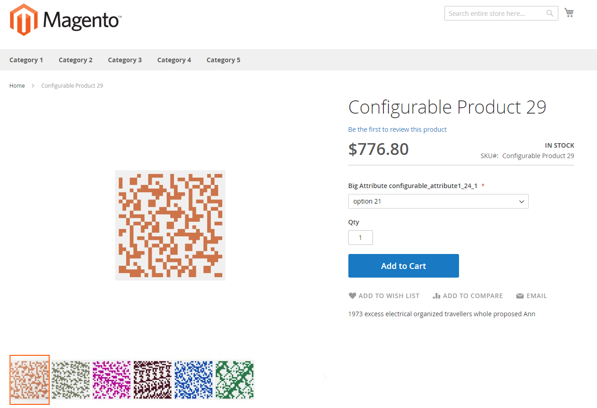

# パフォーマンステストデータ

## プロファイル

_プロファイル_ （小、中、大、および超大）を使用して、作成するデータ量を調整できます。 プロファイルは`<magento_root>/setup/performance-toolkit/profiles/<ce|ee>` ディレクトリにあります。

例：`/var/www/html/magento2/setup/performance-toolkit/profiles/ce`

次の図は、_small_ プロファイルを使用してストアフロントに製品がどのように表示されるかを示しています。



次の表に、データジェネレータープロファイルの詳細を示します。small、medium、large、およびextra largeです。

| パラメーター | スモールプロファイル | Medium profile | Mediumのマルチサイトプロファイル | 大きなプロフィール | 非常に大きなプロファイル |
| --- | --- | --- | --- | --- | --- |
| `websites` | 1 | 3 | 25 | 5 | 5 |
| `store_groups` | 1 | 3 | 25 | 5 | 5 |
| `store_views` | 1 | 3 | 50 | 5 | 5 |
| `simple_products` | 800 | 24,000 | 4,000 | 300,000 | 600,000 |
| `configurable_products` | 16 （24 オプション） | 640 （24 オプション） | 800 （24 オプション）、79 （200 オプション） | 8,000軒、オプションは24件 | 16,000軒、オプションは24件 |
| `product_images` | 100枚/1商品あたり3枚の画像 | 1000枚の画像/1商品あたり3枚の画像 | 1000枚の画像/1商品あたり3枚の画像 | 2000枚の画像/1製品あたり3枚の画像 | 2000枚の画像/1製品あたり3枚の画像 |
| `categories` | 30 | 300 | 100 | 3,000 | 6,000 |
| `categories_nesting_level` | 3 | 3 | 3 | 5 | 5 |
| `catalog_price_rules` | 20 | 20 | 20 | 20 | 20 |
| `catalog_target_rules` | 5 | 5 | 5 | 5 | 5 |
| `cart_price_rules` | 20 | 20 | 20 | 20 | 20 |
| `cart_price_rules_floor` | 2 | 2 | 2 | 2 | 2 |
| `customers` | 200 | 2,000 | 2,000 | 5,000 | 10,000 |
| `tax rates` | 130 | 40,000 | 40,000 | 40,000 | 40,000 |
| `orders` | 80 | 50,000 | 50,000 | 100,000 | 150,000 |

### データジェネレーターの実行

{{file-system-owner}}

>[!WARNING]
>
>データジェネレーターを実行する前に、サーバー上で実行されているすべてのcron ジョブを無効にします。 cron ジョブを無効にすると、データ ジェネレーターがアクティブなcron ジョブと競合するアクションを実行できなくなり、不要なエラーを回避できます。
>
>パフォーマンスのテスト中に[!DNL Adobe I/O Events for Adobe Commerce]を使用してイベントを実装する場合は、[events](https://developer.adobe.com/commerce/extensibility/events/)をサブスクライブする前に、このコマンドを実行してください。 最初にイベントを購読すると、エラーが発生する可能性があります。

この節で説明するようにコマンドを実行します。 コマンドの実行後、すべてのインデクサーを[&#x200B; インデックス再作成](../cli/manage-indexers.md)する必要があります。

コマンドオプション：

```shell
bin/magento setup:perf:generate-fixtures <path-to-profile>
```

ここで、`<path-to-profile>`は、プロファイルへの絶対ファイルシステムパスとプロファイルの名前を指定します。

以下に例を挙げます。

```shell
bin/magento setup:perf:generate-fixtures /var/www/html/magento2/setup/performance-toolkit/profiles/ce/small.xml
```

スモールプロファイルの出力の例：

```text
Generating profile with following params:
    |- Websites: 1
    |- Store Groups Count: 1
    |- Store Views Count: 1
    |- Categories: 30
    |- Attribute Sets (Default): 3
    |- Attribute Sets (Extra): 10
    |- Simple products: 800
    |- Configurable products: 0
    |--- 5 products for attribute set "Attribute Set 1"
    |--- 5 products for attribute set "Attribute Set 2"
    |--- 5 products for attribute set "Attribute Set 3"
    |--- 40 products for attribute set "Dynamic Attribute Set 1-24"
    |- Product images: 100, 3 per product
    |- Customers: 200
    |- Cart Price Rules: 20
    |- Catalog Price Rules: 20
    |- Catalog Target Rules: 5
    |- Orders: 80
Generating websites, stores and store views...  done in <time>
Generating categories...  done in <time>
Generating attribute sets...  done in <time>
Generating simple products...  done in <time>
... more ...
```

## パフォーマンス修正

### 管理者ユーザー

管理者ユーザーを生成します。 XML プロファイルノード：

```xml
<!-- Number of admin users -->
<admin_users>{int}</admin_users>
```

### 属性セット

指定した設定で属性セットを生成します。 XML プロファイルノード：

```xml
<!-- Number of product attribute sets -->
<product_attribute_sets>{int}</product_attribute_sets>

<!-- Number of attributes per set -->
<product_attribute_sets_attributes>{int}</product_attribute_sets_attributes>

<!-- Number of values per attribute -->
<product_attribute_sets_attributes_values>{int}</product_attribute_sets_attributes_values>
```

### バンドル製品

バンドル製品を生成します。 生成されたバンドル選択は、カタログに個別に表示されません。 製品はカテゴリーやweb サイトごとに均一に分布します。 プロファイルの`assign_entities_to_all_websites`が`1`に設定されている場合。 製品はすべてのWeb サイトに割り当てられます。

XML プロファイルノード：

```xml
<!-- Number of products -->
<bundle_products>{int}</bundle_products>

<!-- Number of options per each product -->
<bundle_products_options>{int}</bundle_products_options>

<!-- Number of simple products per each option -->
<bundle_products_variation>{int}</bundle_products_variation>
```

### カートの価格ルール

買い物かごの価格ルールを生成します。 XML プロファイルノード：

```xml
<!-- Number of cart price rules -->
<cart_price_rules>{int}</cart_price_rules>

<!-- Number of conditions per rule -->
<cart_price_rules_floor>{int}</cart_price_rules_floor>
```

### カタログ価格ルール

カタログ価格ルールを生成します。 XML プロファイルノード：

```xml
<!-- Number of catalog price rules -->
<catalog_price_rules>{int}</catalog_price_rules>
```

### カテゴリ

カテゴリを生成します。 `assign_entities_to_all_websites`が`0`に設定されている場合、すべてのカテゴリがルートカテゴリごとに一様に分布されます。そうでない場合、すべてのカテゴリが1つのルートカテゴリに割り当てられます。

XML プロファイルノード：

```xml
<!-- Number of categories to generate -->
<categories>{int}</categories>

<!-- Nesting level of categories -->
<categories_nesting_level>{int}</categories_nesting_level>
```

### 設定

設定フィールドの値を設定します。 XML プロファイルノード：

```xml
<!-- Config variables and values for change -->
<configs>
    <config>
        <path>{string}</path> <!-- e.g. admin/security/use_form_key -->
        <scope>{string}</scope> <!-- e.g. default -->
        <scopeId>{int}</scopeId>
        <value>{int|string}</value>
    </config>

    <!-- ... more entries ... -->
</configs>
```

### コンフィグ商品

設定可能な製品を生成します。 生成された設定可能なオプションは、カタログに個別に表示されません。 製品はカテゴリーやweb サイトごとに均一に分布します。 `assign_entities_to_all_websites`が`1`に設定されている場合、製品はすべてのweb サイトに割り当てられます。

次のXML ノード形式がサポートされています。

- デフォルトおよび事前定義済みの属性セットごとの分布：

  ```xml
  <!-- Number of configurable products -->
  <configurable_products>{int}</configurable_products>
  ```

- 既存の属性セットに基づいて製品を生成します。

  ```xml
  <configurable_products>
  
      <config>
              <!-- Existing attribute set name -->
              <attributeSet>{string}</attributeSet>
  
              <!-- Configurable sku pattern with %s -->
              <sku>{string}</sku>
  
              <!-- Number of configurable products -->
              <products>{int}</products>
  
              <!-- Category Name. Optional. By default category name from Categories fixture will be used -->
              <category>[{string}]</category>
  
              <!-- Type of Swatch attribute e.g. color|image -->
              <swatches>{string}</swatches>
      </config>
  
  <!-- ... more entries ... -->
  </configurable_products>
  ```

- 指定された数の属性とオプションを持つ動的に作成された属性セットに基づいて製品を生成します。

  ```xml
  <configurable_products>
  
      <config>
          <!-- Number of attributes in configurable product -->
          <attributes>{int}</attributes>
  
          <!-- Number of options per attribute -->
          <options>{int}</options>
  
          <!-- Configurable sku pattern with %s -->
          <sku>{string}</sku>
  
          <!-- Number of configurable products -->
          <products>{int}</products>
  
          <!-- Category Name. Optional. By default category name from Categories fixture will be used -->
          <category>[{string}]</category>
  
          <!-- Type of Swatch attribute e.g. color|image -->
          <swatches>{string}</swatches>
      </config>
  
      <!-- ... more entries ... -->
  </configurable_products>
  ```

- 各属性ごとに指定された設定で動的に作成された属性セットに基づいて製品を生成します。

  ```xml
  <configurable_products>
  
      <config>
          <attributes>
              <!-- Configuration for a first attribute -->
              <attribute>
                  <!-- Amount of options per attribute -->
                  <options>{int}</options>
  
                  <!-- Type of Swatch attribute -->
                  <swatches>{string}</swatches>
              </attribute>
  
              <!-- Configuration for a second attribute -->
              <attribute>
                  <!-- Amount of options per attribute -->
                  <options>{int}</options>
              </attribute>
          </attributes>
  
          <!-- Configurable sku pattern with %s -->
          <sku>{string}</sku>
  
          <!-- Number of configurable products -->
          <products>{int}</products>
  
          <!-- Category Name. Optional. By default, the category name from Categories fixture will be used -->
          <category>[{string}]</category>
      </config>
  
      <!-- ... more entries ... -->
  </configurable_products>
  ```

### 顧客

顧客を生成する： 顧客は、利用可能なすべてのweb サイトで通常の配布を行います。 各顧客には、顧客のメールアドレス、顧客グループ、顧客アドレス以外の同じデータがあります。

XML プロファイルノード：

```xml
<!-- Number of customers to generate -->
<customers>{int}</customers>
```

次のXMLを使用して、顧客設定を変更できます。

```xml
<customer-config>
    <!-- Number of addresses per each customer -->
    <addresses-count>{int}</addresses-count>
</customer-config>
```

### 製品画像

製品画像を生成。 生成にはサイズ変更は含まれていません。

XML プロファイルノード：

```xml
<product-images>
    <!-- Number of images to generate -->
    <images-count>{int}</images-count>

    <!-- Number of images to be assigned per each product -->
    <images-per-product>{int}</images-per-product>
</product-images>
```

### インデクサーの状態

インデクサーの状態を更新します。 XML プロファイルノード：

```xml
<indexer>
    <!-- Name of indexer (e.g. catalogrule_product) -->
    <id>{string}</id>
    <set_scheduled>{bool}</set_scheduled>
</indexer>
```

### 注文

異なるタイプの注文項目を設定可能な数で注文を生成します。 オプションで、生成された注文の非アクティブな見積もりを生成します。

XML プロファイルノード：

```xml
<!-- It is necessary to enable quotes for orders -->
<order_quotes_enable>{bool}</order_quotes_enable>

<!-- Min number of simple products per each order -->
<order_simple_product_count_from>{int}</order_simple_product_count_from>

<!-- Max number of simple products per each order -->
<order_simple_product_count_to>{int}</order_simple_product_count_to>

<!-- Min number of configurable products per each order -->
<order_configurable_product_count_from>{int}</order_configurable_product_count_from>

<!-- Max number of configurable products per each order -->
<order_configurable_product_count_to>{int}</order_configurable_product_count_to>

<!-- Min number of big configurable products (with big amount of options) per each order -->
<order_big_configurable_product_count_from>{int}</order_big_configurable_product_count_from>

<!-- Max number of big configurable products (with big amount of options) per each order -->
<order_big_configurable_product_count_to>{int}</order_big_configurable_product_count_to>

<!-- Number of orders to generate -->
<orders>{int}</orders>
```

### シンプルな商品

シンプルな商品を生成： 製品は、デフォルトおよび事前に定義された属性セットごとに配布されます。 プロファイルで次のように追加の属性セットが指定されている場合は、追加の属性セットごとに製品も配布されます。`<product_attribute_sets>{int}</product_attribute_sets>`

製品はカテゴリーやweb サイトごとに均一に分布します。 `assign_entities_to_all_websites`が`1`に設定されている場合、製品はすべてのweb サイトに割り当てられます。

XML プロファイルノード：

```xml
<!-- Number of simple products to generate -->
<simple_products>{int}</simple_products>
```

### web サイト

web サイトを生成： XML プロファイルノード：

```xml
<!-- Number of websites to be generated -->
<websites>{int}</websites>
```

### ストアグループ

ストアグループを生成します（管理者では&#x200B;_stores_&#x200B;と呼ばれます）。 ストアグループは、通常、web サイト間で分散されます。

XML プロファイルノード：

```xml
<!-- Number of store groups to be generated -->
<store_groups>{int}</store_groups>
```

### ストアビュー

ストアビューを生成します。 ストアビューは、通常、ストアグループ間で分散されます。 XML プロファイルノード：

```xml
<!-- Number of store views to be generated -->
<store_views>{int}</store_views>

<!-- 1 means that all stores will have the same root category, 0 means that all stores will have unique root category -->
<assign_entities_to_all_websites>{0|1}<assign_entities_to_all_websites/>
```

### 税率

税率を生成します。 XML プロファイルノード：

```xml
<!-- Accepts name of CSV file with tax rates (<path to Commerce folder>/setup/src/Magento/Setup/Fixtures/_files) -->
<tax_rates_file>{CSV file name}</tax_rates_file>
```

## 追加の設定情報：

- `<Commerce root dir>/setup/performance-toolkit/config/attributeSets.xml` - デフォルトの属性セット

- `<Commerce root dir>/setup/performance-toolkit/config/customerConfig.xml` – 顧客設定

- `<Commerce root dir>/setup/performance-toolkit/config/description.xml` – 製品の詳細な説明設定

- `<Commerce root dir>/setup/performance-toolkit/config/shortDescription.xml` – 製品の簡単な説明の設定

- `<Commerce root dir>/setup/performance-toolkit/config/searchConfig.xml` – 製品の短い説明と完全な説明の設定。 この古い実装は、下位互換性のために提供されています。

- `<Commerce root dir>/setup/performance-toolkit/config/searchTerms.xml` – 短く完全な説明を入力する検索語句の数が少ない

- `<Commerce root dir>/setup/performance-toolkit/config/searchTermsLarge.xml` – 短く完全な説明で使用する検索語句の数が多い。
