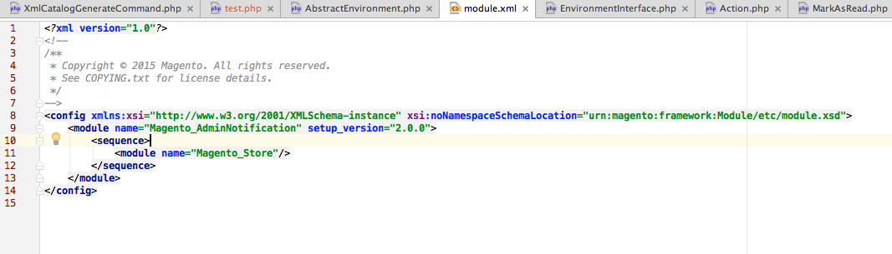

# URN ハイライトの概要

{{file-system-owner}}

コマースコードは、すべての XSD スキーマを [URN (Uniform Resource Name)](https://www.ietf.org/rfc/rfc2141.txt). コードを開発し、XSD を参照する必要がある場合、このコマンドは、URN を認識してハイライト表示するように統合開発環境 (IDE) を設定します。 これにより、開発が容易になります。

デフォルトでは、PhpStorm のような IDE は URN を認識するように設定されておらず、その結果、次のように赤いテキストで表示されます。


この `bin/magento dev:urn-catalog:generate` コマンドを使用すると、IDE（現在は PhpStorm と Visual Studio Code のみ）で次のように URN を認識し、ハイライト表示できます。



特に、このコマンドは次の PhpStorm 設定を作成します。


## IDE の設定

現在は、PhpStorm と Visual Studio Code のみがサポートされています。

コマンド構文：

```bash
bin/magento dev:urn-catalog:generate <path>
```

ここで、 `<path>` は、PhpStorm へのパスです。 `misc.xml` ファイル。プロジェクトのルートを基準とした場所です。 通常、 `<path>` が `.idea/misc.xml`.

>[!INFO]
>
>「スキーマと DTD」を最新の状態に保つには、 `dev:urn-catalog:generate` コマンドを実行します。 `*.xsd` ファイル。
