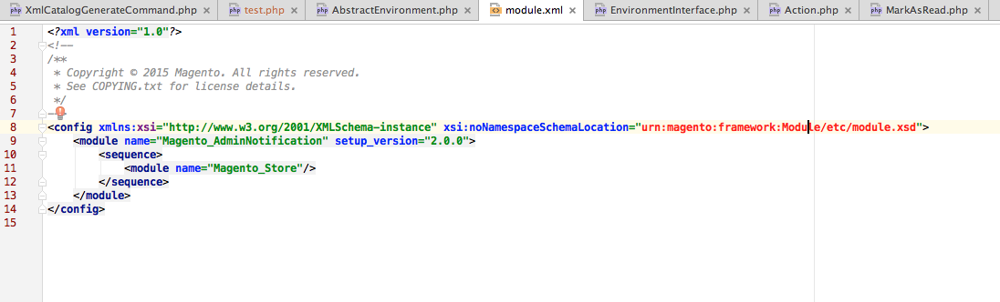
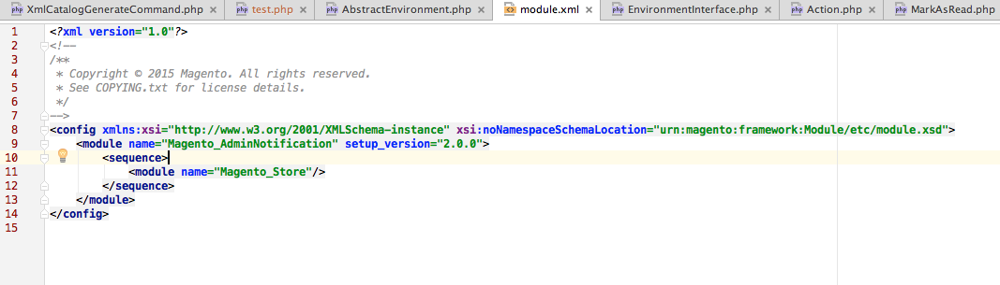
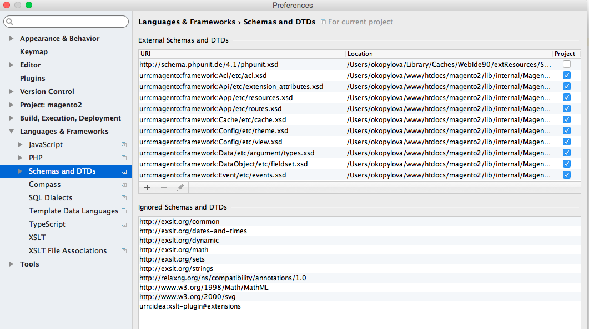

# URN ハイライターの概要

{{file-system-owner}}

Commerce コードは、すべてのXSD スキーマを[Uniform Resource Names （URN） &#x200B;](https://www.ietf.org/rfc/rfc2141.txt)として参照します。 コードを開発しており、XSDを参照する必要がある場合、このコマンドは、URNを認識してハイライト表示するように統合開発者環境（IDE）を設定します。 これにより、開発が容易になります。

デフォルトでは、PhpStormのようなIDEはURNを認識するように設定されていないため、次のように赤いテキストで表示されます。

を認識するように設定されていません

`bin/magento dev:urn-catalog:generate` コマンドを使用すると、IDE （現在はPhpStormとVisual Studio Codeのみ）で、次のようなURNを認識して強調表示できます。



具体的には、このコマンドは次のPhpStorm設定を作成します。



## IDEの設定

現在、サポートされているのはPhpStormとVisual Studio Codeのみです。

コマンドの構文：

```shell
bin/magento dev:urn-catalog:generate <path>
```

ここで、`<path>`は、プロジェクトのルートに関連するPhpStorm `misc.xml` ファイルへのパスです。 通常、`<path>`は`.idea/misc.xml`です。

>[!INFO]
>
>「スキーマとDTD」を最新の状態に保つには、`*.xsd` ファイルを含むCommerce 2 モジュールを追加、変更、削除するたびに`dev:urn-catalog:generate` コマンドを実行します。
