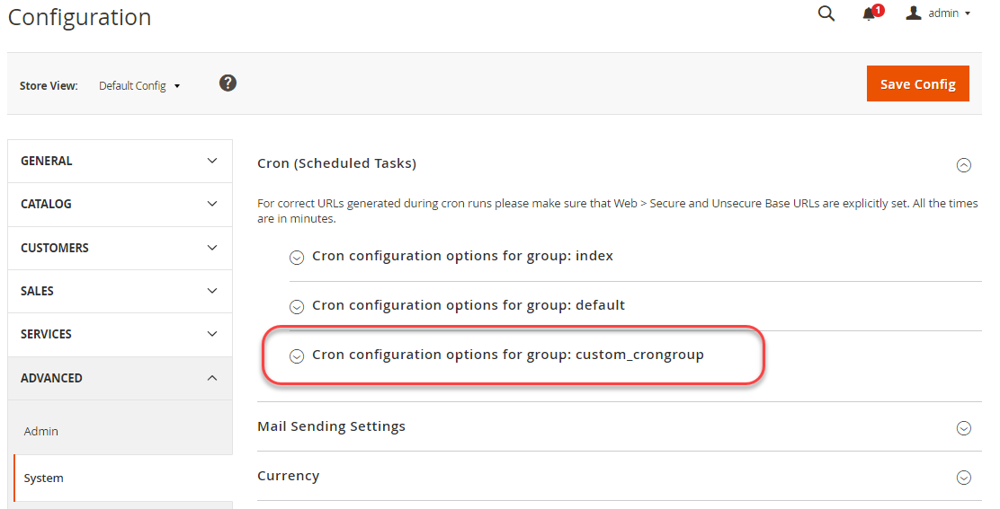

# カスタム cron ジョブの設定

このステップバイステップのチュートリアルでは、サンプルモジュールでカスタム cron ジョブとオプションでcron グループを作成する方法を説明します。 既に持っているモジュールを使用するか、[`magento2-samples` リポジトリ ](https://github.com/magento/magento2-samples)のサンプルモジュールを使用できます。

cron ジョブを実行すると、cron ジョブの名前`custom_cron`を持つ行が`cron_schedule` テーブルに追加されます。

また、オプションでcron グループを作成する方法も示します。このグループを使用すると、Commerce アプリケーションのデフォルト以外の設定でカスタム cron ジョブを実行できます。

このチュートリアルでは、次の要素を想定しています。

- Commerce アプリケーションが`/var/www/html/magento2`にインストールされています
- Commerce データベースのユーザー名とパスワードは両方`magento`です
- すべてのアクションは、[ ファイルシステム所有者](../../installation/prerequisites/file-system/overview.md)として実行します

## 手順1：サンプルモジュールを入手する

カスタム cron ジョブを設定するには、サンプルモジュールが必要です。 `magento-module-minimal` モジュールをお勧めします。

既にサンプルモジュールがある場合は、それを使用できます。この手順と次の手順をスキップして、「手順3:cronを実行するクラスの作成」に進みます。

**サンプルモジュールを取得するには**:

1. [ ファイルシステム所有者](../../installation/prerequisites/file-system/overview.md)としてCommerce サーバーにログインするか、切り替えます。
1. Commerce アプリケーションルート以外のディレクトリ（ホームディレクトリなど）に移動します。
1. [`magento2-samples` リポジトリ ](https://github.com/magento/magento2-samples)を複製します。

   ```shell
   git clone git@github.com:magento/magento2-samples.git
   ```

   エラー`Permission denied (publickey).`でコマンドが失敗した場合は、[SSH公開鍵をGitHub.com](https://docs.github.com/en/authentication/connecting-to-github-with-ssh/adding-a-new-ssh-key-to-your-github-account)に追加する必要があります。

1. サンプルコードをコピーするディレクトリを作成します。

   ```shell
   mkdir -p /var/www/html/magento2/app/code/Magento/SampleMinimal
   ```

1. サンプル モジュール コードをコピーします。

   ```shell
   cp -r ~/magento2-samples/sample-module-minimal/* /var/www/html/magento2/app/code/Magento/SampleMinimal
   ```

1. ファイルが正しくコピーされていることを確認します。

   ```shell
   ls -al /var/www/html/magento2/app/code/Magento/SampleMinimal
   ```

   次の結果が表示されます。

   ```text
   drwxrwsr-x.   4 magento_user apache  4096 Oct 30 13:19 .
   drwxrwsr-x. 121 magento_user apache  4096 Oct 30 13:19 ..
   -rw-rw-r--.   1 magento_user apache   372 Oct 30 13:19 composer.json
   drwxrwsr-x.   2 magento_user apache  4096 Oct 30 13:19 etc
   -rw-rw-r--.   1 magento_user apache 10376 Oct 30 13:19 LICENSE_AFL.txt
   -rw-rw-r--.   1 magento_user apache 10364 Oct 30 13:19 LICENSE.txt
   -rw-rw-r--.   1 magento_user apache  1157 Oct 30 13:19 README.md
   -rw-rw-r--.   1 magento_user apache   270 Oct 30 13:19 registration.php
   drwxrwsr-x.   3 magento_user apache  4096 Oct 30 13:19 Test
   ```

1. Commerce データベースとスキーマを更新します。

   ```shell
   bin/magento setup:upgrade
   ```

1. キャッシュをクリーニングします。

   ```shell
   bin/magento cache:clean
   ```

## 手順2：サンプルモジュールの確認

続行する前に、サンプルモジュールが登録され、有効になっていることを確認します。

1. 次のコマンドを実行します。

   ```shell
   bin/magento module:status Magento_SampleMinimal
   ```

1. モジュールが有効になっていることを確認します。

   ```text
   Module is enabled
   ```

>[!TIP]
>
>出力が`Module does not exist`を示している場合は、[手順1](#step-1-get-a-sample-module)を慎重に確認してください。 コードが正しいディレクトリにあることを確認します。 スペルと大文字と小文字が重要です。何か異なる場合は、モジュールは読み込まれません。 また、`magento setup:upgrade`を実行することを忘れないでください。

## 手順3: cronを実行するクラスを作成する

この手順では、cron ジョブを作成する簡単なクラスを示します。 クラスは、正常に設定されていることを確認する行を`cron_schedule` テーブルにのみ書き込みます。

クラスを作成するには：

1. クラスのディレクトリを作成し、そのディレクトリに変更します。

   ```shell
   mkdir /var/www/html/magento2/app/code/Magento/SampleMinimal/Cron && cd /var/www/html/magento2/app/code/Magento/SampleMinimal/Cron
   ```

1. そのディレクトリに次の内容を含む`Test.php`という名前のファイルを作成しました：

   ```php
   <?php
   namespace Magento\SampleMinimal\Cron;
   
   use Psr\Log\LoggerInterface;
   
   class Test {
       protected $logger;
   
       public function __construct(LoggerInterface $logger) {
           $this->logger = $logger;
       }
   
      /**
       * Write to system.log
       *
       * @return void
       */
       public function execute() {
           $this->logger->info('Cron Works');
       }
   }
   ```

## 手順4: `crontab.xml`を作成

`crontab.xml` ファイルは、カスタム cron コードを実行するスケジュールを設定します。

`crontab.xml`を`/var/www/html/magento2/app/code/Magento/SampleMinimal/etc` ディレクトリに次のように作成します。

```xml
<?xml version="1.0"?>
<config xmlns:xsi="http://www.w3.org/2001/XMLSchema-instance" xsi:noNamespaceSchemaLocation="urn:magento:module:Magento_Cron:etc/crontab.xsd">
    <group id="default">
        <job name="custom_cronjob" instance="Magento\SampleMinimal\Cron\Test" method="execute">
            <schedule>* * * * *</schedule>
        </job>
    </group>
</config>
```

前の`crontab.xml`では、1分に1回`Magento/SampleMinimal/Cron/Test.php` クラスが実行され、その結果、行が`cron_schedule` テーブルに追加されます。

Cron スケジュールを管理者から設定可能にするには、システム設定フィールドの設定パスを使用します。

```xml
<?xml version="1.0"?>
<config xmlns:xsi="http://www.w3.org/2001/XMLSchema-instance" xsi:noNamespaceSchemaLocation="urn:magento:module:Magento_Cron:etc/crontab.xsd">
    <group id="default">
        <job name="custom_cronjob" instance="Magento\SampleMinimal\Cron\Test" method="execute">
            <config_path>system/config/path</config_path>
        </job>
    </group>
</config>
```

ここで、`system/config/path`は、モジュールの`etc/adminhtml/system.xml`で定義されたシステム構成パスです。

## 手順5：コンパイルとキャッシュの削除

次のコマンドでコードをコンパイルします。

```shell
bin/magento setup:di:compile
```

次のコマンドを使用してキャッシュをクリーニングします。

```shell
bin/magento cache:clean
```

## 手順6:cron ジョブの確認

この手順では、`cron_schedule` データベース テーブルでSQL クエリを使用して、カスタム cron ジョブを正常に検証する方法を示します。

cronを検証するには：

1. Commerce cron ジョブの実行：

   ```shell
   bin/magento cron:run
   ```

1. `magento cron:run` コマンドを2～3回入力します。

   最初にコマンドを入力すると、ジョブがキューに入ります。その後、cron ジョブが実行されます。 コマンド _を2回以上入力する必要があります。_

1. SQL クエリ `SELECT * from cron_schedule WHERE job_code like '%custom%'`を次のように実行します。

   1. `mysql -u magento -p`を入力
   1. `mysql>` プロンプトで、`use magento;`と入力します
   1. `SELECT * from cron_schedule WHERE job_code like '%custom%';`を入力

      その結果は次のようになります。

      ```text
      +-------------+----------------+---------+----------+---------------------+---------------------+---------------------+---------------------+
      | schedule_id | job_code       | status  | messages | created_at        | scheduled_at        | executed_at         | finished_at     |
      +-------------+----------------+---------+----------+---------------------+---------------------+---------------------+---------------------+
      |        3670 | custom_cronjob | success | NULL     | 2016-11-02 09:38:03 | 2016-11-02 09:38:00 | 2016-11-02 09:39:03 | 2016-11-02 09:39:03 |
      |        3715 | custom_cronjob | success | NULL     | 2016-11-02 09:53:03 | 2016-11-02 09:53:00 | 2016-11-02 09:54:04 | 2016-11-02 09:54:04 |
      |        3758 | custom_cronjob | success | NULL     | 2016-11-02 10:09:03 | 2016-11-02 10:09:00 | 2016-11-02 10:10:03 | 2016-11-02 10:10:03 |
      |        3797 | custom_cronjob | success | NULL     | 2016-11-02 10:24:03 | 2016-11-02 10:24:00 | 2016-11-02 10:25:03 | 2016-11-02 10:25:03 |
      +-------------+----------------+---------+----------+---------------------+---------------------+---------------------+---------------------+
      ```

1. （オプション）メッセージがCommerceのシステムログに書き込まれていることを確認します。

   ```shell
   cat /var/www/html/magento2/var/log/system.log
   ```

   次のような1つ以上のエントリが表示されます。

   ```text
   [2016-11-02 22:17:03] main.INFO: Cron Works [] []
   ```

   これらのメッセージは、`Test.php`の`execute` メソッドから送信されます。

   ```php
   public function execute() {
        $this->logger->info('Cron Works');
   ```

SQL コマンドとシステム ログにエントリが含まれていない場合は、`magento cron:run` コマンドをもう数回実行して待ちます。 データベースの更新には時間がかかる場合があります。

## 手順7 （オプション）：カスタム cron グループの設定

この手順では、カスタム cron グループをオプションで設定する方法を示します。 カスタム cron ジョブを他のcron ジョブとは異なるスケジュール（通常は1分に1回）で実行する場合や、複数のカスタム cron ジョブを異なる設定で実行する場合は、カスタム cron グループを設定する必要があります。

カスタム cron グループを設定するには：

1. `crontab.xml`をテキストエディターで開きます。
1. `<group id="default">`を`<group id="custom_crongroup">`に変更
1. テキストエディターを終了します。
1. 次の内容で`/var/www/html/magento2/app/code/Magento/SampleMinimal/etc/cron_groups.xml`を作成します。

   ```xml
   <?xml version="1.0"?>
   <config xmlns:xsi="http://www.w3.org/2001/XMLSchema-instance" xsi:noNamespaceSchemaLocation="urn:magento:module:Magento_Cron:etc/cron_groups.xsd">
       <group id="custom_crongroup">
           <schedule_generate_every>1</schedule_generate_every>
           <schedule_ahead_for>4</schedule_ahead_for>
           <schedule_lifetime>2</schedule_lifetime>
           <history_cleanup_every>10</history_cleanup_every>
           <history_success_lifetime>60</history_success_lifetime>
           <history_failure_lifetime>600</history_failure_lifetime>
           <use_separate_process>1</use_separate_process>
       </group>
   </config>
   ```

オプションの意味については、[crons リファレンスのカスタマイズ ](custom-cron-reference.md)を参照してください。

## 手順8：カスタム cron グループの確認

この&#x200B;_オプション_&#x200B;手順では、管理者を使用してカスタム cron グループを検証する方法を示します。

カスタム cron グループを確認するには：

1. カスタムグループのCommerce cron ジョブを実行します。

   ```shell
   php /var/www/html/magento2/bin/magento cron:run --group="custom_crongroup"
   ```

   コマンドを少なくとも2回実行します。

1. キャッシュをクリーニングします。

   ```shell
   php /var/www/html/magento2/bin/magento cache:clean
   ```

1. 管理者としてAdminにログインします。
1. **Stores** > **Settings** > **Configuration** > **Advanced** > **System**&#x200B;をクリックします。
1. 右側のウィンドウで、**Cron**&#x200B;を展開します。

   cron グループは次のように表示されます。

   

