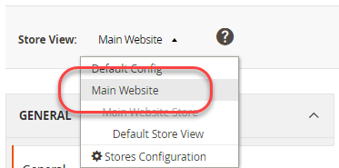
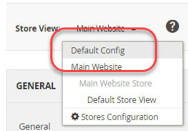
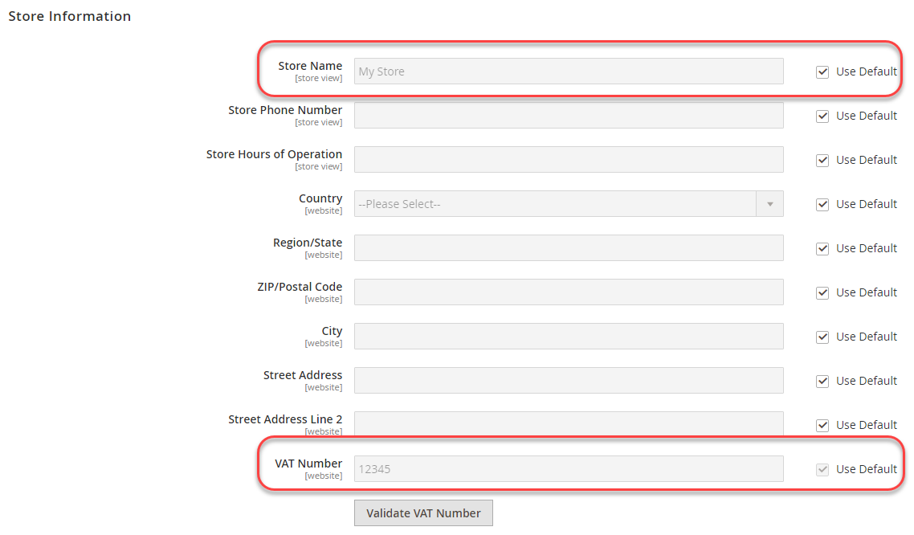
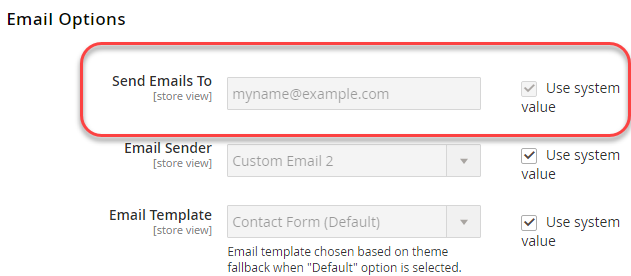
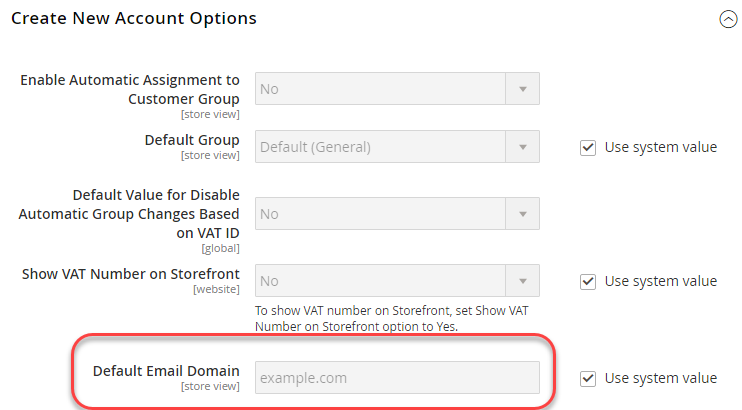

# 環境変数の使用例

この例では、開発システムで共有、システム固有、および機密性の高い値を設定し、共有設定、`config.php`、およびPHP環境変数の組み合わせを使用して実稼動システムのすべての値を設定する方法を示します。

これらの設定設定は、開発システムと実稼動システムの間で共有できます。

VAT番号とストア名（**Stores**/設定/**Configuration**/一般/**General**）

これらの設定設定は、次に示すように、システム固有または機密性の高いものです。

- **ストア**/設定/**設定**/一般/**連絡先**&#x200B;から（機密）に電子メールを送信します
- **ストア**/設定/**設定**/顧客/**顧客設定**/**新しいアカウントオプションの作成**&#x200B;からのデフォルトの電子メールドメイン（システム固有）

同じ手順を使用して、次の参照の設定を行うことができます。

- [機密性の高いシステム固有の設定パスの参照](../reference/config-reference-sens.md)
- [支払設定パスの参照](../reference/config-reference-payment.md)
- [一般設定パスのリファレンス](../reference/config-reference-general.md)
- [Commerce Enterprise B2B拡張機能の設定パスのリファレンス](../reference/config-reference-b2b.md)

## 始める前に

開始する前に、[開発、ビルド、および実稼動システムの前提条件](../deployment/prerequisites.md)で説明されているように、ファイルシステムの権限と所有権を設定します。

## 前提条件

このトピックでは、実稼動システムの設定を変更する例を示します。 必要に応じて、様々な設定オプションを選択できます。

この例では、次の要素を想定しています。

- Git ソースコントロールを使用します
- 開発システムは、`mconfig`という名前のGit リモート リポジトリで利用できます
- Git作業ブランチの名前は`m2.2_deploy`です

## 手順1：開発システムでの設定

開発システムでデフォルトのロケールとウェイトの単位を設定するには：

1. Adminにログインします。
1. **ストア** / 設定/**構成** / 一般/**一般**&#x200B;をクリックします。
1. 複数のweb サイトを利用できる場合は、左上隅の&#x200B;**ストアビュー** リストを使用して、次の図に示すように別のweb サイトに切り替えます。

   

1. 右側のペインで、**ストア情報**&#x200B;を展開します。
1. 必要に応じて、**VAT番号** フィールドの横にある「**デフォルトを使用**」チェックボックスをオフにします。
1. フィールドに数値を入力します（例：`12345`）。
1. 「**ストア名**」フィールドに、値（`My Store`など）を入力します。
1. 「**設定を保存**」をクリックします。
1. 次の図に示すように、**ストアビュー** リストを使用して、**デフォルト設定**&#x200B;を選択します。

   

1. 左側のナビゲーションの「一般」で、「**連絡先**」をクリックします。
1. 「**メールを**&#x200B;に送信」フィールドの横にある「**デフォルトを使用**」チェックボックスをオフにします。
1. フィールドに電子メールアドレスを入力します。
1. 「**設定を保存**」をクリックします。
1. 左側のペインで、顧客/**顧客設定**&#x200B;をクリックします。
1. 右側のペインで、**新しいアカウントオプションを作成**&#x200B;を展開します。
1. 「**デフォルトの電子メールドメイン**」フィールドの横にある「**システム値を使用**」チェックボックスをオフにします。
1. フィールドにドメイン名を入力します。
1. 「**設定を保存**」をクリックします。
1. プロンプトが表示されたら、キャッシュをフラッシュします。

## 手順2：設定の更新

管理者で設定を変更したので、この節で説明するように、共有設定をファイルに書き込みます。

{{$include /help/_includes/config-save-config.md}}

`app/etc/env.php` （システム固有の設定）は更新されましたが、ソース管理にチェックインしないでください。 この手順では、後ほど実稼動システムで同じ設定設定を作成します。

## 手順3：ビルドシステムの更新とファイルの生成

これで、共有設定への変更をソース管理にコミットしたので、ビルドシステムでそれらの変更を取得し、コードをコンパイルして静的ファイルを生成できます。 最後のステップは、本番システムに変更を取り込むことです。

{{$include /help/_includes/config-update-build-system.md}}

## 手順4：実稼動システムの更新

このプロセスの最後のステップは、本番システムを更新することです。 次の2つの部分で行う必要があります。

- 機密性の高いシステム固有の設定を更新する
- 共有設定の更新

### 機密性の高いシステム固有の設定を更新する

環境変数を使用して機密性の高い設定とシステム固有の設定を設定するには、次の点を把握しておく必要があります。

- 各設定の範囲

  手順1の手順に従った場合、メールの送信先の範囲はグローバル（つまり、デフォルトの設定スコープ）になり、デフォルトのメールドメインの範囲はweb サイトになります。

  デフォルトのメールドメイン設定値を設定するには、web サイトのコードを知っている必要があります。 環境変数を見つける方法について詳しくは、[環境変数を使用して構成設定を上書きする](../reference/override-config-settings.md#environment-variables)を参照してください。

- 各設定の設定パス

  この例で使用される設定パスは次のとおりです。

  | 設定名 | 設定パス |
  |--------------|--------------|
  | メール送信先 | `contact/email/recipient_email` |
  | デフォルトのメールドメイン | `customer/create_account/email_domain` |

  すべての機密性の高い設定パスとシステム固有の設定パスは、[機密性の高い設定パスとシステム固有の設定パスのリファレンス ](../reference/config-reference-sens.md)で確認できます。

#### 設定パスを変数名に変換する

[環境変数を使用して構成設定を上書きする](../reference/override-config-settings.md#environment-variables)で説明したように、変数の形式は次のとおりです。

```text
<SCOPE>__<SYSTEM__VARIABLE__NAME>
```

`<SCOPE>`の値は、グローバル スコープの場合は`CONFIG__DEFAULT__`、web サイト スコープの場合は`CONFIG__WEBSITES__<WEBSITE CODE>`です。

`<SYSTEM__VARIABLE__NAME>`の値を見つけるには、設定パスの各`/`文字を2つのアンダースコアに置き換えます。

変数名は次のようになります。

| 名前 | 設定パス | 変数名 |
|--------------|--------------|--------------|
| メール送信先 | `contact/email/recipient_email` | `CONFIG__DEFAULT__CONTACT__EMAIL__RECIPIENT_EMAIL` |
| デフォルトのメールドメイン | `customer/create_account/email_domain` | `CONFIG__WEBSITES__BASE__CUSTOMER__CREATE_ACCOUNT__EMAIL_DOMAIN` |

>[!INFO]
>
>上記の表には、デフォルトのメールドメイン設定用のweb サイトコードのサンプル `BASE`があります。 `BASE`をストアに適したweb サイト コードに置き換えます。

#### 環境変数を使用した変数の設定

次の形式を使用して、`index.php`で変数値を設定できます。

```php
$_ENV['VARIABLE'] = 'value';
```

**変数値を設定するには**:

1. 本番システムにファイルシステム所有者としてログインするか、ファイルシステム所有者に切り替えます。
1. `<Commerce root dir>/pub/index.php`をテキストエディターで開きます。
1. `index.php`の任意の場所で、次のような変数の値を設定します。

   ```php
   $_ENV['CONFIG__DEFAULT__CONTACT__EMAIL__RECIPIENT_EMAIL'] = 'myname@example.com';
   $_ENV['CONFIG__WEBSITES__BASE__CUSTOMER__CREATE_ACCOUNT__EMAIL_DOMAIN'] = 'magento.com';
   ```

1. 変更を`pub/index.php`に保存して、テキストエディターを終了します。
1. 次のセクションに進みます。

### 共有設定の更新

この節では、開発およびビルドシステムで行ったすべての変更を取得し、共有構成設定（ストア名とVAT番号）を更新する方法について説明します。

{{$include /help/_includes/config-update-prod-system.md}}

### 管理者の構成設定の確認

この節では、実稼動システム管理者の設定設定を確認する方法について説明します。

**構成設定を確認するには**:

1. 実稼動システムの管理者にログインします。
1. **ストア** / 設定/**構成** / 一般/**一般**&#x200B;をクリックします。
1. 左上隅の&#x200B;**ストアビュー** リストを使用して、別のweb サイトに切り替えます。

   開発システムで設定した共有設定オプションは、次のように表示されます。

   

   >[!INFO]
   >
   >「**ストア名**」フィールドはweb サイト スコープで編集可能ですが、「既定の構成」スコープに切り替えると、編集できません。 これは、開発システムでオプションを設定した結果です。 **VAT番号**&#x200B;の値は、web サイトの範囲で編集できません。

1. まだ行っていない場合は、デフォルトの設定スコープに切り替えます。
1. 左側のナビゲーションの「一般」で、「**連絡先**」をクリックします。

   次の図に示すように、**メールを**&#x200B;に送信フィールドは編集できません。 これは機密性の高い設定です。

   

1. 左側のペインで、顧客/**顧客設定**&#x200B;をクリックします。
1. 右側のペインで、**新しいアカウントオプションを作成**&#x200B;を展開します。

   「**デフォルトの電子メールドメイン**」フィールドの値は、次のように表示されます。 これはシステム固有の設定です。

   

<!-- Last updated from includes: 2026-04-17 13:49:36 -->
