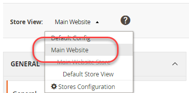

# 環境変数の使用例

この例では、開発システムで共有値、システム固有値、機密値を設定し、共有設定を組み合わせて本番システムのすべての値を設定する方法を示します。 `config.php`、および PHP 環境変数。

これらの設定は、開発システムと実稼動システムの間で共有できます。

VAT 番号および店舗名：自 **ストア** /設定/ **設定** /一般/ **一般**

これらの設定は、次に示すように、システム固有または機密のいずれかです。

- 次のメール送信先（機密）: **ストア** /設定/ **設定** /一般/ **連絡先**
- 次のデフォルトの電子メールドメイン（システム固有） **ストア** /設定/ **設定** /お客様 > **顧客設定** > **新しいアカウントオプションの作成**

同じ手順を使用して、次の参照で設定を構成できます。

- [機密性の高いシステム固有の設定パスの参照](../reference/config-reference-sens.md)
- [支払設定パスの参照](../reference/config-reference-payment.md)
- [一般的な設定パスの参照](../reference/config-reference-general.md)
- [Commerce Enterprise B2B 拡張機能の設定パスのリファレンス](../reference/config-reference-b2b.md)

## 始める前に

開始する前に、ファイルシステムの権限と所有権を設定します。詳しくは、 [開発、ビルド、実稼動システムの前提条件](../deployment/prerequisites.md).

## 前提

このトピックでは、実稼動システムの設定を変更する例を示します。 必要に応じて、別の設定オプションを選択できます。

この例では、次のような場合を想定しています。

- Git ソース管理を使用している
- この開発システムは、という名前の Git リモートリポジトリで使用できます。 `mconfig`
- Git の作業ブランチに次の名前が付けられています： `m2.2_deploy`

## 手順 1：開発システムでの設定

開発システムでデフォルトのロケールと重み付けの単位を設定するには、次の手順に従います。

1. 管理者にログインします。
1. クリック **ストア** /設定/ **設定** /一般/ **一般**.
1. 複数の Web サイトがある場合は、 **ストア表示** のリストを使用して、別の Web サイトに切り替えます。次の図に示すように。

   

1. 右側のウィンドウで、を展開します。 **ストア情報**.
1. 必要に応じて、 **デフォルトを使用** 横のチェックボックス **VAT 番号** フィールドに入力します。
1. フィールドに数値を入力します ( 例： `12345`) をクリックします。
1. Adobe Analytics の **ストア名** フィールドに値を入力します ( 例： `My Store`) をクリックします。
1. クリック **設定を保存**.
1. 以下を使用します。 **ストア表示** リストを使用して選択 **デフォルトの設定** を次の図に示します。

   

1. 左側のナビゲーションで、「一般」の下の「 **連絡先**.
1. 次をクリア： **デフォルトを使用** 横のチェックボックス **メール送信先** フィールドに入力します。
1. 「 」フィールドに電子メールアドレスを入力します。
1. クリック **設定を保存**.
1. 左側のウィンドウで、「顧客」/ **顧客設定**.
1. 右側のウィンドウで、を展開します。 **新しいアカウントオプションの作成**.
1. 次をクリア： **システム値を使用** 横のチェックボックス **デフォルトの電子メールドメイン** フィールドに入力します。
1. 「 」フィールドにドメイン名を入力します。
1. クリック **設定を保存**.
1. プロンプトが表示されたら、キャッシュをフラッシュします。

## 手順 2：設定の更新

管理で設定を変更したら、この節で説明するように、共有設定をファイルに書き込みます。

{{$include /help/_includes/config-save-config.md}}

なお、 `app/etc/env.php` （システム固有の設定）が更新されました。ソース管理にチェックインしないでください。 本番システムに同じ設定を、この手順の後半で作成します。

## 手順 3：ビルドシステムを更新し、ファイルを生成する

共有構成に対する変更をソース管理にコミットしたので、ビルドシステムで変更をプルし、コードをコンパイルし、静的ファイルを生成できます。 最後の手順は、変更内容を実稼動システムにプルすることです。

{{$include /help/_includes/config-update-build-system.md}}

## 手順 4：実稼動システムの更新

このプロセスの最後の手順は、実稼動システムを更新することです。 次の 2 つの部分で実行する必要があります。

- 機密設定とシステム固有の設定を更新する
- 共有設定を更新

### 機密設定とシステム固有の設定を更新する

環境変数を使用して機密性の高い設定とシステム固有の設定を行うには、次の点に注意する必要があります。

- 各設定の範囲

  手順 1 の手順に従った場合、「 Send Emails To 」の範囲はグローバル（デフォルト設定範囲）で、「 Default Email Domain 」の範囲は Web サイトです。

  「デフォルトの電子メールドメイン」設定値を設定するには、Web サイトのコードを把握しておく必要があります。 詳しくは、 [環境変数を使用して設定を上書きする](../reference/override-config-settings.md#environment-variables) を参照してください。

- 各設定の設定パス

  この例で使用される設定パスは次のとおりです。

  | 設定名 | 設定パス |
  |--------------|--------------|
  | メール送信先 | `contact/email/recipient_email` |
  | デフォルトの電子メールドメイン | `customer/create_account/email_domain` |

  機密性の高いシステム固有の設定パスは、 [機密性の高いシステム固有の設定パスの参照](../reference/config-reference-sens.md).

#### 設定パスを変数名に変換する

詳しくは、 [環境変数を使用して設定を上書きする](../reference/override-config-settings.md#environment-variables)に値を設定する場合、変数の形式は次のようになります。

```text
<SCOPE>__<SYSTEM__VARIABLE__NAME>
```

の値 `<SCOPE>` 次に該当 `CONFIG__DEFAULT__` グローバルスコープの場合、または `CONFIG__WEBSITES__<WEBSITE CODE>` （web サイトの範囲の場合）。

の値を検索するには、以下を実行します。 `<SYSTEM__VARIABLE__NAME>`、各 `/` 文字に 2 個のアンダースコアを付けます。

次に、変数名を示します。

| 名前 | 設定パス | 変数名 |
|--------------|--------------|--------------|
| メール送信先 | `contact/email/recipient_email` | `CONFIG__DEFAULT__CONTACT__EMAIL__RECIPIENT_EMAIL` |
| デフォルトの電子メールドメイン | `customer/create_account/email_domain` | `CONFIG__WEBSITES__BASE__CUSTOMER__CREATE_ACCOUNT__EMAIL_DOMAIN` |

>[!INFO]
>
>前述の表には、サンプルの Web サイトコードが含まれています。 `BASE`（「デフォルトの電子メールドメイン」設定）。 置換 `BASE` を、お客様のストアに適した web サイトコードと共に使用します。

#### 環境変数を使用した変数の設定

変数の値は、 `index.php` 次の形式を使用します。

```php
$_ENV['VARIABLE'] = 'value';
```

**変数値を設定するには**:

1. 本番システムに、ファイルシステムの所有者としてログインするか、ファイルシステムの所有者に切り替えます。
1. 開く `<Commerce root dir>/pub/index.php` をクリックします。
1. の任意の場所 `index.php`で、次のような変数の値を設定します。

   ```php
   $_ENV['CONFIG__DEFAULT__CONTACT__EMAIL__RECIPIENT_EMAIL'] = 'myname@example.com';
   $_ENV['CONFIG__WEBSITES__BASE__CUSTOMER__CREATE_ACCOUNT__EMAIL_DOMAIN'] = 'magento.com';
   ```

1. 変更をに保存します。 `pub/index.php` をクリックし、テキストエディタを終了します。
1. 次の節に進みます。

### 共有設定を更新

この項では、開発システムおよびビルドシステムで行ったすべての変更を取り込む方法を説明します。この変更により、共有構成設定（ストア名と VAT 番号）が更新されます。

{{$include /help/_includes/config-update-prod-system.md}}

### 管理での設定の確認

このセクションでは、実稼動システム管理で設定を確認する方法について説明します。

**設定を確認するには**:

1. 実稼動システムの管理者にログインします。
1. クリック **ストア** /設定/ **設定** /一般/ **一般**.
1. 以下を使用します。 **ストア表示** リストを使用して、別の Web サイトに切り替えることができます。

   開発システムで設定した共有設定オプションは、次のように表示されます。

   

   >[!INFO]
   >
   >The **ストア名** フィールドは web サイトスコープで編集可能ですが、デフォルト設定スコープに切り替えた場合、編集できません。 これは、開発システムでオプションを設定する方法の結果です。 の値 **VAT 番号** は、Web サイトの範囲では編集できません。

1. まだ設定していない場合は、デフォルト設定範囲に切り替えます。
1. 左側のナビゲーションで、「一般」の下の「 **連絡先**.

   The **メール送信先** 次の図に示すように、フィールドは編集できません。 これは機密設定です。

   

1. 左側のウィンドウで、「顧客」/ **顧客設定**.
1. 右側のウィンドウで、を展開します。 **新しいアカウントオプションの作成**.

   の値 **デフォルトの電子メールドメイン** フィールドは次のように表示されます。 これは、システム固有の設定です。

   
