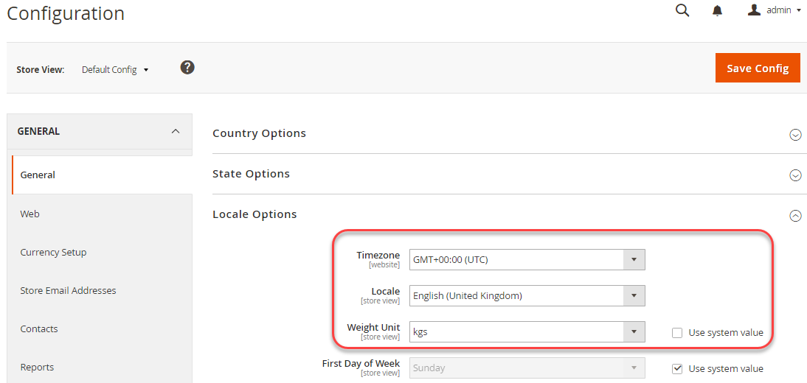
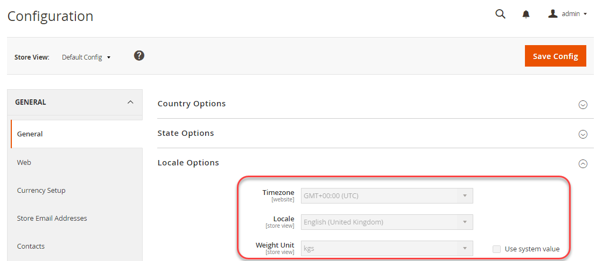

# 共有設定の使用例

この例では、開発システムで次の設定を変更し、ビルドシステムで共有設定ファイル `config.php`を更新し、実稼動システムに同じ設定を実装する方法を示します。

- タイムゾーン
- 重量単位

これらの設定は、**ストア**/設定/**設定**/一般/**一般**&#x200B;の管理者で使用できます。

同じ手順を使用して、以下の参照で機密性のないシステム固有の設定を設定できます。

- [その他の設定パスの参照](../reference/config-reference-general.md)
- [支払設定パスの参照](../reference/config-reference-payment.md)
- [Commerce Enterprise B2B拡張機能の設定パスのリファレンス](../reference/config-reference-b2b.md)

## 始める前に

開始する前に、[開発、ビルド、および実稼動システムの前提条件](../deployment/prerequisites.md)で説明されているように、ファイルシステムの権限と所有権を設定します。

## 前提条件

このトピックでは、実稼動システムの設定を変更する例を示します。 必要に応じて、様々な設定オプションを選択できます。

この例では、次の要素を想定しています。

- Git ソースコントロールを使用します
- 開発システムは、`mconfig`という名前のGit リモート リポジトリで利用できます
- Git作業ブランチの名前は`m2.2_deploy`です

## 手順1：開発システムでの設定

開発システムでタイムゾーンとウェイトの単位を設定するには：

1. Adminにログインします。
1. **ストア** / 設定/**構成** / 一般/**一般**&#x200B;をクリックします。
1. 右側のペインで、**ロケールオプション**&#x200B;を展開します。

   次の図は、例を示しています。

   

1. **タイムゾーン** リストから、**GMT+00:00 （UTC）**&#x200B;をクリックします。
1. 「**重み付け単位**」フィールドの横にある「**システム値を使用**」チェックボックスをオフにします。
1. **重量単位** リストから、**kgs**&#x200B;をクリックします。
1. 「**設定を保存**」をクリックします。
1. プロンプトが表示されたら、キャッシュをフラッシュします。

## 手順2：共有設定の更新

開発システムで共有設定ファイル `app/etc/config.php`を生成し、ソース管理を使用してビルドシステムに転送します。詳しくは、この節を参照してください。

{{$include /help/_includes/config-save-config.md}}

## 手順3：ビルドシステムの更新とファイルの生成

これで、共有設定への変更をソース管理にコミットしたので、ビルドシステムでそれらの変更を取得し、コードをコンパイルして静的ファイルを生成できます。 最後のステップは、本番システムに変更を取り込むことです。 その結果、実稼動システムの設定は開発システムと一致します。

{{$include /help/_includes/config-update-build-system.md}}

## 手順4：実稼動システムの更新

プロセスの最後のステップは、ソースコントロールから実稼動システムを更新することです。 これにより、開発およびビルドシステムに加えたすべての変更が取り込まれ、実稼動システムが完全に最新になります。

{{$include /help/_includes/config-update-prod-system.md}}

### 管理者の変更を確認する

**これらの設定が管理者**&#x200B;で編集できないことを確認するには：

1. Adminにログインします。
1. **ストア** / 設定/**構成** / 一般/**一般**&#x200B;をクリックします。
1. 右側のペインで、**ロケールオプション**&#x200B;を展開します。

   設定したオプションは次のように表示されます。

   

>[!INFO]
>
>管理者でロックされている設定を変更するには、[`magento config:set --lock` コマンド ](../cli/set-configuration-values.md)を使用します。

<!-- Last updated from includes: 2026-04-17 13:49:36 -->
