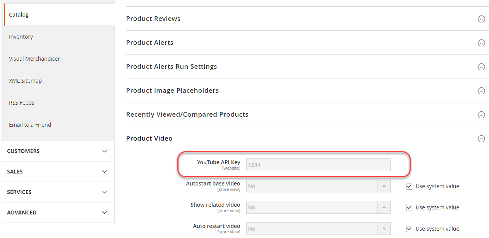

# 実稼動システムの設定

1つの生産システムを持つことができます。 次の条件をすべて満たしている必要があります。

- すべてのCommerce コードは、開発およびビルドシステムと同じリポジトリ内のソースコントロールにあります
- ソース管理に&#x200B;_インクルード_&#x200B;が含まれていることを確認してください。

   - `app/etc/config.php`
   - `generated` ディレクトリ （およびサブディレクトリ）
   - `pub/media` ディレクトリ
   - `pub/media/wysiwyg` ディレクトリ （およびサブディレクトリ）
   - `pub/static` ディレクトリ （およびサブディレクトリ）

- Commerce 2.2以降をインストールし、[実稼動モード &#x200B;](../bootstrap/application-modes.md#production-mode)に設定する必要があります
- このファイル システムには、[開発、ビルド、および実稼動システムの前提条件](../deployment/prerequisites.md)で説明されているように、ファイル システムの所有権と権限が設定されています。

## 実稼動マシンの設定

実稼動マシンを設定するには：

1. Commerceをインストールするか、ソースコントロールからプルした後、実稼動サーバーにファイルシステム所有者としてログインするか、またはファイルシステム所有者に切り替えます。
1. まだ作成していない場合は、`~/.ssh/.composer/auth.json`を作成します。

   ディレクトリを作成します。

   ```shell
   mkdir -p ~/.ssh/.composer
   ```

   そのディレクトリに`auth.json`を作成します。

   `auth.json`には[認証キー](../../installation/prerequisites/authentication-keys.md)が含まれている必要があります。

   サンプルは次のとおりです。

   ```json
   {
      "http-basic": {
         "repo.magento.com": {
            "username": "<your public key>",
            "password": "<your private key>"
         }
      }
   }
   ```

1. 変更を`auth.json`に保存します。
1. 開発システムから実稼動システムに`<Commerce root dir>/app/etc/env.php`をコピーします。
1. テキストエディターで`env.php`を開き、必要な値（データベース接続情報など）を変更します。
1. [`magento config:set`](../cli/set-configuration-values.md)または[`magento config:set-sensitive`](../cli/set-configuration-values.md) コマンドを実行して、システム固有の設定値または機密性の高い設定値をそれぞれ設定します。

   次の節では、例を示します。

## 実稼動システムでの設定値の設定

この節では、`magento config:sensitive:set` コマンドを使用して実稼動システムで機密値を設定する方法について説明します。

機密値を設定するには：

1. [機密値リファレンス &#x200B;](../reference/config-reference-sens.md)を使用して、設定する値を検索します。
1. 設定の設定パスをメモします。
1. 本番システムにファイルシステム所有者としてログインするか、ファイルシステム所有者に切り替えます。
1. Commerceのインストールディレクトリに移動します。
1. 次のコマンドを入力します。

   ```shell
   bin/magento config:sensitive:set {configuration path} {value}
   ```

   例えば、YouTube API キーの値を`1234`に設定するには、次のように入力します

   ```shell
   bin/magento config:sensitive:set catalog/product_video/youtube_api_key 1234
   ```

   次のように、1つ以上の値をインタラクティブに設定することもできます。

   ```shell
   bin/magento config:sensitive:set -i
   ```

   プロンプトが表示されたら、各機密設定の値を入力するか、Enter キーを押して値をスキップし、次の値に移動します。

1. 値が設定されたことを確認するには、管理者にログインします。
1. 管理者で設定を探します。

   例えば、YouTube API キーの設定は、**Stores**/Settings > **Configuration** > **Catalog** > **Catalog** > **Product Video**&#x200B;にあります。

   設定は管理者に表示され、編集できません。 次の図は、例を示しています。

   の機密設定
