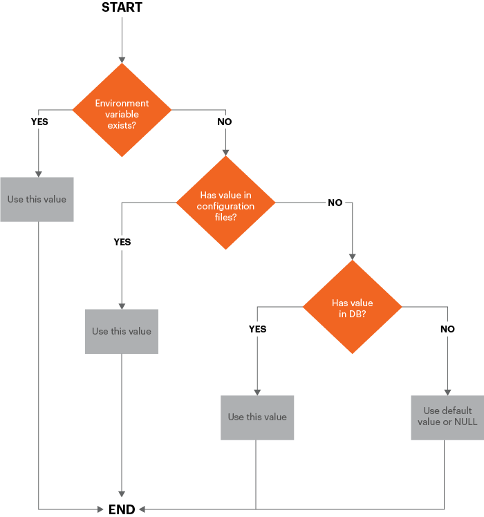
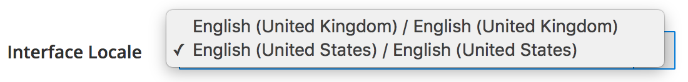
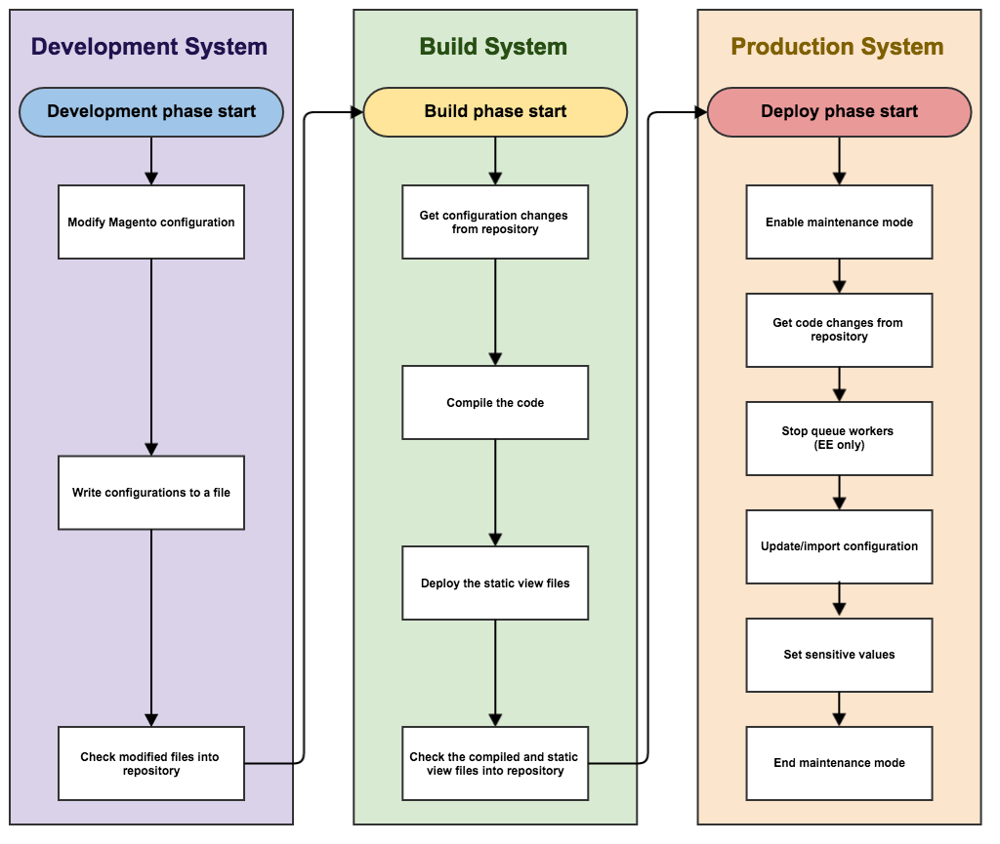

# 技術情報

このトピックでは、Commerce 2.2以降でのパイプラインのデプロイメントに関する技術的な実装の詳細について説明します。 改善点は、次の領域に分けることができます。

- [設定管理](#configuration-management)
- [管理者の変更](#changes-in-the-admin)
- [cronのインストールと削除](#install-and-remove-cron)

このトピックでは、パイプラインのデプロイメントに関する[推奨ワークフロー](#recommended-workflow)についても説明し、その仕組みを理解するのに役立つ例をいくつか紹介します。

開始する前に、開発、ビルド、実稼動システムの[前提条件を確認してください](../deployment/prerequisites.md)。

## 設定管理

開発および実稼動システムの設定を同期および維持できるようにするには、次の上書きスキームを使用します。



図が示すように、設定値は次の順序で使用されます。

1. 環境変数が存在する場合は、他のすべての値を上書きします。
1. 共有設定ファイル `env.php`および`config.php`から。 `env.php`の値が`config.php`の値を上書きします。
1. データベースに保存されている値から。
1. これらのソースに値が存在しない場合は、デフォルト値またはNULLが使用されます。

### 共有設定の管理

共有設定は`app/etc/config.php`に保存されます。これはソース管理に保存する必要があります。

開発環境（またはAdobe Commerce on cloud infrastructure _integration_）システムの管理者で共有設定を設定し、[`magento app:config:dump` コマンド &#x200B;](../cli/export-configuration.md)を使用して設定を`config.php`に書き込みます。

### システム固有の設定の管理

システム固有の設定は`app/etc/env.php`に保存されます。これは&#x200B;_not_&#x200B;がソース管理に含まれている必要があります。

開発環境（またはAdobe Commerce on cloud infrastructure integration）システムの管理者でシステム固有の設定を行い、[`magento app:config:dump` コマンド &#x200B;](../cli/export-configuration.md)を使用して設定を`env.php`に書き込みます。

このコマンドは、機密設定も`env.php`に書き込みます。

### 機密性の高い設定の管理

機密性の高い設定も`app/etc/env.php`に保存されます。

機密性の高い設定は、次のいずれかの方法で管理できます。

- 環境変数
- [`magento config:set:sensitive` コマンド &#x200B;](../cli/set-configuration-values.md)を使用して、本番システムの`env.php`に機密性の高い設定を保存します

### 管理者にロックされた設定設定

`config.php`または`env.php`の構成設定はすべて管理者でロックされています。つまり、これらの設定は管理者で変更できません。
[`magento config:set`または`magento config:set --lock`](../cli/export-configuration.md#config-cli-config-set) コマンドを使用して、`config.php`または`env.php` ファイルの設定を変更します。

## Commerce管理者

管理者は、実稼動モードで次の動作を示します。

- 管理者でキャッシュタイプを有効または無効にすることはできません
- 開発者の設定は利用できません（**ストア** >設定> **設定** >詳細> **開発者**）。次を含む：

   - CSS、JavaScript、HTMLの最小化
   - CSSとJavaScriptの統合
   - サーバーサイドまたはクライアントサイドのLESS コンパイル
   - インライン翻訳
   - 前述したように、`config.php`または`env.php`の構成設定はロックされており、管理者で編集することはできません。
   - 管理者ロケールは、デプロイされたテーマで使用される言語にのみ変更できます

     次の図は、管理者の&#x200B;**アカウント設定** > **インターフェイス ロケール** リストの例を示しています。デプロイされたロケールは2つしかありません。

     

- 管理者を使用して、任意のスコープのロケール設定を変更することはできません。

  実稼動モードに切り替える前に、これらの変更を行うことをお勧めします。

  環境変数または`config:set` CLI コマンドとパス `general/locale/code`を使用して、ロケールを設定できます。

## cronのインストールと削除

バージョン 2.2では、初めて[`magento cron:install` コマンド &#x200B;](../cli/configure-cron-jobs.md)を提供することで、cron ジョブの設定を支援します。 このコマンドは、コマンドを実行するユーザーとしてcrontabを設定します。

また、`magento cron:remove` コマンドを使用してcrontabを削除することもできます。

## 推奨されるパイプライン展開ワークフロー

次の図は、パイプラインのデプロイメントを使用して設定を管理する方法を示しています。



### 開発システム

開発システムで、管理者で構成を変更し、共有構成`app/etc/config.php`とシステム固有の構成`app/etc/env.php`を生成します。 Commerce コードと共有設定をソースコントロールにチェックし、ビルドサーバーにプッシュします。

また、開発システムに拡張機能をインストールし、Commerce コードをカスタマイズする必要があります。

開発システムの場合：

1. 管理者で設定を設定します。

1. 構成をファイルシステムに書き込むには、`magento app:config:dump` コマンドを使用します。

   - `app/etc/config.php`は共有設定で、_を除くすべての設定_&#x200B;が含まれます。機密性の高い設定とシステム固有の設定が含まれます。 このファイルはソース管理にする必要があります。
   - `app/etc/env.php`はシステム固有の設定です。この設定には、特定のシステムに固有の設定（ホスト名やポート番号など）が含まれます。 このファイルは&#x200B;_not_&#x200B;がソース管理に含まれている必要があります。

1. 変更したコードと共有設定をソースコントロールに追加します。

1. 開発中に生成されたphp コードと静的アセットファイルを削除するには、次のコマンドを実行します。

   ```shell
   rm -r var/view_preprocessed/*
   rm -r pub/static/*/*
   rm -r generated/*/*
   ```

アセットをクリアするコマンドを実行した後、Commerceは作業ファイルを生成します。

>[!WARNING]
>
>上記のアプローチに注意してください。 `generated`または`pub` フォルダー内の`.htacces`s ファイルを削除すると、問題が発生する可能性があります。

### システムを構築

ビルドシステムは、コードをコンパイルし、Commerceに登録されたテーマの静的ビューファイルを生成します。 Commerce データベースへの接続は必要ありません。必要なのはCommerce コードベースのみです。

ビルドシステム上で次の操作を行います。

1. ソースコントロールから共有設定ファイルを取得します。
1. コードをコンパイルするには、`magento setup:di:compile` コマンドを使用します。
1. 静的ファイル ビューファイルを更新するには、`magento setup:static-content:deploy -f` コマンドを使用します。
1. ソースコントロールの更新を確認します。

>[!INFO]
>
>静的ビューファイルの[&#x200B; デプロイメント戦略](../cli/static-view-file-strategy.md)を参照してください。

### 制作システム

実稼動システム（つまりライブストア）では、生成されたアセットとコードの更新をソースコントロールから取得し、コマンドラインまたは環境変数を使用してシステム固有の機密性の高い設定設定を設定します。

実稼動システム上：

1. メンテナンスモードを開始します。
1. ソースコードと設定の更新をソースコントロールから取得します。
1. Adobe Commerceを使用している場合は、キューワーカーを停止します。
1. 実稼動システムに設定変更を読み込むには、`magento app:config:import` コマンドを使用します。
1. データベース スキーマを変更したコンポーネントをインストールした場合は、`magento setup:upgrade --keep-generated`を実行してデータベース スキーマとデータを更新し、生成された静的ファイルを保持します。
1. システム固有の設定を設定するには、`magento config:set` コマンドまたは環境変数を使用します。
1. 機密性の高い設定を設定するには、`magento config:sensitive:set` コマンドまたは環境変数を使用します。
1. キャッシュをクリーニング（_フラッシュ_&#x200B;とも呼ばれます）します。
1. メンテナンスモードを終了します。

## 設定管理コマンド

設定の管理に役立つ次のコマンドが用意されています。

- [`magento app:config:dump`](../cli/export-configuration.md)様が管理者設定を`config.php`および`env.php`様に書き込みます（機密性の高い設定を除く）
- [`magento config:set`](../cli/set-configuration-values.md)を使用して、実稼動システム上のシステム固有の設定の値を設定します。

  オプションの`--lock` オプションを使用して、管理者のオプションをロックします（つまり、設定を編集不可にします）。 設定が既にロックされている場合は、`--lock` オプションを使用して設定を変更します。

- [`magento config:sensitive:set`](../cli/set-configuration-values.md)を使用して、実稼動システムの機密設定の値を設定します。
- [`magento app:config:import`](../cli/import-configuration.md)を使用して、`config.php`および`env.php`から実稼動システムに構成変更をインポートします。

## 設定管理の例

この節では、設定の管理例を示します。これにより、`config.php`と`env.php`に対する変更がどのように行われるかを確認できます。

### 既定のロケールを変更

このセクションでは、管理者（**ストア**/設定/**構成**/一般/**一般**/**ロケールオプション**）を使用してデフォルトの重み単位を変更した場合に、`config.php`に加えられた変更を示します。

管理者に変更を加えた後、`bin/magento app:config:dump`を実行して値を`config.php`に書き込みます。 `config.php`の次のスニペットが示すように、値は`locale`の下の`general`配列に書き込まれます。

```php
'general' =>
    array (
        'locale' =>
        array (
            'code' => 'en_US',
            'timezone' => 'America/Chicago',
            'weight_unit' => 'kgs'
        )
    )
```

### 複数の設定設定を変更する

この節では、次の設定変更について説明します。

- Web サイト、ストア、およびストアビューの追加（**ストア**/設定> **すべてのストア**）
- デフォルトのメールドメインの変更（**Stores** >設定> **Configuration** >顧客> **Customer Configuration**）
- PayPal API ユーザー名とAPI パスワードの設定（**Stores** >設定> **Configuration** >販売> **支払い方法** > **PayPal** > **必要なPayPal設定**）

管理者に変更を加えた後、開発システムで`bin/magento app:config:dump`を実行します。 今回は、すべての変更が`config.php`に書き込まれるわけではありません。実際には、次のスニペットに示すように、web サイト、ストア、ストアビューのみが、そのファイルに書き込まれます。

### config.php

`config.php`の内容：

- web サイト、ストア、ストアビューに対する変更。
- システム固有でない検索エンジンの設定
- 機密性のないPayPal設定
- `config.php`から省略された機密設定を知らせるコメント

`websites`配列：

```php
      'new' =>
      array (
        'website_id' => '2',
        'code' => 'new',
        'name' => 'New website',
        'sort_order' => '0',
        'default_group_id' => '2',
        'is_default' => '0',
      ),
```

`groups`配列：

```php
      2 =>
      array (
        'group_id' => '2',
        'website_id' => '2',
        'code' => 'newstore',
        'name' => 'New store',
        'root_category_id' => '2',
        'default_store_id' => '2',
      ),
```

`stores`配列：

```php
     'newview' =>
      array (
        'store_id' => '2',
        'code' => 'newview',
        'website_id' => '2',
        'group_id' => '2',
        'name' => 'New store view',
        'sort_order' => '0',
        'is_active' => '1',
      ),
```

`payment`配列：

```php
      'payment' =>
      array (
        'paypal_express' =>
        array (
          'active' => '0',
          'in_context' => '0',
          'title' => 'PayPal Express Checkout',
          'sort_order' => NULL,
          'payment_action' => 'Authorization',
          'visible_on_product' => '1',
          'visible_on_cart' => '1',
          'allowspecific' => '0',
          'verify_peer' => '1',
          'line_items_enabled' => '1',
          'transfer_shipping_options' => '0',
          'solution_type' => 'Mark',
          'require_billing_address' => '0',
          'allow_ba_signup' => 'never',
          'skip_order_review_step' => '1',
        ),
```

### env.php

既定の電子メール ドメイン システム固有の構成設定は`app/etc/env.php`に書き込まれます。

`bin/magento app:config:dump` コマンドでは機密性の高い設定が書き込まれないため、PayPal設定はどちらのファイルにも書き込まれません。 実稼動システムのPayPal設定は、次のコマンドを使用して設定する必要があります。

```shell
bin/magento config:sensitive:set paypal/wpp/api_username <username>
```

```shell
bin/magento config:sensitive:set paypal/wpp/api_password <password>
```
