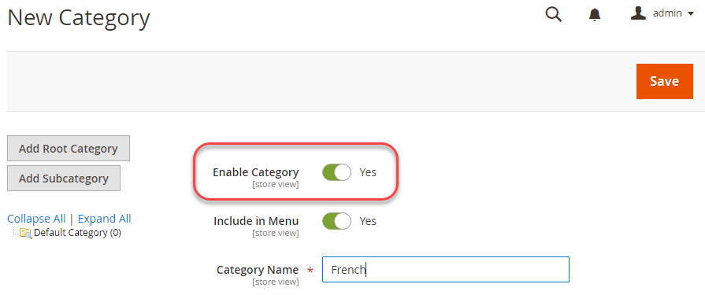

# 管理者での複数ビューの設定

このタスクでは、各ストアのルートカテゴリ（および必要に応じて追加のカテゴリ）を作成する必要があります。 このトピックで説明するタスクは、複数のストアを設定する 1 つの方法となります。 詳しくは、Commerce ユーザーガイドの次の資料を参照してください。

- [カテゴリ](https://docs.magento.com/user-guide/catalog/categories.html)
- [Web サイトの追加](https://docs.magento.com/user-guide/stores/stores-all-create-website.html)
- [URL を格納](https://docs.magento.com/user-guide/stores/store-urls.html)
- [コンテンツ](https://docs.magento.com/user-guide/cms/content-menu.html)

>[!INFO]
>
>例としてのみ、web サイトコードを持つフランス語の web サイトを使用します `french` このトピックの内容です。 詳細な手順のチュートリアルについては、を参照してください [チュートリアル：Apache で複数の web サイトを設定する](ms-apache.md) および [チュートリアル：nginx を使用して複数の Web サイトを設定する](ms-nginx.md)

## 手順 1：ルートカテゴリの作成

ルートカテゴリの作成は任意ですが、このチュートリアルでは、各 web サイトに一意のルートカテゴリを設定する場合に、その方法を説明します。 必要に応じて、追加のカテゴリを作成できます。

ルートカテゴリを作成するには：

1. カテゴリの作成を許可されたユーザーとして管理者にログインします。
1. クリック **カタログ** > **カテゴリ**.
1. クリック **ルートカテゴリを追加**.
1. が含まれる **カテゴリ名** フィールドに、このカテゴリを識別する一意の名前を入力します。
1. 「カテゴリを有効にする」が次のように設定されていることを確認します **はい**.

   このページのその他のオプションについては、を参照してください [ルートカテゴリ](https://docs.magento.com/user-guide/catalog/category-root.html).

   次の図に例を示します。

   

1. クリック **保存**.
1. これらのタスクを必要な回数だけ繰り返して、ストアのルートカテゴリを作成します。

## 手順 2:Web サイトの作成

Web サイトを作成するには：

1. Web サイト、ストア、ストアビューの作成を許可されているユーザーとして管理者にログインします。
1. クリック **ストア** > **設定** > **すべてのストア**.
1. 日 _ストア_ ページ、クリック **Web サイトの作成**.

   - **名前**— Web サイトを識別する名前を入力します。
   - **コード** – 一意のコードを入力します。たとえば、フランスのストアがある場合は、 `french`
   - **並べ替え順序**- オプションの数値並べ替え順を入力します。

   次の図に例を示します。

   

1. クリック **Web サイトの保存**.
1. これらのタスクを必要な回数繰り返して、web サイトを作成します。

## 手順 3：ストアの作成

ストアを作成するには：

1. が含まれる _Admin_ パネル、クリック **ストア** > **設定** > **すべてのストア**.
1. 日 _ストア_ ページ、クリック **ストアを作成**.

   - **Web サイト** – このストアを関連付ける Web サイトの名前をクリックします。
   - **名前**- ストアを識別する名前を入力します。
   - **コード**- ストアを識別する一意のコードを入力します。
   - **ルートカテゴリ** – このストアのルート カテゴリの名前をクリックします。

   次の図に例を示します。

   

1. クリック **ストアを保存**.
1. ストアを作成するために、これらのタスクを必要な回数だけ繰り返します。

## 手順 4：ストアビューの作成

ストア表示を作成するには：

1. が含まれる _Admin_ パネル、クリック **ストア** > **設定** > **すべてのストア**.
1. ストア ページで、 **ストア表示の作成**.

   - **ストア** – このストア表示を関連付けるストアの名前をクリックします。
   - **名前** – このストア ビューを識別する名前を入力します。
   - **コード** – このストア ビューを識別する一意の名前を入力します。
   - **ステータス** – 選択 **Enabled**.

   次の図に例を示します。

   

1. クリック **ストア表示の保存**.
1. これらのタスクを必要な回数だけ繰り返して、ストア表示を作成します。

## 手順 5:web サイトのベース URL の変更

のような一意の URL を使用して web サイトにアクセスするには `http://french.magento.mg`を使用する場合は、管理で各サイトのベース URL を変更する必要があります。

Web サイトのベース URL を変更するには：

1. が含まれる _Admin_ パネル、クリック **ストア** > **設定** > **設定** > **一般** > **Web**.
1. から **ストア表示** リスト ページ上部で、次の図に示すように、web サイトのいずれかの名前をクリックします。

   

1. 右側のパネルで、を展開します **ベース URL**.
1. が含まれる _ベース URL_ セクション、クリア **システム値を使用**.
1. を入力 `http://french.magento.mg` URL （内） **ベース URL** および **ベースリンク URL** フィールド。

1. で前の手順を繰り返します _ベース URL （セキュア）_ セクション。

   >[!INFO]
   >
   >クラウドインフラストラクチャにAdobe Commerceをデプロイするためのベース URL を設定する場合は、最初のピリオドを 3 つのダッシュに置き換える必要があります。 例えば、ベース URL がの場合 `french.branch-sbg7pPa-f3dueAiM03tpy.us.magentosite.cloud`、と入力します `http://french---branch-sbg7pPa-f3dueAiM03tpy.us.magentosite.cloud`. ローカルテストのベース URL を設定する場合は、ピリオドを使用します。

1. クリック **設定を保存**.

1. 他の web サイトに対してこれらのタスクを繰り返します。

## 手順 6：ベース URL へのストアコードの追加

Commerceでは、ストアコードをサイトベース URL に追加するオプションが提供されます。これにより、複数のストアを簡単に設定できます。 このオプションを使用すると、Commerce ファイルシステム上にを保存するディレクトリを作成する必要がなくなります `index.php` および `.htaccess`.

これは防ぎます `index.php` および `.htaccess` 今後のアップグレードでCommerce コードベースと同期されなくなる可能性があります。

を参照してください。 [Commerce ユーザーガイド](https://docs.magento.com/user-guide/stores/store-urls.html).

ベース URL にストアコードを追加するには：

1. が含まれる _Admin_ パネル、クリック **ストア** > **設定** > **設定** > **一般** > **Web**.
1. から **ストア表示** ページ上部のリストで、 **デフォルトの設定** 次の図に示すように。

   

1. 右側のパネルで、を展開します **Url オプション**.
1. をクリア **システム値を使用** の横にあるチェックボックス _Url にストアコードを追加_.
1. から _Url にストアコードを追加_ リスト、クリック **はい**.

   

1. クリック **設定を保存**.
1. プロンプトが表示されたら、キャッシュをフラッシュします。 （**システム** > **キャッシュ管理**）に設定します。

## 手順 7：デフォルトのストア表示ベース URL の変更

この手順を最後に実行する必要があるのは、管理者へのアクセス権が失われるからです。Web サーバー固有のトピックで説明したように、仮想ホストを設定すると、アクセス権が戻ります。

デフォルトのストア表示ベース URL を変更するには：

1. が含まれる _Admin_ パネル、クリック **ストア** > **設定** > **設定** > **一般** > **Web**.

1. から _ストア表示_ ページ上部のリストで、 **デフォルトの設定**.

   

1. 右側のパネルで、を展開します **ベース URL**.
1. が含まれる _ベース URL_ セクション、クリア **システム値を使用**.
1. を入力 `http://magento.mg` URL （内） **ベース URL** および **ベースリンク URL** フィールド。

1. で前の手順を繰り返します **ベース URL （セキュア）** セクション。

   >[!INFO]
   >
   >クラウドインフラストラクチャ上でAdobe Commerceのベース URL を設定する場合は、最初のピリオドを 3 つのダッシュに置き換える必要があります。 例えば、ベース URL がの場合 `french.branch-sbg7pPa-f3dueAiM03tpy.us.magentosite.cloud`、と入力します `http://french---branch-sbg7pPa-f3dueAiM03tpy.us.magentosite.cloud`

1. クリック **設定を保存**.

>[!INFO]
>
>Web サイト、ストア、ストア表示コードには、文字（a ～ z または A ～ Z）、数字（0 ～ 9）、アンダースコア（_）のみを使用できます。 また、最初の文字は文字である必要があります。 大文字またはキャメルケースを使用する場合、内部的には、環境変数による設定の上書きに対応するために、大文字と小文字が区別されません。 参照： [環境変数を使用して設定を上書きする](../reference/override-config-settings.md#environment-variables).