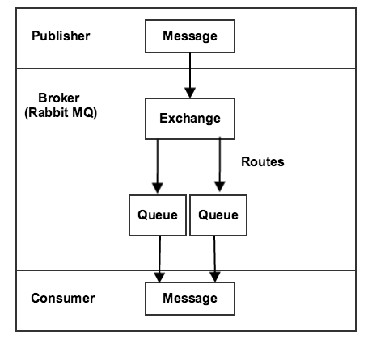
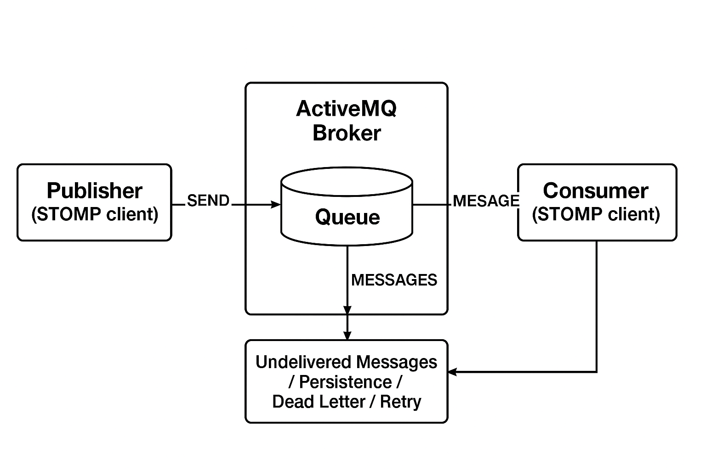

# メッセージキューの概要

メッセージキューフレームワーク（MQF）は、モジュールがメッセージをキューに公開できるようにするシステムです。 また、メッセージを非同期で受信する[consumers](consumers.md)も定義します。 MQFは、複数のメッセージングブローカーをサポートしています。

- **[[!DNL RabbitMQ]](https://www.rabbitmq.com)** - メッセージを送受信するためのスケーラブルなプラットフォームを提供するプライマリメッセージングブローカー。 未配信のメッセージを保存するメカニズムが含まれており、Advanced Message Queuing Protocol （AMQP） 0.9.1仕様に基づいています。
- **[Apache ActiveMQ Artemis](https://activemq.apache.org/components/artemis/)** – 信頼性と拡張性の高いメッセージを作成するためにSTOMP （Simple Text Oriented Messaging Protocol）を使用する代替メッセージングブローカー。 Adobe Commerce 2.4.5以降で導入されました。

## RabbitMQ （AMQP）

次の図は、メッセージキューフレームワークを示しています。

- パブリッシャーは、メッセージを取引所に送信するコンポーネントです。 パブリッシュする取引所と、送信するメッセージの形式を把握できます。

- エクスチェンジは、パブリッシャーからメッセージを受信し、キューに送信します。 [!DNL RabbitMQ]は複数の種類の交換をサポートしていますが、Commerceではトピック交換のみを使用します。 トピックにはルーティングキーが含まれており、これにはドットで区切られたテキスト文字列が含まれています。 トピック名の形式は`string1.string2`です。例：`customer.created`または`customer.sent.email`。

  ブローカーを使用すると、メッセージの転送ルールを設定する際にワイルドカードを使用できます。 アスタリスク （`*`）を使用して&#x200B;_one_&#x200B;文字列を置き換えたり、ポンド記号（`#`）を使用して0つ以上の文字列を置き換えたりできます。 例えば、`customer.*`は`customer.create`と`customer.delete`ではフィルタリングされますが、`customer.sent.email`ではフィルタリングされません。 ただし、`customer.#`は`customer.create`、`customer.delete`、`customer.sent.email`でフィルタリングされます。

- キューは、メッセージを格納するバッファーです。

- 消費者はメッセージを受け取ります。 消費するキューがわかります。 メッセージのプロセッサを特定のキューにマッピングできます。

## Apache ActiveMQ Artemis （STOMP）

RabbitMQの代わりに、Adobe Commerceでは、Simple Text Oriented Messaging Protocol （STOMP）を使用したメッセージングブローカーとして[Apache ActiveMQ Artemis](https://activemq.apache.org/components/artemis/)もサポートしています。

>[!NOTE]
>
>ActiveMQ Artemisは、Adobe Commerce 2.4.5以降で導入されました。

次の図は、ActiveMQ Artemisを使用したSTOMP フレームワークを示しています。

### STOMP Framework コンポーネント

- **発行者**&#x200B;は、宛先（キューまたはトピック）にメッセージを送信するコンポーネントです。 どの宛先に公開し、送信するメッセージの形式を把握できます。

- STOMPの&#x200B;**宛先**&#x200B;は、AMQPの取引所と同様の役割を果たし、パブリッシャーからメッセージを受信してルーティングします。 STOMPでは、ドットを使用した階層的な命名パターンで直接宛先アドレス指定を使用します（例：`customer.created`または`inventory.updated`）。

  Adobe Commerceでは、STOMP宛先に対して&#x200B;**ANYCAST** アドレッシングモードを使用し、ポイントツーポイントのメッセージ配信を提供します。 ANYCAST モードでは、メッセージは利用可能なコンシューマーのプールから1人のコンシューマーにのみ配信され、複数のコンシューマーインスタンス間での負荷分散と作業配分が可能になります。

- **キュー**&#x200B;は、メッセージを格納するバッファーです。 ANYCAST アドレッシングを使用すると、複数のコンシューマーが同じ宛先に接続されている場合でも、キューは1つのコンシューマーにのみメッセージを確実に配信します。

- **消費者**&#x200B;は、宛先からメッセージを受信します。 どの宛先を購読すべきかを把握し、異なる確認モード（自動、クライアント、またはクライアント個人）のメッセージを処理できます。

## MySQL アダプタ （フォールバック）

外部メッセージブローカーを使用せずに、基本的なメッセージキューシステムを設定することもできます。 このシステムでは、MySQL アダプタがメッセージをデータベースに保存します。 3つのデータベース テーブル （`queue`、`queue_message`、および`queue_message_status`）がメッセージ キューのワークロードを管理します。 Cron ジョブは、消費者がメッセージを受信できるようにします。 このソリューションは拡張性が低い。 [!DNL RabbitMQ]やApache ActiveMQ Artemisなどの外部メッセージブローカーは、本番環境でいつでも使用できます。

## 関連情報

インストールと設定の手順については、次を参照してください。

- [RabbitMQのインストールと設定](../../installation/prerequisites/rabbitmq.md)
- [ActiveMQ Artemisのインストールと設定](../../installation/prerequisites/activemq.md)
- [メッセージキューの管理](manage-message-queues.md)
- [メッセージキューコンシューマー](consumers.md)
