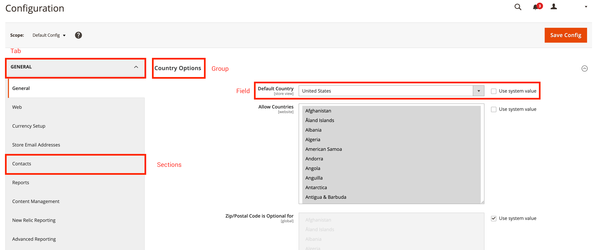

# system.xml リファレンス

`system.xml` ファイルを使用すると、Commerce システム設定を管理できます。 このトピックは、`system.xml` ファイルの一般的な参照として使用します。 `system.xml` ファイルは、特定のCommerce 2拡張機能の`etc/adminhtml/system.xml`の下にあります。

次のコードスニペットは、ファイルのベアスケルトンを示しています。

```xml
<?xml version="1.0" ?>
<config xmlns:xsi="http://www.w3.org/2001/XMLSchema-instance" xsi:noNamespaceSchemaLocation="urn:magento:module:Magento_Config:etc/system_file.xsd">
    <system>
        <!-- PLACE YOUR MODULE SPECIFIC CONFIGURATION HERE -->
    </system>
</config>
```

>[!TIP]
>
>IDEで*XSDの検証を即座に実行したい場合は、`bin/magento dev:urn-catalog:generate [--ide IDE] [--] <path>`を実行できます。

## タブ // セクション // グループ // フィールド

`system.xml` ファイルでは、互いに関連する4つの異なるタイプのエンティティを定義できます。 次の節では、タブ、セクション、グループ、フィールド間の関係について説明します。 次のスクリーンショットは、管理者バックエンドのCommerce 2 System Configurationを示しています。
赤い四角形は、`system.xml` ファイルで定義されている様々なタイプを示します。

管理者に設定済みのセクションを表示する

タブは、様々な設定領域をセマンティックに分割するために使用されます。 各タブには1つ以上のセクションを含めることができ、サブメニューとしても参照できます。 セクションには、1つ以上のグループが含まれています。
各グループには、1つ以上のフィールドが一覧表示されます。 グループを使用して、次のフィールドの一般的な説明を追加することもできます。 前述したように、各グループには1つ以上のフィールドを含めることができます。 フィールドは最小エンティティです
フィールドが表示されます。

## タブ

`<tab>` タグは、システム構成の既存のタブまたは新しいタブを参照します。

### タブ属性参照

`<tab>` タグには、次の属性を指定できます。

| 属性 | 説明 | タイプ | 必須 |
|-------------|------------------------------------------------------------------------------------------------------------------------------------------|----------|----------|
| `id` | セクションを参照するために使用される識別子を定義します。 | `typeId` | 必須 |
| `translate` | 翻訳可能なフィールドを定義します。 ラベルを翻訳可能にするために`label`を指定してください。 | `string` | オプション |
| `sortOrder` | セクションの並べ替え順序を定義します。 大きい数値を指定すると、セクションがページの下部にプッシュされます。小さい数値を指定すると、セクションが上部にプッシュされます。 | `float` | オプション |
| `class` | レンダリングされたタブのHTML要素に定義されたCSS クラスを追加します。 | `string` | オプション |

### Tab ノード参照

`<tab>`-Tagには、次の子を含めることができます。

| ノード | 説明 | タイプ |
|---------|------------------------------------------------------|----------|
| `label` | フロントエンドに表示されるラベルを定義します。 | `string` |

### 例：タブの作成

次のコードスニペットは、サンプルデータを含む新しいタブの作成を示しています。

```xml
<?xml version="1.0" ?>
<config xmlns:xsi="http://www.w3.org/2001/XMLSchema-instance" xsi:noNamespaceSchemaLocation="urn:magento:module:Magento_Config:etc/system_file.xsd">
    <system>
        <tab id="A_UNIQUE_ID" translate="label" class="a-custom-css-class-to-style-this-tab" sortOrder="10">
            <label>A meaningful label</label>
        </tab>
    </system>
</config>
```

上記のスニペットは、識別子`A_UNIQUE_ID`を持つ新しいタブを作成します。 `translate` – 属性が定義され、ラベルを参照しているので、`label` – ノードは翻訳可能です。 レンダリング処理中に、このタブ用に作成されたHTML要素にCSS クラス `a-custom-css-class-to-style-this-tab`が適用されます。
値`10`の`sortOrder` – 属性は、レンダリング時にすべてのタブのリスト内のタブの位置を定義します。

## セクション

`<section>` タグは、システム構成の既存のセクションまたは新しいセクションを参照します。

### セクション属性参照

`<section>` タグには、次の属性を指定できます。

| 属性 | 説明 | タイプ | 必須 |
|:----------------|:---------------------------------------------------------------------------------------------------------------------------------------------------|:---------|:---------|
| `id` | セクションを参照するために使用される識別子を定義します。 | `typeId` | 必須 |
| `translate` | 翻訳可能なフィールドを定義します。 ラベルを翻訳可能にするために`label`を指定してください。 | `string` | オプション |
| `type` | レンダリングされたHTML要素の入力タイプを定義します。 デフォルトは`text`です。 | `string` | オプション |
| `sortOrder` | セクションの並べ替え順序を定義します。 大きい数値を指定すると、セクションがページの下部にプッシュされます。小さい数値を指定すると、セクションが上部にプッシュされます。 | `float` | オプション |
| `showInDefault` | セクションをデフォルトの設定スコープに表示するかどうかを定義します。 セクションを表示するには`1`を指定し、セクションを非表示にするには`0`を指定します。 | `int` | オプション |
| `showInStore` | セクションをストアレベルで表示するかどうかを定義します。 セクションを表示するには`1`を指定し、セクションを非表示にするには`0`を指定します。 | `int` | オプション |
| `showInWebsite` | セクションをweb サイトレベルで表示するかどうかを定義します。 セクションを表示するには`1`を指定し、セクションを非表示にするには`0`を指定します。 | `int` | オプション |
| `canRestore` | セクションをデフォルトに戻すことができるかどうかを定義します。 | `int` | オプション |
| `advanced` | 100.0.2から非推奨（廃止予定）。 | `bool` | オプション |
| `extends` | 別のセクションの識別子を指定すると、このノードのコンテンツは、参照したセクションを拡張します。 | `string` | オプション |

### セクションのノード参照

`<section>` タグには、次の子を含めることができます。

| ノード | 説明 | タイプ |
|------------------|-----------------------------------------------------------------------------------------------------------------------|---------------------|
| `label` | フロントエンドに表示されるラベルを定義します。 | `string` |
| `class` | レンダリングされたセクションのHTML要素に定義されたCSS クラスを追加します。 | `string` |
| `tab` | 関連するタブを参照します。 タブのIDを指定します。 | `typeTabId` |
| `header_css` | この記事を書いている時点では使用も評価もされていません。 | `string` |
| `resource` | このセクションの権限設定を提供するACL リソースを参照します。 | `typeAclResourceId` |
| `group` | 1つ以上のサブグループを定義します。 | `typeGroup` |
| `frontend_model` | 異なるフロントエンドモデルを指定して、レンダリングを変更し、出力を変更します。 | `typeModel` |
| `include` | 追加の`system_include.xsd`互換性のあるファイルを含めるために使用されます。 通常、大きな`system.xml` ファイルを構成するために使用されます。 | `includeType` |

### 例：セクションを作成してタブに割り当てる

次のコードスニペットは、新しいセクションを作成するための基本的な使用方法を示しています。

```xml
<?xml version="1.0" ?>
<config xmlns:xsi="http://www.w3.org/2001/XMLSchema-instance" xsi:noNamespaceSchemaLocation="urn:magento:module:Magento_Config:etc/system_file.xsd">
    <system>
        <tab id="A_UNIQUE_ID" translate="label" class="a-custom-css-class-to-style-this-tab" sortOrder="10">
            <label>A meaningful label</label>
        </tab>

        <section id="A_UNIQUE_SECTION_ID" showInDefault="1" showInWebsite="0" showInStore="1" sortOrder="10" translate="label">
            <label>A meaningful section label</label>
            <tab>A_UNIQUE_ID</tab>
            <resource>VENDOR_MODULE::path_to_the_acl_resource</resource>
        </section>
    </system>
</config>
```

上記のセクションでは、ID `A_UNIQUE_SECTION_ID`を定義し、デフォルトの設定ビューとストアコンテキストに表示されます。 `label` ノードは翻訳可能です。 セクションは、ID `A_UNIQUE_ID`のタブに関連付けられています。 このセクションには、ACL `VENDOR_MODULE::path_to_the_acl_resource`で定義された権限を持つユーザーのみがアクセスできます。

## グループ

`<group>` タグは、フィールドをグループ化するために使用されます。

### グループ属性参照

`<group>` タグには、次の属性を指定できます。

| 属性 | 説明 | タイプ | 必須 |
|:----------------|:---------------------------------------------------------------------------------------------------------------------------------------------------|:---------|:---------|
| `id` | グループを参照するために使用される識別子を定義します。 | `typeId` | 必須 |
| `translate` | 翻訳可能なフィールドを定義します。 ラベルを翻訳可能にするために`label`を指定してください。 複数のフィールドは、スペースで区切る必要があります。 | `string` | オプション |
| `type` | レンダリングされたHTML要素の入力タイプを定義します。 デフォルトは`text`です。 | `string` | オプション |
| `sortOrder` | セクションの並べ替え順序を定義します。 大きい数値を指定すると、セクションがページの下部にプッシュされます。小さい数値を指定すると、セクションが上部にプッシュされます。 | `float` | オプション |
| `showInDefault` | グループをデフォルトの設定スコープに表示するかどうかを定義します。 グループを表示するには`1`を指定し、グループを非表示にするには`0`を指定します。 | `int` | オプション |
| `showInStore` | グループをストアレベルで表示するかどうかを定義します。 グループを表示するには`1`を指定し、グループを非表示にするには`0`を指定します。 | `int` | オプション |
| `showInWebsite` | グループをweb サイト レベルで表示するかどうかを定義します。 グループを表示するには`1`を指定し、グループを非表示にするには`0`を指定します。 | `int` | オプション |
| `canRestore` | グループをデフォルトに復元できるかどうかを定義します。 | `int` | オプション |
| `advanced` | 100.0.2から非推奨（廃止予定）。 | `bool` | オプション |
| `extends` | 別のグループの識別子を指定すると、このノードのコンテンツは、参照したセクションを拡張します。 | `string` | オプション |

### グループノード参照

`<group>` タグには、次の子を含めることができます。

| ノード | 説明 | タイプ |
|-----------------------------|-------------------------------------------------------------------------------------------------------------------------------------------------------------------------------------------|---------------|
| `label` | フロントエンドに表示されるラベルを定義します。 | `string` |
| `fieldset_css` | グループのフィールドセットに1つ以上のCSS クラスを追加します。 | `string` |
| `frontend_model` | 異なるフロントエンドモデルを指定して、レンダリングを変更し、出力を変更します。 | `typeModel` |
| `clone_model` | フィールドを複製する特定のモデルを指定します。 | `typeModel` |
| `clone_fields` | フィールドの複製を有効または無効にします。 | `int` |
| `help_url` | 拡張性がありません。 以下を参照してください。 | `typeUrl` |
| `more_url` | 拡張性がありません。 以下を参照してください。 | `typeUrl` |
| `demo_link` | 拡張性がありません。 以下を参照してください。 | `typeUrl` |
| `comment` | グループ ラベルの下にコメントを追加します。 `<![CDATA[//]]>`を使用すると、HTMLを適用できます。 | `string` |
| `hide_in_single_store_mode` | グループをシングルストアモードで表示するかどうか。 `1`はグループを非表示にし、`0`はグループを表示します。 | `int` |
| `field` | このグループで使用可能な1つ以上のフィールドを定義します。 | `field` |
| `group` | 1つ以上のサブグループを定義します。 | `unbounded` |
| `depends` | 他のフィールドへの依存関係を宣言するために使用できます。 は、特定のフィールドの値が`1`の場合にのみ、特定のフィールドまたはグループを表示するために使用されます。 このノードには`section/group/field`文字列が必要です。 | `depends` |
| `attribute` | カスタム属性は、フロントエンドモデルで使用できます。 通常、特定のフロントエンドモデルをよりダイナミックにするために使用されます。 | `attribute` |
| `include` | 追加の`system_include.xsd`互換性のあるファイルを含めるために使用されます。 通常、大きな`system.xml` ファイルを構成するために使用されます。 | `includeType` |

>[!WARNING]
>
>ノード `more_url`、`demo_url`および`help_url`は、一度だけ使用されるPayPal フロントエンドモデルによって定義されます。 これらのノードは再使用できません。

### 例：特定のセクションのグループを作成する

次のコードスニペットは、新しいグループを作成するための基本的な使用方法を示しています。

```xml
<config xmlns:xsi="http://www.w3.org/2001/XMLSchema-instance" xsi:noNamespaceSchemaLocation="urn:magento:module:Magento_Config:etc/system_file.xsd">
    <system>
        <tab id="A_UNIQUE_ID" translate="label" class="a-custom-css-class-to-style-this-tab" sortOrder="10">
            <label>A meaningful label</label>
        </tab>

        <section id="A_UNIQUE_SECTION_ID" showInDefault="1" showInWebsite="0" showInStore="1" sortOrder="10" translate="label">
            <label>A meaningful section label</label>
            <tab>A_UNIQUE_ID</tab>
            <resource>VENDOR_MODULE::path_to_the_acl_resource</resource>

            <group id="A_UNIQUE_GROUP_ID" translate="label comment" sortOrder="10" showInDefault="1" showInWebsite="0" showInStore="1">
                <label>A meaningful group label</label>
                <comment>An additional comment helping users to understand the effect when configuring the fields defined in this group.</comment>
                <!-- Add your fields here. -->
            </group>
        </section>
    </system>
</config>
```

上記のグループは、ID `A_UNIQUE_GROUP_ID`を定義し、デフォルトの設定ビューとストアコンテキストに表示されます。 `label`と`comment`の両方が翻訳可能としてマークされます。

## フィールド

`<field>`-Tagは、`<group>`-Tags内で特定の設定値を定義するために使用されます。

### フィールド属性参照

`<field>` タグには、次の属性を指定できます。

| 属性 | 説明 | タイプ | 必須 |
|:----------------|:---------------------------------------------------------------------------------------------------------------------------------------------------|:---------|:---------|
| `id` | フィールドを参照するために使用される識別子を定義します。 | `typeId` | 必須 |
| `translate` | 翻訳可能なフィールドを定義します。 ラベルを翻訳可能にするために`label`を指定してください。 複数のフィールドは、スペースで区切る必要があります。 | `string` | オプション |
| `type` | レンダリングされたHTML要素の入力タイプを定義します。 デフォルトは`text`です。 | `string` | オプション |
| `sortOrder` | セクションの並べ替え順序を定義します。 大きい数値を指定すると、セクションがページの下部にプッシュされます。小さい数値を指定すると、セクションが上部にプッシュされます。 | `float` | オプション |
| `showInDefault` | フィールドをデフォルトの設定範囲に表示するかどうかを定義します。 フィールドを表示するには`1`を指定し、フィールドを非表示にするには`0`を指定します。 | `int` | オプション |
| `showInStore` | フィールドをストアレベルで表示するかどうかを定義します。 フィールドを表示するには`1`を指定し、フィールドを非表示にするには`0`を指定します。 | `int` | オプション |
| `showInWebsite` | フィールドをweb サイトレベルで表示するかどうかを定義します。 フィールドを表示するには`1`を指定し、フィールドを非表示にするには`0`を指定します。 | `int` | オプション |
| `canRestore` | フィールドをデフォルトに戻すことができるかどうかを定義します。 | `int` | オプション |
| `advanced` | 100.0.2から非推奨（廃止予定）。 | `bool` | オプション |
| `extends` | 別のフィールドの識別子を指定すると、このノードのコンテンツは、参照したセクションを拡張します。 | `string` | オプション |

### フィールドタイプ参照

`<field>`-Tagは、`type=""`属性に対して次の値を持つことができます。

| タイプ | 説明 |
|-----------------|-------------------------------------------------------------------------------------------------------------------------------------------------------------------------------------------------------------------------------|
| `text` | 標準、1行のテキストフィールド |
| `textarea` | テキストブロック |
| `select` | 通常のドロップダウン。カスタム `source_model`が必要な場合があります。 `Yes/No`個の選択項目にも使用されます。 例については、`Magento\Search\Model\Adminhtml\System\Config\Source\Engine`を参照してください。 |
| `multiselect` | `select`と同様ですが、複数のオプションが有効です。 |
| `button` | 即時のイベントをトリガーするボタン。 ボタンテキストとアクションを定義するには、カスタムフロントエンドモデルが必要です。 例については、`Magento\ScheduledImportExport\Block\Adminhtml\System\Config\Clean`を参照してください。 |
| `obscure` | 値が暗号化され、`****`として表示されたテキストフィールド。 ブラウザーで「エレメントを検査」を使用してタイプを変更しても、値は表示されません。 |
| `password` | 非表示の値が暗号化されていないことを除いて`obscure`と同様に、ブラウザーで「要素を検査」を使用してタイプを強制的に変更すると、値が表示されます。 |
| `file` | ファイルをアップロードして処理できるようにします。 |
| `label` | 編集可能なフィールドではなくラベルを表示します。 このタイプは、特定のスコープ（ストアビューレベルなど）でのみフィールドを編集できる場合に使用します。 |
| `time` | 時間、分、秒の3つのドロップダウンを使用して時間を設定するように制御します。 |
| `allowspecific` | 特定の国の複数選択リスト。 `Magento\Shipping\Model\Config\Source\Allspecificcountries`などの`source_model`が必要です |
| `image` | 画像のアップロードを許可します。 |
| `note` | 情報メモをページに追加できるようにします。 この種類では、メモをレンダリングするために`frontend_model`が必要です。 |

カスタムフィールドタイプを作成することもできます。 これは、アクションを伴う特別なボタンが必要な場合によく行われます。 そのためには、次の2つの主要な要素が必要です。

- `adminhtml`領域にブロックを作成しています
- `type=""`をこのブロックへのパスに設定しています

ブロック自体には、少なくとも`__construct` メソッドと`getElementHtml()` メソッドが必要です。 [Magento_OfflineShipping](https://github.com/magento/magento2/blob/2.4/app/code/Magento/OfflineShipping)は、カスタムタイプの簡単な例です。

例えば、OfflineShipping モジュールでは、`Magento\OfflineShipping\Block\Adminhtml\Form\Field\Export`で「書き出し」ボタンが定義され、フィールド定義は次のようになります。

```xml
<field id="export" translate="label" type="Magento\OfflineShipping\Block\Adminhtml\Form\Field\Export" sortOrder="5" showInDefault="0" showInWebsite="1" showInStore="0">
    <label>Export</label>
</field>
```

### フィールドノード参照

`<field>` タグには、次の子を含めることができます。

| ノード | 説明 | タイプ |
|-----------------------------|-------------------------------------------------------------------------------------------------------------------------------------------------------------------------------------------|------------------|
| `label` | フロントエンドに表示されるラベルを定義します。 | `string` |
| `comment` | フィールドラベルの下にコメントを追加します。 `<![CDATA[//]]>`を使用すると、HTMLを適用できます。 | `string` |
| `tooltip` | このフィールドの意味を説明するために使用できるもう1つの可能なフロントエンド要素。 フィールドの横に小さなアイコンとして表示されます。 | `string` |
| `hint` | 追加情報を表示します。 特定の`frontend_model`でのみ使用できます。 | `string` |
| `frontend_class` | レンダリングされたセクションのHTML要素に定義されたCSS クラスを追加します。 | `string` |
| `frontend_model` | 異なるフロントエンドモデルを指定して、レンダリングを変更し、出力を変更します。 | `typeModel` |
| `backend_model` | 設定された値を変更する別のバックエンドモデルを指定します。 | `typeModel` |
| `source_model` | 特定の値セットを提供する異なるソースモデルを指定します。 | `typeModel` |
| `config_path` | フィールドの汎用設定パスを上書きするために使用できます。 | `typeConfigPath` |
| `validate` | 様々な検証ルールを定義します（スペース区切り）。 使用可能な検証ルールの完全な参照リストを以下に示します。 | `string` |
| `can_be_empty` | `type`が`multiselect`の場合に、フィールドを空にできることを指定するために使用します。 | `int` |
| `if_module_enabled` | 特定のモジュールが有効になっている場合にのみフィールドを表示するために使用します。 | `typeModule` |
| `base_url` | ファイルのアップロードに`upload_dir`と組み合わせて使用します。 | `typeUrl` |
| `upload_dir` | アップロード用のターゲットディレクトリを指定します。 このノードには追加の属性とノードがあります。 これを使用する前に調べておきましょう。 | `typeUploadDir` |
| `button_url` | `button_url`と`button_label`が指定されている場合は、ボタンを表示します。 通常、カスタムフロントエンドモデルと組み合わせて使用されます。 | `typeUrl` |
| `button_label` | `button_label`と`button_url`が指定されている場合は、ボタンを表示します。 通常、カスタムフロントエンドモデルと組み合わせて使用されます。 | `string` |
| `more_url` | 拡張性がありません。 以下を参照してください。 | `typeUrl` |
| `demo_url` | 拡張性がありません。 以下を参照してください。 | `typeUrl` |
| `hide_in_single_store_mode` | グループをシングルストアモードで表示するかどうか。 `1`はグループを非表示にし、`0`はグループを表示します。 | `int` |
| `options` | 未使用： 非推奨（廃止予定）: | `complexType` |
| `depends` | 他のフィールドに依存関係を宣言するために使用できます。 は、特定のフィールドの値が`1`の場合にのみ、特定のフィールドまたはグループを表示するために使用されます。 このノードには`section/group/field`文字列が必要です。 | `complexType` |
| `attribute` | カスタム属性は、フロントエンドモデルで使用できます。 通常、特定のフロントエンドモデルをよりダイナミックにするために使用されます。 | `complexType` |
| `requires` | 拡張性がありません。 以下を参照してください。 | `complexType` |

>[!WARNING]
>
>ノード `more_url`、`demo_url`、`requires`および`options`は、別のコア支払いモデルによって定義され、1回だけ使用されます。 これらのノードは再使用できません。

### 例：特定のグループに2つのフィールドを作成する

```xml
<config xmlns:xsi="http://www.w3.org/2001/XMLSchema-instance" xsi:noNamespaceSchemaLocation="urn:magento:module:Magento_Config:etc/system_file.xsd">
    <system>
        <tab id="A_UNIQUE_ID" translate="label" class="a-custom-css-class-to-style-this-tab" sortOrder="10">
            <label>A meaningful label</label>
        </tab>

        <section id="A_UNIQUE_SECTION_ID" showInDefault="1" showInWebsite="0" showInStore="1" sortOrder="10" translate="label">
            <label>A meaningful section label</label>
            <tab>A_UNIQUE_ID</tab>
            <resource>VENDOR_MODULE::path_to_the_acl_resource</resource>

            <group id="A_UNIQUE_GROUP_ID" translate="label" sortOrder="10" showInDefault="1" showInWebsite="0" showInStore="1">
                <label>A meaningful group label</label>
                <comment>An additional comment helping users to understand the effect when configuring the fields defined in this group.</comment>

                <field id="A_UNIQUE_FIELD_ID" translate="label" sortOrder="10" showInDefault="0" showInWebsite="0" showInStore="1" type="select">
                    <label>Feature Flag Example</label>
                    <comment>This field is an example for a basic yes or no select.</comment>
                    <tooltip>Usually these kinds of fields are used to enable or disable a given feature. Other fields might be dependent to this and will only appear if this field is set to yes.</tooltip>
                    <source_model>Magento\Config\Model\Config\Source\Yesno</source_model>
                </field>

                <field id="ANOTHER_UNIQUE_FIELD_ID" translate="label" sortOrder="10" showInDefault="0" showInWebsite="0" showInStore="1" type="text">
                    <label>A meaningful field label</label>
                    <comment>A descriptive text explaining this configuration field.</comment>
                    <tooltip>Another possible frontend element that also can be used to describe the meaning of this field. Will be displayed as a small icon beside the field.</tooltip>
                    <validate>required-entry no-whitespace</validate> <!-- Field is required and must not contain any whitespace. -->
                    <if_module_enabled>VENDOR_MODULE</if_module_enabled>
                    <depends> <!-- This field will only be visible if the field with the id A_UNIQUE_FIELD_ID is set to value 1 -->
                        <field id="A_UNIQUE_FIELD_ID">1</field>
                    </depends>
                </field>
            </group>
        </section>
    </system>
</config>
```

上記の例では、デフォルトとストアビューの両方で表示/設定可能な2つのフィールドを作成します。 両方のフィールドには、ユーザーに目的を説明するコメントとツールヒントがあります。 `label` ノードは翻訳可能です。
識別子`ANOTHER_UNIQUE_FIELD_ID`のフィールドは、`if_module_enabled`の指定されたモジュールがグローバルに有効になっている場合に表示されます。 このフィールドは、ルール `required-entry`および`no-whitespace`に対しても値を検証します。
識別子`A_UNIQUE_FIELD_ID`のフィールドは、値`Yes`と`No`を提供する別のソース モデルを定義しています。

### 共通のソースモデル

次のソースモデルは、Commerce 2 コアによって提供されます。 一般的には、より多くのソースモデルがあります。次のリストに、最も一般的なソースモデルを示します。 これらのソースモデルが適切に動作するためには、フィールド属性`type`を`select`に設定する必要があることに注意してください。

| Source Model | 説明 |
|-----------------------------------------------------------|------------------------------------------------------------------------------------------------------------|
| `Magento\Config\Model\Config\Source\Yesnocustom` | 値`Yes`、`No`、`Specified`を指定します。 |
| `Magento\Config\Model\Config\Source\Enabledisable` | 値`Enable`、`Disable`を指定します。 値を`0`および`1`としてデータベースに保存します。 |
| `Magento\AdminNotification\Model\Config\Source\Frequency` | 値`1 Hour`、`2 Hours`、`6 Hours`、`12 Hours`および`24 Hours`を指定します。 値は整数として保存されます。 |
| `Magento\Catalog\Model\Config\Source\TimeFormat` | 時間形式（12 h/24 h）の値を指定します。 |
| `Magento\Cron\Model\Config\Source\Frequency` | 値`Daily`、`Weekly`、`Monthly`を指定します。 値は`D`、`W`、`M`という名前でデータベースに保存されます。 |
| `Magento\GoogleAdwords\Model\Config\Source\Language` | ISO 639-1形式（enなど）の特定の言語の2文字コードの値を提供します。 |
| `Magento\Config\Model\Config\Source\Locale` | 上記と同様の値を提供しますが、ロケールコード（en_USなど）が含まれます。 |

### フィールド検証

1つのフィールドに1つ以上のバリデータークラスを割り当てることで、ユーザーの入力が拡張機能の要件を満たしていることを確認できます。 検証ルールは、`<validate>` タグを使用して適用できます。
次の例では、フィールドを検証し、複数の異なる検証ルールを追加します。

```xml
<field id="A_CUSTOM_IDENTIFIER" showInDefault="1" showInWebsite="0" showInStore="1">
    <validate>required-entry validate-clean-url no-whitespace</validate>
</field>
```

次の検証ルールを使用できます。

| ルール | 説明 |
|---------------------------------|-------------------------------------------------------------------------------------------------------------------------|
| `alphanumeric` | 文字、数字、スペース、アンダースコアのみを使用できます。 |
| `integer` | 正または負の非小数点数を指定できます。 |
| `ipv4` | 有効なIP v4 アドレスを許可します。 |
| `ipv6` | 有効なIP v6 アドレスを許可します。 |
| `letters-only` | 文字のみを使用できます。 例：`abcABC`。 |
| `letters-with-basic-punc` | 文字または句読点のみを使用できます。<br>次の式を渡す必要があります：`/^[a-z\-.,()\u0027\u0022\s]+$/i`。 |
| `mobileUK` | （英国）の携帯電話番号を許可します。 |
| `no-marginal-whitespace` | 値の先頭または末尾の空白を無効にします。 |
| `no-whitespace` | 空白を無効にします。 |
| `phoneUK` | （英国）の電話番号を許可します。 |
| `phoneUS` | （米国）の電話番号を許可します。 |
| `required-entry` | 空の値（`validate-no-empty`と同等の検証）を無効にします。<br>検証エラーメッセージ：「これは必須フィールドです。」 |
| `time` | 00:00 ～ 23:59の間の24時間形式で有効な時間を許可します。 例：`15`、`15:05`、`15:05:48`。 |
| `time12h` | 午前12:00時から午後11:59:59時までの12時間形式で有効な時間を許可します。 例：`3 am`、`11:30 pm`、`02:15:00 pm`。 |
| `validate-admin-password` | 数字とアルファベットの両方を使用して、7文字以上の文字を使用できます。 |
| `validate-alphanum-with-spaces` | 文字（a ～ zまたはA ～ Z）、数字（0 ～ 9）、またはスペースのみを使用できます。 |
| `validate-clean-url` | 有効なURLを許可します。 例：`https://www.example.com`または`www.example.com` |
| `validate-currency-dollar` | 有効な（ドル）金額を許可します。 例えば、$100.00です。 |
| `validate-data` | 文字（a ～ zまたはA ～ Z）、数字（0 ～ 9）、またはアンダースコア（\_）のみを使用できます。<br>最初の文字は文字である必要があります。<br> （式：`/^[A-Za-z]+[A-Za-z0-9_]+$/`） <br>検証エラーのメッセージ：「このフィールドには文字（a-zまたはA-Z）、数字（0-9）またはアンダースコア（\_）のみを使用してください。最初の文字は文字である必要があります。」 |
| `validate-date-au` | 日付の形式をdd/mm/yyyyに設定します。 例えば、2006年3月17日の2006/03/17。 |
| `validate-email` | 有効な電子メールアドレスを許可します。 例：johndoe@domain.com |
| `validate-emailSender` | 有効な電子メールアドレスを許可します。 例：johndoe@domain.com |
| `validate-fax` | 有効なFAX番号を指定できます。 例：123-456-7890 |
| `validate-no-empty` | 空の値（`requried-entry`と同等の検証）を無効にします。<br>検証エラーメッセージ：「空の値」。 |
| `validate-no-html-tags` | HTML タグの使用を禁止します。 |
| `validate-password` | 6文字以上を指定します。 先頭と末尾のスペースは無視されます。 |
| `validate-phoneLax` | 有効な電話番号を許可します。 例：（123） 456-7890または123-456-7890 |
| `validate-phoneStrict` | 有効な電話番号を許可します。 例：（123） 456-7890または123-456-7890 |
| `validate-select` | 選択した選択オプションに`null`値、文字列値`none`または文字列長0が指定されていないことを強制します。 |
| `validate-ssn` | 有効な（米国）社会保障番号を許可します。 例：123-45-6789 |
| `validate-street` | 文字（a ～ zまたはA ～ Z）、数字（0 ～ 9）、スペースおよび「#」のみを使用できます。 |
| `validate-url` | 有効なURLを許可します。 プロトコルが必要です（http://、https://またはftp://）。 |
| `validate-xml-identifier` | 有効なXML識別子を許可します。 たとえば、something_1、block5、id-4などです。 |
| `validate-zip-us` | 有効な（米国）郵便番号を許可します。 例えば、90602または90602-1234です。 |
| `vinUS` | （米国）車両識別番号（VIN）値を許可します。 |

### デフォルト値

フィールドのデフォルト値は、`section/group/field_ID` ノードでデフォルト値を指定することで、モジュールの`etc/config.xml` ファイルで設定できます。

#### 例：`ANOTHER_UNIQUE_FIELD_ID`の既定値の設定（既定の範囲）

```xml
<config xmlns:xsi="http://www.w3.org/2001/XMLSchema-instance" xsi:noNamespaceSchemaLocation="urn:magento:module:Magento_Store:etc/config.xsd">
    <default>
        <A_UNIQUE_SECTION_ID>
            <A_UNIQUE_GROUP_ID>
                <ANOTHER_UNIQUE_FIELD_ID>This is the default value</ANOTHER_UNIQUE_FIELD_ID>
            </A_UNIQUE_GROUP_ID>
        </A_UNIQUE_SECTION_ID>
    </default>
</config>
```

#### 例：`ANOTHER_UNIQUE_FIELD_ID`のデフォルト値の設定（Web サイトスコープ）

`websites` タグを使用して、特定のweb サイトのデフォルト値を指定します。

```xml
<config xmlns:xsi="http://www.w3.org/2001/XMLSchema-instance" xsi:noNamespaceSchemaLocation="urn:magento:module:Magento_Store:etc/config.xsd">
    <websites>
        <WEBSITE_CODE>
            <A_UNIQUE_SECTION_ID>
                <A_UNIQUE_GROUP_ID>
                    <ANOTHER_UNIQUE_FIELD_ID>This is the default value</ANOTHER_UNIQUE_FIELD_ID>
                </A_UNIQUE_GROUP_ID>
            </A_UNIQUE_SECTION_ID>
        </WEBSITE_CODE>
    </websites>
</config>
```
