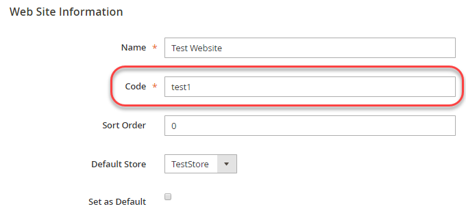
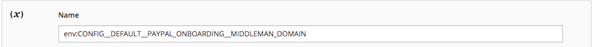

# 設定設定を上書き

このトピックでは、設定パスを知って環境変数名を導き出す方法について説明します。 Adobe Commerceの設定は、環境変数を使用して上書きできます。 例えば、実稼動システム上の決済代行会社のライブ URLの値を上書きできます。

環境変数を使用して、_any_&#x200B;の構成設定の値を上書きできます。ただし、[&#x200B; デプロイメントの一般的な概要](../deployment/overview.md)で説明しているように、Adobeでは、共有コンフィギュレーションファイル、`config.php`およびシステム固有のコンフィギュレーションファイル、`env.php`を使用して一貫した設定を維持することをお勧めします。

>[!TIP]
>
>_Commerce on Cloud Infrastructure ガイド_&#x200B;の「[Configure environments](https://experienceleague.adobe.com/docs/commerce-cloud-service/user-guide/configure/env/stage/variables-intro.html?lang=ja)」に関するトピックをご覧ください。

## 環境変数

環境変数名は、そのスコープの後に、特定の形式の設定パスが続く構成で構成されます。 次の節では、変数名の決定方法について詳しく説明します。

変数は、次のいずれかに使用できます。

- [機密値](config-reference-sens.md)は、環境変数または[`magento config:sensitive:set`](../cli/set-configuration-values.md) コマンドを使用して設定する必要があります。
- システム固有の値は、次を使用して設定する必要があります。

   - 環境変数
   - [`magento config:set`](../cli/set-configuration-values.md) コマンド
   - 管理者の後に[`magento app:config:dump` コマンド &#x200B;](../cli/export-configuration.md)が続きます

設定パスは、次の場所にあります。

- [機密性の高いシステム固有の設定パスの参照](config-reference-sens.md)
- [支払設定パスの参照](config-reference-payment.md)
- [Commerce B2B拡張機能の設定パスのリファレンス](config-reference-b2b.md)
- [その他の設定パスの参照](config-reference-general.md)

### 変数名

システム設定の変数名の一般的な形式は次のとおりです。

`<SCOPE>__<SYSTEM__VARIABLE__NAME>`

`<SCOPE>`は次のいずれかになります。

- グローバルスコープ（_all_ スコープのグローバル設定）

  グローバルスコープ変数の形式は次のとおりです。

  `CONFIG__DEFAULT__<SYSTEM__VARIABLE__NAME>`

- 特定の範囲（つまり、設定は指定されたストアビューまたはweb サイトにのみ影響します）

  例えば、ストアビュースコープ変数の形式は次のとおりです。

  `CONFIG__STORES__ <STORE_VIEW_CODE>__<SYSTEM__VARIABLE__NAME>`

  スコープの詳細は、次を参照してください。

   - [ステップ 1:web サイトまたはストアビューのスコープ値を見つける](#step-1-find-the-website-or-store-view-scope-value)
   - [Commerce ユーザーガイドのトピック](https://experienceleague.adobe.com/ja/docs/commerce-admin/start/setup/websites-stores-views#scope-settings)
   - [範囲クイックリファレンス](https://experienceleague.adobe.com/ja/docs/commerce-admin/config/scope-change#scope-quick-reference)

`<SYSTEM__VARIABLE__NAME>`は、`/`に置き換えられたダブルアンダースコア文字を含む設定パスです。 詳細については、[手順2：システム変数の設定](#step-2-set-global-website-or-store-view-variables)を参照してください。

### 変数形式

`<SCOPE>`は`<SYSTEM__VARIABLE__NAME>`から2つのアンダースコア文字で区切られています。

`<SYSTEM__VARIABLE__NAME>`は、構成設定の&#x200B;_設定パス_&#x200B;から派生しています。これは、特定の設定を一意に識別する`/`区切り文字列です。 設定パスの各`/`文字を2つのアンダースコア文字に置き換えて、システム変数を作成します。

設定パスにアンダースコア文字が含まれている場合、アンダースコア文字は変数に残ります。

設定パスの完全なリストは、次の場所にあります。

- [機密性の高いシステム固有の設定パスの参照](config-reference-sens.md)
- [支払設定パスの参照](config-reference-payment.md)
- [Commerce Enterprise B2B拡張機能の設定パスのリファレンス](config-reference-b2b.md)
- [その他の設定パスの参照](config-reference-general.md)

## ステップ 1:web サイトまたはストアビューのスコープ値を見つける

この節では、_スコープ_ （ストアビューまたはweb サイト）ごとにシステム構成値を検索して設定する方法について説明します。 グローバル スコープ変数を設定するには、[手順2: グローバル、web サイト、またはストア ビュー変数の設定](#step-2-set-global-website-or-store-view-variables)を参照してください。

範囲の値は、`store`、`store_group`、`store_website` テーブルから取得されます。

- `store` テーブルは、ストアビュー名とコードを指定します
- `store_website` テーブルは、web サイト名とコードを指定します

また、管理者を使用してコード値を検索することもできます。

テーブルの読み方：

- `Path in Admin`列

  コンマの前の値は、管理者ナビゲーションのパスです。 コンマの後の値は、右側のペインのオプションです。

- `Variable name`列は、対応する環境変数の名前です。

  必要に応じて、これらの設定パラメーターのシステム値を環境変数として指定するオプションがあります。

   - 変数名全体は常にALL CAPSです
   - 変数名を`CONFIG__`で開始します（2つのアンダースコア文字に注意）
   - 次の節に示すように、変数名の`<STORE_VIEW_CODE>`部分または`<WEBSITE_CODE>`部分は、管理者またはCommerce データベースで見つけることができます。
   - `<SYSTEM__VARIABLE__NAME>`については、[手順2: グローバル、web サイト、またはストアビュー変数の設定](#step-2-set-global-website-or-store-view-variables)を参照してください。

### 管理画面でweb サイトまたはストアビューの範囲を検索する

次の表は、管理画面でweb サイトまたはストアビューの値を検索する方法をまとめたものです。

| 説明 | 管理者のパス | 変数名 |
|--------------|--------------|----------------------|
| ストアビューの作成、編集、削除 | **[!UICONTROL Stores]** > **[!UICONTROL All Stores]** | `CONFIG__STORES__<STORE_VIEW_CODE>__<SYSTEM__VARIABLE__NAME>` |
| web サイトの作成、編集、削除 | **[!UICONTROL Stores]** > **[!UICONTROL All Store]s** | `CONFIG__WEBSITES__<WEBSITE_CODE>__<SYSTEM__VARIABLE__NAME>` |

例えば、管理画面でweb サイトまたはストアビュースコープの値を検索するには、次の手順を実行します。

1. Web サイトの表示を許可されたユーザーとして管理者にログインします。
1. **[!UICONTROL Stores]** > **[!UICONTROL All Store]s**&#x200B;をクリックします。
1. Web サイトまたはストアビューの名前をクリックします。

   右側のペインは、次のように表示されます。

   

1. スコープ名が&#x200B;**[!UICONTROL Code]** フィールドに表示されます。
1. [手順2: グローバル、web サイト、またはストアビュー変数を設定します](#step-2-set-global-website-or-store-view-variables)。

### データベース内のweb サイトまたはストアビュースコープを検索する

これらの値をデータベースから取得するには、次の手順を実行します。

1. まだ行っていない場合は、開発システムにファイルシステム所有者としてログインします。
1. 次のコマンドを入力します。

   ```shell
   mysql -u <database-username> -p
   ```

1. `mysql>` プロンプトで、次のコマンドを次の順序で入力します。

   ```shell
   use <database-name>;
   ```

1. 次のSQL クエリを使用して、関連する値を検索します。

   ```shell
   SELECT * FROM STORE;
   SELECT * FROM STORE_WEBSITE;
   ```

   サンプルは次のとおりです。

   ```shell
   mysql> SELECT * FROM STORE_WEBSITE;
   +------------+-------+--------------+------------+------------------+------------+
   | website_id | code  | name         | sort_order | default_group_id | is_default |
   +------------+-------+--------------+------------+------------------+------------+
   |          0 | admin | Admin        |          0 |                0 |          0 |
   |          1 | base  | Main Website |          0 |                1 |          1 |
   |          2 | test1 | Test Website |          0 |                3 |          0 |
   +------------+-------+--------------+------------+------------------+------------+
   ```

1. `name`の値ではなく、`code`列の値をスコープ名として使用します。

   例えば、テスト Web サイトの設定変数を設定するには、次の形式を使用します。

   ```shell
   CONFIG__WEBSITES__TEST1__<SYSTEM__VARIABLE__NAME>
   ```

   `<SYSTEM__VARIABLE__NAME>`は次のセクションから来ます。

## ステップ 2：グローバル、web サイト、またはストアビュー変数を設定する

この節では、システム変数の設定方法について説明します。

- グローバルスコープの値（つまり、すべてのweb サイト、ストア、ストアビュー）を設定するには、変数名を`CONFIG__DEFAULT__`から始めます。

- 特定のストアビューまたはweb サイトの値を設定するには、[手順1: スコープ値](#step-1-find-the-website-or-store-view-scope-value)で説明されているように変数名を開始します。

   - `CONFIG__WEBSITES`
   - `CONFIG__STORES`

- 変数名の最後の部分は設定パスで、設定ごとに一意です。

[いくつかの例を見る](#examples)。

次の表に、いくつかのサンプル変数を示します。

| 説明 | 管理者のパス（**ストア** > **設定** > **設定**&#x200B;を省略） | 変数名 |
|--------------|--------------|----------------------|
| Elasticsearch サーバーホスト名 | カタログ > **カタログ**、**Elasticsearch Server Hostname** | `<SCOPE>__CATALOG__SEARCH__ELASTICSEARCH_SERVER_HOSTNAME` |
| Elasticsearch サーバーポート | カタログ > **カタログ**、**Elasticsearch Server Port** | `<SCOPE>__CATALOG__SEARCH__ELASTICSEARCH_SERVER_PORT` |
| 輸送国の起源 | 売上> **出荷設定** | `<SCOPE>__SHIPPING__ORIGIN__COUNTRY_ID` |
| カスタム管理者URL | 詳細> **管理者** | `<SCOPE>__ADMIN__URL__CUSTOM` |
| カスタム管理パス | 詳細> **管理者** | `<SCOPE>__ADMIN__URL__CUSTOM_PATH` |

## 例

この節では、いくつかのサンプル変数の値を検索する方法を示します。

### Elasticsearch サーバーホスト名

グローバルなHTML縮小の変数名を検索するには：

1. 範囲の決定：

   グローバル スコープなので、変数名は`CONFIG__DEFAULT__`で始まります

1. 残りの変数名は`CATALOG__SEARCH__ELASTICSEARCH_SERVER_HOSTNAME`です。

   **結果**：変数名は`CONFIG__DEFAULT__CATALOG__SEARCH__ELASTICSEARCH_SERVER_HOSTNAME`です

### 輸送国の起源

配送国の原産地の変数名を検索するには、次の手順を実行します。

1. 範囲の決定：

   手順1: web サイトまたはストア ビューのスコープ値の検索で説明されているように、[database](#find-a-website-or-store-view-scope-in-the-database)でスコープを検索します。 （手順2：グローバル、web サイト、またはストアビュー変数の設定[&#128279;](#step-2-set-global-website-or-store-view-variables)の テーブルに示すように、管理者で値を見つけることもできます。

   例えば、範囲は`CONFIG__WEBSITES__DEFAULT`である可能性があります。

1. 残りの変数名は`SHIPPING__ORIGIN__COUNTRY_ID`です。

   **結果**：変数名は`CONFIG__WEBSITES__DEFAULT__SHIPPING__ORIGIN__COUNTRY_ID`です

## 環境変数の使用方法

PHPの[`$_ENV`](https://php.net/manual/en/reserved.variables.environment.php)関連付け配列を使用して、設定値を変数として設定します。 Commerceの実行時に実行される任意のPHP スクリプトで値を設定できます。

>[!TIP]
>
>`index.php`または`pub/index.php`で変数値を設定すると、web サーバーの構成に応じて異なるアプリケーションエントリポイントを使用できるため、必ずしも期待どおりに機能するとは限りません。 アプリケーションのエントリポイントが異なっても、`$_ENV` ディレクティブを`app/bootstrap.php` ファイルに配置すると、`app/bootstrap.php` ファイルがCommerce アーキテクチャの一部として読み込まれるため、`$_ENV` ディレクティブは常に実行されます。

2つの`$_ENV`値を設定する例を次に示します。

```php
$_ENV['CONFIG__DEFAULT__CATALOG__SEARCH__ELASTICSEARCH_SERVER_HOSTNAME'] = 'http://search.example.com';
$_ENV['CONFIG__DEFAULT__GENERAL__STORE_INFORMATION__MERCHANT_VAT_NUMBER'] = '1234';
```

ステップバイステップの例は、[環境変数を使用して設定値を設定](../deployment/example-environment-variables.md)に示しています。

>[!WARNING]
>
>- `$_ENV`配列で設定した値を使用するには、`php.ini` ファイルに`variables_order = "EGPCS"` （Environment、Get、Post、Cookie、およびServer）を設定する必要があります。 詳しくは、[PHP ドキュメント &#x200B;](https://www.php.net/manual/en/ini.core.php)を参照してください。
>
>- Adobe Commerce on cloud infrastructureの場合、[Project Web Interface](https://experienceleague.adobe.com/docs/commerce-cloud-service/user-guide/project/overview.html?lang=ja#configure-the-project)を使用して構成設定を上書きする場合は、変数名の前に`env:`を付ける必要があります。 例：
>
>
