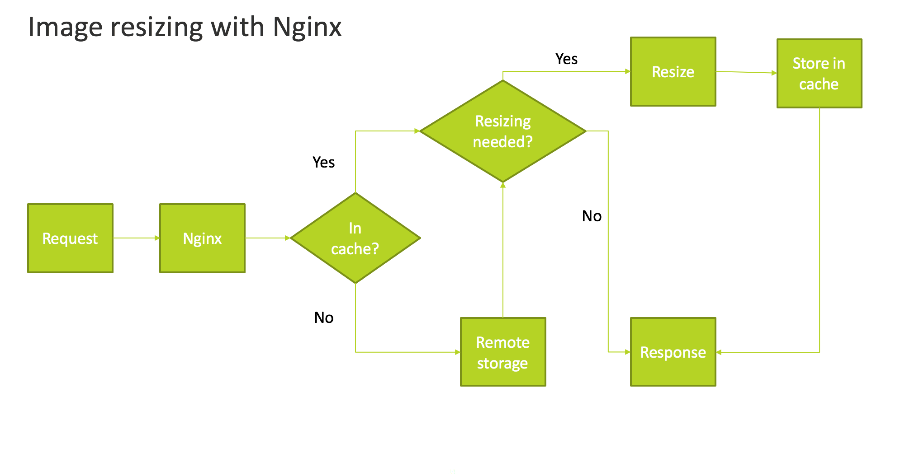

# リモートストレージの画像のサイズ変更を設定

デフォルトでは、Adobe Commerceはアプリケーション側での画像のサイズ変更をサポートしています。 ただし、リモート・ストレージ・モジュールを有効にすると、Nginx を使用してイメージのサイズ変更をサーバ側にオフロードし、ディスク・リソースを節約し、ディスク使用量を最適化できます。

次の図は、Nginx が画像を取得し、サイズ変更し、キャッシュに保存する方法を示しています。 サイズ変更は、高さや幅など、URL に含まれるパラメーターによって決まります。



>[!TIP]
>
>Adobe Commerce on cloud infrastructure プロジェクトについては、 [クラウドインフラストラクチャ上のコマース用のリモートストレージの設定](cloud-support.md)

## Adobe Commerceでの URL 形式の設定

サーバー側で画像のサイズを変更するには、Adobe Commerceを設定して、画像の高さ、幅、場所 (URL) の引数を指定する必要があります。

**サーバー側の画像のサイズ変更用に Commerce を設定するには**:

1. 内 _管理者_ パネル、クリック **[!UICONTROL Stores]** > **[!UICONTROL Settings]** > **[!UICONTROL Configuration]** > **[!UICONTROL General]** > **[!UICONTROL Web]**.

1. 右側のウィンドウで、を展開します。 **[!UICONTROL Url options]**.

1. 内 _カタログメディア URL 形式_ セクション、クリア **[!UICONTROL Use system value]**.

1. を選択します。 `Image optimization based on query parameters` URL: **_カタログメディア URL 形式_** フィールドに入力します。

1. クリック **[!UICONTROL Save Config]**.

1. 次に進みます。 [Nginx 設定](#configure-nginx).

## Nginx の設定

サーバー側での画像のサイズ変更の設定を続けるには、 `nginx.conf` ファイルを作成し、 `proxy_pass` 選択したアダプタの値。

**Nginx で画像のサイズを変更するには**:

1. のインストール [Nginx 画像フィルタモジュール][nginx-module].

   ```shell
   load_module /etc/nginx/modules/ngx_http_image_filter_module.so;
   ```

1. の作成 `nginx.conf` 含まれるテンプレートに基づくファイル `nginx.conf.sample` ファイル。 例：

   ```conf
   location ~* \.(jpg|jpeg|png|gif|webp)$ {
       set $width "-";
       set $height "-";
       if ($arg_width != '') {
           set $width $arg_width;
       }
       if ($arg_height != '') {
           set $height $arg_height;
       }
       image_filter resize $width $height;
       image_filter_jpeg_quality 90;
   }
   ```

1. [_オプション_] の設定 `proxy_pass` 特定のアダプタの値。

   - [Amazon Simple Storage Service (Amazon S3)](remote-storage-aws-s3.md)

<!-- link definitions -->

[nginx-module]: https://nginx.org/en/docs/http/ngx_http_image_filter_module.html
