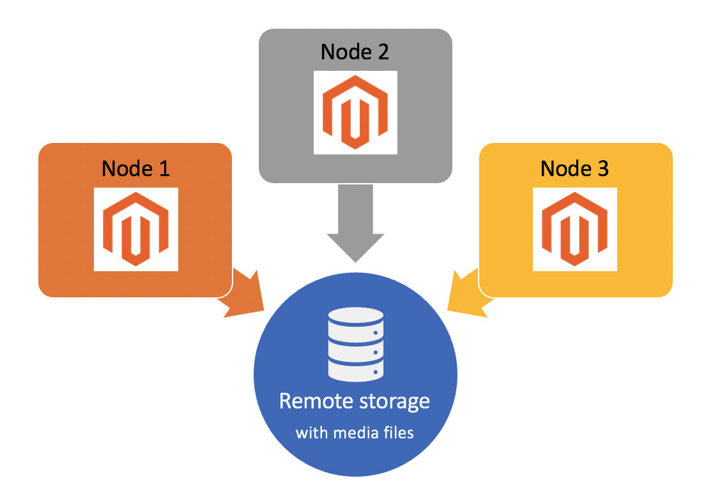

# リモートストレージの構成

リモートストレージモジュールでは、AWS S3 などのストレージサービスを使用して、メディアファイルを保存し、インポートおよびエクスポートのスケジュールを永続的なリモートストレージコンテナに設定できます。 デフォルトでは、Adobe Commerceアプリケーションは、メディアファイルを、そのアプリケーションを含むファイルシステムと同じファイルシステムに保存します。 これは複雑なマルチサーバ構成に対しては非効率で、リソースを共有する際にパフォーマンスが低下する可能性があります。 リモートストレージモジュールを使用すると、メディアファイルを `pub/media` 内のファイルのインポート/エクスポート `var` サーバー側の画像のサイズ変更を利用するためのリモートオブジェクトストレージのディレクトリ。

>[!INFO]
>
>リモートストレージは、Commerce バージョン 2.4.2 以降でのみ使用できます。 詳しくは、 [2.4.2 リリースノート](https://devdocs.magento.com/guides/v2.4/release-notes/open-source-2-4-2.html).

>[!INFO]
>
>リモートストレージモジュールには _制限_ クラウドインフラストラクチャ上のAdobe Commerceのサポート。 Adobeがサードパーティのストレージアダプタサービスを完全にトラブルシューティングできない。 詳しくは、 [クラウドインフラストラクチャ上のコマース用のリモートストレージの設定](cloud-support.md) クラウドプロジェクト用のリモートストレージの実装に関するガイダンス



## リモートストレージオプション

リモートストレージは、 `remote-storage` オプションを [`setup` CLI コマンド](../../installation/tutorials/deployment.md). この `remote-storage` オプションでは次の構文を使用します。

```text
--remote-storage-<parameter-name>="<parameter-value>"
```

この `parameter-name` は、特定のリモートストレージパラメーター名を参照します。 次の表に、リモートストレージの設定に使用できるパラメータを示します。

| コマンドラインパラメータ | パラメーター名 | 説明 | デフォルト値 |
|--- |--- |--- |--- |
| `remote-storage-driver` | ドライバ | アダプタ名<br>可能な値：<br>**ファイル**:リモートストレージを無効にし、ローカルファイルシステムを使用&#x200B;<br>**aws-s3**:以下を使用： [Amazon Simple Storage Service (Amazon S3)](remote-storage-aws-s3.md) | なし |
| `remote-storage-bucket` | バケット | オブジェクトのストレージまたはコンテナ名 | なし |
| `remote-storage-prefix` | prefix | オプションのプレフィックス（オブジェクトストレージ内の場所） | 空 |
| `remote-storage-region` | 地域 | 地域名 | なし |
| `remote-storage-key` | アクセスキー | オプションのアクセスキー | 空 |
| `remote-storage-secret` | 秘密鍵 | オプションの秘密鍵 | 空 |

### ストレージアダプタ

デフォルトの格納場所は、ローカルファイルシステムにあります。 A _ストレージアダプタ_ では、ストレージサービスに接続して、任意の場所にファイルを保存できます。 [!DNL Commerce] は、次のストレージサービスの構成をサポートしています。

- [Amazon Simple Storage Service (Amazon S3)](remote-storage-aws-s3.md)

## リモートストレージを有効にする

リモートストレージは、Adobe Commerceのインストール中にインストールするか、既存の Commerce インスタンスにリモートストレージを追加することができます。 次の例では、各メソッドで `remote-storage` コマースを使用するパラメーター `setup` CLI コマンド 最低限、ストレージを提供する必要があります `driver`, `bucket`、および `region`.

- 例：リモートストレージを使用した Commerce のインストール

   ```bash
   bin/magento setup:install --remote-storage-driver="aws-s3" --remote-storage-bucket="myBucket" --remote-storage-region="us-east-1"
   ```

- 例：既存のコマースでのリモートストレージの有効化

   ```bash
   bin/magento setup:config:set --remote-storage-driver="aws-s3" --remote-storage-bucket="myBucket" --remote-storage-region="us-east-1"
   ```

>[!TIP]
>
>クラウドインフラストラクチャ上のAdobe Commerceについては、 [クラウドインフラストラクチャ上のコマース用のリモートストレージの設定](cloud-support.md).

## 制限事項

リモートストレージとデータベースストレージの両方を同時に有効にすることはできません。 リモートストレージを使用している場合は、データベースストレージを無効にします。

```bash
bin/magento config:set system/media_storage_configuration/media_database 0
```

リモートストレージを有効にすると、確立された開発環境に影響を与える場合があります。 例えば、特定の PHP ファイル関数は期待どおりに動作しない場合があります。 ファイル操作に対する Commerce Framework の使用を適用する必要があります。

PHP の使用禁止のネイティブ関数のリストは、 [magento-coding-standard リポジトリ][code-standard].

## コンテンツを移行

特定のアダプタのリモートストレージを有効にした後、CLI を使用して既存のアダプタを移行できます _メディア_ ファイルをリモートストレージに保存します。

```bash
./magento2ce/bin/magento remote-storage:sync
```

>[!INFO]
>
>sync コマンドは、 `pub/media` ディレクトリ _not_ のインポート/エクスポートファイル `var` ディレクトリ。 詳しくは、 [予定されているインポート/エクスポート][import-export] 内 _Commerce 2.4 ユーザーガイド_.

<!-- link definitions -->

[import-export]: https://docs.magento.com/user-guide/system/data-scheduled-import-export.html
[code-standard]: https://github.com/magento/magento-coding-standard/blob/develop/Magento2/Sniffs/Functions/DiscouragedFunctionSniff.php
