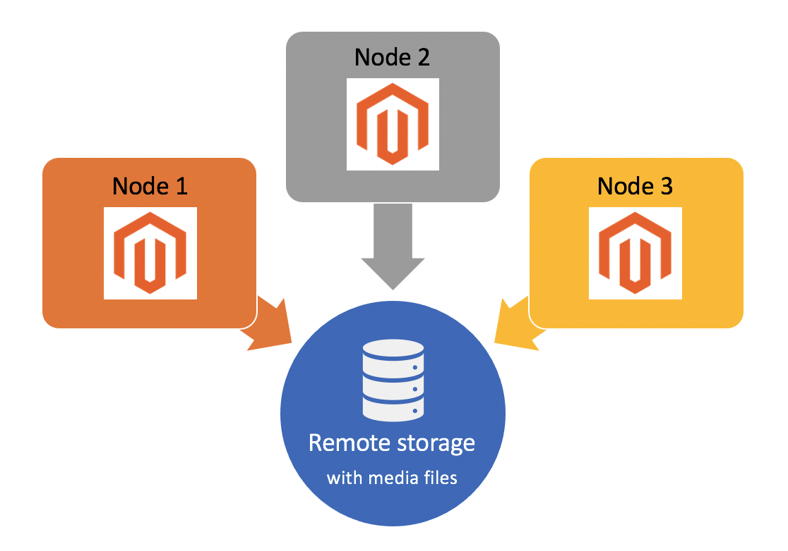

# リモートストレージの設定

リモートストレージモジュールには、メディアファイルを保存し、AWS S3などのストレージサービスを使用して、永続的なリモートストレージコンテナに読み込みと書き出しをスケジュールするオプションが用意されています。

デフォルトでは、Adobe Commerce アプリケーションは、アプリケーションを含む同じファイルシステムにメディアファイルを保存します。 これは、複雑なマルチサーバー設定では非効率的であり、リソースを共有する際にパフォーマンスが低下する可能性があります。 リモートストレージモジュールを使用すると、メディアファイルを`pub/media` ディレクトリに保存し、リモートオブジェクトストレージの`var` ディレクトリにファイルを読み込みおよび書き出しして、サーバーサイドの画像サイズを活用できます。

>[!BEGINSHADEBOX]

リモート ストレージ _と_ データベース ストレージの両方を同時に有効にすることはできません。 リモート・ストレージを有効にする前に、データベース・ストレージを無効にする必要があります。

```shell
bin/magento config:set system/media_storage_configuration/media_database 0
```

リモートストレージを有効にすると、既存の開発エクスペリエンスに影響する可能性があります。 例えば、特定のPHP ファイル関数が期待どおりに動作しない場合があります。 ファイル操作に対するCommerce Frameworkの使用を強制する必要があります。 禁止されているPHP ネイティブ関数のリストは、[magento-coding-standard](https://github.com/magento/magento-coding-standard/blob/develop/Magento2/Sniffs/Functions/DiscouragedFunctionSniff.php) リポジトリで入手できます。

>[!ENDSHADEBOX]

>[!INFO]
>
>- リモートストレージは、Commerce バージョン 2.4.2以降でのみ使用できます。 [2.4.2 リリースノート &#x200B;](https://experienceleague.adobe.com/ja/docs/commerce-operations/release/notes/magento-open-source/2-4-2)を参照してください。
>
>- リモート ストレージ モジュールは、クラウド インフラストラクチャ上のAdobe Commerceで&#x200B;_制限付き_ サポートされています。 Adobeでは、サードパーティ製ストレージアダプターサービスのトラブルシューティングを完全に実行できません。 クラウドプロジェクトにリモートストレージを実装するガイダンスについては、[Commerce on Cloud インフラストラクチャのリモートストレージの設定](cloud-support.md)を参照してください。



## リモートストレージオプション

[`setup` CLI コマンド &#x200B;](../../installation/tutorials/deployment.md)を使用して、`remote-storage` オプションを使用してリモート ストレージを設定できます。 `remote-storage` オプションでは、次の構文を使用します。

```text
--remote-storage-<parameter-name>="<parameter-value>"
```

`parameter-name`は、特定のリモート ストレージ パラメーター名を参照しています。 次の表に、リモートストレージの設定に使用できるパラメーターを示します。

| コマンドラインパラメーター | パラメーター名 | 説明 | デフォルト値 |
|--- |--- |--- |--- |
| `remote-storage-driver` | ドライバー | アダプタ名<br>可能な値：<br>**ファイル**：リモートストレージを無効にし、ローカルファイルシステムを使用します&#x200B;<br>**aws-s3**: [Amazon Simple Storage Service （Amazon S3）を使用します](remote-storage-aws-s3.md) | なし |
| `remote-storage-bucket` | バケット | オブジェクトストレージまたはコンテナ名 | なし |
| `remote-storage-prefix` | 接頭辞 | オプションの接頭辞（オブジェクトストレージ内の場所） | empty |
| `remote-storage-region` | 地域 | 地域名 | なし |
| `remote-storage-key` | アクセスキー | オプションのアクセスキー | empty |
| `remote-storage-secret` | 秘密鍵 | オプションの秘密鍵 | empty |

### ストレージアダプター

デフォルトのストレージの場所は、ローカルのファイルシステムにあります。 _ストレージアダプタ_&#x200B;を使用すると、ストレージサービスに接続し、ファイルを任意の場所に保存できます。 [!DNL Commerce]は、次のストレージ サービスの設定をサポートしています：

- [Amazon Simple Storage Service （Amazon S3）](remote-storage-aws-s3.md)

## リモートストレージの有効化

Adobe Commerceのインストール中にリモートストレージをインストールしたり、既存のCommerce インスタンスにリモートストレージを追加したりできます。 次の例では、Commerce `setup` CLI コマンドで`remote-storage` パラメーターのセットを使用して各メソッドを示します。 最低限、ストレージ `driver`、`bucket`、`region`を指定する必要があります。

- 例：リモートストレージを使用したCommerceのインストール

  ```shell
  bin/magento setup:install --remote-storage-driver="aws-s3" --remote-storage-bucket="myBucket" --remote-storage-region="us-east-1"
  ```

- 例：既存のCommerceでリモートストレージを有効にする

  ```shell
  bin/magento setup:config:set --remote-storage-driver="aws-s3" --remote-storage-bucket="myBucket" --remote-storage-region="us-east-1"
  ```

>[!TIP]
>
>クラウド インフラストラクチャ上のAdobe Commerceについては、[&#x200B; クラウド インフラストラクチャ上のCommerceのリモート ストレージの設定](cloud-support.md)を参照してください。

## コンテンツの移行

特定のアダプタのリモートストレージを有効にした後、CLIを使用して、既存の&#x200B;_media_ ファイルをリモートストレージに移行できます。

```shell
./magento2ce/bin/magento remote-storage:sync
```

>[!INFO]
>
>同期コマンドは、`pub/media` ディレクトリ内のファイルのみを移行します。_not_ ファイルは`var` ディレクトリ内のインポート/エクスポート ファイルです。 _Commerce 2.4 ユーザーガイド_&#x200B;の「[&#x200B; スケジュールされた読み込み/書き出し](https://experienceleague.adobe.com/docs/commerce-admin/systems/data-transfer/data-scheduled-import-export.html?lang=ja)」を参照してください。

