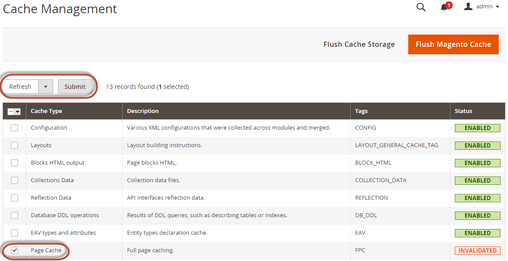

# 検索エンジン設定

この節では、Adobe CommerceのオンプレミスのデプロイメントでElasticsearchまたはOpenSearchをテストするために選択する必要がある最小設定について説明します。

>[!TIP]
>
>バージョン 2.4.4および2.4.3-p2では、**Elasticsearch**&#x200B;というラベルが付けられたすべてのフィールドがOpenSearchにも適用されます。
>Elasticsearch 8.xのサポートがバージョン 2.4.6で導入されたときには、ElasticsearchとOpenSearchの設定を区別するために新しいラベルが作成されました。

検索エンジンの設定について詳しくは、[&#x200B; ユーザーガイド &#x200B;](https://experienceleague.adobe.com/docs/commerce-admin/catalog/catalog/search/search-configuration.html)を参照してください。

## 管理者から検索エンジンを設定します

>[!TIP]
>
>新しい検索エンジンのバージョンにアップグレードする方法については、[&#x200B; アップグレードの前提条件](../../upgrade/prepare/prerequisites.md)を参照してください。

ElasticsearchまたはOpenSearchを使用するようにシステムを設定するには：

1. 管理者としてAdminにログインします。
1. **[!UICONTROL Stores]** > [!UICONTROL Settings] > **[!UICONTROL Configuration]** > **[!UICONTROL Catalog]** > **[!UICONTROL Catalog]** > **[!UICONTROL Catalog Search]**&#x200B;をクリックします。
1. **[!UICONTROL Search Engine]** リストから、対応する検索エンジンのバージョンを選択します。

   次の表に、Commerceとの接続を設定およびテストするために必要なオプションを示します。 検索エンジンのサーバー設定を変更しない限り、デフォルトは機能する必要があります。 次の手順に進みます。

   | オプション | 説明 |
   |--- |--- |
   | **[!UICONTROL Server Hostname]** | ElasticsearchまたはOpenSearchを実行しているマシンの完全修飾ホスト名またはIP アドレスを入力します。<br>Adobe Commerce クラウド インフラストラクチャ版：統合システムからこの値を取得します。 |
   | **[!UICONTROL Server Port]** | Web サーバープロキシポートを入力します。 デフォルトは、クラウドインフラストラクチャ上の9200<br>Adobe Commerceです。この値を取得するには、統合システムを使用します。 |
   | **[!UICONTROL Index Prefix]** | 検索エンジンのインデックス接頭辞を入力します。 1つのインスタンスを複数のCommerce インストール（ステージング環境および実稼動環境）で使用する場合は、各インストールに一意のプレフィックスを指定する必要があります。 それ以外の場合は、デフォルトの接頭辞magento2を使用できます。 |
   | **[!UICONTROL Enable HTTP Auth]** | 検索エンジンサーバーの認証を有効にしている場合にのみ、**[!UICONTROL Yes]**&#x200B;をクリックします。 その場合は、指定したフィールドにユーザー名とパスワードを入力します。 |
   | **[!UICONTROL Server Timeout]** | ElasticsearchまたはOpenSearch サーバーへの接続を確立する際に待機する時間（秒単位）を入力します。 |

1. **[!UICONTROL Test Connection]**&#x200B;をクリックします。

   回答サンプル：

   

   次でログイン：

   - [検索エンジン用のApacheの設定](../../installation/prerequisites/search-engine/configure-apache.md)
   - [検索エンジン用にnginxを設定する](../../installation/prerequisites/search-engine/configure-nginx.md)

   ご覧の通り：

   

その場合は、次のことをお試しください。

- 検索エンジンサーバーが実行されていることを確認します。
- サーバーがCommerceとは異なるホスト上にある場合は、Commerce サーバーにログインし、検索エンジンホストにpingを送信します。 ネットワーク接続の問題を解決し、接続を再度テストします。
- ElasticsearchまたはOpenSearchを開始したコマンドウィンドウで、スタックトレースと例外を確認します。 続行する前にそれらを解決する必要があります。 特に、`root`権限を持つユーザーとして検索エンジンを開始していることを確認してください。
- [UNIX ファイアウォールとSELinux](../../installation/prerequisites/search-engine/overview.md#firewall-and-selinux)の両方が無効になっていることを確認するか、検索エンジンとCommerceが互いに通信できるようにルールを設定します。
- **[!UICONTROL Server Hostname]** フィールドの値を確認します。 サーバーが使用可能であることを確認します。 代わりに、サーバーのIP アドレスを試すことができます。
- `netstat -an | grep <listen-port>` コマンドを使用して、**[!UICONTROL Server Port]** フィールドで指定されたポートが別のプロセスで使用されていないことを確認します。

  例えば、検索エンジンがデフォルトポートで実行されているかどうかを確認するには、次のコマンドを使用します。

  ```shell
  netstat -an | grep 9200
  ```

  ポート 9200で実行している場合は、次のように表示されます。

  ```text
  `tcp        0      0 :::9200            :::-         LISTEN`
  ```

## カタログ検索のインデックスを再作成し、ページ全体のキャッシュを更新する

検索エンジンの設定を変更したら、カタログ検索インデックスを再インデックスし、管理者またはコマンドラインを使用して完全なページキャッシュを更新する必要があります。

管理者を使用してキャッシュを更新するには：

1. 管理者で、**[!UICONTROL System]** > **[!UICONTROL Cache Management]**&#x200B;をクリックします。
1. **[!UICONTROL Page Cache]**&#x200B;の横にあるチェックボックスを選択します。
1. 右上の&#x200B;**[!UICONTROL Actions]** リストから、**更新**&#x200B;をクリックします。

   

コマンドラインを使用してキャッシュをクリーンアップするには：[`bin/magento cache:clean`](../cli/manage-cache.md#clean-and-flush-cache-types)

コマンドラインを使用してインデックスを再作成するには：

1. [&#x200B; ファイルシステム所有者](../../installation/prerequisites/file-system/overview.md)としてCommerce サーバーにログインするか、切り替えます。
1. 次のいずれかのコマンドを入力します。

   カタログ検索インデックスのみを再インデックス化するには、次のコマンドを入力します。

   ```shell
   bin/magento indexer:reindex catalogsearch_fulltext
   ```

   すべてのインデクサーを再インデックス化するには、次のコマンドを入力します。

   ```shell
   bin/magento indexer:reindex
   ```

1. インデックス再作成が完了するまで待ちます。

   >[!INFO]
   >
   >キャッシュとは異なり、インデックスはcron ジョブによって更新されます。 検索エンジンの使用を開始する前に、[cronが有効になっていることを確認してください](../cli/configure-cron-jobs.md)。
