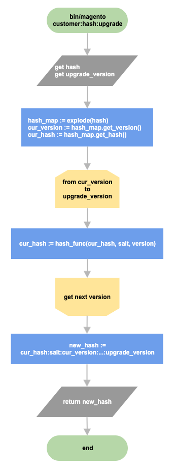
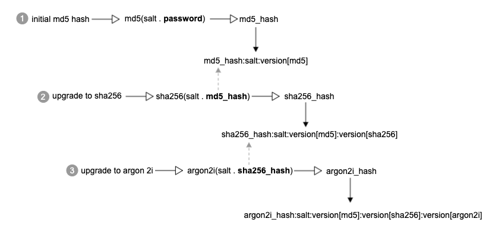

# パスワードハッシュ

現在、Commerceでは、さまざまなネイティブ PHP ハッシュアルゴリズムに基づいて、独自のパスワードハッシュを使用しています。 Commerceは、`MD5`、`SHA256`、`Argon 2ID13`などの複数のアルゴリズムをサポートしています。 Sodium拡張機能がインストールされている場合（PHP 7.3でデフォルトでインストールされている場合）、`Argon 2ID13`がデフォルトのハッシュアルゴリズムとして選択されます。 それ以外は、`SHA256`がデフォルトです。 Commerceは、Argon 2i アルゴリズムをサポートするネイティブ PHP `password_hash`関数を使用できます。

`MD5`などの古いアルゴリズムでハッシュ化された古いパスワードが危険にさらされないようにするために、現在の実装では、元のパスワードを変更せずにハッシュをアップグレードする方法が提供されています。 一般に、パスワードハッシュの形式は次のとおりです。

```text
password_hash:salt:version<n>:version<n>
```

ここで、`version<n>`...`version<n>`は、パスワードで使用されるすべてのハッシュアルゴリズムのバージョンを表します。 また、塩は常にパスワードハッシュと一緒に保存されるので、アルゴリズムのチェーン全体を復元できます。 例を次に示します。

```text
a853b06f077b686f8a3af80c98acfca763cf10c0e03597c67e756f1c782d1ab0:8qnyO4H1OYIfGCUb:1:2
```

最初の部分はパスワードハッシュを表します。 2つ目の`8qnyO4H1OYIfGCUb`は塩です。 最後の2つは異なるハッシュアルゴリズムです。1は`SHA256`、2は`Argon 2ID13`。 つまり、お客様のパスワードは当初`SHA256`でハッシュ化され、その後、アルゴリズムは`Argon 2ID13`で更新され、ハッシュはArgonでハッシュ化されました。

## ハッシュ戦略のアップグレード

ハッシュアップグレードメカニズムがどのようなものかを考えてみましょう。 最初はパスワードが`MD5`でハッシュ化され、その後アルゴリズムがArgon 2ID13で複数回更新されたとします。 次の図は、ハッシュ アップグレード フローを示しています。



各ハッシュアルゴリズムは、前のパスワードハッシュを使用して新しいハッシュを生成します。 Commerceには、元の生のパスワードは保存されません。



前述したように、パスワードハッシュには、元のパスワードに複数のハッシュバージョンが適用されている場合があります。
ここでは、お客様の認証中にパスワード確認メカニズムがどのように機能するかを説明します。

```php
def verify(password, hash):
    restored = password

    hash_map = extract(hash)
    # iterate through all versions specified in the received hash [md5, sha256, argon2id13]
    for version in hash_map.get_versions():
        # generate new hash based on password/previous hash, salt and version
        restored = hash_func(salt . restored, version)

    # extract only password hash from the hash:salt:version chain
    hash = hash_map.get_hash()

    return compare(restored, hash)
```

Commerceでは、使用済みのすべてのパスワードハッシュのバージョンをパスワードハッシュと一緒に保存するため、パスワード検証中にハッシュチェーン全体を復元できます。 ハッシュ検証メカニズムは、ハッシュアップグレード戦略と似ています。パスワードのハッシュと一緒に保存されたバージョンに基づいて、アルゴリズムは提供されたパスワードからハッシュを生成し、ハッシュ化されたパスワードとデータベースに保存されたハッシュとの比較結果を返します。

## 導入

`\Magento\Framework\Encryption\Encryptor` クラスは、パスワード ハッシュの生成と検証を担当します。 [`bin/magento customer:hash:upgrade`](https://experienceleague.adobe.com/en/docs/commerce-operations/tools/cli-reference/commerce-on-premises#customerhashupgrade) コマンドは、顧客パスワード ハッシュを最新のハッシュ アルゴリズムにアップグレードします。
