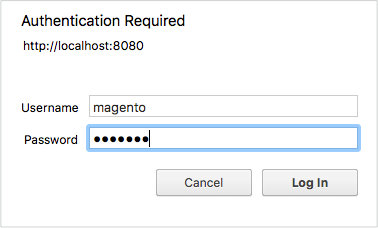

# セキュアなcron PHP

このトピックでは、悪意のあるエクスプロイトで使用されないようにするための`pub/cron.php`のセキュリティの確保について説明します。 cronを保護しないと、誰でもcronを実行してCommerce アプリケーションを攻撃する可能性があります。

cron ジョブは、スケジュールされたタスクを複数実行し、Commerce設定の重要な一部です。 スケジュールされたタスクには、次のようなものがあります。

- インデックス再作成
- 電子メールの生成
- ニュースレターの生成
- サイトマップの生成

>[!INFO]
>
>cron グループについて詳しくは、[cronの設定と実行](../cli/configure-cron-jobs.md#run-cron-from-the-command-line)を参照してください。

cron ジョブは、次の方法で実行できます。

- コマンドラインまたはcrontabで[`magento cron:run`](../cli/configure-cron-jobs.md#run-cron-from-the-command-line) コマンドを使用する
- Web ブラウザーの`pub/cron.php?[group=<name>]`へのアクセス

>[!INFO]
>
>[`magento cron:run`](../cli/configure-cron-jobs.md#run-cron-from-the-command-line) コマンドを使用してcronを実行する場合は、既にセキュリティで保護されている別のプロセスを使用するため、何もする必要はありません。

## Apacheによるセキュアクローン

この節では、ApacheでHTTP Basic認証を使用してcronを保護する方法について説明します。 これらの手順は、CentOS 6を使用したApache 2.2に基づいています。 詳しくは、次のいずれかのリソースを参照してください。

- [Apache 2.2認証と認証のチュートリアル](https://httpd.apache.org/docs/2.2/howto/auth.html)
- [Apache 2.4認証と認証のチュートリアル](https://httpd.apache.org/docs/2.4/howto/auth.html)

### パスワードファイルの作成

セキュリティ上の理由から、Web サーバーのdocroot以外の場所にパスワードファイルを配置できます。 この例では、パスワードファイルを新しいディレクトリに保存しています。

`root`権限を持つユーザーとして次のコマンドを入力します。

```shell
mkdir -p /usr/local/apache/password
```

```shell
htpasswd -c /usr/local/apache/password/passwords <username>
```

ここで、`<username>`はWeb サーバーユーザーまたは別のユーザーにすることができます。 この例では、web サーバーユーザーを使用していますが、ユーザーの選択はユーザーによって異なります。

画面の指示に従って、ユーザーのパスワードを作成します。

パスワードファイルに別のユーザーを追加するには、`root`権限を持つユーザーとして次のコマンドを入力します。

```shell
htpasswd /usr/local/apache/password/passwords <username>
```

### 承認済みcron グループを作成するためのユーザーの追加（オプション）

複数のユーザーがcronを実行できるようにするには、これらのユーザーをグループファイルを含むパスワードファイルに追加します。

パスワードファイルに別のユーザーを追加するには：

```shell
htpasswd /usr/local/apache/password/passwords <username>
```

承認済みグループを作成するには、web サーバーのdocroot以外の場所にグループファイルを作成します。 グループファイルは、グループの名前とグループ内のユーザーを指定します。 この例では、グループ名は`MagentoCronGroup`です。

```shell
vim /usr/local/apache/password/group
```

ファイルの内容：

```text
MagentoCronGroup: <username1> ... <usernameN>
```

### `.htaccess`でcronを保護します

`.htaccess` ファイルでcronを保護するには：

1. ファイルシステムの所有者としてCommerce サーバーにログインするか、切り替えます。
1. `<magento_root>/pub/.htaccess`をテキストエディターで開きます。

   （`cron.php`は`pub` ディレクトリにあるので、この`.htaccess`のみを編集してください）。

1. _1人以上のユーザーのCron アクセス。_ 既存の`<Files cron.php>` ディレクティブを次のディレクティブに置き換えます。

   ```conf
   <Files cron.php>
      AuthType Basic
      AuthName "Cron Authentication"
      AuthUserFile /usr/local/apache/password/passwords
      Require valid-user
   </Files>
   ```

1. グループの&#x200B;_Cron アクセス。_ 既存の`<Files cron.php>` ディレクティブを次のディレクティブに置き換えます。

   ```conf
   <Files cron.php>
      AuthType Basic
      AuthName "Cron Authentication"
      AuthUserFile /usr/local/apache/password/passwords
      AuthGroupFile <path to optional group file>
      Require group <name>
   </Files>
   ```

1. 変更を`.htaccess`に保存して、テキストエディターを終了します。
1. [&#x200B; クローンが安全であることを確認します](#verify-cron-is-secure)。

## Nginxでcronを保護

この節では、Nginx web サーバーを使用してcronを保護する方法について説明します。 次のタスクを実行する必要があります。

1. Nginx用に暗号化されたパスワードファイルを設定する
1. `pub/cron.php`へのアクセス時にパスワード ファイルを参照するようにnginx設定を変更します

### パスワードファイルの作成

続行する前に、次のいずれかのリソースを参照して、パスワードファイルを作成します。

- [Ubuntu 14.04 （DigitalOcean）でNginxでパスワード認証を設定する方法](https://www.digitalocean.com/community/tutorials/how-to-set-up-password-authentication-with-nginx-on-ubuntu-14-04)
- [Nginxによる基本的なHTTP認証（howtoforge）](https://www.howtoforge.com/basic-http-authentication-with-nginx)

### `nginx.conf.sample`でcronを保護します

Commerceには、最適化されたサンプル nginx コンフィギュレーションファイルが標準搭載されています。 cronを保護するために修正することをお勧めします。

1. [`nginx.conf.sample`](https://github.com/magento/magento2/blob/2.4/nginx.conf.sample) ファイルに以下を追加します。

   ```conf
   #Securing cron
   location ~ cron\.php$ {
      auth_basic "Cron Authentication";
      auth_basic_user_file /etc/nginx/.htpasswd;
   
      try_files $uri =404;
      fastcgi_pass   fastcgi_backend;
      fastcgi_buffers 1024 4k;
   
      fastcgi_read_timeout 600s;
      fastcgi_connect_timeout 600s;
   
      fastcgi_index  index.php;
      fastcgi_param  SCRIPT_FILENAME  $document_root$fastcgi_script_name;
      include        fastcgi_params;
   }
   ```

1.nginxを再起動します。

```shell
systemctl restart nginx
```

1. [&#x200B; クローンが安全であることを確認します](#verify-cron-is-secure)。

## cronが安全であることを確認する

`pub/cron.php`が安全であることを確認する最も簡単な方法は、パスワード認証を設定した後に、`cron_schedule` データベーステーブルに行を作成していることを確認することです。 この例では、SQL コマンドを使用してデータベースをチェックしますが、好きなツールを使用できます。

>[!INFO]
>
>この例で実行している`default` cronは、`crontab.xml`で定義されているスケジュールに従って実行されます。 一部のcron ジョブは1日に1回だけ実行されます。 ブラウザーからcronを初めて実行すると、`cron_schedule` テーブルが更新されますが、その後の`pub/cron.php` リクエストは設定されたスケジュールで実行されます。

**cronが安全であることを確認するには**:

1. データベースにCommerce データベースユーザーまたは`root`としてログインします。

   以下に例を挙げます。

   ```shell
   mysql -u magento -p
   ```

1. Commerce データベースを使用します。

   ```shell
   use <database-name>;
   ```

   以下に例を挙げます。

   ```shell
   use magento;
   ```

1. `cron_schedule` データベーステーブルからすべての行を削除します。

   ```shell
   TRUNCATE TABLE cron_schedule;
   ```

1. ブラウザーからcronを実行します。

   ```shell
   http[s]://<Commerce hostname or ip>/cron.php?group=default
   ```

   例：

   ```shell
   http://magento.example.com/cron.php?group=default
   ```

1. プロンプトが表示されたら、許可されたユーザーの名前とパスワードを入力します。 次の図は、例を示しています。

   

1. 行がテーブルに追加されたことを確認します。

   ```shell
   SELECT * from cron_schedule;
   
   mysql> SELECT * from cron_schedule;
   +-------------+-----------------------------------------------+---------+----------+---------------------+---------------------+-------------+-------------+
   | schedule_id | job_code                             | status  | messages | created_at        | scheduled_at      | executed_at | finished_at |
   +-------------+-----------------------------------------------+---------+----------+---------------------+---------------------+-------------+-------------+
   |         1 | catalog_product_outdated_price_values_cleanup | pending | NULL    | 2017-09-27 14:24:17 | 2017-09-27 14:24:00 | NULL      | NULL      |
   |         2 | sales_grid_order_async_insert             | pending | NULL    | 2017-09-27 14:24:17 | 2017-09-27 14:24:00 | NULL      | NULL      |
   |         3 | sales_grid_order_invoice_async_insert       | pending | NULL    | 2017-09-27 14:24:17 | 2017-09-27 14:24:00 | NULL      | NULL      |
   |         4 | sales_grid_order_shipment_async_insert      | pending | NULL    | 2017-09-27 14:24:17 | 2017-09-27 14:24:00 | NULL      | NULL      |
   |         5 | sales_grid_order_creditmemo_async_insert     | pending | NULL    | 2017-09-27 14:24:17 | 2017-09-27 14:24:00 | NULL      | NULL      |
   |         6 | sales_send_order_emails                  | pending | NULL    | 2017-09-27 14:24:17 | 2017-09-27 14:24:00 | NULL      | NULL      |
   |         7 | sales_send_order_invoice_emails            | pending | NULL    | 2017-09-27 14:24:17 | 2017-09-27 14:24:00 | NULL      | NULL      |
   |         8 | sales_send_order_shipment_emails           | pending | NULL    | 2017-09-27 14:24:17 | 2017-09-27 14:24:00 | NULL      | NULL      |
   |         9 | sales_send_order_creditmemo_emails         | pending | NULL    | 2017-09-27 14:24:17 | 2017-09-27 14:24:00 | NULL      | NULL      |
   |        10 | newsletter_send_all                     | pending | NULL    | 2017-09-27 14:24:17 | 2017-09-27 14:25:00 | NULL      | NULL      |
   |        11 | captcha_delete_old_attempts               | pending | NULL    | 2017-09-27 14:24:17 | 2017-09-27 14:30:00 | NULL      | NULL      |
   |        12 | captcha_delete_expired_images             | pending | NULL    | 2017-09-27 14:24:17 | 2017-09-27 14:30:00 | NULL      | NULL      |
   |        13 | outdated_authentication_failures_cleanup     | pending | NULL    | 2017-09-27 14:24:17 | 2017-09-27 14:24:00 | NULL      | NULL      |
   |        14 | magento_newrelicreporting_cron            | pending | NULL    | 2017-09-27 14:24:17 | 2017-09-27 14:24:00 | NULL      | NULL      |
   +-------------+-----------------------------------------------+---------+----------+---------------------+---------------------+-------------+-------------+
   14 rows in set (0.00 sec)
   ```

## Web ブラウザーからcronを実行する

web ブラウザーを使用して、開発中など、cronをいつでも実行できます。

>[!WARNING]
>
>ブラウザーでcronを実行する場合は、まずcronを保護せずに&#x200B;_not_&#x200B;を実行します。

Apache Web サーバーを使用している場合は、ブラウザーでcronを実行する前に、`.htaccess` ファイルから制限を削除する必要があります。

1. Commerce ファイルシステムへの書き込み権限を持つユーザーとして、Commerce サーバーにログインします。
1. テキストエディターで次のいずれかを開きます（Magentoへのエントリポイントに応じて）。

   ```text
   <magento_root>/pub/.htaccess
   <magento_root>/.htaccess
   ```

1. 次の項目を削除またはコメントアウトします。

   ```conf
   ## Deny access to cron.php
     <Files cron.php>
        order allow,deny
        deny from all
     </Files>
   ```

   以下に例を挙げます。

   ```conf
   ## Deny access to cron.php
      #<Files cron.php>
         # order allow,deny
         # deny from all
      #</Files>
   ```

1. 変更を保存し、テキストエディターを終了します。

   その後、次のようにweb ブラウザーでcronを実行できます。

   ```text
   <your hostname or IP>/<Commerce root>/pub/cron.php[?group=<group name>]
   ```

どこで：

- `<your hostname or IP>`は、Commerce インストールのホスト名またはIP アドレスです
- `<Commerce root>`は、Commerce ソフトウェアをインストールしたweb サーバーのdocroot相対ディレクトリです

  Commerce アプリケーションの実行に使用する正確なURLは、web サーバーとバーチャルホストの設定方法によって異なります。

- `<group name>`は有効なcron グループ名です（オプション）

以下に例を挙げます。

```http
https://magento.example.com/magento2/pub/cron.php?group=index
```

>[!INFO]
>
>実行するタスクを見つけるためにcronを2回実行する必要があります。最初に実行するタスクを見つけ、もう一度タスク自体を実行します。 cron グループについて詳しくは、[cronの設定と実行](../cli/configure-cron-jobs.md)を参照してください。
