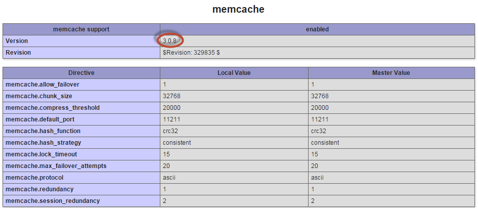

# Ubuntuでのmemcachedの設定

この節では、Ubuntuにmemcachedをインストールする手順を説明します。

>[!INFO]
>
>Adobeでは、memcached バージョン 3.0.5以降を使用することをお勧めします。

PHPはmemcacheをネイティブにサポートしていないので、PHPで使用するには拡張機能をインストールする必要があります。 利用可能なPHP拡張機能は2つあり、どの拡張機能を使用するかをデコードすることが重要です。

- `memcache` （_no d_） – 古いが人気のある拡張機能で、定期的にメンテナンスされません。
現在`memcache`拡張機能&#x200B;_はPHP 7で動作しません。_ memcache[&#128279;](https://www.php.net/manual/en/book.memcache.php)については、PHP ドキュメントを参照してください。

  Ubuntuの正確な名前は`php5-memcache`です。

- `memcached` （_と`d`_） - PHP 7と互換性のある、新しく保守された拡張機能。 memcached[&#128279;](https://www.php.net/manual/en/book.memcached.php)については、PHP ドキュメントを参照してください。

  Ubuntuの正確な名前は`php5-memcached`です。

## Ubuntuでのmemcachedのインストールと設定

**Ubuntu**&#x200B;でmemcachedをインストールして設定するには：

1. `root`権限を持つユーザーとして、次のコマンドを入力します。

   ```shell
   apt-get -y update
   ```

   ```shell
   apt-get -y install php5-memcached memcached
   ```

1. `CACHESIZE`と`-l`のmemcached設定設定を変更します。

   1. `/etc/memcached.conf`をテキストエディターで開きます。
   1. `-m` パラメーターを探します。
   1. その値を`1GB`以上に変更してください
   1. `-l` パラメーターを探します。
   1. 値を`127.0.0.1`または`localhost`に変更します
   1. 変更を`memcached.conf`に保存して、テキストエディターを終了します。
   1. memcachedを再起動します。

      ```shell
      service memcached restart
      ```

1. Web サーバーを再起動します。

   Apacheの場合、`service apache2 restart`

1. 次のセクションに進みます。

## Magentoをインストールする前に、memcachedが機能することを確認する

Adobeでは、Commerceをインストールする前にmemcachedをテストして、動作することを確認することをお勧めします。 これには数分しかかかりませんし、後でトラブルシューティングを簡素化できます。

### memcachedがweb サーバーで認識されていることを確認します

memcachedがweb サーバーで認識されていることを確認するには：

1. Web サーバーのdocrootに`phpinfo.php` ファイルを作成します。

   ```php
   <?php
   // Show all information, defaults to INFO_ALL
   phpinfo();
   ```

1. web ブラウザーでそのページに移動します。 例：

   ```http
   http://192.0.2.1/phpinfo.php
   ```

1. memcachedが次のように表示されることを確認します。

   

   memcached バージョン 3.0.5以降を使用していることを確認します。

   memcachedが表示されない場合は、web サーバーを再起動してブラウザーページを更新します。 それでも表示されない場合は、`php-pecl-memcached`拡張機能がインストールされていることを確認してください。

### memcachedがデータをキャッシュできることを確認します

このテストでは、PHP スクリプトを使用して、memcachedがキャッシュデータを保存および取得できることを検証します。

このテストについて詳しくは、[Ubuntu チュートリアルでMemcacheをインストールして使用する方法](https://www.digitalocean.com/community/tutorials/how-to-install-and-use-memcache-on-ubuntu-14-04)を参照してください。

Web サーバーのdocrootに次の内容を含む`cache-test.php`を作成します。

```php
$meminstance = new Memcached();

$meminstance->addServer("<memcached hostname or ip>", <memcached port>);

$result = $meminstance->get("test");

if ($result) {
    echo $result;
} else {
    echo "No matching key found. Refresh the browser to add it!";
    $meminstance->set("test", "Successfully retrieved the data!") or die("Could not save anything to memcached...");
}
```

ここで、`<memcached hostname or ip>`は`localhost`、`127.0.0.1`、またはmemcache ホスト名またはIP アドレスのいずれかです。 `<memcached port>`はリッスン ポートです。既定では`11211`。

web ブラウザーでそのページに移動します。 例

```http
http://192.0.2.1/cache-test.php
```

初めてページに移動すると、次のように表示されます。`No matching key found. Refresh the browser to add it!`

ブラウザーを更新します。 メッセージが`Successfully retrieved the data!`に変更されます

最後に、Telnetを使用してmemcache キーを表示できます。

```shell
telnet localhost <memcache port>
```

プロンプトに、次のように入力します

```shell
stats items
```

結果は次のようになります。

```text
STAT items:2:number 1
STAT items:2:age 106
STAT items:2:evicted 0
STAT items:2:evicted_nonzero 0
STAT items:2:evicted_time 0
STAT items:2:outofmemory 0
STAT items:2:tailrepairs 0
STAT items:2:reclaimed 0
STAT items:2:expired_unfetched 0
STAT items:2:evicted_unfetched 0
```

memcached ストレージをフラッシュしてTelnetを終了します。

```shell
flush_all
```

```shell
quit
```

[Telnet テストに関する追加情報](https://darkcoding.net/software/memcached-list-all-keys/)
