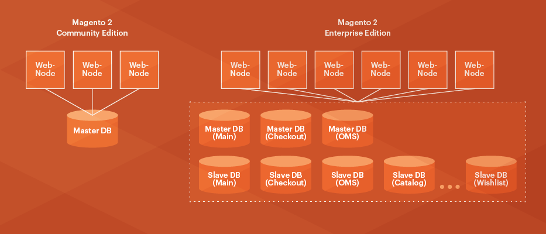

# スプリットデータベースソリューションの概要

{{ee-only}}

{{deprecate-split-db}}

Adobe Commerceには、Commerce アプリケーションの異なる機能領域に対して3つの個別のマスターデータベースを使用できるなど、いくつかのスケーラビリティの利点があります。

チェックアウト、注文、商品データでは、それぞれ個別のマスターデータベースを使用できます。オプションでデータベースを複製することもできます。 これにより、ニーズに応じて、web サイトのチェックアウト、注文管理、web サイトのブラウジング、マーチャンダイジング活動からの負荷を個別にスケーリングできます。 これらの変更により、データベース層のスケーリング方法が大幅に柔軟になります。

>[!INFO]
>
>クラウド インフラストラクチャ上のAdobe Commerceは、この機能をサポートしていません&#x200B;_not_。

`ResourceConnections` クラスは、Commerce アプリケーションへの統合MySQL データベース接続を提供します。 プライマリデータベースへのクエリの場合は、コマンドクエリ責任分離（CQRS）データベースパターンを実装します。 このパターンは、読み取りおよび書き込みクエリを適切なデータベースにルーティングするためのロジックを処理します。 開発者は、どの設定が使用されているかを知る必要がなく、読み取りと書き込みのデータベース接続が個別にありません。

オプションのデータベースレプリケーションを設定すると、次のようなメリットが得られます。

- データバックアップ
- プライマリデータベースには影響を与えないデータ分析
- 拡張性

MySQL データベースは非同期でレプリケートされるため、スレーブはマスターから更新を受け取るために永続的に接続する必要はありません。

次の図は、この機能の仕組みを示しています。

Magento Open Sourceでは、1つのマスターデータベースのみが使用されます。

Adobe Commerceでは、3つのマスターデータベースと設定可能な数のスレーブデータベースを使用してレプリケーションを実行します。 Adobe Commerceには、データベース接続のための単一のインターフェイスが用意されており、その結果、パフォーマンスが高速化され、拡張性が向上します。

## 設定オプション

スプリットデータベースのパフォーマンスソリューションの設計が原因で、カスタムコードとインストール済みコンポーネント _では次のいずれかを実行できません。_

- データベースに直接書き込む（代わりに、Adobe Commerce データベースインターフェイスを使用する必要があります）
- 営業または見積データベースに影響するJOINを使用
- チェックアウト、セールス、またはメインデータベースのテーブルに外部キーを使用する

>[!WARNING]
>
>コンポーネントの開発者に連絡して、コンポーネントが上記のいずれかを行うかどうかを確認します。 その場合は、次のいずれかを選択する必要があります。
>
>- コンポーネント開発者に、コンポーネントの更新を依頼します。
>- 分割データベースソリューションなしで&#x200B;_そのまま_ コンポーネントを使用します。
>- 分割データベースソリューションを使用できるように、コンポーネントを削除します。

つまり、次のいずれかを実行できます。

- Commerceを本番環境に導入する前&#x200B;_に、スプリットデータベースソリューション_&#x200B;を設定します。

  Adobeでは、Commerce ソフトウェアのインストール後、できるだけ早く分割データベースを設定することをお勧めします。

- [分割データベースソリューションを手動で](multi-master-manual.md)設定します。

  コンポーネントが既にインストールされている場合、またはCommerceが既に実稼動環境にある場合は、このタスクを実行する必要があります。 （_実稼動システムを_&#x200B;更新しないでください。開発システムで更新を行い、テスト後に変更を同期します。）

  >[!WARNING]
  >
  >2つの追加のデータベースインスタンスを手動でバックアップする必要があります。 Commerceは、メインデータベースインスタンスのみをバックアップします。 [`magento setup:backup --db`](../../installation/tutorials/backup.md) コマンドと管理者オプションでは、追加のテーブルがバックアップされません。

## 前提条件

スプリットデータベースでは、任意のホスト上に3つのMySQL マスターデータベースを設定する必要があります（Commerce サーバー上の3つすべて、各データベースを個別のサーバー上など）。 これらは&#x200B;_master_ データベースで、次のように使用されます。

- チェックアウトテーブル用の1つのマスターデータベース
- セールステーブル用の1つのマスターデータベース（_Order Management System_、または&#x200B;_OMS_、テーブルとも呼ばれます）
- 残りのCommerce 2 アプリケーションテーブル用の1つのマスターデータベース

さらに、ロードバランサーおよびバックアップとして機能する任意の数の&#x200B;_スレーブ_ データベースをオプションで設定できます。

このガイドでは、マスターデータベースのみを設定する方法について説明します。 必要に応じて、スレーブデータベースを設定するためのサンプル設定と参照を提供します。

このガイドでは、3つのマスターデータベースに次の名前が付けられています。

- `magento_quote`
- `magento_sales`
- `magento`

（データベースには任意の名前を付けることができます）。
