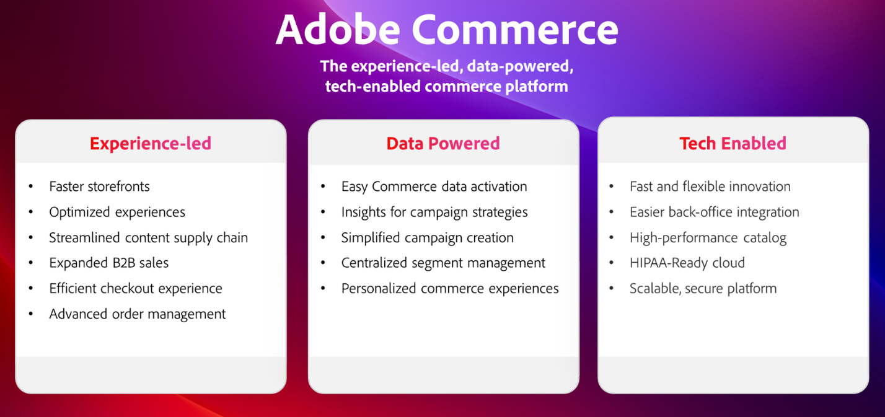
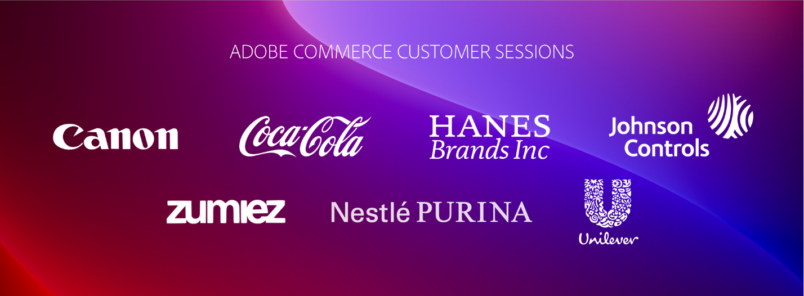
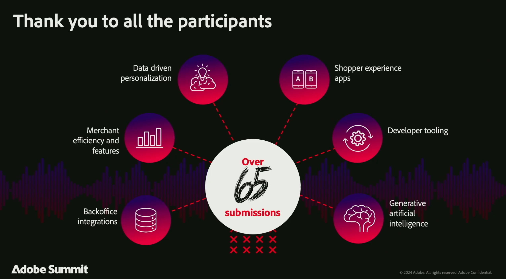

# 2024 Adobe CommerceのAdobe Summit サマリー

「Adobe Summit 2024は、業界をリードする顧客、先見の明を持つパートナー、Adobe Commerceチームなど、Adobe Commerceのコミュニティが一堂に会し、つながり、調査し、学ぶという目覚ましいイベントでした。 Hanesbrands、Coca-Cola、Nestle、Unilever、Canonなどのセッションを特集したコンテンツはすべて、[**オンデマンドでご利用いただけます**](https://business.adobe.com/summit/2024/sessions.html?Track=Commerce)!

Adobe Summit 2024の主なハイライトを紹介します。

## Adobe Commerceのロードマップ

このカンファレンスは、[**Adobe Commerceロードマップセッション**](https://business.adobe.com/summit/2024/sessions/adobe-commerce-2024-product-roadmap-review-s432.html)から始まります。このセッションでは、Adobe Adobe Commerceが、顧客体験主導の基盤により、企業のイノベーションを加速し、売上の増加にどのように役立つのかを解説します。

新機能とパフォーマンスの改善点を示す

Adobe Commerceが次のような機能を提供します。

- **[より高速なストアフロント体験](https://experienceleague.adobe.com/developer/commerce/storefront/):** アドビの新しい高性能ストアフロントアーキテクチャ、Edge Delivery Servicesは、サイトの読み込み速度、SEO ランキング、オーガニックトラフィックを向上させます。 さらに、Adobe Experience Manager Assetsとの新たな統合により、生成AIによるコンテンツ制作とワークフロー管理を利用して、コンテンツsupply chainを合理化できます。

- **[詳細にパーソナライズされた購買ジャーニー](https://experienceleague.adobe.com/en/docs/commerce-admin/customers/customers-menu/personalize-scale):** リアルタイムのストアフロントのクリック数、バックエンドの注文履歴、現在では顧客プロファイルデータを自動的に収集し、他のAdobe Experience Cloud ソリューションと共有します。 ユースケースプレイブックを活用してオムニチャネル施策の設定を自動化し、Adobe Real-Time CDPオーディエンスを活用してコマースモバイルアプリやアップセル/クロスセルオファーをパーソナライズできます。

- **[コンポーザブル開発の簡素化](https://developer.adobe.com/commerce/extensibility/app-development/learning-path/):** Adobe Developer App Builderを使用して、低コストでより迅速にイノベーションを実現します。 新しいバックオフィス統合スターターキットを利用すれば、ERPやその他のバックエンドシステムへの統合を簡素化できます。 API オーケストレーション、イベント管理、サーバーレス拡張性などの統合された開発者エクスペリエンスを通じて、Webhookを設定し、管理UIをカスタマイズできます。

- **[高度なB2B CommerceとOrder Management](https://experienceleague.adobe.com/en/docs/commerce-admin/b2b/introduction):**&#x200B;高度な見積もりツールと親子アカウント設定により、大規模なグローバルアカウントとB2B2Xのユースケースをサポートし、B2Bの売上を向上させます。 IBM Sterling Order Managementとの新しい事前構築済みの統合機能により、リアルタイムの在庫管理、自動化された注文フルフィルメント、返品管理、ダッシュボードとワークフローのフルセットを利用して、業務効率を最大化できます。

## 顧客およびパートナーの強力なセッション

また、Adobe Commerceの顧客とパートナーからなる革新的なコミュニティでは、自社の戦略、ベストプラクティス、知見を共有しました。

Commerce セッション [こちら](https://business.adobe.com/summit/2024/sessions.html?Track=Commerce)の全容をご覧いただき、以下の最もホットなセッションをご確認ください。

- [Unileverが、UnileverのVP兼CTOであるPrashaant Huria氏と共に、分散型貿易ルートをグローバルに市場にデジタル化した方法](https://business.adobe.com/summit/2024/sessions/how-unilever-digitized-its-distributive-trade-rout-s430.html)。 Prashaant氏は、Unileverの世界的な流通取引の拡大とセールスパフォーマンスの向上におけるリーダーシップが評価され、Adobe Experience Maker of the Year賞を受賞しました。

- [E-Comm Masterclass: Hanesbrands、Hanesbrands、グローバルビジネスインサイトおよびデータ分析シニアマネージャーのEmmylou Jordan氏と共に世界最速のストアフロントを構築](https://business.adobe.com/summit/2024/sessions/ecomm-masterclass-hanesbrands-creates-the-worlds-f-s435.html)

- [Coca-Cola:The Coca-Cola Companyのグローバルアドテク/マーテックプラットフォーム担当ディレクターのVinay Gopinath氏と協力し、](https://business.adobe.com/summit/2024/sessions/cocacola-unlocking-data-to-create-consumercentric-s434.html)顧客中心のCommerce体験を実現するためのデータを手に入れる

- [Canon USAのマーテクエンゲージメントオペレーションのマネージャーであるMatthew Mandato氏と共に、CanonがAdobe Commerceを使用してコンバージョン率とトラフィックを増加させた方法](https://business.adobe.com/summit/2024/sessions/how-canon-increased-conversion-rates-and-traffic-u-s438.html)

- [Nestle Purina: Ben Robie氏（テクニカルマネージャーD2C、Nestle Purina シニア）と協力して、Adobe Commerce](https://business.adobe.com/summit/2024/sessions/purina-takes-composable-commerce-approach-to-boost-s437.html)でビジネスの俊敏性を高めるコンポーザブルプラットフォームを構築

## Adobe Commerce Rockstarsによるイノベーションの紹介

アドビでは、毎年、Adobe Commerceを利用して、先進的な顧客やパートナー企業が生み出していることに光を当てています。 65以上の中から選ばれた上位3件の提出物から聞いた&#x200B;**[Adobe Commerce ロックスターのショーケース &#x200B;](https://business.adobe.com/summit/2024/sessions/adobe-commerce-rockstar-showcase-s431.html)**&#x200B;をご覧ください。

- **Edge Delivery ServicesとLuma Bridgeによるストアフロントのイノベーション**

  Martin Altmann氏（Comwrap Reply、プリンシパルコンサルタント兼Adobeプラクティスリード）

- **リーンOrder ManagementのApp Builderとの統合**

  Shikha Raina氏（Bounteous、アーキテクト）

- **マスター GPT GenAIおすすめの商品コンテンツ作成**

  Atwix、CTO、Yaroslav Rogoza氏

2024年のAdobe Commerceロックスターに選ばれた人を見てみましょう！

**[オンデマンドコンテンツ &#x200B;](https://business.adobe.com/summit/2024/sessions.html?Track=Commerce)**&#x200B;に取り組むことで、すべての素晴らしいセッションを思い出してください。また、[**Experience League**](https://experienceleague.adobe.com/en/docs/commerce-admin/start/about)のAdobe Commerceの最新イノベーションに関する最新情報を常に入手できます。
