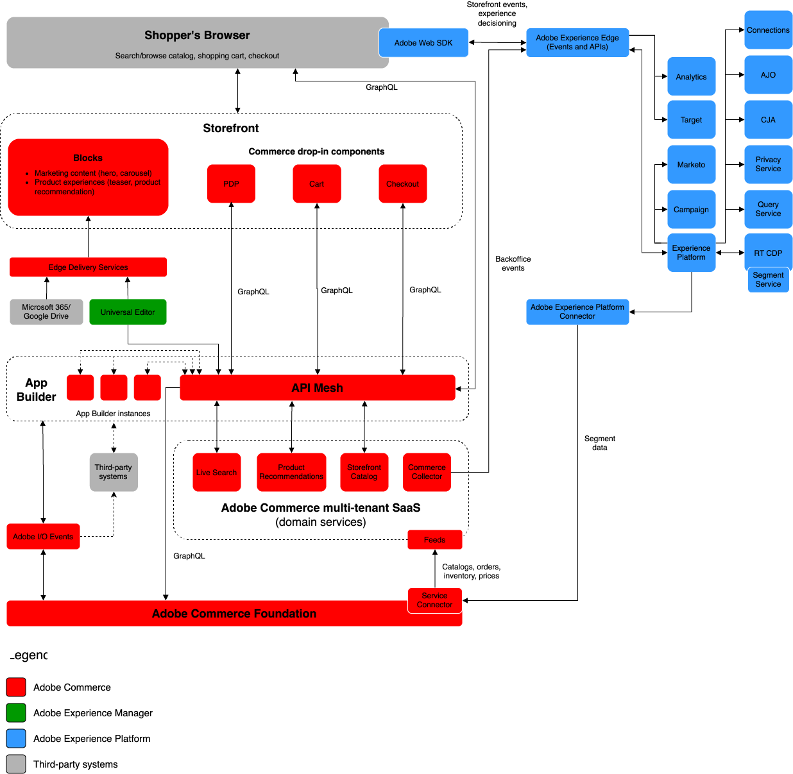

# Adobe Commerceの企業向けリファレンスアーキテクチャ

Adobe Commerceは、テクノロジーの柔軟性と使いやすさを兼ね備えた、顧客体験主導型の基盤です。これにより、ビジネスの成果を促進する優れた顧客体験を生み出すことができます。

Commerceは、パフォーマンス、拡張性、セキュリティに対する企業の要件に対応するように進化しています。 Adobeの最新のコンポーザブルコマースソリューションを使用した最新の実装アプローチを採用することは、大企業向けビジネスを成功に導くために不可欠です。 ここでは、Commerceの最新の実装アプローチについて詳しく説明します。

次のアーキテクチャ図は、Adobe CommerceとすべてのAdobe Experience Cloud ソリューション間のデータフローを示しています。

{width="800" zoomable="yes"}

>[!NOTE]
>
>図に示す高レベルのデータフローは、ほとんどの企業実装で一貫性があります。 実装を独自のものにできる重要な要素は、カタログの構築方法です（特にB2Bの場合）。 カタログアーキテクチャを[Commerce web API](https://developer.adobe.com/commerce/webapi/get-started/)に慎重にマッピングする必要があります。

## クラウド基盤

[&#x200B; クラウド インフラストラクチャ上のAdobe Commerce](https://experienceleague.adobe.com/ja/docs/commerce-cloud-service/user-guide/overview)は、Commerceの実装の基盤です。 これは、クラウドネイティブ環境でのCommerce アプリケーションの構築、デプロイ、モニタリング、管理に対するセルフサービスアプローチを備えた[&#x200B; セキュア &#x200B;](../../security-and-compliance/shared-responsibility.md)自動ホスティングプラットフォームを提供します。

次のクラウド基盤の技術的な詳細を参照してください。

- [**拡張されたアーキテクチャ**](https://experienceleague.adobe.com/ja/docs/commerce-cloud-service/user-guide/architecture/scaled-architecture) – 安定した予測可能なパフォーマンスを維持するために自動的に調整された容量
- [**複数の環境**](https://experienceleague.adobe.com/ja/docs/commerce-cloud-service/user-guide/architecture/pro-architecture) - PHP、MySQL （MariaDB）、Redis、RabbitMQ、およびサポートされている検索エンジンテクノロジーを事前にプロビジョニングして、サイトを開発、テスト、デプロイします
- [**構成管理**](https://experienceleague.adobe.com/ja/docs/commerce-cloud-service/user-guide/configure/overview) - アプリケーション設定、ルート、ビルドおよびデプロイのアクション、通知を管理するためのカスタマイズ可能な環境設定ファイルおよびコマンドラインインターフェイス（CLI）です。
- [**Git ベースのワークフロー**](https://experienceleague.adobe.com/ja/docs/commerce-cloud-service/user-guide/architecture/pro-develop-deploy-workflow)：迅速な開発と継続的なデプロイメントのためにコード変更をプッシュした後、自動的にビルドおよびデプロイします
- [**組み込みの可観測性**](https://experienceleague.adobe.com/ja/docs/commerce-cloud-service/user-guide/monitor/performance) – 複数のソースからのログデータを組み合わせて、サイトのパフォーマンスの管理と問題の診断に役立つツール
- [**包括的なAPI カバレッジ**](https://developer.adobe.com/commerce/webapi/get-started/)—[GraphQL](https://developer.adobe.com/commerce/webapi/graphql/)および[REST](https://developer.adobe.com/commerce/webapi/rest) APIにより、主要なCommerce アプリケーションをサードパーティシステムと統合し、Commerce機能を拡張

## Experience Cloudとの連携

Adobe Commerceは、すべてのExperience Cloud ソリューションと統合して、[&#x200B; パーソナライズされたコマース体験を大規模に提供します](https://experienceleague.adobe.com/ja/docs/commerce-admin/customers/customers-menu/personalize-scale#customers-menu)。

[Data Connection](https://experienceleague.adobe.com/ja/docs/commerce/data-connection/overview)を使用すると、買い物客の購買行動に関するインサイトが得られるので、他のAdobe Digital Experience製品を使用して、あらゆるチャネルをまたいでパーソナライズされたショッピング体験を構築できます。

>[!NOTE]
>
>詳しくは、次のリソースを参照してください。
>
>- 技術的な詳細については、[&#x200B; デジタルエクスペリエンスの設計図](https://experienceleague.adobe.com/ja/docs/blueprints-learn/architecture/overview)を参照してください。
>- [顧客体験のパーソナライズ &#x200B;](https://experienceleague.adobe.com/ja/docs/events/the-skill-exchange-recordings/commerce/aug2024/personalization)を参照してください。

## サードパーティシステムとの統合

Adobeは、包括的な拡張ポイントとアプリケーションを構築するためのツールを提供します。これにより、Commerceの主要な機能を拡張し、CommerceをCRM、ERPS、PIMSなどのサードパーティシステムと統合できます。 これらのツールは、次の方法でプラットフォームの総所有コストを削減します。

- **スケーラビリティ** - アプリケーションは、コアソフトウェアとは別に拡張できるため、効率が向上し、アップグレードを簡素化できます。
- **分離** – 分離された環境とは、開発者がコアリリースに依存することなく、自分の裁量で拡張機能をアップグレードまたは変更できることを意味します。
- **技術的な独立性** – 開発者は、自分のニーズに合ったテクノロジースタックとコーディング言語を選択できます。

Adobeには、統合とカスタマイズを構築するための次の開発者向けツールが用意されています。

- [**Adobe Developer App Builder用API メッシュ**](https://developer.adobe.com/graphql-mesh-gateway/)：複数のAPI、GraphQL、REST、その他のソースを調整して、クエリ可能な1つのGraphQL エンドポイントに結合します。
- [**App Builder**](https://developer.adobe.com/app-builder/docs/overview/):Commerceの機能を拡張し、サードパーティのソリューションと統合する、安全でスケーラブルなweb アプリケーションを構築してデプロイします。
- [**Events**](https://developer.adobe.com/commerce/extensibility/events/)：カスタムイベントトリガーを使用して、他の拡張可能な開発ツールと対話します。
- [**Webhook**](https://developer.adobe.com/commerce/extensibility/webhooks/) - Webhookを使用して、Commerceとサードパーティシステム間のインタラクションを自動的にトリガーします。
- [**管理者UI SDK**](https://developer.adobe.com/commerce/extensibility/admin-ui-sdk/)：マーチャント向けの新しいページと機能を使用して、Commerce管理者をカスタマイズおよび強化します。
- [**統合スターターキット**](https://developer.adobe.com/commerce/extensibility/starter-kit/)：参照統合、オンボーディングスクリプト、標準化されたアーキテクチャにより、バックオフィスの統合を迅速化します。

>[!NOTE]
>
>[最新のアプローチ：Adobe Commerceの効果的な拡張性](https://experienceleague.adobe.com/ja/docs/events/the-skill-exchange-recordings/commerce/aug2024/extensibility)を参照してください。

## ストアフロントサービス

Adobeでは、主要なビジネス目標をサポートする、インテリジェントで構成可能なマーチャンダイジングサービスを豊富に提供しています。 これらのサービスは、大規模なパフォーマンスの最適化に不可欠なAPIも提供します。

- [&#x200B; ライブサーチ &#x200B;](https://experienceleague.adobe.com/ja/docs/commerce/live-search/overview) – このAIを活用した検索ツールを使用して、買い物客によりスマートで迅速かつ適切な検索結果を提供します。
- [商品レコメンデーション &#x200B;](https://experienceleague.adobe.com/ja/docs/commerce/product-recommendations/overview)：買い物客の行動、人気のレンド、商品の類似性などに基づいて、AIを活用したレコメンデーションを追加します。
- [&#x200B; カタログサービス &#x200B;](https://experienceleague.adobe.com/ja/docs/commerce/catalog-service/guide-overview) - パフォーマンスの向上、拡張性の向上、コンバージョンの増加を実現しながら、顧客に最適化された製品体験を提供します。
- [支払いサービス &#x200B;](https://experienceleague.adobe.com/ja/docs/commerce/payment-services/guide-overview) – 無利息の支払い分割払い、支払い処理、注文、請求書に関する単一のビューなど、さまざまな支払い方法を提供することで、顧客満足度を向上させます。

## ヘッドレスストアフロント

ヘッドレスコマースは、API ファーストのコマースです。 Adobe Commerceは、GraphQL API レイヤーを通じてあらゆるコマースサービスとデータを提供する分離型アーキテクチャにより、完全なヘッドレスを実現します。 このアーキテクチャにより、コアアプリケーションとは独立してフロントエンドを開発することが可能になり、新しいテクノロジーを使用して新しい顧客接点を迅速に構築し、テストする俊敏性が得られます。

Adobeは、[Edge Delivery Services](https://www.aem.live/home)が提供するのと同じ利点と機能を備えた、最新のヘッドレスストアフロントテクノロジーを提供します。これには、ドキュメントベースのオーサリング、パフォーマンスを重視したアーキテクチャ、すぐに使用できるネイティブなテストが含まれます。 Adobe Commerce [&#x200B; ストアフロントサービス &#x200B;](#storefront-services)の規模とパフォーマンス、および[&#x200B; ドロップインコンポーネント &#x200B;](https://experienceleague.adobe.com/developer/commerce/storefront/?lang=ja)の柔軟性と利便性を活用して、コマース機能を提供します。

