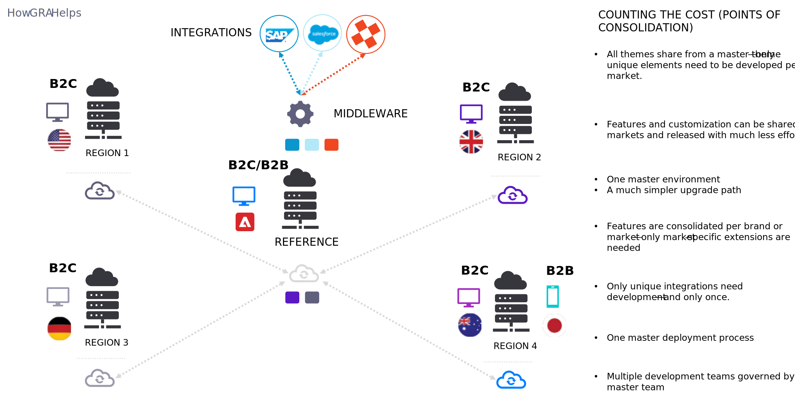

# グローバルリファレンスアーキテクチャ (GRA)

>[!VIDEO](https://video.tv.adobe.com/v/3410528/?quality=12&learn=on)

複数のブランドに複数のサイトを持つ企業を複数の現地市場（通貨、言語、メディア、共有カタログ、ユニーク買い物かご）で運営し、同じ機能と統合を実装する際に不要なコストを避けたい場合は、グローバル・リファレンス・アーキテクチャ (GRA) が常に最適です。

GRA は次のようになります。

- 実装アプローチ
- デプロイメント戦略
- プロセスガバナンスモデル

GRA は次の条件を満たしていません。

- 製品の「機能」
- 任意のコマースプラットフォームに固有
- グローバルビジネスの使用例のみ

GRA の影響：

- コードの配信方法

   - 様々なエクスペリエンスを提供する目的固有のコードリポジトリに基づいて構築されています。

- ビジネスシステムの統合方法

   - ブランドや地域ごとにビジネスシステムへの接続を統合します。

- カスタマイズの開発と維持方法

   - カスタマイズは一元化され、ドメイン固有のものになるので、すべてのカスタマイズ作業をビジネスの総合的な視点から行うことができます。

- 新しい市場がどのように有効化されているか

   - 複数のチャネルと市場のリリースを簡素化し、それ以外の場合は、時間とコストが大幅に大幅に増加します。
