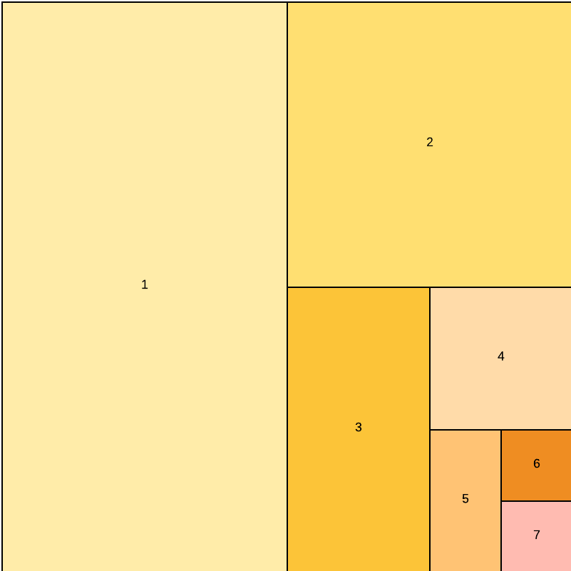

# Adobe Commerceのベストプラクティスのデバッグ

ここでは、Adobe Commerce フレームワークを体系的かつ効果的にデバッグする方法について説明します。 ここでの目的は、問題の根本原因をすばやく突き止め、調査時間を最小限に抑えることです。

## トラブルシューティング：通常の容疑者

この節では、開発中に発生する可能性のある最も一般的な問題について説明します。

### キャッシュ

- 調査を続ける前にキャッシュをフラッシュする
- APC キャッシュ、CDN、Varnish、生成されたコード、および`var/view_preprocessed`および`pub/static/` ディレクトリについて検討します
- キャッシュのフラッシュまたはコードの変更後に、キューハンドラーを停止して再起動します

次のコードサンプルは、キャッシュの管理に関連する便利なコマンドを提供します（実稼動環境では実行しないでください）。

```shell
# restart php-fpm to flush APC
sudo service php-fpm restart
 
# restart varnish to force full flush
sudo service varnish restart
 
# clear generated files
rm -rf generated/*
 
# clear static file cache
rm -rf var/view_preprocessed/*
rm -rf pub/static/*
 
# flush redis cache
redis-cli -n <db_number> FLUSHDB
 
# flush redis cache and sessions
redis-cli FLUSHALL
 
# flush redis cache with telnet
telnet <ip_or_host> 6379
SELECT <db_number>
FLUSHDB
Ctrl + ]
quit
 
# flush redis cache and sessions with telnet
telnet <ip_or_host> 6379
FLUSHALL
Ctrl + ]
quit
 
# find consumers
pgrep -af queue:consumers:start
 
# kill all queue consumers (they will restart by cron job)
sudo pkill -f queue:consumers:start
 
# kill a specific queue consumer (it will restart by cron job)
sudo kill <process_id>
```

### インデックス付きデータ

問題がインデックス関連の場合は、すべてのインデックスを再作成します。 インデックス付きデータのデバッグは、通常、実稼動以外の環境で行われます。 実稼動環境では、インデックスを再作成する前に、インデックスの不整合の原因を調査する必要がある場合があります。 欠陥のある状態の特徴は、問題の起源について何かを教えることができます。

### Composer

ブランチの変更や、以前のデバッグ作業で編集されたコアファイルが原因で、コードが古くなっている可能性があります。 潜在的な問題を解決するには、次のコマンドを実行します。

```shell
rm -rf vendor/*
composer clear-cache
composer install
```

### 生成コンテンツ

JS、CSS、画像、翻訳、その他のファイルで生成されたコンテンツをデバッグする前に、フロントエンドファイルを再構築します。

```shell
rm -rf generated/* var/cache/* var/page_cache/* var/session/* var/view_preprocessed/* pub/static/*
bin/magento setup:static-content:deploy
bin/magento cache:flush
```

### 開発者モード

ローカル インストールが`developer` モードであることを確認してください。

### 新しいモジュール

モジュールを作成した場合は、次の問題を確認します。

- モジュールは有効ですか？

  ```shell
  bin/magento module --enable Your_Module
  ```

  新しいモジュールの`app/etc/config.php` ファイルを確認してください。

- ファイルとディレクトリ構造のネストを確認します。 例えば、レイアウトファイルは`view/frontend/layout` ディレクトリではなく`view/layout/` ディレクトリにありますか？ テンプレートは、`view/frontend/templates` ディレクトリではなく`view/frontend/template` ディレクトリにありますか？

## トラブルシューティング：半分割

通常の容疑者が問題の解決策を提供しない場合、最も速い方法は問題を半分に分割（または二分割）することです。 この方法では、コードを直線的に進めるのではなく、大きな塊を取り除き、残ったものを分割して根本原因を特定できます。

次の図を参照してください。




バイスキングにはいくつかのアプローチがありますが、Adobeでは、次の順序で実行することをお勧めします。

- トピック別の二分
- コミット別の分割
- ファイルで区切る

### ステップ 1：トピック別に分割

問題がコードに関連しない可能性がある場合は、まず大きな塊を削除します。 大きな塊として考えるべきものには、次のようなものがあります。

- **Adobe Commerce framework**：問題はAdobe Commerceに関連するものですか、それとも別の接続システムに関連するものですか？
- **サーバーとクライアント** - ブラウザーのキャッシュとストレージをクリアします。 問題は解決されますか？ サーバー関連の原因が除外される可能性があります。 問題はまだ存在しますか？ ブラウザーのデバッグに時間を費やす必要はもうありません。
- **セッション**：すべてのユーザーに問題が発生しますか？ そうでない場合、問題はセッションまたはブラウザー関連のトピックに限定される場合があります。
- **キャッシュ** – すべてのキャッシュを無効にすると、何も変わりますか？ その場合は、キャッシュ関連のトピックに集中できます。
- **データベース** – 同じコードを実行しているすべての環境で問題が発生しますか？ そうでない場合は、設定やその他のデータベース関連のトピックで問題を探します。
- **コード**：上記のいずれの問題も解決しなかった場合は、コードの問題を探します。

### 手順2：コミットによるバイセクト

今から2か月前の間に問題が発生した場合は、コードを2か月前にロールバックします。 問題がまだ存在するかどうかを確認します。 1 ヶ月先へ進みます。 問題はそこで発生しますか？ そうでない場合は、2週間先に進んでください。 今起こっているんですか？ 1週間戻ってください。 まだそこですか？ 4日戻って。 ある時点で、問題に関連するコードを含む可能性の高いコミットが1つだけ残っています。 根本原因は、そのコミットで編集されたファイルに限定される可能性があります。

コミットを使用して数週間と数日を置き換えることができます。 例えば、100 コミット、転送50、転送25、戻り12をロールバックします。

### ステップ 3: ファイルで二分

- Adobe Commerceをファイルの種類（コアと非コア）で分割します。 まず、顧客モジュールとマーケットプレイスモジュールをすべて無効にします。 問題はまだ存在しますか？ これはコア以外の問題である可能性が高いです。
- `app/etc/config.php` ファイルで（およそ）半分のモジュールを再度有効にします。 依存関係を把握する： 同じトピックのモジュールクラスターを一度に有効にすることをお勧めします。 問題はまだ存在しますか？
- 残りのモジュールの4分の1を有効にします。 問題はまだ存在しますか？ 有効にしているものの半分を無効にします。 この方法は、1つのモジュールに対して根本原因を特定するのに役立ちます。

## 時間の節約

トラブルシューティングのテクニックとは別に、このセクションでは、デバッグ中の時間を節約するのに役立つ一般的なルールをいくつか提供します。

### データ制限

問題をレプリケートするために、完全なカタログまたはすべてのストアビューが必要かどうかを検討します。 デバッグを開始する前に、カタログの95%を削除したデータベースクローンでインデックス作成の問題をデバッグできます。 この方法は、インデックス作成プロセス中の時間を大幅に節約します。 ストア数とカタログを削減したクライアントデータベースの複製を作成します。 これは、デバッグする領域に応じて、他のエンティティ（顧客など）にも適用される場合があります。

### 詳細な情報を請求

時には、すべてのコードと技術的な作業の中で忘れやすいステップ：より多くの情報を求めます。 全画面でのキャプチャ、ビデオ、問題を特定した人物とのビデオ会議チャット、レプリケーションの手順、問題のあるイベントの周りで他の一見重要でないことが起こったかどうかについての質問。 誰かが何が起こると思ったかを尋ねます。 これは本当にバグなのか、それとも単にコードの仕組みの誤解なのか？

### 言語と解釈

問題の概要は明確ですか？ 用語や説明を複数の方法で解釈することはできません。 その場合は、同じことを話しているかどうかを確認してください。

### インターネット検索

問題に関連する用語でインターネット検索を行います。 他の誰かが既に同じ問題に遭遇している可能性があります。 [Adobe Commerce GitHubの問題](https://github.com/magento/magento2/issues)を検索します。

### 休憩する

プロジェクトを長期間検討し続けたい場合、解決策を見つけるのが難しくなる可能性があります。 あなたの仕事を置いて、別の仕事を拾うか、散歩をしてください。 その答えはしばらく問題を忘れたときにあなたに来るかもしれません。

## ツール

n98 magerun CLI ツール （[https://github.com/netz98/n98-magerun2](https://github.com/netz98/n98-magerun2)）は、コマンドラインからAdobe Commerceを操作する便利な機能を提供します。 特に次のコマンド：

```shell
n98-magerun2.phar dev:console
n98-magerun2.phar sys:cron:run
n98-magerun2.phar db:console
n98-magerun2.phar index:trigger:recreate
```


## コードスニペット

次のトピックでは、Commerce プロジェクトの問題を記録または特定するために使用できるコードスニペットについて説明します。

### CommerceでXML ファイルが使用されているかどうかを確認する

XML ファイルに明らかな構文エラーを追加して、使用されているかどうかを確認します。 タグを開き、次のように閉じないでください。

```xml
<?xml version="1.0"?>
<test
```

このファイルを使用すると、エラーが発生します。 そうでない場合は、モジュールが使用されていないか、インスタンスで有効になっていない可能性があります。また、XML ファイルが間違った場所にある可能性があります。

### ログ

>[!BEGINTABS]

>[!TAB Adobe Commerce]

```php
\Magento\Framework\App\ObjectManager::getInstance()
    ->get(\Psr\Log\LoggerInterface::class)->debug('message');
```

>[!TAB  モノログ ]

```php
$log = new \Monolog\Logger('custom', [new \Monolog\Handler\StreamHandler(BP.'/var/log/test.log')]);
$log->info('Your Logging Message', ['context' => ['email' => 'john@example.com']]);
```

>[!TAB Zend]

```php
$writer = new \Zend\Log\Writer\Stream(BP . '/var/log/test.log');
$logger = new \Zend\Log\Logger();
$logger->addWriter($writer);
$logger->info('Your text message');
$logger->info(print_r($yourArray, true));
```

>[!ENDTABS]

### 低レベルのログ

任意のPHP ファイルで常に機能する2つの例：

```php
file_put_contents('/var/www/html/var/log/example.log', "example line\n", FILE_APPEND);
file_put_contents('/var/www/html/var/log/example.log', print_r($yourArray, true) . "\n", FILE_APPEND);
```

スタックトレースの場合：

```php
try {
    throw new \Exception('example');
} catch (\Exception $e) {
    file_put_contents('/var/www/html/var/log/example.log', $e->getTraceAsString() . "\n", FILE_APPEND);
}
```
