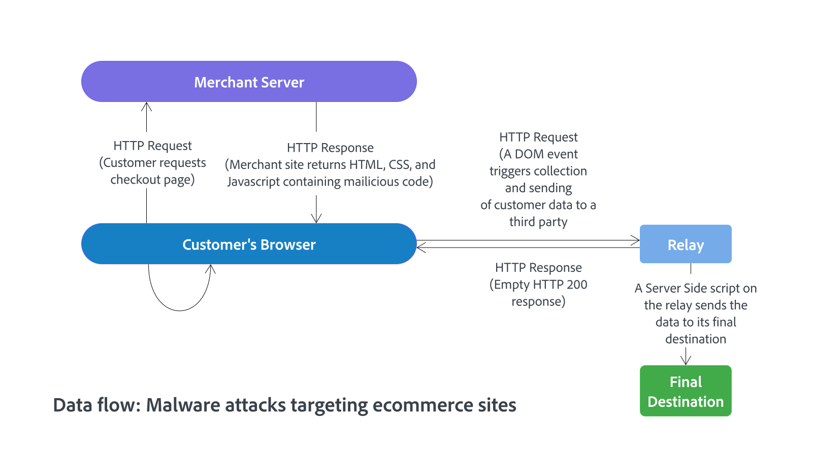

# Commerceのサイトとインフラストラクチャの保護

クラウドインフラストラクチャにデプロイされたAdobe Commerce プロジェクトの安全な環境を確立および管理することは、Adobe Commerceのお客様、ソリューションパートナー、Adobe間で共有される責任です。 このガイドの目的は、方程式の顧客側のベストプラクティスを提供することです。

すべてのセキュリティリスクを排除することはできませんが、これらのベストプラクティスを適用すると、Commerce インストールのセキュリティ対策が強化されます。 安全なサイトとインフラストラクチャは、悪意のある攻撃に対する攻撃を低減し、ソリューションと顧客の機密情報のセキュリティを確保し、サイトの障害やコストのかかる調査の原因となるセキュリティ関連のインシデントを最小限に抑えるのに役立ちます。

>[!NOTE]
>
>クラウドインフラストラクチャ上のAdobe Commerce プロジェクトを保護および管理するための役割と責任について詳しくは、_Adobe Commerce セキュリティおよびコンプライアンスガイド_&#x200B;の[Shared Responsibility Model](https://experienceleague.adobe.com/en/docs/commerce-operations/security-and-compliance/shared-responsibility#security-responsibilities-chart)）を参照してください。

[ サポートされているすべてのバージョン ](../../../release/versions.md) /:

- Adobe Commerce on cloud infrastructure
- Adobe Commerce オンプレミス

## 優先度の推奨事項

Adobeでは、次の推奨事項をすべてのお客様にとって最優先事項と見なしています。 Commerceのすべてのデプロイメントに、次の主要なセキュリティのベストプラクティスを導入します。

 **管理者とすべてのSSH接続に対して2要素認証を有効にする**

- [Commerce管理者のセキュリティ](https://experienceleague.adobe.com/docs/commerce-admin/systems/security/2fa/security-two-factor-authentication.html)

- [ セキュアなSSH接続](https://experienceleague.adobe.com/docs/commerce-cloud-service/user-guide/project/multi-factor-authentication.html) （クラウドインフラストラクチャ）

プロジェクトでMFAが有効になっている場合、SSH アクセス権を持つすべてのAdobe Commerce on cloud infrastructure アカウントは、認証ワークフローに従う必要があります。 このワークフローには、環境にアクセスするための2要素認証（2FA）コード、またはAPI トークンとSSH証明書が必要です。

 **管理者の保護**

- [ デフォルトの`admin`や`backend`などの一般的な用語を使用する代わりに、デフォルト以外の管理者URL](https://experienceleague.adobe.com/docs/commerce-admin/stores-sales/site-store/store-urls.html#use-a-custom-admin-url)を設定します。 この設定により、サイトへの不正アクセスを試みるスクリプトのリスクを軽減できます。

- [高度なセキュリティ設定](https://experienceleague.adobe.com/docs/commerce-admin/systems/security/security-admin.html)の設定 – URLに秘密鍵を追加し、パスワードを大文字と小文字を区別する必要があり、管理者ユーザーアカウントをロックする前に、管理者セッションの長さ、パスワードの有効期間、ログイン試行回数を制限します。 セキュリティを強化するには、現在のセッションが期限切れになる前にキーボードの非アクティブな長さを設定し、ユーザー名とパスワードを大文字と小文字を区別する必要があります。

- [ReCAPTCHA](https://experienceleague.adobe.com/docs/commerce-admin/systems/security/captcha/security-google-recaptcha.html)を有効にして、管理者を自動ブルートフォース攻撃から保護します。

- [管理者権限](https://experienceleague.adobe.com/docs/commerce-admin/systems/user-accounts/permissions.html)を管理者ユーザーアカウントに役割と役割に割り当てる場合は、最小権限の原則に従います。

 **Adobe Commerceの最新リリースへのアップグレード**

Commerce プロジェクトを最新リリース ](#upgrade-to-the-latest-release)のAdobe Commerce、Commerce サービス、およびAdobeが提供するセキュリティパッチ、ホットフィックス、その他のパッチを含む拡張機能に[ アップグレードすることで、コードを常に最新の状態に保ちます。

 **機密性の高い設定値を保護**

重要な設定値をロックするには、[構成管理](../../../configuration/cli/set-configuration-values.md)を使用します。

`lock config`および`lock env` CLI コマンドは、環境変数が管理者から更新されないように設定します。 コマンドは、値を`<Commerce base dir>/app/etc/env.php` ファイルに書き込みます。 （クラウドインフラストラクチャプロジェクト上のCommerceについては、[Store Configuration Management](https://experienceleague.adobe.com/docs/commerce-cloud-service/user-guide/configure-store/store-settings.html#sensitive-data)を参照してください）。

 **セキュリティスキャンの実行**

[Commerce セキュリティスキャンサービス ](https://experienceleague.adobe.com/docs/commerce-admin/systems/security/security-scan.html)を使用して、すべてのAdobe Commerce サイトに既知のセキュリティリスクとマルウェアを監視し、サインアップしてパッチの更新とセキュリティ通知を受け取ります。

## 拡張機能とカスタムコードのセキュリティを確保

Adobe Commerce Marketplaceからサードパーティの拡張機能を追加してAdobe Commerceを拡張する場合、またはカスタムコードを追加する場合は、次のベストプラクティスを適用して、これらのカスタマイズのセキュリティを確保してください。

 **セキュリティに精通したパートナーまたはソリューションインテグレーター（SI）を選択** – 安全な開発プラクティスに従い、セキュリティ問題の防止と対処に確かな実績を持つ組織を選択することで、安全な統合とカスタムコードの安全な配信を確保します。

 **安全な拡張機能を使用** – お使いのソリューションインテグレーターまたは開発者に相談し、[Adobe拡張機能のベストプラクティス ](../planning/extensions.md)に従って、Commerceのデプロイに最適で安全な拡張機能を特定します。

- Adobe Commerce Marketplaceまたはソリューションインテグレーターから拡張機能のみを入手してください。 拡張機能がインテグレーターを通じて取得されている場合は、インテグレーターが変更した場合に拡張ライセンスの所有権が引き継ぎ可能であることを確認します。

- 拡張機能とベンダーの数を制限することで、リスクのリスクを低減します。

- 可能であれば、Commerce アプリケーションと統合する前に、拡張機能コードのセキュリティを確認してください。

- PHP拡張機能の開発者が、Adobe Commerce開発ガイドライン、プロセス、セキュリティのベストプラクティスに従っていることを確認します。 具体的には、開発者は、リモートコードの実行や脆弱な暗号化につながる可能性のあるPHP機能の使用を避ける必要があります。 拡張機能の開発者に関するガイド *のベストプラクティス*&#x200B;の[ セキュリティ ](https://developer.adobe.com/commerce/php/best-practices/security/)を参照してください。

 **監査コード** - サーバーとソースコードのリポジトリを確認して、残りの開発作業を行います。 アクセス可能なログファイル、公開されている.git ディレクトリ、SQL ステートメントを実行するトンネル、データベースダンプ、php情報ファイル、または必要とされないその他の保護されていないファイルが存在せず、攻撃で使用される可能性があることを確認します。

## 最新リリースへのアップグレード

Adobeでは、セキュリティを強化し、お客様を侵害から保護するために、アップデートされたソリューションコンポーネントを継続的にリリースしています。 最新バージョンのAdobe Commerce アプリケーション、インストール済みのサービス、拡張機能にアップグレードし、現在のパッチを適用することは、セキュリティ脅威に対する最初の最善の防御策です。

Commerceは通常、四半期ごとにセキュリティアップデートをリリースしますが、優先度やその他の要因に基づいて、重大なセキュリティ脅威に対するホットフィックスをリリースする権利を留保します。

使用可能なAdobe Commerceのバージョン、リリースサイクル、アップグレードとパッチのプロセスについて詳しくは、次のリソースを参照してください。

- [リリース済みバージョン](../../../release/versions.md)
- [製品の可用性](../../../release/product-availability.md) （Adobe Commerce サービスおよびAdobeで作成された拡張機能）
- [Adobe Commerce ライフサイクルポリシー](../../../release/lifecycle-policy.md)
- [アップグレードガイド](../../../upgrade/overview.md)
- [パッチの適用方法](../../../upgrade/patches/overview.md)

>[!TIP]
>
>[Adobe セキュリティ通知サービス ](https://www.adobe.com/subscription/adbeSecurityNotifications.html)を購読することで、最新のセキュリティ情報を入手し、既知のセキュリティ問題を軽減できます。

## 災害復旧計画の策定

Commerceサイトが危険にさらされた場合は、包括的な災害復旧計画を策定して実施することで、被害を管理し、通常の業務を迅速に復旧できます。

お客様が災害のためにCommerce インスタンスを復元する必要がある場合、Adobeはバックアップファイルをお客様に提供できます。 お客様とソリューションインテグレーターは、該当する場合、リストアを実行できます。

災害復旧計画の一部として、Adobeでは、ビジネス継続性の目的で必要な場合に再デプロイメントを容易にするために、[Adobe Commerce アプリケーション設定](../../../configuration/cli/export-configuration.md)を書き出すことを強くお勧めします。 設定をファイルシステムにエクスポートする主な理由は、システム設定がデータベース設定よりも優先されることです。 読み取り専用のファイルシステムでは、機密性の高い設定を変更するためにアプリケーションを再デプロイする必要があり、保護のレイヤーが追加されます。

### 追加情報

**Adobe Commerceがクラウドインフラストラクチャにデプロイされました**

- [バックアップと災害復旧](https://experienceleague.adobe.com/docs/commerce-cloud-service/user-guide/architecture/pro-architecture.html#backup-and-disaster-recovery)

- [Adobe Commerce on cloud infrastructureのストア構成管理](https://experienceleague.adobe.com/docs/commerce-cloud-service/user-guide/configure-store/store-settings.html)

**オンプレミスにデプロイされたAdobe Commerce**

- [構成設定の書き出し](../../../configuration/cli/export-configuration.md)

   - [構成設定のインポート](../../../configuration/cli/import-configuration.md)

   - [ファイルシステム、メディア、データベースのバックアップとロールバック](../../../installation/tutorials/backup.md)

## 安全なサイトとインフラの維持

この節では、Adobe Commerce インストールのサイトとインフラストラクチャのセキュリティを維持するためのベストプラクティスについて説明します。 これらのベストプラクティスの多くは、一般的にコンピューターインフラストラクチャのセキュリティを確保することに重点を置いているため、推奨事項のいくつかは既に実装されている可能性があります。

 **不正アクセスをブロック** - ホスティングパートナーと協力してVPN トンネルを設定し、Commerce サイトおよびカスタマーデータへの不正アクセスをブロックします。 Commerce アプリケーションへの不正アクセスをブロックするSSH トンネルを設定します。

 **Web アプリケーションファイアウォールを使用**：トラフィックを分析し、Web アプリケーションファイアウォールを使用して不明なIP アドレスにクレジットカード情報を送信するなど、疑わしいパターンを検出します。

クラウドインフラストラクチャにデプロイされたAdobe Commerce インストールでは、[Fastly サービス統合](https://experienceleague.adobe.com/docs/commerce-cloud-service/user-guide/cdn/fastly.html)で利用可能な組み込みのWAF サービスを使用できます

 **高度なパスワードセキュリティ設定を設定する** – 強固なパスワードを設定し、少なくとも90日ごとに変更します。これは、セクション 8.2.4のPCI データセキュリティ標準で推奨されています。 [管理者セキュリティ設定の設定](https://experienceleague.adobe.com/docs/commerce-admin/systems/security/security-admin.html)を参照してください。

 **HTTPS**&#x200B;を使用 – Commerce サイトが新しく実装された場合は、HTTPSを使用してサイト全体を起動します。 Googleでは、HTTPSをランキング要素として使用しているだけでなく、HTTPSで保護されていない限り、多くの利用者はサイトからの購入を検討さえしません。

## マルウェアから保護

コマースサイトを標的としたマルウェア攻撃は非常に一般的で、脅威者はトランザクションからクレジットカードや個人情報を収集する新しい方法を継続的に開発しています。

しかし、Adobeは、ほとんどのサイトの侵害が革新的なハッカーによるものではないことがわかりました。 代わりに、脅威アクターは、多くの場合、既存のパッチが適用されていない脆弱性、パスワードの不足、およびファイルシステム内の弱い所有権と権限の設定を利用します。

最も一般的な攻撃では、悪意のあるコードがカスタマーストアの絶対ヘッダーまたは絶対フッターに挿入されます。 このコードは、顧客のログイン資格情報やチェックアウトフォームデータなど、顧客がストアフロントに入力するフォームデータを収集します。 その後、このデータはCommerceのバックエンドではなく、悪意のある目的で別の場所に送信されます。 また、マルウェアは、元の支払いフォームを支払いプロバイダーによって設定された保護を上書きする偽のフォームに置き換えるコードを実行する管理者を侵害する可能性があります。

クライアントサイドのクレジットカードのスキマーは、次の図に示すように、ユーザーのブラウザーで実行できるマーチャント web サイトのコンテンツにコードを埋め込むマルウェアの一種です。

ユーザーがフォームを送信したり、フィールド値を変更したりするなど、特定のアクションが発生すると、スキマーはデータをシリアライズして、サードパーティのエンドポイントに送信します。 これらのエンドポイントは、通常、データを最終宛先に送信するためのリレーとして機能する、その他の侵害されたweb サイトです。

>[!TIP]
>
>Commerce サイトがマルウェア攻撃の影響を受ける場合は、[ セキュリティインシデントへの対応](../maintenance/respond-to-security-incident.md)に関するAdobe Commerceのベストプラクティスに従ってください。

### 最も一般的な攻撃を把握

以下は、AdobeのすべてのCommerceのお客様が認識し、対策を講じることを推奨する一般的な攻撃カテゴリのリストです。

- **サイトのデフェイス** – 攻撃者は、サイトの外観を変更したり、独自のメッセージを追加したりすることで、web サイトに損害を与えます。 サイトやユーザーアカウントへのアクセスは侵害されていますが、支払い情報は安全に保たれていることが多いです。

- **ボットネット** – お客様のCommerce サーバーは、スパムメールを送信するボットネットの一部になります。 ユーザーデータは通常、侵害されませんが、顧客のドメイン名がスパムフィルターによってブロックリストに加えるされ、ドメインからのメール配信が妨げられる可能性があります。 または、顧客のサイトがボットネットの一部になり、別のサイトで分散型サービス拒否（DDoS）攻撃が発生します。 ボットネットは、Commerceサーバーへのインバウンド IP トラフィックをブロックし、お客様が買い物できないようにする可能性があります。

- **直接サーバー攻撃**：データが侵害され、バックドアとマルウェアがインストールされ、サイトの操作に影響が及びます。 サーバーに保存されていない支払い情報は、これらの攻撃によって侵害される可能性が低くなります。

- **サイレントカードキャプチャ** – この最も悲惨な攻撃では、侵入者は隠れたマルウェアやカードキャプチャソフトウェアをインストールするか、または最悪の場合、チェックアウトプロセスを変更してクレジットカード情報を収集します。 その後、データはダークウェブ上の販売のために別のサイトに送信されます。 このような攻撃は、長期間にわたって気づかれない可能性があり、顧客アカウントや財務情報の大幅な侵害につながる可能性があります。

- **サイレントキーロギング** – 攻撃者は、管理者ユーザーの資格情報を収集するためにキーロギングコードを顧客サーバーにインストールし、ログインして検出されることなく他の攻撃を起動できるようにします。

### パスワード推測攻撃から保護

ブルートフォースパスワード推測攻撃は、不正な管理者アクセスにつながる可能性があります。 次のベストプラクティスに従って、これらの攻撃からサイトを保護してください。

- Commerceのインストールに外部からアクセスできるすべてのポイントを特定して保護します。

  Commerce プロジェクトの設定時にAdobeの[優先度の推奨事項](#priority-recommendations)に従うことで、最も保護が必要な管理者へのアクセスを保護できます。

- 指定したIP アドレスまたはネットワークからのユーザーのみにアクセスを許可するアクセス制御リストを設定して、Commerce サイトへのアクセスを制御します。

  カスタム VCL コードスニペットを使用したFastly Edge ACLを使用して、受信リクエストをフィルタリングし、IP アドレスによるアクセスを許可できます。 リクエスト ](https://experienceleague.adobe.com/docs/commerce-cloud-service/user-guide/cdn/custom-vcl-snippets/fastly-vcl-allowlist.html)を許可するには、[ カスタム VCLを参照してください。

  >[!TIP]
  >
  >リモートワーカーを使用する場合は、リモート従業員のIP アドレスが、Commerce サイトへのアクセス権限を持つアドレスのリストに含まれていることを確認します。

### クリックジャッキングの不正利用の防止

Adobeは、ストアフロントへのリクエストに含めることができる`X-Frame-Options` HTTP リクエストヘッダーを提供することで、クリックジャッキング攻撃からストアを保護します。 *Adobe Commerce Configuration Guide*&#x200B;の[ クリックジャッキングの不正利用の防止](../../../configuration/security/xframe-options.md)を参照してください。
