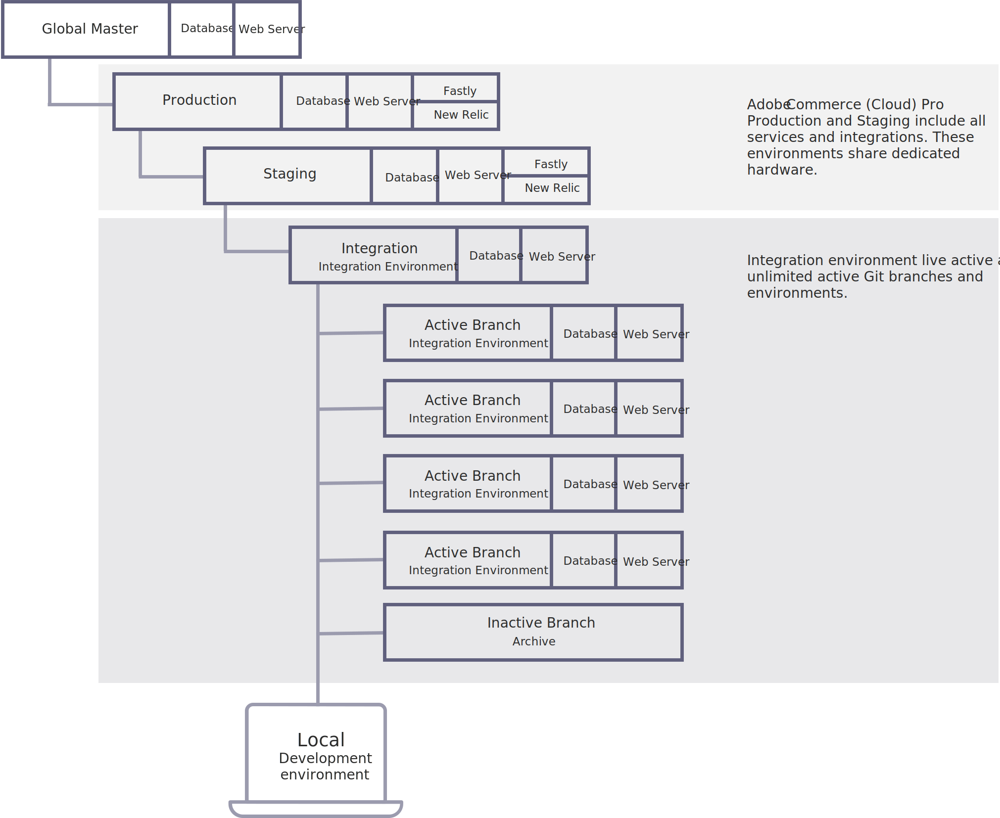

# 環境

Adobe Commerce on cloud infrastructure Pro アーキテクチャは、ストアの開発、テスト、起動に使用できる環境をサポートします。 各環境には、データベースと Web サーバーが含まれます。 Adobe Commerceで利用される 4 つの環境は、次のとおりです。

- **統合**-1 つの環境ブランチを提供し、最大 4 つの環境ブランチを追加で作成できます。 これにより、Platform-as-a-Service(PaaS) コンテナにデプロイされるアクティブなブランチを最大で 5 つ作成できます。

- **ステージング** — 専用の Infrastructure-as-a-S(IaaS) コンテナに展開される 1 つの環境ブランチを提供します。

- **実稼動** — 専用の Infrastructure-as-a-S(IaaS) コンテナに展開される 1 つの環境ブランチを提供します。

- **グローバルマスター**— Platform-as-a-Service(PaaS) コンテナにデプロイされる master ブランチを提供します。

## Git ブランチ

統合環境は、Platform-as-a-Service(PaaS) コンテナにデプロイされたAdobe Commerceコードを含む、単一のベース統合ブランチを提供します。

クラウドインフラストラクチャ環境のAdobe Commerceは、柔軟で継続的な統合プロセスをサポートしています。 最初に、ローカルプロジェクトフォルダーに統合ブランチを複製します。 新しいブランチ（複数のブランチ）を作成して、新しい機能の開発、変更の設定、拡張機能の追加をおこないます。 開発されたコードブランチと対応する設定ファイルがあれば、コードの変更を統合ブランチにマージして、より包括的なテストをおこなう準備が整います。

