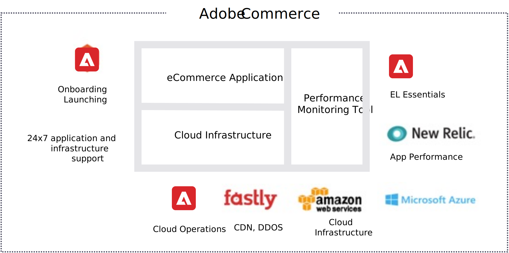

# 概要

AWS上のAdobe Commerceで最も人気のある管理ホストオプションの 1 つは、Adobe Commerce自体が提供しています。 Adobe Commerce on cloud infrastructure は、Adobe Commerceソフトウェアの完全に管理された自動ホスティングプラットフォームです。

Adobe Commerce on cloud infrastructure は、包括的にカスタマイズ可能で、安全で、拡張性の高い Web ストアフロントを、主要なホスティングおよびManaged Servicesインフラストラクチャと組み合わせて迅速に導入できる、サービスとしてのプラットフォーム (PaaS) 製品です。 異なるインフラストラクチャを持つ 2 つのプランを提供します。 Adobe Commerce [スターター](https://experienceleague.adobe.com/docs/commerce-cloud-service/user-guide/architecture/cloud-architecture.html#starter-projects) プランは、より複雑で小さいカタログを持つ小規模な店舗に最適です。 Adobe Commerce [Pro](https://experienceleague.adobe.com/docs/commerce-cloud-service/user-guide/architecture/cloud-architecture.html#pro-projects) プランは、より複雑な大規模な店舗、より大規模な製品カタログ、またはピークに達するトラフィックを対象に設計されています。 Adobeは、パートナーからの入力を使用して、適切なアーキテクチャを決定します。

Adobe Commerceは、完全に冗長化されたマルチクラウドホスティングインフラストラクチャを備えたクラウド対応で、パフォーマンス、回復性、柔軟な拡張性を最適化します。 Fastly のコンテンツ配信ネットワーク (CDN) 上でコマースプラットフォームを効率的に実行でき、New Relicを使用して監視や管理をおこなうことで、ストア環境をスムーズに運用できます。

Adobe Commerceは、最も一般的に SaaS ソリューションと関連し、ソフトウェアのカスタマイズの柔軟性を維持しながら、最新のクラウドコンピューティングのすべてのメリットを提供します。

- 柔軟な拡張性
- 高い耐障害性と可用性
- PCI コンプライアンス
- グローバルな可用性と自動パッチ適用

## メリット

Adobe Commerceのその他のメリットは次のとおりです。

- **Adobe Commerce向けに最適化**. Adobe Commerceが開発したビルドスクリプトとサービス設定により、最適なマーチャントパフォーマンスを得るために、すべてのインスタンスが適切に調整および設定されていることを確認します。

- **一貫性のある、セキュアなリリース**. すべてのコードデプロイメントは Git ベースで一貫性と再現性を保ち、堅牢なセキュリティを実現する読み取り専用の実稼動環境を備えています。

- **パートナーに対する柔軟性**. 完全な REST API とスクリプト可能なコマンドラインインターフェイスにより、外部システムとの統合が容易になり、既存のコード管理ワークフローとの互換性が確保されます。

- **柔軟な配置ツールセット**. 開発タスク、QA テスト、実稼動問題の診断に必要な無制限の環境を、迅速に切り替え、結合、複製、および切り離します。

- **継続的なクラウド配信**. コードブランチや開発チームをまたいで、継続的な方法で、開発から UAT、実稼動に、信頼性を持って直接移行します。

## サードパーティのサービス

この節では、クラウドインフラストラクチャプロジェクト上のAdobe Commerceの主要なサードパーティのサービスとツールについてまとめます。 詳しくは、 [技術スタック](https://experienceleague.adobe.com/docs/commerce-cloud-service/user-guide/architecture/tech-stack.html) （内） _クラウドガイド_ を参照してください。

- **Fastly CDN**：お客様がサイトやストアにアクセスすると、キャッシュされたページの読み込みを高速化するために、リクエストが Fastly にヒットします。 Fastly WAF は、DDoS 保護サービスも提供しています。

- **New Relic**：アプリケーションとオペレーティング環境の完全なビューを提供します。 New Relicでは、モバイルおよびブラウザーアプリケーションの主要指標と、サポートするサービス、データストア、ホストを組み合わせることで、パフォーマンスを総合的に最適化し、あらゆる取り組みの成功を確実にします。

- **コンポーザー**:Adobe Commerceの依存関係とアップグレードを管理し、含まれるパッケージに関するコンテキスト、パッケージの動作、およびそれらの組み合わせ方法を提供します。

- **Git**：ソースコード管理を提供します。 Git では、ローカル分岐、便利なステージング領域、複数のワークフローを自動ビルドとデプロイにより、効率的で迅速な開発と継続的なデプロイメントを実現します。

- **サービスとしてのプラットフォーム (PaaS)**:PHP、MySQL、Redis を含む、事前にプロビジョニングされたインフラストラクチャを提供します。 [!DNL RabbitMQ]、および OpenSearch またはElasticsearchテクノロジー。

- **AWSまたは Azure のクラウドホスティング**：基盤となる Infrastructure-as-a-S(IaaS) を強化します。IaaS は、オンライン販売および小売業のための拡張性が高く安全な環境を提供します。
