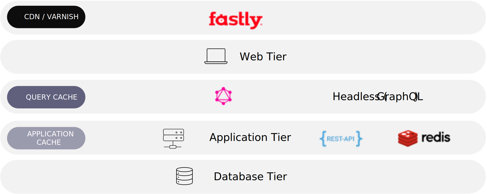

# パフォーマンスの最適化

パフォーマンスは大きな話題です。 ユーザーが低速なサイトや応答しないサイトを経験した場合、そのサイトはコンバージョンに影響を与えます。 クラウドインフラストラクチャ実装でのAdobeコマースのパフォーマンスを最適化するには、次の手順に従うことをお勧めします。

- 問題の評価
- パフォーマンスの測定
- パフォーマンス向上に不可欠なシステムの一部を特定
- システムの一部を変更してボトルネックを取り除く
- 変更後のパフォーマンスの測定
- より良い場合は、それを採用するか、元に戻す

## 一般的なパフォーマンスの問題

遅いエクスペリエンスの影響は通常 2 つの指標で定義され、各要因は多くの理由で引き起こされる可能性があります。

High time-to-first-byte(TTFB) は、通常、サーバの応答速度を定義するインジケータと見なされます。 この時間は、リクエストを処理するためのソースコードの実行に由来するだけでなく、次の要因の影響を受ける場合もあります。

- DNS 参照
- DB レイヤーからのクエリが遅い
- 各アプリケーション・レイヤーからの CPU 時間
- メモリ制限
- I/O 待機は、ファイルの読み取りと書き込み、ソケット経由での接続から影響を受ける可能性がある
- ソフトウェア設定 (nginx、PHP、MySQL、Redis、Vanris)
- ネットワーク帯域幅
- 不正なキャッシュ
- 不正なコード
- 不適切な統合アプローチ
- 低速なサードパーティサービス応答の依存関係
- 拡張性のないアーキテクチャ

低速読み込みリソースは、通常、静的リソース（CSS、JavaScript、画像、ビデオ、サードパーティの Ajax 呼び出し応答）を定義するインジケーターと見なされます。

Adobeコマースは、次の機能を通じてビジネスを拡大/縮小できます。

また、コマースの規模を拡大する主な要因もあり、全体的なパフォーマンスにも影響します。

- 複雑で大規模な製品カタログ
- 多数の管理者
- グローバルストアフロント
- 高変数トラフィック
- タッチポイントの拡張
- 大量トランザクション

スケール用に構築された階層化されたキャッシュ可能なアーキテクチャの場合、このグラフを参照として使用できます。

