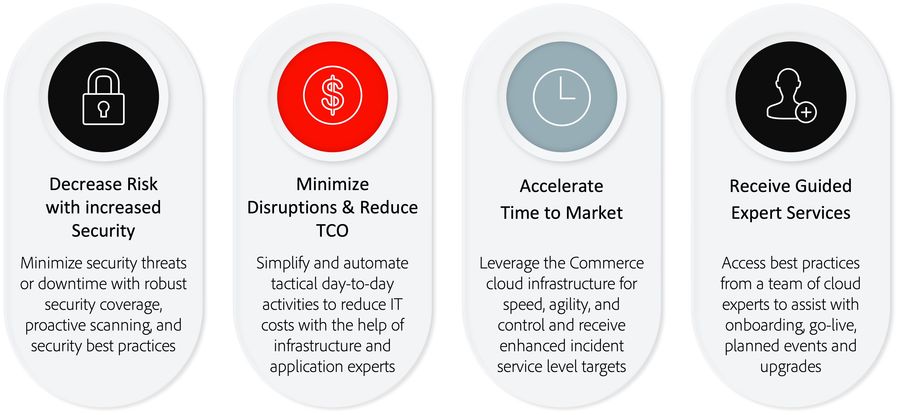
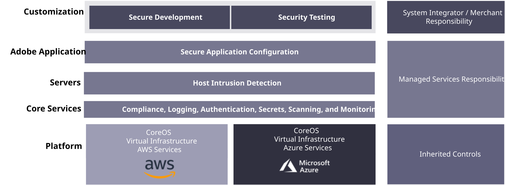

# Adobe Managed Services

Adobe Commerceは、すぐに使える堅牢な機能、広範なカスタマイズオプション、サードパーティとの統合など、e コマース能力を提供するためのプラットフォームです。

Adobe Managed Servicesは、Adobe Commerce on cloud infrastructure Pro プランのアプリケーションとインフラストラクチャのホストおよび管理を提供します。

## Adobe Workfrontの利点

### 実装オプションの比較

Adobe Managed Servicesは、オンプレミスおよびマネージド以外のクラウド実装に対して、次のような主な利点をもたらします。

- **拡張サービスレベル目標（SLT）** – 標準的なAdobe Commerce サポートよりも高速な応答時間。
- **拡張サービスレベル契約（SLA）** - 99.9%のアプリケーションレベル。通常のAdobe Commerce on cloud infrastructureのお客様は、99.99%のインフラレベルを超えることができます。
- **専用のクラウド専門知識** - Managed Servicesでは、アプリケーションおよびクラウド インフラストラクチャのエキスパートとして機能する専用のカスタマーサクセスエンジニア（CSE）をお客様に提供します。 CSEは、顧客とそのパートナーと連携し、市場投入までの時間を短縮するためのベストプラクティスとガイダンスを提供します。
  - オンボーディングプロセスのガイドとサポート
  - プロビジョニングとプラットフォーム設定の管理
  - 統合とカスタマイズのためのアーキテクチャ原則のアドバイス
  - インシデント管理とビジネス継続性の促進
  - イベントの計画、実行、モニタリングを通じてイベントをサポートします
  - クラウドのサポートと専門知識（積極的な最適化、レポート、ベストプラクティス）

Managed Servicesの主な利点の詳細な比較については、次の表を参照してください。

| 機能 | Adobe Commerce オンプレミス | Adobe Commerce on Cloud | Managed Services上のAdobe Commerce |
|---------|---------------------------|-------------------------|-----------------------------------|
| Adobeのエンタープライズソフトウェア | ✓ | ✓ | ✓ |
| Adobe Developer App Builder | | ✓ | ✓ |
| セキュアな専用のクラウドインフラ | | ✓ P1: 1時間 | ✓ P1: 15分 |
| 強化されたインシデントサービスレベル目標 | | ✓ | ✓ |
| サージキャパシティのモニタリングおよび対応 | | ✓ | ✓ |
| インフラセキュリティ | | ✓ | ✓ |
| インフラレベルにおけるSLA99.99% | | ✓ | ✓ |
| アプリケーションレベルにおけるSLAの割合99.9% | | | ✓ |
| 専用のインフラエキスパートリソース（カスタマーサクセスエンジニア） | | | ✓ |
| 計画的なイベント管理 | | | ✓ |
| カスタマイズされたサイトモニタリングとパーソナライズされたランブック | | | ✓ |
| アップグレードとパッチのデプロイメント支援 | | | ✓ |
| 本番稼動プロセスとの連携 | | | ✓ |
| 専用のエスカレーション管理 | | | ✓ |
| アプリケーションの監視とサポート | | | ✓ |

## 役割と責任

Adobeは、Managed Services システム上でのAdobe Commerceのプロビジョニング、開発、ステージングおよびプロダクションに関する一連のサービスを提供します。 ソリューションの開発とデプロイメントを可能な限り効率的に進めるには、お客様とパートナーが以下のように役割を理解し、果たすことが重要です。

<table>
    <thead>
        <tr>
            <th></th>
            <th>お客様</th>
            <th>パートナー</th>
            <th>カスタマーサクセスエンジニア</th>
        </tr>
    </thead>
    <tbody>
        <tr>
            <td colspan="4" style="background:lightgray;"><strong>プロビジョニング</strong></td>
        </tr>
        <tr>
            <td>クラウド領域の選択</td>
            <td>所有者</td>
            <td>Contributor</td>
            <td>Advisor</td>
        </tr>
        <tr>
            <td>インスタンスのプロビジョニング</td>
            <td></td>
            <td></td>
            <td>所有者</td>
        </tr>
        <tr>
            <td>内部ネットワークの設定とセキュリティ</td>
            <td></td>
            <td></td>
            <td>所有者</td>
        </tr>
        <tr>
            <td>Adobe Commerce アプリケーションプロビジョニング</td>
            <td></td>
            <td></td>
            <td>所有者</td>
        </tr>
        <tr>
            <td>Adobe Commerce Source Code Access</td>
            <td></td>
            <td></td>
            <td>所有者</td>
        </tr>
        <tr>
            <td>CDN サービスプロビジョニング</td>
            <td></td>
            <td></td>
            <td>所有者</td>
        </tr>
        <tr>
            <td>ローカル開発環境</td>
            <td>Contributor</td>
            <td>所有者</td>
            <td></td>
        </tr>
        <tr>
            <td colspan="4" style="background:lightgray;"><strong>開発とQA</strong></td>
        </tr>
        <tr>
            <td>要件収集とプロジェクト管理</td>
            <td>Contributor</td>
            <td>所有者</td>
            <td>Advisor</td>
        </tr>
        <tr>
            <td>アプリケーション開発</td>
            <td>Contributor</td>
            <td>所有者</td>
            <td>Advisor</td>
        </tr>
        <tr>
            <td>アプリケーションテスト</td>
            <td>Contributor</td>
            <td>所有者</td>
            <td>Advisor</td>
        </tr>
        <tr>
            <td colspan="4" style="background:lightgray;"><strong>ステージングと移行</strong></td>
        </tr>
        <tr>
            <td>開発、統合、ステージングへのコード展開</td>
            <td>Contributor</td>
            <td>所有者</td>
            <td>Advisor</td>
        </tr>
        <tr>
            <td>コンテンツの展開</td>
            <td>Contributor</td>
            <td>所有者</td>
            <td>Advisor</td>
        </tr>
        <tr>
            <td>ユーザー受け入れテスト開発</td>
            <td>所有者</td>
            <td>Contributor</td>
            <td>Advisor</td>
        </tr>
        <tr>
            <td>ユーザー受け入れテスト</td>
            <td>所有者</td>
            <td>Contributor</td>
            <td>Advisor</td>
        </tr>
        <tr>
            <td>カスタム監視要件</td>
            <td>Contributor</td>
            <td>所有者</td>
            <td>Advisor</td>
        </tr>
        <tr>
            <td>顧客が提供するSSL証明書</td>
            <td>所有者</td>
            <td></td>
            <td>Contributor</td>
        </tr>
        <tr>
            <td>パフォーマンスと負荷テストの開発</td>
            <td>Contributor</td>
            <td>所有者</td>
            <td>Advisor</td>
        </tr>
        <tr>
            <td>パフォーマンスと負荷テスト</td>
            <td>Contributor</td>
            <td>所有者</td>
            <td>Advisor</td>
        </tr>
        <tr>
            <td>カスタマイズ開発とQA</td>
            <td>Contributor</td>
            <td>所有者</td>
            <td>Advisor</td>
        </tr>
        <tr>
            <td>Runbookの完了</td>
            <td>所有者</td>
            <td>Contributor</td>
            <td>Contributor</td>
        </tr>
        <tr>
            <td>Runbook Review</td>
            <td></td>
            <td></td>
            <td>所有者</td>
        </tr>
        <tr>
            <td colspan="4" style="background:lightgray;"><strong>Launch</strong></td>
        </tr>
        <tr>
            <td>運用開始チェックリスト</td>
            <td>Contributor</td>
            <td>Contributor</td>
            <td>所有者</td>
        </tr>
        <tr>
            <td>ライブイベント用カンファレンスルーム</td>
            <td>Contributor</td>
            <td>Contributor</td>
            <td>所有者</td>
        </tr>
        <tr>
            <td>実稼動コードのデプロイメント</td>
            <td>Contributor</td>
            <td>Contributor</td>
            <td>所有者</td>
        </tr>
        <tr>
            <td colspan="4" style="background:lightgray;"><strong>本番</strong></td>
        </tr>
        <tr>
            <td>本番環境の監視</td>
            <td></td>
            <td></td>
            <td>所有者</td>
        </tr>
        <tr>
            <td>プリンシパルアプリケーションモニタリング</td>
            <td>Contributor</td>
            <td>Contributor</td>
            <td>所有者</td>
        </tr>
        <tr>
            <td>実稼動イベント応答</td>
            <td>Contributor</td>
            <td>Contributor</td>
            <td>所有者</td>
        </tr>
        <tr>
            <td>インフラストラクチャおよびオペレーティングシステムレベルのメンテナンス</td>
            <td></td>
            <td></td>
            <td>所有者</td>
        </tr>
        <tr>
            <td>カスタムコードのメンテナンスとセキュリティパッチ</td>
            <td>Contributor</td>
            <td>所有者</td>
            <td>Advisor</td>
        </tr>
        <tr>
            <td>Adobe Commerce製品のアップデートとアップグレードへのアクセスを提供する</td>
            <td>Contributor</td>
            <td>Contributor</td>
            <td>所有者</td>
        </tr>
        <tr>
            <td>Adobe Commerce製品のアップデートとアップグレードの適用</td>
            <td>Contributor</td>
            <td>所有者</td>
            <td>Advisor</td>
        </tr>
        <tr>
            <td>実稼動デプロイメントを承認するための承認掲示板の変更</td>
            <td>Contributor</td>
            <td>Contributor</td>
            <td>所有者</td>
        </tr>
        <tr>
            <td>実稼動アプリケーションの管理</td>
            <td>所有者</td>
            <td>Contributor</td>
            <td>Advisor</td>
        </tr>
        <tr>
            <td>本番インフラストラクチャの調整</td>
            <td>Contributor</td>
            <td>Contributor</td>
            <td>所有者</td>
        </tr>
        <tr>
            <td>本番アーキテクチャの拡張</td>
            <td></td>
            <td></td>
            <td>所有者</td>
        </tr>
        <tr>
            <td>実稼動のバックアップとリカバリ</td>
            <td></td>
            <td>Contributor</td>
            <td>所有者</td>
        </tr>
        <tr>
            <td colspan="4" style="background:lightgray;"><strong>セキュリティとコンプライアンス</strong></td>
        </tr>
        <tr>
            <td>SOC-2 サービス監査</td>
            <td></td>
            <td></td>
            <td>所有者</td>
        </tr>
        <tr>
            <td>インフラのPCI認証</td>
            <td></td>
            <td></td>
            <td>所有者</td>
        </tr>
        <tr>
            <td>カスタマイズされたアプリケーションのPCI認証</td>
            <td>所有者</td>
            <td>Contributor</td>
            <td></td>
        </tr>
        <tr>
            <td>コアアプリケーションのセキュリティ監査</td>
            <td>所有者</td>
            <td>Contributor</td>
            <td>Advisor</td>
        </tr>
        <tr>
            <td>カスタマイズと拡張機能のセキュリティ監査</td>
            <td>所有者</td>
            <td>Contributor</td>
            <td></td>
        </tr>
        <tr>
            <td>顧客アプリケーションのインスタンスの侵入テスト</td>
            <td>所有者</td>
            <td>Contributor</td>
            <td></td>
        </tr>
        <tr>
            <td>Web Application Firewall Rules （WAF）</td>
            <td>Contributor</td>
            <td>Contributor</td>
            <td>所有者</td>
        </tr>
        <tr>
            <td>侵入検知モニタリング</td>
            <td></td>
            <td></td>
            <td>所有者</td>
        </tr>
        <tr>
            <td>アプリケーションとDB イベントの監視</td>
            <td>Contributor</td>
            <td>Contributor</td>
            <td>所有者</td>
        </tr>
        <tr>
            <td>Web アプリケーションファイアウォールイベント監視</td>
            <td>Contributor</td>
            <td>Contributor</td>
            <td>所有者</td>
        </tr>
        <tr>
            <td>ユーザー管理とSSOの統合</td>
            <td>所有者</td>
            <td>Contributor</td>
            <td>Contributor</td>
        </tr>
        <tr>
            <td>セキュリティイベント応答</td>
            <td>Contributor</td>
            <td>Contributor</td>
            <td>所有者</td>
        </tr>
        <tr>
            <td>企業のネットワークやリソースへの接続の設定、保護、維持 </td>
            <td>所有者</td>
            <td>Advisor</td>
            <td>Advisor</td>
        </tr>
    </tbody>
</table>

## セキュリティ

Managed ServicesのAdobeセキュリティスタックは、あらゆるレベルのセキュリティを強化し、自動化と一貫性を確保してヒューマンエラーを低減します。 開発チームと運用チームは、スタックの様々なレベルからセキュリティ制御を自動的に継承します。

Amazon Web ServicesやMicrosoft Azureなどのプラットフォームパートナーは、プラットフォームのカスタマイズを適用する際に最大限のセキュリティを確保します。一方、AdobeのManaged Servicesチームは、コンプライアンス、ロギング、認証、スキャン、モニタリングなどのコアセキュリティサービスや、サーバーセキュリティおよびセキュアアプリケーション設定を提供します。 詳しくは、[Adobe Commerce セキュリティ &#x200B;](https://business.adobe.com/products/magento/secure-ecommerce.html)を参照してください。

次の図は、Adobe Managed Servicesのセキュリティテクノロジースタックを示しています。

## アップグレードの支援

Managed Services チームは、アップグレードプロセスの計画と支援に積極的な役割を果たします。 カスタマーサクセスエンジニア（CSE）は、プロジェクトマネージャーを含むアップグレードプロジェクトチーム、開発者（社内のSME エキスパート、Adobe認定パートナー、Adobe Consultingのプロフェッショナル）と連携して、アップグレード中に適切な計画を策定し、ベストプラクティスを遵守できるようにします。

Managed Services CSEは、Adobe Commerceのお客様と連携して、大規模環境でアップグレードを実行します。 CSEは、専門家の知識を活用して、ダウンタイムを最小限に抑え、全体的なリスクを軽減しながら、アップグレードの成功を最大化するのに役立ちます。 さらに、Managed Services CSEは、アップグレード用の専用ステージング環境と連携して動作するので、アップグレードの検証中に既存の実稼動プロセスに影響が及ぶことはありません。

Adobeは、Managed Services システムのプロビジョニング、開発、ステージング、実稼動に関する一連のサービスを提供します。 次の表に、アップグレードプロセスで各参加者が果たす役割の概要を示します。

<table>
<thead>
  <tr>
    <th>ステップ</th>
    <th>タスク</th>
    <th>お客様</th>
    <th>開発パートナー*</th>
    <th>Managed Services</th>
  </tr>
</thead>
<tbody>
  <tr>
    <td rowspan="3">プランのアップグレード</td>
    <td>アップグレードプロジェクト計画の作成</td>
    <td>所有者</td>
    <td>Contributor</td>
    <td>コントリビューター CSEは、アップグレード テンプレートとアップグレード プランのサンプルを提供します。アドバイスとベストプラクティスのヒントを提供します。</td>
  </tr>
  <tr>
    <td>必要なインフラストラクチャの変更の決定</td>
    <td></td>
    <td>Contributor</td>
    <td>所有者 CSEは、適切なサイズを確保するために、ステージングおよび実稼動インフラストラクチャを確認します。</td>
  </tr>
  <tr>
    <td>アップグレードの複雑さを評価  パッケージ、問題と修正、サードパーティとカスタム モジュールを特定して文書化します</td>
    <td>Contributor</td>
    <td>所有者</td>
    <td>コントリビューター CSEは、アップグレード互換性ツールのレポートと推奨事項を提供します。</td>
  </tr>
  <tr>
    <td rowspan="3">アップグレードを実行</td>
    <td>インフラストラクチャ サービス  [MariaDB、Redis、Open Search、およびRabbit MQ] （ステージングと実稼動）</td>
    <td></td>
    <td></td>
    <td>所有者 CSEは、インフラストラクチャ サービスのアップグレードを調整します。 CSEは、アップグレード用のカンファレンス ミーティング イベントをスケジュールします。 CSEは、実稼動からステージングへのデータ移行を支援します。</td>
  </tr>
  <tr>
    <td>Commerceのコードベースとカスタマイズの更新。コードの再コンパイルとコードリファクタリング</td>
    <td>Contributor</td>
    <td>所有者</td>
    <td></td>
  </tr>
  <tr>
    <td>アップグレード後のチェックとトラブルシューティングの実行</td>
    <td></td>
    <td>所有者</td>
    <td>コントリビューター CSEは、アップグレード後のランブックを実行して、アップグレードに関連する問題を検出および修正します。</td>
  </tr>
  <tr>
    <td rowspan="3">UATとLaunch</td>
    <td>パフォーマンステストとセキュリティテストの実施</td>
    <td>Contributor</td>
    <td>所有者</td>
    <td>コントリビューター CSEは、アプリケーションとインフラストラクチャのパフォーマンスを監視することで、負荷テストを支援します。 CSEは、Commerce Security Scan Toolの設定を支援します。</td>
  </tr>
  <tr>
    <td>ステージングでのユーザー受け入れテスト</td>
    <td>所有者</td>
    <td>Contributor</td>
    <td>コントリビューター CSEは、アップグレード後にアプリケーションとインフラストラクチャが正しく動作していることを検証します。</td>
  </tr>
  <tr>
    <td>Launch to Production</td>
    <td>Contributor</td>
    <td>所有者</td>
    <td>コントリビューター CSE スケジュールは、会議ミーティング イベントを開始します。</td>
  </tr>
  <tr>
    <td>起動後</td>
    <td></td>
    <td>Contributor</td>
    <td>Contributor</td>
    <td>所有者 CSEは、アプリケーションとインフラストラクチャのパフォーマンスを監視します。</td>
  </tr>
</tbody>
</table>
