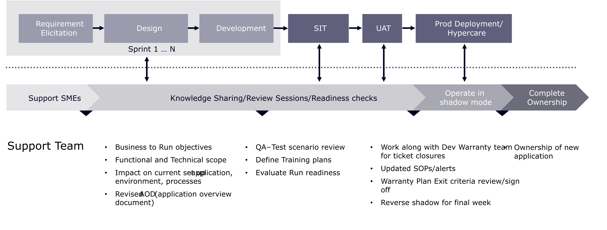

# メンテナンスとサポートの概要

消費者はこれまで以上に多くの選択肢に触れています。 ブランドはいくらでも注目を集めることができるので、消費者に競合他社を見る理由を与えることはできません。 これまで説明してきたように、顧客ロイヤルティと顧客に対する忍耐力は薄れています。 企業を諦めることもあまりなく、e コマース体験の質が低いことは、顧客にとって簡単にあきらめる方法です。

これは2つの補完的なポイントにつながります。 ひとつ目は、新しいコマースサイトの立ち上げは、次に進むという意味ではないということです。 マーケティングの変化の速度と消費者のニーズの変化の速度は非常に大きく、企業は常に進化し続ける必要があります。 それでは2つ目のポイントです。 デジタルコマースのサポートが、顧客の期待に応えなければ、対応できません。 つまり、コマースサポートは、サイトを機能させ続けるだけでなく、企業を前進させる必要があります。 このセクションでは、サイトの立ち上げ後、ブランドを前進させ始めるのに役立ちます。

## 移行フェーズ

プロジェクトの移行段階で本番環境のサポートを設定することは、コマース企業の最も重要な成功要因のひとつです。 実装が完了し、サイトが公開されたら、制作サポートチームがサポート活動を引き継ぐための準備と準備が必要です。 通常は、移行期に開発チームを縮小し、小規模なチームを編成してサポートを提供します。

知識の移転はプロジェクト全体を通して行われ、移行の成功は納品と並行して行われます。 さらに、ユーザーガイドとテクノロジーウィキは、プロジェクトのフェーズ全体を通じてワークショップを可能にする重要なツールです。

次の図は、移行の成果に含まれるフェーズとアクティビティを示しています。

>[!NOTE]
>
> ポストプロダクションサポートチームを適切に編成するために必要なタスクをプロジェクトマネージャーが完了できるように、移行チェックリストを作成することが重要です。 この移行はプロジェクト全体の計画の一部であり、タスクをスケジュールに含める必要があります。

プラットフォームの強化と最適化を継続し、コマース業務全体を最適化するための適切なサポートモデルを特定することは、導入プロセス中に行われたあらゆる作業を維持するために重要なステップです。 包括的な継続的なサポートプランを導入することで、コマースサイトは顧客の期待に応え、目標も達成することができます。

Adobe Commerceを導入する際は、メンテナンスとサポート戦略に何を含めるかを考えることが重要です。
エキスパートのサポートは、Adobe Commerce ライセンスに含まれています。 エキスパートサポートとAdobe サポートプランについて詳しくは、[Adobe サポートプラン &#x200B;](https://business.adobe.com/customers/consulting-services/premier-support.html)を参照してください。
Adobe サポートプランに加えて、従来のMagento サポート条件もあります。 お客様に適用されるサポートサービスを理解するには、契約を参照して、お客様のサポート契約を確認するか、Adobeのアカウントチームにお問い合わせください。
