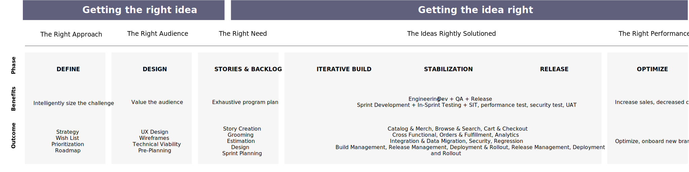

# 配信と計画のアプローチ

実装を開始する前にプロジェクトの範囲をすべて理解することは、時間通りに、予算通りに、そしてお客様のニーズを満たすソリューションを提供するための計画を立てることと同じくらい重要です。 これには、ソリューションの設計と実装のための完全なブループリントを特定し、成功を測定しながらブループリントを実行する両方が必要です。

これは、最初のアイデアの時点からローンチ後まで続く、チーム全体のコミットメントです。 これはプロセスの細部を重視し、時には退屈な側面ですが、計画とガバナンスに加える作業により、障害物を回避し、克服するのがはるかに簡単になります。

戦略的コマースプロジェクトは、複数のアプローチとさまざまなプロジェクト管理手法で実現できます。 ただし、配信を成功させ、最適な実行を実現するには、ハイブリッドアジャイル アプローチをお勧めします。

このアプローチは、次の手順で構成されます。

- 計画、設計、戦略を立てるフェーズを定義

- アジャイルスプリントによるソリューションの構築と設計

- パイロット版の統合、パフォーマンス、ユーザー受け入れテスト

- ブランドおよびコマースサイトのスクラムチームのロールアウト

ハイブリッドモデルを使用すると、タイムライン、コスト、品質をターゲットに維持しながら、アジャイル手法の力を活用できます。 計画全体は、2 つの異なるフェーズに分けられ、その後、ローンチ、最適化、メンテナンスの各アクティビティが続きます。

- **適切なアイデアの取得** – これは、要件、設計、およびテクノロジー・ソリューションが戦略的に取り組まれ、ドキュメント化され、利害関係者の間で協力されていることを確認するための実装前段階です。 実装のバックログが調整および作成され、開発スプリントが計画され、製品構築の順次戦略が確定します。

- **考えを正しく理解する** – これは、製品を反復的に構築し、十分にテストして、適切にリリースする実装フェーズです。 最初のステップは、複数のスプリントを通じてコードを開発することです。各スプリントには、スプリント内の開発とテストが含まれ、その後、システム統合テスト、パフォーマンステストとセキュリティテスト、ユーザー受け入れテスト、リリースアクティビティが続きます。

プロジェクトの計画は、重要なアクティビティです。 プロジェクトのフェーズを監視、管理、制御する方法について、関係者、チーム、スポンサー、プロジェクトマネージャーをガイドします。 また、目標を特定し、期限を逃さないようにし、重要なタスクに優先順位を付け、リスクを軽減し、望ましい結果を得ることもできます。

プロジェクト計画は通常、次の 4 つのフェーズで構成されます。

- 開始と計画
- 実行
- ローンチ
- ローンチ後

各フェーズは複数の小さなスプリントを通じて配信されるため、より小さな増分で、より高い俊敏性で、進捗と成果を管理できます。 しかし、計画はユニークで、通常、他の 3 つのフェーズの一部です。 各フェーズの詳細な分類と、Adobe Commerceの実装を成功に導くためのプロジェクトプランの例を示しました。

定義したアプローチは、プロジェクトを正常に実行できるよう、様々なプロジェクトフェーズが一緒になって表示されることを示しています。 プロジェクト管理オフィス（PMO）は、様々なレベルで綿密な管理を提供し、各フェーズ（およびスプリント）で成功を収め、最適な品質とコストで成功したタイムリーな実行を可能にします。

