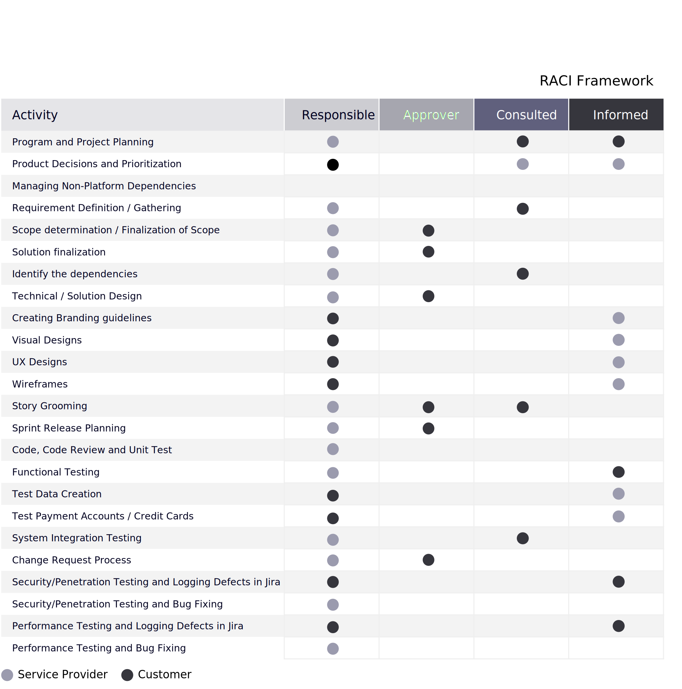

# 責任と所有権

大きなプロジェクトを実行する際、最初は何もかもうまくいっているように見えます。 プロジェクトのロードマップは、明確なマイルストーンを含む詳細で包括的です。 資源計画とステークホルダー・コミットメントが実施されている。 しかし、期限を逃し、タスクを忘れてしまうと、すぐに事態が崩れ始める可能性があります。

これは、多くの場合、プロジェクトの役割と責務に関する明確性が欠けているために発生します。 役割と責務を明確に果たすことが、あらゆるプロジェクトにとって重要な成功要因です。 プロジェクトがなければ、プロジェクトはすぐに脱線し、関係者は時間や予算が超過した例外的な方法を通じて管理しようとしています。

## 我々は共同でどのように協力するのか？

責任ある、責任ある、責任ある、問い合わせる、情報に基づく (RACI) マトリックス ( [プロジェクト範囲](../project-scope/deliverables.md) セクション — プロジェクトの各段階で所有権と責任を定義し、文書化する便利なツールです。 マトリックス内では、プロジェクト内のすべてのタスク、マイルストーンおよび決定が、特定の役割または個人にマッピングされます。 各チームメンバーや関係者が自分の役割を確実に理解できるようにすることで、プロジェクト管理によるプロセスの合理化に役立ちます。 これは、プロジェクトの計画段階で定義し、各関係者が受け入れる必要があります。

