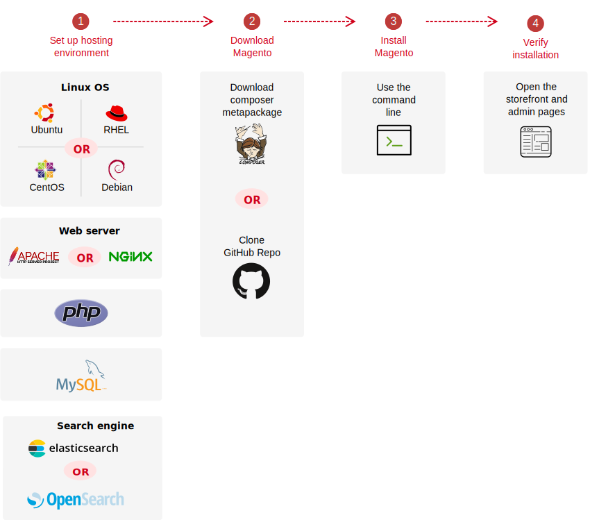

# オンプレミスでのインストールの概要

>[!NOTE]
>
>次の図は、 _**オンプレミス**_ Adobe CommerceとMagento Open Source:

一般的なインストールフローを次に示します。

1. サーバー環境を設定します。

   前提条件となるソフトウェア（PHP、Apache、MySQL、検索エンジンなど）をインストールします。 詳しくは、 [システム要件](system-requirements.md) を参照してください。

1. 取得 [認証キー](prerequisites/authentication-keys.md) を Commerce Composer リポジトリに追加します。

1. Adobe CommerceまたはMagento Open Sourceソフトウェアを入手します。

   * （推奨） [Composer メタパッケージ](composer.md) モジュールとその依存関係を管理する。

   * アプリケーションコードベースへの投稿やMagento Open Sourceのカスタマイズをおこなう場合は、 [複製](https://developer.adobe.com/commerce/contributor/guides/install/clone-repository/) GitHub リポジトリ この方法を使用するには、GitHub と Composer の両方に精通している必要があります。

1. コマンドラインを使用してアプリケーションをインストールします。

   前提条件のソフトウェアが正しく設定されていないために手順が失敗した場合は、 [前提条件](prerequisites/overview.md).

1. [検証](next-steps/verify.md) ストアフロントと管理者を表示して、インストールを実行します。

