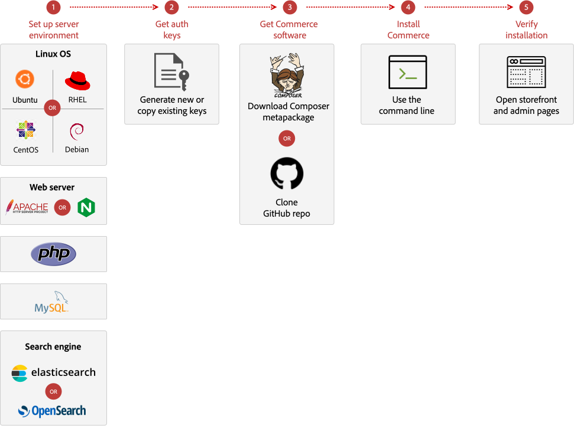

# オンプレミス インストールの概要

このページでは、独自のインフラストラクチャへのAdobe Commerceのインストールの概要について説明します。 インストールプロセスには、サーバー環境の設定、必要なソフトウェアと資格情報の取得、インストールコマンドの実行が含まれます。

Adobe Commerce オンプレミス ソフトウェアは、約30 ～ 60分でインストールできます。 ただし、インストール前にサーバー環境を設定するのに必要な時間は、エクスペリエンスと選択したテクノロジーによって異なります。

>[!TIP]
>
>正常に処理するには、中級の技術的な知識とサーバーアクセスが必要です。

インストールすると、[お客様向けのストアフロント &#x200B;](https://experienceleague.adobe.com/en/docs/commerce-admin/start/storefront/storefront)と[管理パネル &#x200B;](https://experienceleague.adobe.com/en/docs/commerce-admin/start/admin/admin)の両方を備えた機能的なAdobe Commerce ストアが作成されます。 プロセスを開始する前に、データベースの資格情報、ドメイン情報、認証キーを準備しておく必要があります。

## 加盟店の責任

Adobe Commerceをオンプレミスで利用すれば、サーバー、ホスティング環境、システムメンテナンスなどを含む独自のインフラストラクチャをホスティングして管理できます。 Adobeでは、以下の主要なCommerce アプリケーションに特化したサポートを提供しています。

- 製品のアップデートと修正へのアクセス
- 脆弱性に対処するためのセキュリティパッチ
- セルフホステッド製品の管理と最適化に役立つ包括的なドキュメントをご確認ください

お客様は環境を完全に制御し、より高度なカスタマイズと柔軟性を実現できますが、インフラストラクチャのパフォーマンス、セキュリティ、スケーラビリティを確保する責任があります。 例えば、次のような責任を負います。

- すべてのAdobe Commerce オンプレミスシステムの設計、実装、設定、メンテナンス、トラブルシューティング、パフォーマンステスト。
   - サーバー、オペレーティングシステム、データベース、[!DNL PHP]、検索、キャッシュ、フルページキャッシュ、コンテンツ配信ネットワーク。 一般的なテーマには、[!DNL Nginx/Apache]、[!DNL PHP]、[!DNL MySQL/MariaDB]、[!DNL Redis]、[!DNL Elasticsearch/OpenSearch]、[!DNL RabbitMQ]、[!DNL Varnish]、[!DNL DNS]、[!DNL SSL/TLS certificates]および使用されている[!DNL CDN]が含まれます（ただし、これらに限定されません）。
- キャパシティプランニング、自動スケーリング、クラスタリング、バックアップ、災害復旧
- すべての製品および顧客データ、設計、設定および設定、アプリケーションおよびデータベースの維持管理、コードのデプロイメント、バージョンのアップグレード、パッチアプリケーション
- APM/ログ/アラートによる監視とアラート（例：[!DNL New Relic]、[!DNL Datadog]、[!DNL ELK]）
- オペレーティングシステム、[!DNL PHP]、データベース、ミドルウェアの強化および更新に関するセキュリティパッチ

## ワークフロー

次の図は、オンプレミス環境用のAdobe Commerceのインストールに関する主な手順を示しています。

### サーバー環境の設定

[の前提条件](prerequisites/overview.md)に従って、PHP、web サーバー、データベース、検索エンジンをインストールして設定します。

### 認証キーを取得

Commerce Marketplaceから新しい[認証キー](prerequisites/authentication-keys.md)を生成（または既存のキーをコピー）して、Adobe Commerce Composer パッケージにアクセスします。

### Adobe Commerceの導入

[Composer](prerequisites/commerce.md) （推奨）を使用してダウンロードするか、開発用コントリビューション用にGitHubからクローンします。

Magento Open Source コードベースにコントリビューションする場合やアプリケーションをカスタマイズする場合は、GitHub リポジトリを[&#x200B; クローン &#x200B;](https://developer.adobe.com/commerce/contributor/guides/install/clone-repository)します。 この方法を使用するには、GitHubとComposerの両方に精通している必要があります。

### アプリケーションのインストール

特定の設定でインストールコマンドを実行します。 完全な例については、[&#x200B; クイックスタート &#x200B;](composer.md)を参照してください。

>[!NOTE]
>
>前提条件ソフトウェアが正しく設定されていないため、手順が失敗した場合は、[前提条件](prerequisites/overview.md)を確認してください。

### インストールの確認

ストアフロントと管理パネルを[&#x200B; テスト &#x200B;](next-steps/verify.md)して、すべてが正しく動作することを確認します。

## 一般的なインストールの問題

- **権限エラー**：適切なファイルシステムの所有権と権限を確保する
- **データベース接続エラー**: データベースの資格情報とネットワーク接続を確認します
- **認証キーエラー**:Commerce Marketplace キーが有効でアクティブであることを確認してください
- **メモリ制限**：十分なPHP メモリ割り当てを確保します（最小2 GBを推奨）
