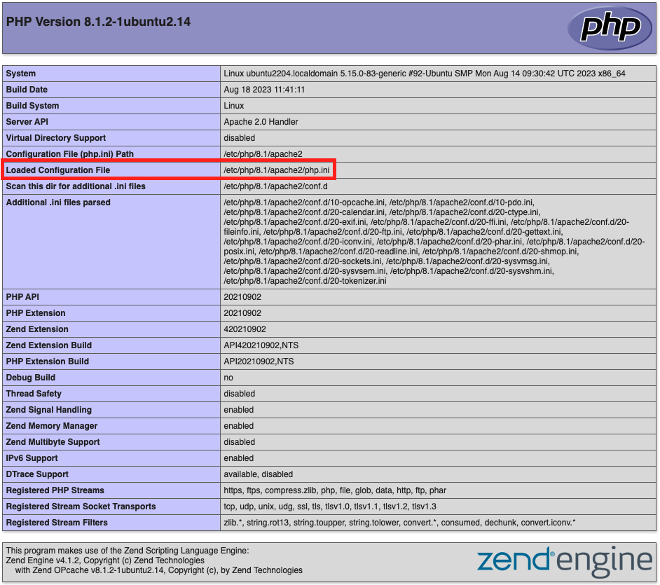

# PHP設定

このトピックでは、必要なPHP オプションを設定する方法について説明します。

>[!NOTE]
>
>サポートされているPHP バージョンは、Adobe Commerce リリースによって異なります。 インストール中のリリースでサポートされている正確なPHP バージョンについては、[必要システム構成](../system-requirements.md)を参照してください。

クラウド設定ガイダンスについては、_Commerce on Cloud Infrastructure_ ガイドの[PHP settings](https://experienceleague.adobe.com/en/docs/commerce-on-cloud/user-guide/configure/app/php-settings)を参照してください。

## PHP プロセス制御

{{php-process-control}}

## PHPがインストールされていることを確認する

PHPは、ほとんどのLinux ディストリビューションにデフォルトでインストールされます。 このトピックでは、既にPHPがインストールされていることを前提としています。 PHPがインストールされているかどうかを確認するには、コマンドラインで次のように入力します。

```shell
php -v
```

PHPがインストールされている場合は、次のようなメッセージが表示されます。

```text
PHP <supported-version> (cli) (built: <build-date>) (NTS)
Copyright (c) The PHP Group
Zend Engine v<matching-version>, Copyright (c) Zend Technologies
    with Zend OPcache v<matching-version>, Copyright (c), by Zend Technologies
```

PHPがインストールされていない場合（またはアップグレードが必要な場合）は、Linux ディストリビューションの手順に従ってインストールします。

## インストールされた拡張機能を確認

Adobe Commerceには、特定のPHP拡張機能が必要です。 次のリストは、Commerceの各エディションに必要な拡張機能を示しています。 リストは、各エディションの最新バージョンを実行しているデプロイメントから自動生成されます。

{{$include /help/_includes/templated/php-extensions.md}}

インストールされている拡張機能を確認するには：

1. インストール済みモジュールのリスト。

   ```shell
   php -m
   ```

1. 必要な拡張機能がすべてインストールされていることを確認します。
1. PHPのインストールに使用するのと同じワークフローを使用して、欠落しているモジュールを追加します。

## PHP設定の確認

>[!WARNING]
>
>PHP [ バグ 81101](https://bugs.php.net/bug.php?id=81101)の影響を受けるレガシー環境のトラブルシューティングを行う場合は、`php.ini` ファイルの`pcre.jit=0`を設定して、CSSが読み込まれない問題を回避してください。

- PHPのシステムタイムゾーンを設定します。設定しない場合、インストール時に次のようなエラーが表示され、cronなどの時間関連の操作が機能しない場合があります。

```text
PHP Warning:  date(): It is not safe to rely on the system's timezone settings. [more messages follow]
```

- PHPのメモリ制限を設定します。

  Adobeでは、次の項目を推奨しています。

   - コードのコンパイルまたは静的アセットのデプロイ，`1G`
   - デバッグ，`2G`
   - テスト中、`~3-4G`

- PHP `realpath_cache_size`および`realpath_cache_ttl`の値を推奨設定に増やします。

  ```conf
  realpath_cache_size=10M
  realpath_cache_ttl=7200
  ```

  これらの設定を使用すると、PHP プロセスはページ読み込み時にパスを検索するのではなく、ファイルにパスをキャッシュできます。 PHP ドキュメントの[ パフォーマンスチューニング ](https://www.php.net/manual/en/ini.core.php)を参照してください。

- Adobe Commerce 2.1以降に必要な[`opcache.save_comments`](https://www.php.net/manual/en/opcache.configuration.php#ini.opcache.save-comments)を有効にします。

  Adobeでは、パフォーマンス上の理由から[PHP OPcache](https://www.php.net/manual/en/book.opcache.php)を有効にすることをお勧めします。 OPcacheは多くのPHP ディストリビューションで有効になっています。

  Adobe Commerce 2.1以降では、コード生成にPHP コードコメントを使用します。

>[!NOTE]
>
>インストールおよびアップグレード時の問題を回避するために、Adobeでは、PHP コマンドライン設定とPHP web サーバープラグイン設定の両方に同じPHP設定を適用することを強くお勧めします。 詳しくは、次の節を参照してください。

## PHP設定ファイルの検索

この節では、必要な設定を更新するために必要な設定ファイルの検索方法について説明します。

### `php.ini`設定ファイルを検索

Web サーバー設定を検索するには、web ブラウザーで[`phpinfo.php` ファイル ](optional-software.md#create-phpinfophp)を実行し、次のように`Loaded Configuration File`を探します。



PHP コマンドライン設定を見つけるには、次のように入力します

```shell
php --ini | grep "Loaded Configuration File"
```

>[!NOTE]
>
>`php.ini` ファイルが1つしかない場合は、そのファイルを変更します。 2つの`php.ini` ファイルがある場合は、*両方* ファイルを変更します。 これを怠ると、予期しないパフォーマンスが発生する可能性があります。

### OPcache構成設定の検索

PHP OPcacheの設定は通常、`php.ini`または`opcache.ini`にあります。 場所は、オペレーティングシステムとPHPのバージョンによって異なる場合があります。 OPcache設定ファイルには、`opcache` セクションまたは`opcache.enable`のような設定が含まれている場合があります。

次のガイドラインを使用して検索します。

- Apache web サーバー：

  Apacheを使用するUbuntuの場合、OPcache設定は通常、`php.ini` ファイルにあります。

  Apacheまたはnginxを使用するCentOSの場合、OPcache設定は通常`/etc/php.d/opcache.ini`にあります

  そうでない場合は、次のコマンドを使用して検索します。

  ```shell
  sudo find / -name 'opcache.ini'
  ```

- nginx web サーバーとPHP-FPM: `/etc/php/<supported-php-version>/fpm/php.ini`

`opcache.ini`が複数ある場合は、それらをすべて変更します。

## PHP オプションの設定方法

PHP オプションを設定するには：

1. テキストエディターで`php.ini`を開きます。
1. 使用可能な[ タイムゾーン設定](https://www.php.net/manual/en/timezones.php)で、サーバーのタイムゾーンを探します
1. 次の設定を探し、必要に応じてコメントを解除します。

   ```conf
   date.timezone =
   ```

1. 手順2で見つけたタイムゾーン設定を追加します。

1. `memory_limit`の値を、このセクションの先頭で推奨されている値のいずれかに変更します。

   以下に例を挙げます。

   ```conf
   memory_limit=2G
   ```

1. 次の値に一致するように`realpath_cache`設定を追加または更新します。

   ```conf
   ;
   ; Increase realpath cache size
   ;
   realpath_cache_size = 10M
   
   ;
   ; Increase realpath cache ttl
   ;
   realpath_cache_ttl = 7200
   ```

1. 変更を保存し、テキストエディターを終了します。

1. 他の`php.ini`を開き（それらが異なる場合）、同じ変更を加えます。

## OPcache オプションの設定

`opcache.ini` オプションを設定するには：

1. テキストエディターでOPcache設定ファイルを開きます。

   - `opcache.ini` （CentOS）
   - `php.ini` （Ubuntu）
   - `/etc/php/<supported-php-version>/fpm/php.ini` （nginx web サーバー（CentOSまたはUbuntu））

1. `opcache.save_comments`を探し、必要に応じてコメントを解除します。
1. 値が`1`に設定されていることを確認してください。
1. 変更を保存し、テキストエディターを終了します。
1. Web サーバーを再起動します。

   - Apache、Ubuntu: `service apache2 restart`
   - Apache、CentOS: `service httpd restart`
   - nginx、Ubuntu、CentOS: `service nginx restart`

## トラブルシューティング

PHPの問題のトラブルシューティングについては、次のAdobe Commerce サポート記事を参照してください。

- [ブラウザーでAdobe Commerceにアクセスする際のPHP バージョンエラーまたは404 エラー](https://support.magento.com/hc/en-us/articles/360033117152-PHP-version-error-or-404-error-when-accessing-Magento-in-browser)
- [PHP設定エラー](https://experienceleague.adobe.com/en/docs/commerce-knowledge-base/kb/troubleshooting/miscellaneous/php-settings-errors)
- [PHPのバージョン準備状況チェックの問題](https://experienceleague.adobe.com/en/docs/commerce-knowledge-base/kb/troubleshooting/miscellaneous/cron-readiness-check-issues)
- [一般的なPHPの致命的なエラーと解決策](https://experienceleague.adobe.com/en/docs/commerce-knowledge-base/kb/troubleshooting/miscellaneous/common-php-fatal-errors-and-solutions)

<!-- Last updated from includes: 2025-04-04 22:27:22 -->
