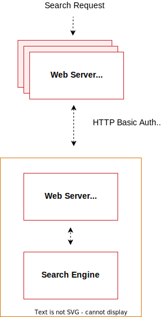

# 検索エンジンの前提条件

Adobe Commerce 2.4以降、すべてのインストールでは、カタログ検索ソリューションとして[Elasticsearch](https://www.elastic.co)または[OpenSearch](https://opensearch.org/)を使用するように設定する必要があります。

>[!NOTE]
>
>OpenSearchのサポートは2.4.4で追加されました。 OpenSearchはElasticsearchの互換性のあるフォークです。 Elasticsearch 7を設定する手順はすべて、OpenSearchに適用されます。 [ElasticsearchからOpenSearchへの移行](../../../upgrade/prepare/opensearch-migration.md)は、OpenSearchへの切り替えに関するガイダンスを提供します。

## サポートされているバージョン

Adobe Commerce 2.4.4以降をインストールする前に、ElasticsearchまたはOpenSearchのいずれかをインストールして設定する必要があります。

特定のバージョン情報については、[必要システム構成](../../system-requirements.md)を参照してください。

## 推奨される設定

推奨事項は次のとおりです。

* [検索エンジン用にnginxを設定する](configure-nginx.md)
* [検索エンジン用のApacheの設定](configure-apache.md)

## インストールの場所

次のタスクは、次の図に従ってシステムを設定したことを前提としています。



上の図は、次の図を示しています。

* Commerce アプリケーションと検索エンジンは、異なるホストにインストールされます。

  別々のホストで実行するには、プロキシが機能する必要があります。 （検索エンジンのクラスタリングは、このガイドの範囲を超えていますが、詳しくは、[Elasticsearch クラスタリングに関するドキュメント &#x200B;](https://www.elastic.co/guide/en/elasticsearch/guide/current/distributed-cluster.html)を参照してください）。

* 各ホストは独自のWeb サーバーを持っています。Web サーバーは同じである必要はありません。

  例えば、Commerce アプリケーションはApacheを実行でき、検索エンジンはnginxを実行できます。

* どちらのweb サーバーもTransport Layer Security （TLS）を使用します。

  TLSの設定は、ドキュメントの範囲を超えています。

検索リクエストは次のように処理されます。

1. 利用者からの検索リクエストは、Commerceウェブサーバによって受信され、検索エンジンサーバに転送される。

   検索エンジンを設定して、プロキシのホストとポートに接続します。 Web サーバーのSSL ポート（デフォルトでは443）をお勧めします。

1. 検索エンジン web サーバー（ポート 443でリッスン）は、リクエストを検索エンジン サーバーにプロキシします（デフォルトでは、ポート 9200でリッスンします）。

1. 検索エンジンへのアクセスは、HTTP Basic認証によってさらに保護されます。 検索エンジンにアクセスするには、有効なユーザー名とパスワードを入力してSSL *および*&#x200B;経由で送信する必要があります。

1. 検索エンジンはリクエストを処理します。

1. 通信は同じルートに沿って返され、Elasticsearch web サーバーは安全なリバースプロキシとして機能します。

## 前提条件

この節で説明するタスクでは、次の操作が必要です。

* [ファイアウォールとSELinux](#firewall-and-selinux)
* [Java Software Development Kit （JDK）のインストール](#install-the-java-software-development-kit)
* [検索エンジンのインストール](#install-the-search-engine)
* [Elasticsearchのアップグレード](#upgrading-elasticsearch)

### ファイアウォールとSELinux

セキュリティ関連のソフトウェア（iptables、SELinux、AppArmor）は、サブシステム間の通信をブロックするようにデフォルトで設定できます。 問題がある場合は、それらを確認することをお勧めします。

#### iptablesとSELinuxのルールの設定

ファイアウォールまたはSELinuxを有効にして通信を許可するルールを設定するには、次のリソースを参照してください。

* [iptablesの使い方](https://help.ubuntu.com/community/IptablesHowTo)
* [iptables ルールの編集方法（fedora プロジェクト）](https://fedoraproject.org/wiki/How_to_edit_iptables_rules)
* [SELinuxの概要（CentOS.org）](https://www.centos.org)
* [SELinux ハウツーWiki （CentOS.org）](https://wiki.centos.org/HowTos/SELinux)

### Java Software Development Kitのインストール

Javaが既にインストールされているかどうかを確認するには、次のコマンドを入力します。

```shell
java -version
```

メッセージ `java: command not found`が表示された場合は、次の節で説明するようにJava SDKをインストールする必要があります。

次のいずれかのセクションを参照してください。

* [CentOSに最新のJDKをインストールする](#install-the-jdk-on-centos)
* [最新のJDKをUbuntuにインストールする](#install-the-jdk-on-ubuntu)

#### CentOSへのJDKのインストール

この[Digital Ocean チュートリアル &#x200B;](https://www.digitalocean.com/community/tutorials/how-to-install-java-on-centos-and-fedora#install-oracle-java-8)を参照してください。

JDKと&#x200B;*not* the JREをインストールしてください。

```shell
yum -y install java-1.8.0-openjdk
```

>[!NOTE]
>
>Java バージョン 8は、すべてのオペレーティングシステムで使用できない場合があります。 例えば、[Ubuntu](https://packages.ubuntu.com/)で使用可能なパッケージのリストを検索できます。

#### UbuntuへのJDKのインストール

UbuntuにJDK 1.8をインストールするには、`root`権限を持つユーザーとして次のコマンドを入力します。

```shell
apt-get -y update
```

```shell
apt-get install -y openjdk-8-jdk
```

その他のオプションについては、[Oracle ドキュメント &#x200B;](https://docs.oracle.com/javase/8/docs/technotes/guides/install/install_overview.html)を参照してください。

### 検索エンジンのインストール

プラットフォーム固有の手順に応じて、[Elasticsearchのインストール &#x200B;](https://www.elastic.co/guide/en/elasticsearch/reference/current/install-elasticsearch.html)または[OpenSearch](https://opensearch.org/docs/latest/opensearch/install/index/)をインストールして設定します。

Elasticsearchが動作していることを確認するには、実行中のサーバーで次のコマンドを入力します。

```shell
curl -XGET '<host>:9200/_cat/health?v&pretty'
```

次のようなメッセージが表示されます。

```text
epoch      timestamp cluster       status node.total node.data shards pri relo init unassign pending_tasks
1519701563 03:19:23  elasticsearch green           1         1      0   0    0    0        0             0
```

OpenSearchが機能していることを確認するには、次のコマンドを入力します。

```shell
curl -XGET https://<host>:9200 -u 'admin:admin' --insecure
```

```shell
curl -XGET https://<host>:9200/_cat/plugins?v -u 'admin:admin' --insecure
```

## Elasticsearchのアップグレード

データのバックアップ、潜在的な移行の問題の検出、実稼動環境にデプロイする前のアップグレードのテストについて詳しくは、[Elasticsearchのアップグレード &#x200B;](https://www.elastic.co/guide/en/elasticsearch/reference/current/setup-upgrade.html)を参照してください。 現在のバージョンのElasticsearchによっては、クラスター全体の再起動が必要な場合とそうでない場合があります。

ElasticsearchにはJDK 1.8以降が必要です。 [Java ソフトウェア開発キットのインストール &#x200B;](#install-the-java-software-development-kit)を参照して、どのバージョンのJDKがインストールされているかを確認してください。

## 関連資料

[Elasticsearch](https://www.elastic.co/guide/en/elasticsearch/reference/current/index.html)または[OpenSearch](https://opensearch.org/docs/latest/)のドキュメントを参照してください。
