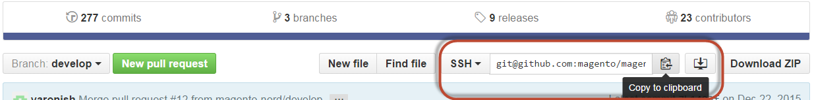
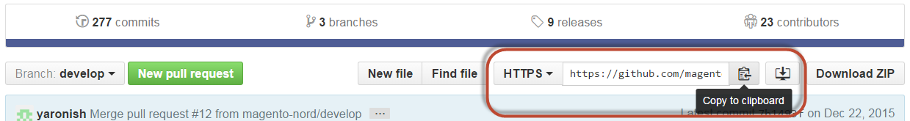

# サンプルデータ Git リポジトリのクローン

このトピックでは、Magento Open Source GitHub リポジトリをクローンした場合にサンプルデータをクローンして追加する方法について説明します。 このメソッドは、コントリビューター（つまり、Magento Open Source コードベースへのコントリビューター）のみを対象としています。

貢献開発者でない場合は、ページの左側にある目次に表示される他のオプションのいずれかを選択します。

次の条件に当てはまる場合、コントリビューターは、サンプルデータ *のみ*&#x200B;をインストールするこの方法を使用できます。

* Magento Open Sourceや
* あなたは[GitHub リポジトリを複製しました](https://developer.adobe.com/commerce/contributor/guides/install/clone-repository)

>[!WARNING]
>
>サンプルデータは、`develop` ブランチ （より最新）またはリリース済みのブランチ （`2.4` （より安定）のいずれかで使用できます。 より安定したリリース済みのブランチを使用することをお勧めします。 リポジトリにコードを提供していて、最新のコードが必要な場合は、`develop` ブランチを使用します。 選択したブランチに関係なく、Magento Open Source GitHub リポジトリの対応するブランチを[ クローン ](https://developer.adobe.com/commerce/contributor/guides/install/clone-repository)する必要があります。 例えば、`develop` ブランチのサンプルデータは、Magento Open Source `develop` ブランチで&#x200B;*only*&#x200B;使用できます。

## サンプルデータリポジトリを複製する

この節では、サンプルデータリポジトリを複製してサンプルデータをインストールする方法について説明します。 サンプルデータリポジトリは、次のいずれかの方法で複製できます。

* [SSH プロトコル ](#clone-with-ssh)を使用したクローン
* [HTTPS プロトコル ](#clone-with-https)を使用して複製

### SSHによるクローン作成

SSH プロトコルを使用してサンプルデータ GitHub リポジトリを複製するには、次の手順を実行します。

1. Web ブラウザーで、[ サンプルデータリポジトリ ](https://github.com/magento/magento2-sample-data)に移動します。
1. ブランチの名前の横にある、リストから&#x200B;**SSH**&#x200B;をクリックします。
1. 「**クリップボードにコピー**」をクリックします

   次の図は、例を示しています。

   を使用してGitHub リポジトリを複製する

1. Web サーバーのdocroot ディレクトリに変更します。

   通常、Ubuntuでは`/var/www`、CentOSでは`/var/www/html`です。

1. `git clone`を入力し、以前に取得した値を貼り付けます。

   例は次のとおりです。

   ```shell
   git clone git@github.com:magento/magento2-sample-data.git
   ```

1. リポジトリがサーバー上で複製されるのを待ちます。

   >[!NOTE]
   >
   >次のエラーが表示される場合は、[SSH キー](https://docs.github.com/articles/generating-ssh-keys/)をGitHubと共有していることを確認してください：<br>

   ```text
   Cloning into 'magento2'...
   Permission denied (publickey).
   fatal: The remote end hung up unexpectedly
   ```

1. メインの`magento2` リポジトリから使用したブランチに対応するサンプルデータリポジトリのブランチをチェックアウトしてください。

   例：

   Magento Open Source GitHub リポジトリの`2.4-develop` ブランチを使用した場合、サンプルデータブランチは`2.4-develop`である必要があります。

   正しいブランチをチェックアウトするには、サンプルデータリポジトリのルートディレクトリから次のコマンドを実行します（`2.4-develop` ブランチが必要な場合）。

   ```shell
   git checkout 2.4-develop
   ```

1. `<app_root>`に変更します。
1. 次のコマンドを入力して、サンプルデータが適切に機能するように、複製したファイル間にシンボリックリンクを作成します。

   ```shell
   php -f <sample-data_clone_dir>/dev/tools/build-sample-data.php -- --ce-source="<path_to_your_magento_instance>"
   ```

1. コマンドが完了するのを待ちます。

1. [ ファイルシステムの権限と所有権の設定](#set-file-system-ownership-and-permissions)を参照してください。

1. 次のコマンドを実行します。

   ```shell
   bin/magento setup:upgrade
   ```

### HTTPSを使用した複製

HTTPS プロトコルを使用してサンプルデータ GitHub リポジトリを複製するには、次の手順を実行します。

1. Web ブラウザーで、[ サンプルデータリポジトリ ](https://github.com/magento/magento2-sample-data)に移動します。
1. ページの右側の&#x200B;**クローン URL** フィールドで、**HTTPS**&#x200B;をクリックします。
1. 「**クリップボードにコピー**」をクリックします。

   次の図は、例を示しています。

   を使用してGitHub リポジトリを複製する

1. Web サーバーのdocroot ディレクトリに変更します。

   通常、Ubuntuでは`/var/www`、CentOSでは`/var/www/html`です。

1. `git clone`を入力し、以前に取得した値を貼り付けます。

   例は次のとおりです。

   ```shell
   git clone https://github.com/magento/magento2-sample-data.git
   ```

1. リポジトリがサーバー上で複製されるのを待ちます。
1. メインの`magento2` リポジトリから使用したブランチに対応するサンプルデータリポジトリのブランチをチェックアウトしてください。

   例：

   Magento Open Source GitHub リポジトリの`2.4-develop` ブランチを使用した場合、サンプルデータブランチは`2.4-develop`である必要があります。

   正しいブランチをチェックアウトするには、サンプルデータリポジトリのルートディレクトリから次のコマンドを実行します（`2.4-develop` ブランチが必要な場合）。

   ```shell
   git checkout 2.4-develop
   ```

1. `<magento_root>`に変更します。
1. 次のコマンドを入力して、サンプルデータが適切に機能するように、複製したファイル間にシンボリックリンクを作成します。

   ```shell
   php -f <sample-data_clone_dir>/dev/tools/build-sample-data.php -- --ce-source="<path_to_your_magento_instance>"
   ```

   以下に例を挙げます。

   ```shell
   php -f <sample-data_clone_dir>/dev/tools/build-sample-data.php -- --ce-source="/var/www/magento2"
   ```

1. コマンドが完了するのを待ちます。
1. 次の節を参照してください。

>[!WARNING]
>
>Adobe Commerceをインストールした後&#x200B;*にサンプルデータ*&#x200B;をインストールする場合は、次のコマンドを実行してデータベースとスキーマを更新する必要があります。
>
>```shell
><magento_root>/bin/magento setup:upgrade
>```

## ファイルシステムの所有権と権限の設定

`php build-sample-data.php` スクリプトはサンプルデータリポジトリとMagento Open Source リポジトリの間にシンボリックリンクを作成するので、サンプルデータリポジトリにファイルシステムの権限と所有権を設定する必要があります。 これを怠ると、ストアフロントへのアクセスにエラーが発生します。

サンプルデータリポジトリにファイルシステムの権限と所有権を設定するには：

1. サンプルデータコピーディレクトリに変更します。
1. 所有権の設定：

   ```shell
   chown -R :<your web server group name> .
   ```

   典型的な例：

   * CentOS: `chown -R :apache .`

   * Ubuntu: `chown -R :www-data .`

1. 権限の設定：

   ```shell
   find . -type d -exec chmod g+ws {} +
   ```

1. 静的ファイルを消去：

   ```shell
   cd <your Magento Open Source install dir>
   ```

   ```shell
   rm -rf var/cache/* var/page_cache/* generated/*
   ```

## サンプルデータのインストールを完了します

{{$include /help/_includes/sample-data-complete.md}}

<!-- Last updated from includes: 2022-09-08 11:33:05 -->
