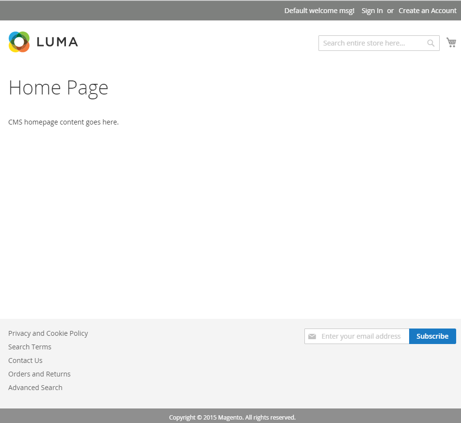
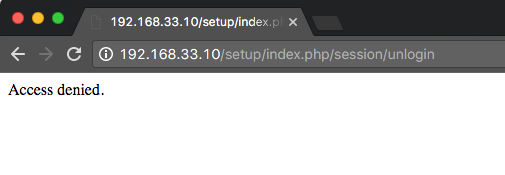

# セキュリティを向上させるためにdocrootを変更する

Apache web サーバーを使用した標準インストールでは、Adobe Commerceがデフォルトのweb ルート `/var/www/html/magento2`にインストールされます。

`magento2/` ディレクトリには次のものが含まれています。

- `pub/`
- `setup/`
- `var/`

アプリケーションは`/var/www/html/magento2/pub`から提供されます。 ファイルシステムの残りの部分は、ブラウザーからアクセスできるので脆弱です。
webrootを`pub/` ディレクトリに設定すると、サイト訪問者はブラウザーからファイルシステムの機密領域にアクセスできなくなります。

このトピックでは、既存のインスタンスのApache docrootを変更して、より安全な`pub/` ディレクトリからファイルを提供する方法について説明します。

## nginxに関するメモ

[nginx](../prerequisites/web-server/nginx.md)と、インストールディレクトリに含まれる[`nginx.conf.sample`](https://github.com/magento/magento2/blob/2.4/nginx.conf.sample) ファイルを使用している場合は、おそらく既に`pub/` ディレクトリのファイルを提供しています。

サイトを定義するサーバーブロックで使用する場合、`nginx.conf.sample`設定は、サーバーのdocroot設定を上書きして、`pub/` ディレクトリからファイルを提供します。 例えば、次の設定の最終行を参照してください。

```conf
# /etc/nginx/sites-available/magento

upstream fastcgi_backend {
   server  unix:/run/php/php7.4-fpm.sock;
}

server {

         listen 80;
         server_name 192.168.33.10;
         set $MAGE_ROOT /var/www/html/magento2ce;
         include /var/www/html/magento2ce/nginx.conf.sample;
}
```

## 始める前に

このチュートリアルを完了するには、LAMP スタックで動作する作業用インストールにアクセスする必要があります。

- Linux
- Apache （2.4以降）
- MySQL （5.7以降）
- PHP （7.4）
- Elasticsearch（7.x）またはOpenSearch （1.2）
- Adobe Commerce（2.4以降）

>[!NOTE]
>
>詳しくは、[前提条件](../prerequisites/overview.md)および[&#x200B; インストールガイド &#x200B;](../overview.md)を参照してください。

## &#x200B;1. サーバー設定の編集

仮想ホストファイルの名前と場所は、実行しているApacheのバージョンによって異なります。 この例は、Apache v2.4上の仮想ホストファイルの名前と場所を示しています。

1. アプリケーションサーバーにログインします。
1. 仮想ホストファイルを編集します。

   ```shell
   vim /etc/apache2/sites-available/000-default.conf
   ```

1. `pub/` ディレクトリへのパスを`DocumentRoot` ディレクティブに追加します。

   ```conf
   <VirtualHost *:80>
   
            ServerAdmin webmaster@localhost
            DocumentRoot /var/www/html/magento2ce/pub
   
            ErrorLog ${APACHE_LOG_DIR}/error.log
            CustomLog ${APACHE_LOG_DIR}/access.log combined
   
            <Directory "/var/www/html">
                        AllowOverride all
            </Directory>
    </VirtualHost>
   ```

1. Apacheを再起動します。

   ```shell
   systemctl restart apache2
   ```

## &#x200B;2. ベース URLを更新

アプリケーションのインストール時にベース URLを作成するためにサーバーのホスト名またはIP アドレスにディレクトリ名を追加した場合（例：`http://192.168.33.10/magento2`）、そのディレクトリ名を削除する必要があります。

>[!NOTE]
>
>`192.168.33.10`をサーバーのホスト名に置き換えます。

1. データベースにログインします。

   ```shell
   mysql -u <user> -p
   ```

1. アプリケーションのインストール時に作成したデータベースを指定します。

   ```shell
   use <database-name>
   ```

1. ベース URLを更新します。

   ```shell
   UPDATE core_config_data SET value='http://192.168.33.10' WHERE path='web/unsecure/base_url';
   ```

## &#x200B;3. env.php ファイルを更新する

次のノードを`env.php` ファイルに追加します。

```conf
'directories' => [
    'document_root_is_pub' => true
]
```

詳しくは、[env.php リファレンス &#x200B;](../../configuration/reference/config-reference-envphp.md)を参照してください。

## &#x200B;4. モードを切り替え

`production`と`developer`を含む[&#x200B; アプリケーションモード &#x200B;](../../configuration/bootstrap/application-modes.md)は、セキュリティを向上させ、開発を容易にするために設計されています。 名前が示すように、アプリケーションを拡張またはカスタマイズする場合は`developer` モードに切り替え、ライブ環境で実行する場合は`production` モードに切り替える必要があります。

モードの切り替えは、サーバー設定が正しく動作していることを確認する際に重要な手順です。 CLI ツールを使用してモードを切り替えることができます。

1. インストールディレクトリに移動します。
1. `production` モードに切り替えます。

   ```shell
   bin/magento deploy:mode:set production
   ```

   ```shell
   bin/magento cache:flush
   ```

1. ブラウザーを更新し、ストアフロントが正しく表示されることを確認します。
1. `developer` モードに切り替えます。

   ```shell
   bin/magento deploy:mode:set developer
   ```

   ```shell
   bin/magento cache:flush
   ```

1. ブラウザーを更新し、ストアフロントが正しく表示されることを確認します。

## &#x200B;5. ストアフロントの検証

web ブラウザーのストアフロントに移動し、すべてが機能していることを確認します。

1. Web ブラウザーを開き、アドレスバーにサーバーのホスト名またはIP アドレスを入力します。 例：`http://192.168.33.10`。

   次の図は、ストアフロントページの例を示しています。 次のように表示される場合、インストールは成功しました。

   

   ページに404 （見つかりません）が表示されたり、画像、CSS、JSなどの他のアセットが読み込まれない場合は、[&#x200B; トラブルシューティングの節](https://support.magento.com/hc/en-us/articles/360032994352)を参照してください。

1. ブラウザーからアプリケーションディレクトリにアクセスしてみてください。 アドレスバーのサーバーのホスト名またはIP アドレスにディレクトリ名を追加します。

   404または「アクセス拒否」メッセージが表示された場合は、ファイルシステムへのアクセスが正常に制限されています。

   
