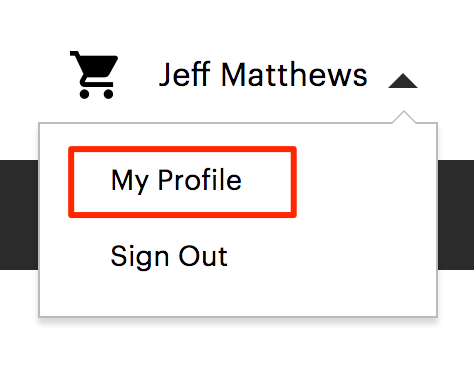
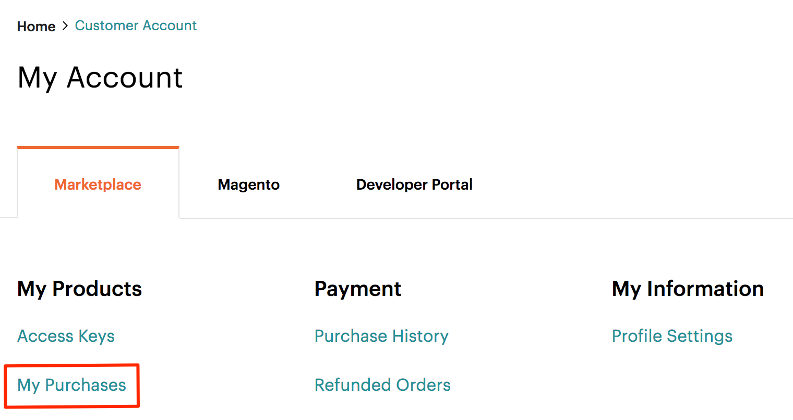
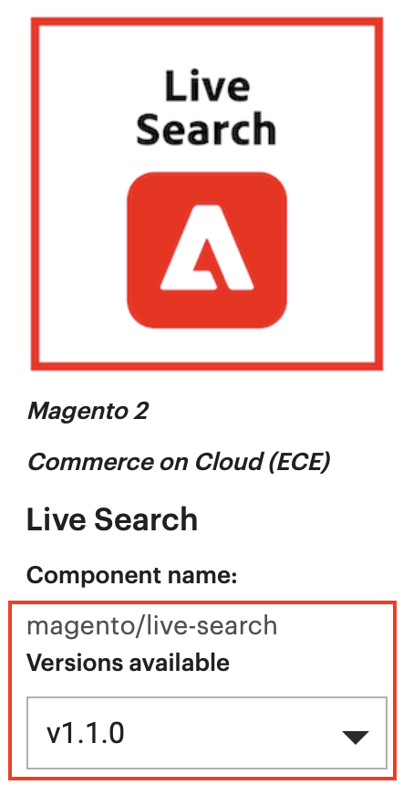

# サードパーティ製の拡張機能を管理

Adobe Commerce ビヘイビアーを拡張またはカスタマイズするコードは、拡張機能と呼ばれます。 オプションで、[Commerce Marketplace](https://commercemarketplace.adobe.com/)またはその他の拡張機能ディストリビューションシステムに拡張機能をパッケージ化して配布できます。

拡張機能には次のものが含まれます。

- モジュール（Adobe Commerceの機能を拡張）
- テーマ（ストアフロントと管理者のルック&amp;フィールの変更）
- 言語パッケージ（ストアフロントと管理者のローカライズ）

このトピックでは、コマンドラインインターフェイスを使用して、_オンプレミス_ プロジェクト用にCommerce Marketplaceから購入したサードパーティ製の拡張機能を管理する方法について説明します。 クラウドインフラプロジェクトについては、[拡張機能の管理](https://experienceleague.adobe.com/en/docs/commerce-cloud-service/user-guide/configure-store/extensions)を参照してください。

同じ手順で&#x200B;_any_&#x200B;拡張機能をインストールできます。必要なのは、拡張機能のコンポーザー名とバージョンだけです。 見つけるには、拡張機能の`composer.json` ファイルを開き、`"name"`と`"version"`の値を書き留めます。

## インストール

インストールの前に、次のことをおこなう必要があります。

1. データベースをバックアップします。
1. メンテナンスモードを有効にする：

   ```shell
   bin/magento maintenance:enable
   ```

拡張機能をインストールするには、次の操作を行う必要があります。

1. Commerce Marketplaceまたはその他の拡張機能の開発者から拡張機能を取得します。
1. Commerce Marketplaceから拡張機能をインストールする場合は、`repo.magento.com` リポジトリが`composer.json` ファイルに存在することを確認します。

   ```shell
   "repositories": [
       {
           "type": "composer",
           "url": "https://repo.magento.com/"
       }
   ]
   ```

1. 拡張機能のコンポーザー名とバージョンを取得します。
1. プロジェクト内の`composer.json` ファイルを、拡張機能の名前とバージョンで更新します。
1. 拡張機能が正しくインストールされていることを確認します。
1. 拡張機能を有効にして設定します。

### 拡張機能を確認

拡張機能のコンポーザー名とバージョンを既に知っている場合は、この手順をスキップして、[`composer.json` ファイルの更新](#update-composer-dependencies)を続行します。

Commerce Marketplaceから拡張機能のコンポーザー名とバージョンを取得するには：

1. 拡張機能の購入に使用したユーザー名とパスワードで[Commerce Marketplace](https://commercemarketplace.adobe.com/)にログインします。

1. 右上隅で、**自分の名前** > **自分のプロファイル**&#x200B;をクリックします。

   

1. 「**購入履歴**」をクリックします。

   

1. インストールする拡張機能を見つけ、コンポーネント名とバージョンをメモします。

   

>[!TIP]
>
>または、拡張機能の`composer.json` ファイルに、_any_&#x200B;拡張機能のコンポーザー名とバージョン （Commerce Marketplaceまたは他の場所で購入した拡張機能）を見つけることができます。

### コンポーザーの依存関係を更新

拡張機能の名前とバージョンを`composer.json` ファイルに追加します。

1. プロジェクト ディレクトリに移動し、`composer.json` ファイルを更新します。

   ```shell
   composer require <component-name>:<version>
   ```

   以下に例を挙げます。

   ```shell
   composer require j2t/module-payplug:2.0.2
   ```

1. [認証キー](../prerequisites/authentication-keys.md)を入力します。 公開鍵はユーザー名、秘密鍵はパスワードです。

1. Composerがプロジェクトの依存関係の更新を完了するのを待ち、エラーがないことを確認します。

   ```text
   Updating dependencies (including require-dev)
   Package operations: 1 install, 0 updates, 0 removals
     - Installing j2t/module-payplug (2.0.2): Downloading (100%)
   Writing lock file
   Generating autoload files
   ```

### インストールを確認

拡張機能が正しくインストールされていることを確認するには、次のコマンドを実行します。

```shell
bin/magento module:status J2t_Payplug
```

デフォルトでは、拡張機能はおそらく無効になっています。

```text
Module is disabled
```

拡張機能の名前の形式は`<VendorName>_<ComponentName>`です。これは、コンポーザー名とは異なる形式です。 この形式を使用して、拡張機能を有効にします。 拡張機能の名前がわからない場合は、次を実行します。

```shell
bin/magento module:status
```

「無効なモジュールのリスト」の下にある拡張機能を探します。

### 有効にする

最初に生成された静的ビューファイルをクリアしない限り、一部の拡張機能は正しく機能しません。 拡張機能を有効にする際に`--clear-static-content` オプションを使用して、静的ビューファイルをクリアします。

1. 拡張機能を有効にし、静的ビューファイルをクリアします。

   ```shell
   bin/magento module:enable J2t_Payplug --clear-static-content
   ```

   次の出力が表示されます。

   ```text
   The following modules have been enabled:
   - J2t_Payplug
   
   To make sure that the enabled modules are properly registered, run 'setup:upgrade'.
   Cache cleared successfully.
   Generated classes cleared successfully. Please run the 'setup:di:compile' command to generate classes.
   Generated static view files cleared successfully.
   ```

1. 拡張機能を登録：

   ```shell
   bin/magento setup:upgrade
   ```

1. プロジェクトを再コンパイルする：実稼動モードでは、「Magento コンパイルコマンドを再実行してください」というメッセージが表示されることがあります。 アプリケーションは、開発者モードでコンパイルコマンドを実行するように求めるプロンプトを表示しません。

   ```shell
   bin/magento setup:di:compile
   ```

1. 拡張機能が有効になっていることを確認します。

   ```shell
   bin/magento module:status J2t_Payplug
   ```

   拡張機能が無効になっていないことを確認する出力が表示されます。

   ```text
   Module is enabled
   ```

1. キャッシュをクリーニングします。

   ```shell
   bin/magento cache:clean
   ```

1. 必要に応じて、Adminで拡張機能を設定します。

>[!TIP]
>
>ブラウザーでストアフロントを読み込む際にエラーが発生した場合は、次のコマンドを使用してキャッシュをクリアします：`bin/magento cache:flush`。

## アップグレード

モジュールまたは拡張機能を更新またはアップグレードするには：

1. Marketplaceまたは別の拡張機能の開発者から更新されたファイルをダウンロードします。 モジュール名とバージョンをメモします。

1. コンテンツをアプリケーションルートディレクトリに書き出します。

1. モジュールにComposer パッケージが存在する場合は、次のいずれかを実行します。

   モジュール名ごとに更新：

   ```shell
   composer update vendor/module-name
   ```

   バージョンごとに更新：

   ```shell
   composer require vendor/module-name ^x.x.x
   ```

1. 次のコマンドを実行して、キャッシュをアップグレード、デプロイ、クリーニングします。

   ```shell
   bin/magento setup:upgrade --keep-generated
   ```

   ```shell
   bin/magento setup:static-content:deploy
   ```

   ```shell
   bin/magento cache:clean
   ```

## アンインストール

サードパーティの拡張機能を削除する手順については、拡張機能ベンダーにお問い合わせください。 手順では、次の情報を提供する必要があります。

- データベーステーブルの変更を元に戻す方法
- データベースデータの変更を元に戻す方法
- 削除または元に戻すファイル

>[!CAUTION]
>
>実稼動以外の環境&#x200B;_first_&#x200B;でアンインストール手順を実行し、実稼動環境にデプロイする前に徹底的にテストします。

サードパーティの拡張機能のアンインストールに関する一般的な情報については、次の手順を参照してください。

1. Adobe Commerce プロジェクトリポジトリから拡張機能を削除します。

   - Composer ベースの拡張機能の場合は、Adobe Commerce `composer.json` ファイルから拡張機能を削除します。

     ```shell
     composer remove <component-name>
     ```

   - Composer ベース以外の拡張機能の場合は、Adobe Commerce プロジェクトリポジトリから物理ファイルを削除します。

     ```shell
     rm -rf app/code/<vendor-name>/<component-name>
     ```

1. `config.php` ファイルがAdobe Commerce プロジェクト リポジトリのソース管理下にある場合は、`config.php` ファイルから拡張機能を削除します。

1. ローカルデータベースをテストして、ベンダーから提供された指示が期待どおりに動作することを確認します。

1. 拡張機能が適切に無効になっており、web サイトがステージング環境で期待どおりに動作することを確認します。

1. 本番環境に変更をデプロイします。
