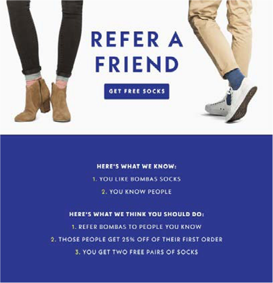

# 電子メールマーケティング

電子メールマーケティング（簡単に言うと）は、製品を宣伝、引き付け、顧客に販売するための電子メールを通じて、リードおよび現在の顧客にマーケティングメッセージを送信します。 マーケティングチームは、顧客情報の取得と、ダイレクトメールキャンペーンを通じたパーソナライズされたコンテンツの送信を完全にコントロールできます。 E メールは、顧客とブランドの間の関係を構築するのに役立つツールとして機能します。

電子メールマーケティングを検討する理由：

- 現在および将来の顧客との関係を構築できます

- 売上の促進とコンバージョン率の向上に役立つ

- ビジネスの成長を促進

- instagramやFacebookなどのサードパーティは不要

## お知らせメール

最後の印象を作ることは、e コマースビジネスで不可欠です。 新規顧客に最初に送信する E メールが有効な場合、顧客のメモリに永続的なインプレッションが残されます。 デザインをシンプルでオリジナルな状態に保つようにします。 例えば、一部のブランドでは、顧客が新規登録すると E メールに割引が適用されます。

## キュレートされた E メール

キュレーションされた電子メールは、購読者が製品に関する詳細情報を入手できる、最適な電子メール形式の 1 つです。 また、顧客セグメントに基づいてキュレーションされた E メールを送信することもできます。

## エンゲージメントメール

顧客は簡単に E メールを見落とすことができますが、E メールがエンゲージメント E メールとして送信された場合、顧客が E メールを見ずに削除する確率は低くなります。 エンゲージメント E メールは、送料無料などのプロモーションをユーザーに提供するキャンペーンの形式で作成できます。

## 紹介 E メール

口コミは、最高のマーケティング戦略の 1 つです。 例えば、紹介 E メールを既存の顧客に送信するなどです。 例えば、「友達を紹介して 10 ドルを受け取る」とします。 紹介 E メールは、顧客がより多くの顧客を得るのに役立つ、という言葉を有機的に広める動機を与えます。

## 割引メール

E メールを通じた割引の提供は、効果的なマーケティング戦略です。 購読者の忠誠度を保つために、割引を提供する必要があります。

## 中断メール

顧客は、高い送料や満足のいかない返品ポリシーなど、様々な理由で買い物かごを放棄します。 買い物かごに残した商品に関するリマインダーの電子メールを送信することで、顧客を成功した買い物客に変換できます。 さらに、無料、割引、次回の購入に対する割引券など、チェックアウトを完了するためのインセンティブを提供できます。 これにより、コンバージョン率を高めることができます。

## 注文確認 E メール

注文確認メールは、売上を押し上げるだけでなく、顧客に注文をしたという自信を与え、顧客体験と忠誠度を高めます。

## 調査の E メール

顧客が注文を受け取ったら、フォローアップ調査の電子メールを送信して、改善の経験や提案を尋ねる必要があります。 また、調査を完了した場合、顧客が調査を完了したときにはギフト券を提供する店もあります。これは、顧客が調査を完了したときに、調査を完了する動機がないためです。

