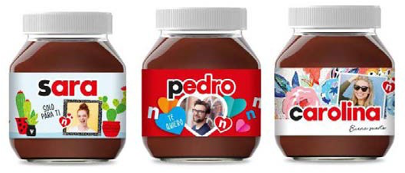

# パーソナライズ

e コマースビジネスの成長のベースラインは、顧客の忠誠度です。 顧客を幸せに保つことは、製品、コンテンツ、チェックアウト、顧客、サービスの経験から得られる多くの要素の組み合わせです。 パーソナライゼーションは AI に依存し、AI は顧客情報をリアルタイムで追跡し、パーソナライズされた独自のエクスペリエンスを提供します。 パーソナライゼーションは、あらゆる種類のビジネスで機能するとは限りませんが、サイトへのトラフィックを促進するのに役立つ追加機能です。

パーソナライゼーションには、以下が含まれます。

- お客様のニーズに応える

- 顧客の履歴に基づいて、適切な製品レコメンデーションを提供する

- 顧客と製品のセグメント化

## 例

パーソナライゼーションの例を次に示します。

- **顧客の関心** — 顧客プロファイルに基づいてホームページとナビゲーションを変更します。 例えば、ユーザーが以前にサイトを訪問し、女性のセクションを調査した場合、次に URL を入力したときに、女性のホームページに移動します。

- **推奨製品** — 顧客の閲覧行動に基づいて製品をレコメンデーションします。

- **検索** — 以前の検索動作に基づいて、パーソナライズされた検索結果を表示します。

- **電子メール** — 顧客が買い物かごに品目を入れていない場合や、製品が在庫切れの場合は、在庫が再び入ったときに通知を送信する、製品に関するパーソナライズされた E メールを送信します。

- **位置情報** — サイトの複数の位置情報を表示します。 例えば、顧客が AU サイトを訪問したが、顧客が選択できるように、米国のサイトオプションも表示される。

- **割引コード** — 特定のカテゴリの製品をプロモーションするために、特定のカテゴリの割引コードを表示します。

- **補完製品** — 顧客が製品を訪問した際に、補完製品を表示します。 例えば、顧客がドレスを見て、ドレスに合った靴、バッグ、アクセサリーなどの無料製品を見ることができます。

- **パーソナライズされたホームページ** — 登録ユーザー向けにパーソナライズされたホームページを表示し、ユーザーにとって特別な印象を与えます。

これらはパーソナライゼーションのほんの一例です。 ビジネスの要件に応じて調査できる機能は、数え切れないほど多くあります。 常に変化する市場動向に追いつくのは難しいことですが、全体的な顧客体験の向上に役立ちます。
