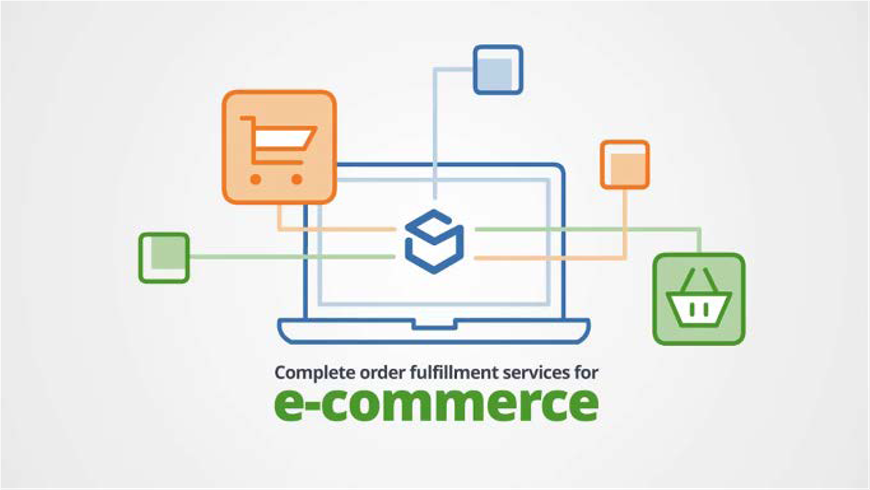

# 発送と受渡

顧客に最高のオンラインエクスペリエンスを提供することに多くの取り組みが進められています。 物事の物理的な面では、小売業者は出荷の重要性を見落とすべきではありません。 送料は第三者に渡すことはできません。 研究、計画、分析を行う必要があります。 これが、カスタマーエクスペリエンスジャーニーの最後のポイントです。そのため、配送と達成を適切におこなう必要があります。

## 基本的な要因

出荷と達成には、次のような基盤として機能するいくつかの基本的な要素があります。

- **発送方法とコスト** — 企業は、輸送コスト全体を分析および分割し、輸送コストの吸収、顧客へのコストの引き渡し、またはコストの共有を決定する必要がありますか？ ビジネスは、無料の送料または配送料のオファーを提供しますか？ 製品はどのように発送されますか？ 送料と配送料が複数ありますか？

- **製品** — 商品の数、重さ、目的地、耐久性によって製品が異なります。 異なる製品は異なる送料を持つので、企業はこれらの詳細を分析して、送料の合計コストを理解する必要があります。

- **パッケージ** — パッケージングは、輸送方法とコストの理解にも重要な役割を果たします。 例えば、製品は壊れやすいものですか、それともギフトとして梱包されているのですか。

- **シーズン** — クリックの狂乱や祭りなど、季節のピーク時にどのような変化がもたらされるか。

- **通信事業者** — どのサードパーティ製船会社がビジネスに最適ですか？ 海運会社が提供するサービスは何ですか？ 費用はいくらですか。

## 発送方法

商品を出荷する前に、会社は発送方法とコストを決める必要があります。 発送方法には、次のような様々なオプションがあります。

- **送料無料** — 無料配送をお客様に提供することが、最適な顧客体験ではあるが、ビジネスに適さない場合があります。

- **リアルタイムレート** — サードパーティの出荷プロバイダーと連携して、小売業者は、現在配送会社が請求している配送方法とコストを投稿できます。 これにより、顧客は希望する発送方法を選択できます。

- **定額料金** — 最も人気のある出荷オプションの 1 つ。 ここでのトリックは、小売業者が顧客に過剰な料金や過少な料金をかけないようにすることです。 これは、小売業者が標準製品を持っている場合にも機能しますが、小売業者が様々な製品を持っている場合は複雑になる可能性があります。

- **送料の額を超える無料** — 顧客が一定額を超えて購入した場合、小売業者は無料で配送を提供できます。 小売業者は、このサービスを提供するためにその金額を計算する必要があります。

出荷と達成には、社内と社外の両方のチームの調整が必要です。 出荷および履行戦略を組織全体と共有して、それらを調整する必要があります。 例えば、マーケティングチームが送料無料を含むプロモーションを送信したい場合、送料と受渡しの戦略とチームに合わせて、顧客の負の体験をなくす必要があります。

## ベストプラクティス

出荷および履行戦略を決定する際は、次のベストプラクティスを使用します。

- 適切なスキルを持つ適切な担当者と適切なチームを組み立てる
- 従うチームの目標を設定しています
- ビジネスのニーズに最適な適切な出荷戦略の選択
- 方法の確認と必要に応じた繰り返し

## B2B と B2C

次の表に、B2B と B2C の出荷と履行の違いを示します。

| B2B | B2C |
|----------------------------------------------------------------------------------------------|------------------------------------------------------|
| 費用と数量が関係するので、達成と出荷の完了に時間がかかります | 同じ日の送料や送料を無料にできます。 |
| ビジネスとクライアントの間の 1 つの接続で 1 つが必要 | 通常、短期の関係 |
| 通常、長期の関係 | ビジネスは、顧客を保持するためのロイヤルティカードを提供します |
| プロセスは長く、複雑にすることができます | プロモーションとキャンペーンのオファーは顧客に提供します |
| 強力なルールを適用する必要があります | 基本ルールを適用できます |
| 戻り値には時間がかかる場合があります | すぐに戻る |
