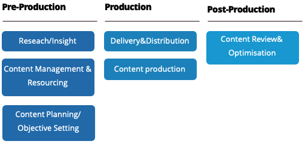

# コンテンツ戦略

e コマースコンテンツマーケティングプランが成功しても、ブレーンストーミングセッションや予感、継承された習慣からは生じません。 事業者は、顧客が見つけ、価値を生み出すコンテンツを計画するために、定量的および定性的データ（既に所有しているソースから得られるものと、作成または購入されたものから得られるもの）を収集する必要がある。 Adobe Experience Managerを使用すると、AEM オーサリング環境で管理されるコンテンツを活用して、非常に魅力的なキャンペーンを作成できます。 Adobe Experience Managerで設計、管理、検証するマーケティングアセットを、様々なチャネルにわたって簡単に公開できます。

## コンテンツ戦略のフレームワーク

### 実稼動前

この段階には、ユーザーの開始、ニーズの理解、ペルソナの開発、既存のアセットとポジションのレビューとインベントリが含まれます。 コンテンツ管理、リソースおよび計画は、適切な構造、編成およびリソースを確立し、維持するように設計されています。

### 実稼働と実行

このステージでは、コンテンツを作成します。 これには、コンテンツの作成、オーサリング、編集、アセット制作、コンテンツの最適化（アクセシビリティ、SEO、タグ付けと分類、アウトソーシングによる生産、サードパーティ製ツールやテクノロジーの役割、コンテンツの再利用）が含まれます。

### Post – 実稼動

この段階では、コンテンツ、適応、最適化のレビューと評価が行われます。 これには、分析の評価、最適化、テスト、学習、ユーザーエクスペリエンスが含まれます。

最後に、テスト、ターゲット設定、戦略を使用すると、環境設定やニーズが異なる特定の訪問者セグメントに配信する適切なコンテンツを特定し、それぞれにターゲットを設定したエクスペリエンスを作成できます。

## Adobe Experience Manager

基本的な web コンテンツを管理する場合でも、ソーシャルネットワークにリリースするコンテンツを管理する場合でも、Adobe Experience Managerは、顧客が関与する可能性のあるすべてのチャネルにわたってクリエイティブアセットやその他のコンテンツを配信するのに役立ちます。 AEMを使用すると、AEM オーサリング環境で管理されるコンテンツを活用して、非常に魅力的なキャンペーンを作成できます。 Adobe Experience Managerで設計、管理、検証するマーケティングアセットを、様々なチャネルやプラットフォームにわたって簡単に公開できます。

Adobe Experience Managerは、インフラストラクチャレベルおよびアプリケーションレベルの多数の機能を 1 つの統合パッケージに組み合わせます。 オファーのアドレスは次のとおりです。

- **Sites**:IT 部門に負担をかけることなく、関連性の高い Web サイトやモバイル・アプリを迅速に作成および配信し、いつでもコンテンツを更新できます。
- **Assets** – すべてのデジタルチャネルにわたって画像、ビデオ、その他のアセットを簡単に管理し、パーソナライズされたカスタマーエクスペリエンスを提供します。
- **コミュニティ** – すべての社会的資産にわたって活発なコミュニティと魅力的な会話を構築し、新しいレベルの学習と顧客の忠誠心を刺激できます。
- **Forms** - エンタープライズレベルのフォームを web サイトやモバイルエクスペリエンスに統合し、フォームの作成とトランザクションの完了を簡素化します。
- **アプリ** - マーケターと IT の間のギャップを埋めるソリューションでモバイルアプリを作成および配信し、マーケターが（ローンチ後でも）コンテンツを簡単に更新できるようにします。

