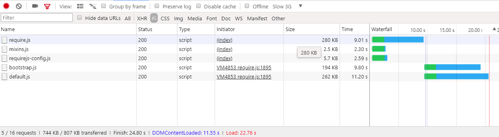

# 詳細 [!DNL JavaScript] バンドル

バンドル [!DNL JavaScript] パフォーマンスを向上させるためのモジュールは、次の 2 つを減らすことです。

1. サーバーリクエストの数。
1. これらのサーバーリクエストのサイズ。

モジュール型アプリケーションでは、サーバ要求の数は数百件に及ぶ可能性があります。 例えば、次のスクリーンショットは、のリストの先頭のみを表示しています。 [!DNL JavaScript] クリーンインストールのホームページにロードされたモジュール。


## 結合とバンドル

標準、 [!DNL Commerce] には、サーバーリクエストの数を減らす 2 つの方法（結合とバンドル）が用意されています。 これらの設定は、デフォルトではオフになっています。 の管理 UI 内でオンにできます **[!UICONTROL Stores]** > **設定** > **[!UICONTROL Configuration]** > **[!UICONTROL Advanced]** > **[!UICONTROL Developer]** > **[!UICONTROL [!DNL JavaScript] Settings]**&#x200B;または、コマンドラインから実行します。


### 基本バンドル

コマンドラインから組み込みバンドルを有効にするには：

```bash
php -f bin/magento config:set dev/js/enable_js_bundling 1
```

これはネイティブです [!DNL Commerce] システムに存在するすべてのアセットを組み合わせ、同じサイズのバンドル間で配布するメカニズム （bundle_0.js、bundle_1.js .. bundle_x.js）:

![[!DNL Commerce] バンドル](../assets/performance/images/magentoBundling.png)

より良いが、ブラウザーはまだすべての [!DNL JavaScript] 必要なバンドルだけでなく、バンドル。

[!DNL Commerce] バンドルにより、ページあたりの接続数は減りますが、リクエストされたページが 1 つまたは 2 つのバンドル内のファイルのみに依存する場合でも、ページリクエストのたびに、すべてのバンドルが読み込まれます。 ブラウザーがバンドルをキャッシュした後のパフォーマンスが向上します。 ただし、ブラウザーはこれらのバンドルを同期的に読み込むので、ユーザーは初めてを訪問します。 [!DNL Commerce] ストアフロントは、レンダリングに時間がかかり、ユーザーエクスペリエンスが損なわれる可能性があります。

### 基本的な結合

コマンドラインからの組み込み結合を有効にする手順は次のとおりです。

```bash
php -f bin/magento config:set dev/js/merge_files 1
```

このコマンドは、すべての同期を結合します [!DNL JavaScript] ファイルを 1 つのファイルに統合する。 バンドルを有効にせずに結合を有効にしても、次の理由から役に立ちません。 [!DNL Commerce] は RequireJS を使用します。 バンドルを有効にしない場合、 [!DNL Commerce] は、RequireJS とその設定のみを結合します。 バンドルと結合の両方を有効にすると、 [!DNL Commerce] 単一のを作成 [!DNL JavaScript] ファイル：


## 実際のレンダリング時間

以前のバンドルおよび統合読み込み時間は、開発環境で優れています。 しかし、実際には、低速の接続、大きな接続しきい値、限られたネットワークなど、多くの場合、レンダリングの速度が低下する可能性があります。 さらに、モバイルデバイスはデスクトップほど高速にはレンダリングされません。

実際のストアフロントのデプロイメントをテストして準備するには、Chrome のネイティブのスロットルプロファイル「Slow 3G」を使用してテストすることをお勧めします。 Slow 3G では、以前のバンドルされた出力時間に、多くのユーザーの接続の実情が反映されるようになりました。


低速の 3G 接続では、ホームページのすべてのバンドルを読み込むのに約 44 秒かかります [!DNL Commerce] インストール。

バンドルを 1 つのファイルに結合する場合も同じです。 次に示すように、ユーザーは最初のページの読み込みから約 42 秒待つことができます。


～に対するより高度なアプローチで [!DNL JavaScript] バンドルすることで、これらの読み込み時間を改善できます。

## 高度なバンドル

の目標を忘れないでください [!DNL JavaScript] バンドルとは、ブラウザーに読み込まれる各ページに対してリクエストされるアセットの数とサイズを減らすことです。 これを行うには、バンドルをビルドして、ストアの各ページがアクセスした各ページに対して共通のバンドルとページ固有のバンドルのみをダウンロードする必要があります。

これを実現する 1 つの方法は、ページのタイプによってバンドルを定義することです。 分類できます [!DNL Commerce]ページが、カテゴリ、製品、CMS、顧客、買い物かご、チェックアウトを含む複数のページタイプに分類されます。 これらのページタイプのいずれかに分類されたページごとに、異なる RequireJS モジュール依存関係のセットがあります。 ページタイプ別に RequireJS モジュールをバンドルすると、ストア内のページの依存関係をカバーするバンドルが 1 つだけになります。

例えば、すべてのページに共通の依存関係のバンドル、CMS のみのページのバンドル、カタログのみのページのバンドル、検索のみのページの別のバンドル、チェックアウトページのバンドルを作成できます。

共通機能、製品関連機能、発送機能、チェックアウト機能、税金、フォーム検証用に、目的に応じてバンドルを作成することもできます。 バンドルの定義方法は、ユーザー次第であり、ストアの構造も同じです。 一部のバンドル戦略が他の戦略よりも効果的な場合があります。

綺麗な [!DNL Commerce] インストールでは、バンドルをページタイプごとに分割することで十分な優れたパフォーマンスを実現できますが、一部のカスタマイズでは詳細な分析やその他のアセット配布が必要になる場合があります。

### 必要なツール

次の手順では、をインストールし、次のツールについて理解しておく必要があります。

- [nodejs](https://nodejs.org/en/download/)
- [r.js](http://requirejs.org/docs/optimization.html#download)
- [[!DNL PhantomJS]](https://phantomjs.org/) （オプション）

### サンプルコード

この記事で使用されるサンプルコードの完全なバージョンは、次の場所で入手できます。

- [build.js](../assets/performance/code-samples/build.js)
- [deps.js](../assets/performance/code-samples/deps.js)
- [deps-map.sh](../assets/performance/code-samples/deps-map.sh.txt)

### パート 1：バンドル設定の作成

#### 1\. build.js ファイルの追加

を作成 `build.js` 内のファイル [!DNL Commerce] ルートディレクトリ。 このファイルには、バンドルのビルド設定全体が含まれます。

```javascript
({
    optimize: 'none',
    inlineText: true
})
```

後で、 `optimize:` from_の設定 `none` 対象： `uglify2` バンドル出力を縮小します。 しかし、現時点では、開発時には、設定したままにすることができます。 `none` ビルドの高速化を実現します。

#### 2\. RequireJS の依存関係、タグ、パス、マップを追加する

次の RequireJS ビルド設定ノードを追加します。 `deps`, `shim`, `paths`、および `map`、ビルドファイルに追加：

```javascript
({
    optimize: 'none',
    inlineText: true,

    deps: [],
    shim: {},
    paths: {},
    map: { "*": {} },
})
```

#### 3\. requirejs-config.js インスタンス値を集計します

この手順では、複数のすべてを集計する必要があります `deps`, `shim`, `paths`、および `map` ストアの設定ノード `requirejs-config.js` ファイルを、内の対応するノードに `build.js` ファイル。 これを行うには、 **[!UICONTROL Network]** ブラウザーのデベロッパーツールパネルでタブをクリックし、ストア内の任意のページ（ホームページなど）に移動します。 「ネットワーク」タブには、ストアのインスタンスの `requirejs-config.js` 上部付近のファイル。ここでハイライト表示：


このファイル内には、設定ノードごとに複数のエントリがあります（`deps`, `shim`, `paths`, `map`）に設定します。 これらの複数のノード値を、build.js ファイルの単一の設定ノードに集計する必要があります。 例えば、ストアの場合 `requirejs-config.js` インスタンスには、15 個の個別のエントリがあります `map` ノードの場合は、15 個のノードすべてのエントリを 1 つのノードにマージする必要があります `map` 内のノード `build.js` ファイル。 以下の場合も同じです。 `deps`, `shim`、および `paths` ノード。 このプロセスを自動化するスクリプトがないと、時間がかかる場合があります。

パスを変更してください `mage/requirejs/text` 対象： `requirejs/text` 。対象： `paths` 設定ノードを次のように設定します。

```javascript
({
    //...
    paths: {
        //...
        "text": "requirejs/text"
    },
})
```

#### 4\. モジュールノードの追加

の最後 `build.js` ファイル、モジュールを追加[] 後でストアフロント用に定義するバンドルのプレースホルダーとして配列します。

```javascript
({
    optimize: 'none',
    inlineText: true,

    deps: [],
    shim: {},
    paths: {},
    map: { "*": {} },

    modules: [],
})
```

#### 5\. RequireJS の依存関係の取得

すべての [!DNL RequireJS] 次を使用して、ストアのページタイプから依存関係をモジュール化します。

1. [!DNL PhantomJS] コマンドラインから（以下を持っていることが前提） [!DNL PhantomJS] インストール済み）。
1. ブラウザーのコンソールで RequireJS コマンドを実行する。

#### 使用目的 [!DNL PhantomJS]:

が含まれる [!DNL Commerce] ルートディレクトリに、という名前の新しいファイルを作成します。 `deps.js` 次のコードをコピーします。 このコードは [!DNL [!DNL PhantomJS]]：ページを開き、ブラウザーがすべてのページアセットを読み込むのを待ちます。 その後、 [!DNL RequireJS] 特定のページの依存関係。

```javascript
"use strict";
var page = require('webpage').create(),
    system = require('system'),
    address;

if (system.args.length === 1) {
    console.log('Usage: $phantomjs deps.js url');
    phantom.exit(1);
} else {
    address = system.args[1];
    page.open(address, function (status) {
        if (status !== 'success') {
            console.log('FAIL to load the address');
        } else {
            setTimeout(function () {
                console.log(page.evaluate(function () {
                    return Object.keys(window.require.s.contexts._.defined);
                }));
                phantom.exit();
            }, 5000);
        }
    });
}
```

内でターミナルを開きます。 [!DNL Commerce] ルートディレクトリを指定し、特定のページタイプを表すストア内の各ページに対してスクリプトを実行します。

<pre>
phantomjs deps.js <i>url-to-specific-page</i> &gt; <i>text-file-representing-pagetype-dependencies</i>
</pre>

例えば、Luma をテーマにしたサンプルストアの 4 つのページで、4 つのバンドル（ホームページ、カテゴリ、製品、買い物かご）を作成するために使用する 4 つのページタイプを表します。

```terminal
phantomjs deps.js http://m2.loc/ > bundle/homepage.txt
phantomjs deps.js http://m2.loc/women/tops-women/jackets-women.html > bundle/category.txt
phantomjs deps.js http://m2.loc/beaumont-summit-kit.html > bundle/product.txt
phantomjs deps.js http://m2.loc/checkout/cart/?SID=m2tjdt7ipvep9g0h8pmsgie975 > bundle/cart.txt (prepare a shopping cart)
..............
```

#### ブラウザーコンソールを使用するには：

を使用しない場合 [!DNL PhantomJS]を使用すると、ストアフロントで各ページタイプを表示しながら、ブラウザーのコンソールから次のコマンドを実行できます。

```shell
Object.keys(window.require.s.contexts._.defined)
```

このコマンド （内で使用） [!DNL PhantomJS] スクリプト）を使用すると、以下の同じリストが作成されます [!DNL RequireJS] 依存関係を作成して、ブラウザーのコンソール内に表示します。 このアプローチの欠点は、独自のバンドル/ページタイプのテキストファイルを作成する必要があることです。

#### 6\. 出力の書式設定とフィルタリング

を結合した後 [!DNL RequireJS] ページタイプのテキストファイルへの依存関係では、各ページタイプの依存関係ファイルで次のコマンドを使用して、ファイル内のコンマを改行に置き換えることができます。

```terminal
sed -i -e $'s/,/\\\n/g' bundle/category.txt
sed -i -e $'s/,/\\\n/g' bundle/homepage.txt
sed -i -e $'s/,/\\\n/g' bundle/product.txt
....
```

また、mixin は依存関係が重複しているので、各ファイルのすべての mixin を削除する必要があります。 各依存関係ファイルで次のコマンドを使用します。

```terminal
sed -i -e 's/mixins\!.*$//g' bundle/homepage.txt
sed -i -e 's/mixins\!.*$//g' bundle/category.txt
sed -i -e 's/mixins\!.*$//g' bundle/product.txt
...
```

#### 7\. 一意の一般的なバンドルの特定

目標は、の共通バンドルを作成することです。 [!DNL JavaScript] すべてのページで必要なファイル。 これにより、ブラウザーは、共通のバンドルと 1 つ以上の特定のページタイプのみを読み込む必要があります。

でターミナルを開きます。 [!DNL Commerce] ルートディレクトリを指定し、次のコマンドを使用して依存関係があることを確認します。依存関係があれば、別々のバンドルに分割できます。

```bash
sort bundle/*.txt |uniq -c |sort -n
```

このコマンドは、で見つかった依存関係を結合して並べ替えます。 `bundle/*.txt` ファイル。  出力には、各依存関係を含むファイルの数も示されます。

```terminal
1 buildTools,
1 jquery/jquery.parsequery,
1 jsbuild,
2 jquery/jquery.metadata,
2 jquery/validate,
2 mage/bootstrap,
3 jquery
3 jquery/ui
3 knockoutjs/knockout
...
```

この出力は、次のことを示しています `buildTools` は、バンドル/*.txt ファイルの 1 つだけの依存関係です。 この `jquery/jquery.metadata` 依存関係が 2 つのファイルに含まれている `es6-collections` は 3 つのファイルに含まれます。

出力には、次の 3 つのページタイプ（ホームページ、カテゴリ、製品）のみが表示されます。

- 3 つの依存関係は、1 つのページタイプにのみ固有です（番号 1 で示されます）。
- さらに 3 つの依存関係が 2 つのページタイプで発生します（数字は 2 です）。
- 最後の 3 つの依存関係は、3 種類のページタイプすべてに共通です（数字は 3 です）。

つまり、どのページタイプにどの依存関係が必要かがわかれば、依存関係を別のバンドルに分割することで、ストアのページ読み込み速度を向上できる可能性があります。

#### 8\. 依存関係配布ファイルの作成

どのページタイプにどの依存関係が必要かを調べるには、に新しいファイルを作成します。 [!DNL Commerce] というルートディレクトリ `deps-map.sh` 次のコードをコピーします。

```shell
awk 'END {
 for (R in rec) {
   n = split(rec[R], t, "/")
   if (n > 1)
     dup[n] = dup[n] ? dup[n] RS sprintf("\t%-20s -->\t%s", rec[R], R) : \
       sprintf("\t%-20s -->\t%s", rec[R], R)
   }
 for (D in dup) {
   printf "records found in %d files:\n\n", D
   printf "%s\n\n", dup[D]
   }
 }
{
 rec[$0] = rec[$0] ? rec[$0] "/" FILENAME : FILENAME
}' bundle/*.txt
```

また、次の場所でスクリプトを検索できます。 [https://www.unix.com/shell-programming-and-scripting/140390-get-common-lines-multiple-files.html](https://www.unix.com/shell-programming-and-scripting/140390-get-common-lines-multiple-files.html)

でターミナルを開きます。 [!DNL Commerce] ルートディレクトリをクリックし、ファイルを実行します。

```bash
bash deps-map.sh
```

このスクリプトからの出力は、3 つのサンプルページタイプに適用すると、次のようになります（ただし、はるかに長くなります）。

```terminal
bundle/product.txt   -->   buildTools,
bundle/category.txt  -->   jquery/jquery.parsequery,
bundle/product.txt   -->   jsbuild,

bundle/category.txt/bundle/homepage.txt -->    jquery/jquery.metadata,
bundle/category.txt/bundle/homepage.txt -->    jquery/validate,
bundle/category.txt/bundle/homepage.txt -->    mage/bootstrap,

bundle/category.txt/bundle/homepage.txt/bundle/product.txt --> jquery,
bundle/category.txt/bundle/homepage.txt/bundle/product.txt --> jquery/ui,
bundle/category.txt/bundle/homepage.txt/bundle/product.txt --> knockoutjs/knockout,
```

これは、バンドル設定を構築するのに十分な情報です。

#### 9\. build.js ファイルにバンドルを作成します

を開きます `build.js` 設定ファイルを開き、バンドルをに追加します `modules` ノード。 各バンドルは、次のプロパティを定義する必要があります。

- `name`— バンドルの名前。 例えば、次の名前： `bundles/cart` が `cart.js` ～に束ねる `bundles` サブディレクトリ。

- `create`— バンドルを作成するためのブール値フラグ（値： `true` または `false`）に設定します。

- `include`— ページの依存関係として含まれるアセット（文字列）の配列。 RequireJS は、すべての依存関係をトレースし、除外されない限りバンドルに含めます。

- `exclude`— バンドルから除外するバンドルまたはアセットの配列。

```javascript
{
    name: 'bundles/catalog',
    create: true,
    include: [
        'addToWishlist',
        'priceBundle',
        'priceUtils',
        'priceOptions',
        'sticky',
        'productSummary',
        'slide'
    ],
    exclude: [
        'requirejs/require',
        'bundles/default',
        'mage/bootstrap'
    ],
}
```

この例は次を再利用します `mage/bootstrap` および `requirejs/require` アセット。同期して読み込む必要がある最も重要なコンポーネントとコンポーネントを優先します。 存在するバンドルは次のとおりです。

- `requirejs/require` – 同期的に読み込まれる唯一のバンドル
- `mage/bootstrap`—UI コンポーネントを含むブートストラップバンドル
- `bundles/default` – すべてのページにデフォルトのバンドルが必要
- `bundles/cart` – 買い物かごページに必要なバンドル
- `bundles/shipping` – 買い物かごとチェックアウトページ用の共通バンドル （チェックアウトが直接開かれないと仮定すると、買い物かごページが以前に開かれ、出荷バンドルが既に読み込まれている場合、チェックアウトページはさらに高速に読み込まれます）。
- `bundles/checkout`- チェックアウト用のすべて
- `bundles/catalog` – 製品ページとカテゴリページに関するすべて

### パート 2：バンドルの生成

次の手順では、より効率的に生成するための基本的なプロセスを説明します [!DNL Commerce] バンドル。 このプロセスは好きなように自動化できますが、を使用する必要があります `nodejs` および `r.js` ：バンドルを実際に生成します。 テーマに次の条件がある場合： [!DNL JavaScript]関連のカスタマイズを使用し、同じものを再利用できない `build.js` ファイルです。複数のファイルを作成する必要があります。 `build.js` テーマごとの設定。

#### 1.静的ストアサイトを生成する

バンドルを生成する前に、静的デプロイメントコマンドを実行します。

```bash
php -f bin/magento setup:static-content:deploy -f -a frontend
```

このコマンドは、設定したテーマおよびロケールごとに静的ストアのデプロイメントを生成します。 例えば、Luma テーマと、英語とフランス語のロケールを持つカスタムテーマを使用する場合、次の 4 つの静的デプロイメントを生成します。

- ...luma/en_US
- ...luma/fr_FR
- ...custom/en_US
- ...custom/fr_FR

すべてのストアテーマおよびロケール用のバンドルを生成するには、ストアテーマおよびロケールごとに以下の手順を繰り返します。

#### 2.静的ストアのコンテンツを一時ディレクトリに移動する

まず、静的コンテンツをターゲットディレクトリから一時的なディレクトリに移動する必要があります。これは、RequireJS がターゲットディレクトリ内のすべてのコンテンツを置き換えるからです。

```bash
mv pub/static/frontend/Magento/{theme}/{locale} pub/static/frontend/Magento/{theme}/{locale}_tmp
```

例：

```bash
mv pub/static/frontend/Magento/luma/en_US pub/static/frontend/Magento/luma/en_US_tmp
```

#### 3. r.js Optimizer を実行する

次に、で r.js optimizer を実行します。 `build.js` ファイルの送信元 [!DNL Commerce]のルートディレクトリです。 すべてのディレクトリとファイルへのパスは、作業ディレクトリからの相対パスで指定します。

```bash
r.js -o build.js baseUrl=pub/static/frontend/Magento/luma/en_US_tmp dir=pub/static/frontend/Magento/luma/en_US
```

このコマンドは、 `bundles` ターゲットディレクトリのサブディレクトリ（この場合は、次になります） `pub/static/frontend/Magento/luma/en_US/bundles`.

新しいバンドルディレクトリの内容のリストは、次のようになります。

```bash
ll pub/static/frontend/Magento/luma/en_US/bundles
```

```terminal
total 1900
drwxr-xr-x  2 root root    4096 Mar 28 11:24 ./
drwxr-xr-x 70 root root    4096 Mar 28 11:24 ../
-rw-r--r--  1 root root  116417 Mar 28 11:24 cart.js
-rw-r--r--  1 root root  187090 Mar 28 11:24 catalog.js
-rw-r--r--  1 root root  307619 Mar 28 11:24 checkout.js
-rw-r--r--  1 root root 1240608 Mar 28 11:24 default.js
-rw-r--r--  1 root root   74233 Mar 28 11:24 shipping.js
```

#### 4. バンドルを使用するように RequireJS を設定する

RequireJS でバンドルを使用するには、 `onModuleBundleComplete` コールバック後 `modules` 内のノード `build.js` ファイル：

```javascript
[
    {
       //...
       exclude: [
           'requirejs/require',
           'bundles/default',
           'bundles/checkout',
           'bundles/cart',
           'bundles/shipping',
           'mage/bootstrap'
       ],
   },
],
bundlesConfigOutFile: `${config.dir}/requirejs-config.js`,
onModuleBundleComplete: function(data) {
    if (this.bundleConfigAppended) {
        return;
    }
    this.bundleConfigAppended = true;

    // bundlesConfigOutFile requires a simple require.config call in order to modify the configuration
    const bundleConfigPlaceholder = `
(function (require) {
require.config({});
})(require);
    `;

    fs.appendFileSync(this.bundlesConfigOutFile, bundleConfigPlaceholder);
}
```

#### 5. deploy コマンドを再実行する

次のコマンドを実行してデプロイします。

```bash
r.js -o app/design/frontend/Magento/luma/build.js baseUrl=pub/static/frontend/Magento/luma/en_US_tmp dir=pub/static/frontend/Magento/luma/en_US
```

開く `requirejs-config.js` が含まれる `pub/static/frontend/Magento/luma/en_US` requireJS によってファイルにバンドル設定呼び出しが追加されたことを確認するディレクトリ。

```javascript
require.config({
    bundles: {
        "bundles/default": ["mage/template", "mage/apply/scripts", "mage/apply/main", "mage/mage", "mage/translate", "mage/loader"],
        "bundles/cart": ["Magento_Ui/js/lib/validation/utils", "Magento_Ui/js/lib/validation/rules", "Magento_Ui/js/lib/validation/validation"]
    }
}
```

>[!NOTE]
>
>バンドルを設定する際は、必ずを配置します `requirejs.config()` 呼び出しは表示される順序で実行されるので、呼び出しは実行する順序で実行されます。

#### 6.結果のテスト

ページが読み込まれたら、ブラウザーが異なる依存関係とバンドルを読み込んでいることに注意してください。 例えば、「遅い 3G」プロファイルの結果は次のようになります。



空のホームページのページ読み込み時間が、ネイティブを使用する場合の 2 倍の速さになりました [!DNL Commerce] バンドル。 しかし、私たちはさらに良くすることができます。

#### 7. バンドルを最適化する

gzipped した場合でも、 [!DNL JavaScript] ファイルはまだ大きい。 縮小に uglifier を使用する RequireJS を使用して縮小します。 [!DNL JavaScript] 良い結果を得るために。

でオプティマイザーを有効にするには `build.js` ファイル、追加 `uglify2` を選択します。を選択します。を選択した場合、 `build.js` ファイル：

```javascript
({
    optimize: 'uglify2',
    inlineText: true
})
```

結果は重要になる場合があります。


読み込み時間がネイティブの 3 倍になりました [!DNL Commerce] バンドル。
