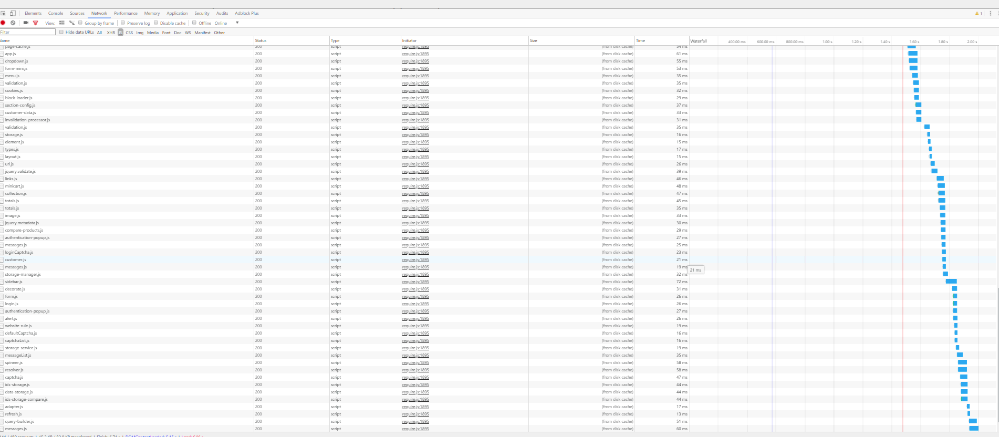
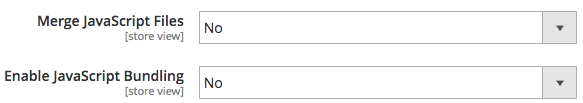
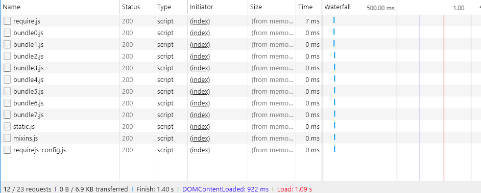
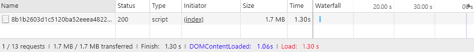
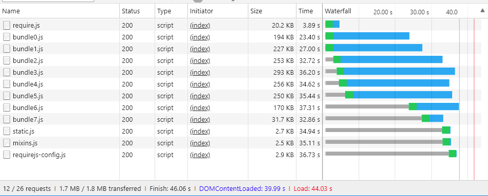
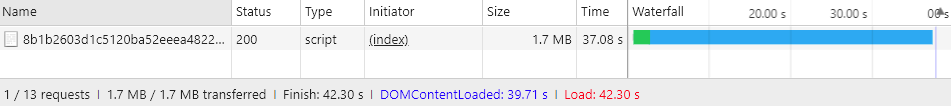
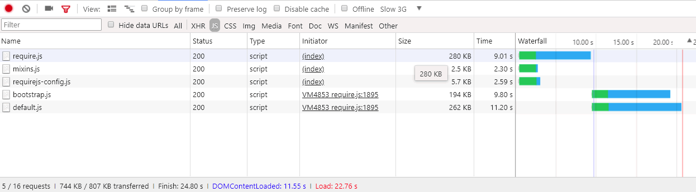
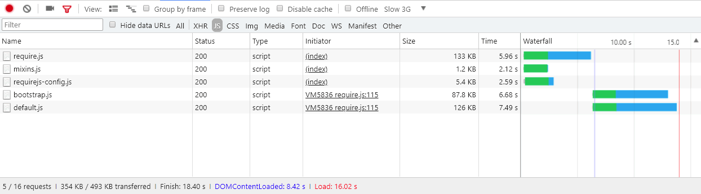

# 高度なJavaScriptのバンドル

JavaScriptのモジュールをバンドルしてパフォーマンスを向上させるには、次の2つの点を軽減する必要があります。

1. サーバーリクエストの数。
1. サーバーリクエストのサイズ。

モジュラーアプリケーションでは、サーバーリクエストの数は数百に達することができます。 例えば、次のスクリーンショットは、クリーンインストールのホームページに読み込まれたJavaScript モジュールのリストの開始のみを示しています。



## 結合とバンドル

Commerceでは、サーバーリクエストの数を減らすためにバンドルをサポートしています。 バンドルはデフォルトでオフになっています。 この機能は、**[!UICONTROL Stores]** > **設定** > **[!UICONTROL Configuration]** > **[!UICONTROL Advanced]** > **[!UICONTROL Developer]** > **[!UICONTROL JavaScript Settings]**&#x200B;で有効にするか、コマンドラインから有効にできます。

サードパーティ製ツール、HTTP/2、非推奨のJSおよびCSS結合に関するガイダンスについては、[設定のベストプラクティス &#x200B;](configuration.md#bundling-tips)の&#x200B;*バンドルヒント*&#x200B;を参照してください。



### 基本バンドル

コマンドラインから組み込みバンドルを有効にするには：

```bash
php -f bin/magento config:set dev/js/enable_js_bundling 1
```

これは、システムに存在するすべてのアセットを組み合わせて、同じサイズのバンドル（bundle_0.js、bundle_1.js ... bundle_x.js）に配布するネイティブのCommerce メカニズムです。



より良い、しかし、ブラウザは依然として必要なものだけでなく、すべてのJavaScriptバンドルを読み込みます。

Commerce バンドルは、ページあたりの接続数を減らしますが、要求されたページが1つまたは2つのバンドル内のファイルのみに依存する場合でも、ページリクエストごとに、すべてのバンドルが読み込まれます。 ブラウザーがバンドルをキャッシュすると、パフォーマンスが向上します。 しかし、ブラウザーがこれらのバンドルを同期して読み込むため、利用者がCommerceのストアフロントを初めて訪問したときに、レンダリングに時間がかかり、顧客体験が損なわれる可能性があります。

### 基本的な結合（推奨されません）

>[!NOTE]
>
>**[!UICONTROL Merge JavaScript Files]**&#x200B;を使用することはお勧めしません。 この設定は、ページのHEAD セクションで同期的に読み込まれたJavaScriptに対してのみ設計されており、バンドルと[!DNL RequireJS] ロジックが正しく動作しない可能性があります。 後方互換性のみが維持され、HTTP/2が有効になっている場合にパフォーマンス上のメリットはありません。
>**[!UICONTROL Merge JavaScript Files]**&#x200B;を有効にして問題が発生した場合は、パッチを適用する前に無効にしてみてください。 結合を無効にできない場合は、[ACSD-67908](../tools/quality-patches-tool/patches-available-in-qpt/v1-1-73/acsd-67908.md)を参照してください。

コマンドラインから組み込み結合を有効にするには：

```bash
php -f bin/magento config:set dev/js/merge_files 1
```

このコマンドは、すべての同期JavaScript ファイルを1つのファイルに結合します。 バンドルも有効にせずに結合を有効にすることは、Commerceで[!DNL RequireJS]が使用されるため便利ではありません。 バンドルを有効にしない場合、Commerceは[!DNL RequireJS]とその設定のみを結合します。 バンドルと結合の両方を有効にすると、Commerceは1つのJavaScript ファイルを作成します。



## 実際のレンダリング時間

以前のバンドルおよびマージされたロード時間は、開発環境では良好に見えます。 しかし、実際には、接続が遅い、接続のしきい値が大きい、ネットワークが限られているなど、多くのことがレンダリングを遅くすることがあります。 さらに、モバイルデバイスはデスクトップほど高速にレンダリングされません。

実際のストアフロントのデプロイメントをテストおよび準備するには、Chromeの「Slow 3G」のネイティブスロットリングプロファイルを使用してテストすることをお勧めします。 遅い3Gでは、以前のバンドルされた出力時間は、多くのユーザーの接続の現実を反映するようになりました。



遅い3G接続では、クリーンなCommerceインストールのホームページのすべてのバンドルを読み込むのに約44秒かかります。

バンドルを1つのファイルに結合する場合も同様です。 ユーザーは、次に示すように、最初のページ読み込みに対して約42秒待つ可能性があります。



「JavaScriptバンドルに対するより高度なアプローチにより、これらの読み込み時間を短縮できます。

## 高度なバンドル

JavaScript バンドルの目標は、ブラウザーに読み込まれるページごとに、リクエストされたアセットの数とサイズを減らすことです。 それには、ストアの各ページがアクセスした各ページに共通のバンドルとページ固有のバンドルのみをダウンロードする必要があるように、バンドルを構築します。

これを実現する方法のひとつは、ページタイプごとにバンドルを定義することです。 Commerceのページは、カテゴリー、商品、CMS、お客様、カート、チェックアウトなど、いくつかの種類のページに分類できます。 これらのページタイプのいずれかに分類された各ページには、異なるモジュール依存関係のセットが設定されています。 [!DNL RequireJS]&#x200B;[!DNL RequireJS] モジュールをページタイプ別にバンドルすると、ストア内の任意のページの依存関係をカバーする少数のバンドルのみが作成されます。

例えば、すべてのページに共通する依存関係のバンドル、CMS専用ページのバンドル、カタログ専用ページのバンドル、検索専用ページのバンドル、チェックアウトページのバンドルが作成されます。

また、共通の機能、製品関連の機能、発送機能、チェックアウト機能、税金、フォーム検証など、目的ごとにバンドルを作成することもできます。 バンドルの定義方法は、お客様とストアの構造によって異なります。 バンドル戦略によっては、他の戦略よりも優れた機能を発揮するものもあります。

クリーンなCommerceのインストールでは、バンドルをページタイプごとに分割することで十分なパフォーマンスを得ることができます。ただし、カスタマイズによっては、より詳細な分析やその他のアセット配布が必要になる場合があります。

### 必要なツール

次の手順を実行するには、次のツールをインストールし、使い慣れている必要があります。

- [nodejs](https://nodejs.org/en/download/)
- [r.js](http://requirejs.org/docs/optimization.html#download)
- [[!DNL PhantomJS]](https://phantomjs.org/) （オプション）

### サンプルコード

この記事で使用するサンプルコードの完全なバージョンは、次の場所で入手できます。

- [build.js](../assets/performance/code-samples/build.js)
- [deps.js](../assets/performance/code-samples/deps.js)
- [deps-map.sh](../assets/performance/code-samples/deps-map.sh.txt)

### パート 1：バンドル設定の作成

#### 1\. build.js ファイルの追加

Commerceのルートディレクトリに`build.js` ファイルを作成します。 このファイルには、バンドルのビルド設定全体が含まれます。

```javascript
({
    optimize: 'none',
    inlineText: true
})
```

後で、`optimize:`設定を_ `none`から`uglify2`に変更して、バンドル出力を縮小します。 ただし、現時点では、開発中は`none`に設定しておくと、ビルドを高速化できます。

#### 2\. [!DNL RequireJS]の依存関係、シム、パス、およびマップを追加

次の[!DNL RequireJS] ビルド設定ノード、`deps`、`shim`、`paths`および`map`をビルドファイルに追加します。

```javascript
({
    optimize: 'none',
    inlineText: true,

    deps: [],
    shim: {},
    paths: {},
    map: { "*": {} },
})
```

#### 3\. `requirejs-config.js` インスタンス値を集計します

この手順では、ストアの`deps` ファイルの複数の`shim`、`paths`、`map`、および`requirejs-config.js`設定ノードをすべて、`build.js` ファイルの対応するノードに集約する必要があります。 これを行うには、ブラウザーの開発者ツールパネルで「**[!UICONTROL Network]**」タブを開き、ホームページなど、ストア内の任意のページに移動します。 「ネットワーク」タブで、上部の近くにストアの`requirejs-config.js` ファイルのインスタンスが表示され、ここで強調表示されます。

![[!DNL RequireJS]設定](../assets/performance/images/RequireJSConfig.png)

このファイル内には、各設定ノード （`deps`、`shim`、`paths`、`map`）に対する複数のエントリがあります。 複数のノード値をbuild.js ファイルの単一の設定ノードに集約する必要があります。 例えば、ストアの`requirejs-config.js` インスタンスに15個の個別の`map` ノードのエントリがある場合、15個のすべてのノードのエントリを`map` ファイルの単一の`build.js` ノードにマージする必要があります。 `deps`、`shim`、`paths`のノードについても同じです。 このプロセスを自動化するスクリプトがなければ、時間がかかることがあります。

次のように、`mage/requirejs/text`設定ノードのパス `requirejs/text`を`paths`に変更する必要があります。

```javascript
({
    //...
    paths: {
        //...
        "text": "requirejs/text"
    },
})
```

#### 4\. モジュールノードの追加

`build.js` ファイルの最後に、後でストアフロント用に定義するバンドルのプレースホルダーとしてモジュール []配列を追加します。

```javascript
({
    optimize: 'none',
    inlineText: true,

    deps: [],
    shim: {},
    paths: {},
    map: { "*": {} },

    modules: [],
})
```

#### 5\。 [!DNL RequireJS]の依存関係を取得

ストアのページタイプからすべての[!DNL RequireJS] モジュールの依存関係を取得するには、次を使用します。

1. コマンドラインから[!DNL PhantomJS]を実行します（[!DNL PhantomJS]がインストールされている場合）。
1. ブラウザーのコンソールで[!DNL RequireJS] コマンドを実行します。

#### [!DNL PhantomJS]を使用するには：

Commerceのルートディレクトリで、`deps.js`という名前の新しいファイルを作成し、以下のコードでコピーします。 このコードは[!DNL [!DNL PhantomJS]]を使用してページを開き、ブラウザーがすべてのページアセットを読み込むのを待ちます。 次に、特定のページのすべての[!DNL RequireJS]依存関係を出力します。

```javascript
"use strict";
var page = require('webpage').create(),
    system = require('system'),
    address;

if (system.args.length === 1) {
    console.log('Usage: $phantomjs deps.js url');
    phantom.exit(1);
} else {
    address = system.args[1];
    page.open(address, function (status) {
        if (status !== 'success') {
            console.log('FAIL to load the address');
        } else {
            setTimeout(function () {
                console.log(page.evaluate(function () {
                    return Object.keys(window.require.s.contexts._.defined);
                }));
                phantom.exit();
            }, 5000);
        }
    });
}
```

Commerceのルートディレクトリ内でターミナルを開き、ストア内の各ページに対して特定のページタイプを表すスクリプトを実行します。

<pre>
phantomjs deps.js <i>url-to-specific-page</i> &gt; <i>text-file-representing-pagetype-dependencies</i>
</pre>

例えば、Luma テーマのサンプルストアの4つのページで、4つのページタイプ（ホームページ、カテゴリ、製品、カート）を作成するために使用する4つのページタイプを表します。

```
phantomjs deps.js http://m2.loc/ > bundle/homepage.txt
phantomjs deps.js http://m2.loc/women/tops-women/jackets-women.html > bundle/category.txt
phantomjs deps.js http://m2.loc/beaumont-summit-kit.html > bundle/product.txt
phantomjs deps.js http://m2.loc/checkout/cart/?SID=m2tjdt7ipvep9g0h8pmsgie975 > bundle/cart.txt (prepare a shopping cart)
..............
```

#### ブラウザーコンソールを使用するには：

[!DNL PhantomJS]を使用しない場合は、ストアフロントの各ページタイプを表示しながら、ブラウザーのコンソールから次のコマンドを実行できます。

```shell
Object.keys(window.require.s.contexts._.defined)
```

このコマンド（[!DNL PhantomJS] スクリプト内で使用）は、[!DNL RequireJS]依存関係の同じリストを作成し、それらをブラウザーのコンソールに表示します。 このアプローチの欠点は、独自のバンドル/ページタイプのテキストファイルを作成する必要があることです。

#### 6\. 出力のフォーマットとフィルタリング

[!DNL RequireJS]依存関係をページ型テキストファイルに結合した後、各ページ型依存関係ファイルで次のコマンドを使用して、ファイル内のコンマを改行に置き換えることができます。

```bash
sed -i -e $'s/,/\\\n/g' bundle/category.txt
sed -i -e $'s/,/\\\n/g' bundle/homepage.txt
sed -i -e $'s/,/\\\n/g' bundle/product.txt
....
```

また、Mixinの依存関係が重複しているため、各ファイルのすべてのMixinを削除する必要があります。 各依存ファイルに対して次のコマンドを使用します。

```bash
sed -i -e 's/mixins\!.*$//g' bundle/homepage.txt
sed -i -e 's/mixins\!.*$//g' bundle/category.txt
sed -i -e 's/mixins\!.*$//g' bundle/product.txt
...
```

#### 7\. 一意の共通バンドルの特定

目標は、すべてのページで必要なJavaScript ファイルの共通バンドルを作成することです。 この方法では、ブラウザーは共通バンドルを1つ以上の特定のページタイプと共に読み込むだけです。

Commerceのルートディレクトリでターミナルを開き、次のコマンドを使用して、依存関係を持っていることを確認し、個別のバンドルに分割できます。

```bash
sort bundle/*.txt |uniq -c |sort -n
```

このコマンドは、`bundle/*.txt` ファイルにある依存関係を結合して並べ替えます。  出力には、各依存関係を含むファイルの数も表示されます。

```
1 buildTools,
1 jquery/jquery.parsequery,
1 jsbuild,
2 jquery/jquery.metadata,
2 jquery/validate,
2 mage/bootstrap,
3 jquery
3 jquery/ui
3 knockoutjs/knockout
...
```

この出力は、`buildTools`がbundle/*.txt ファイルの1つだけの依存関係であることを示しています。 `jquery/jquery.metadata`の依存関係は2つの（2） ファイルにあり、`es6-collections`は3つの（3） ファイルにあります。

出力には、3つのページタイプ（ホームページ、カテゴリ、製品）のみが表示され、次のように表示されます。

- 3つの依存関係は、1つのページタイプ（番号1で表示）にのみ固有です。
- 2つのページタイプ（数字2で示されます）に対してさらに3つの依存関係が発生します。
- 最後の3つの依存関係は、アドビのすべての3つのページタイプ（数字3で示されます）に共通しています。

これは、どのページタイプでどの依存関係が必要かがわかれば、ストアのページ読み込み速度を向上できる可能性があることを示しています。

#### 8\. 依存関係配布ファイルの作成

どのページタイプが必要かを調べるには、`deps-map.sh`という名前のCommerce ルートディレクトリに新しいファイルを作成し、以下のコードにコピーします。

```shell
awk 'END {
 for (R in rec) {
   n = split(rec[R], t, "/")
   if (n > 1)
     dup[n] = dup[n] ? dup[n] RS sprintf("\t%-20s -->\t%s", rec[R], R) : \
       sprintf("\t%-20s -->\t%s", rec[R], R)
   }
 for (D in dup) {
   printf "records found in %d files:\n\n", D
   printf "%s\n\n", dup[D]
   }
 }
{
 rec[$0] = rec[$0] ? rec[$0] "/" FILENAME : FILENAME
}' bundle/*.txt
```

スクリプトは[https://www.unix.com/shell-programming-and-scripting/140390-get-common-lines-multiple-files.html](https://www.unix.com/shell-programming-and-scripting/140390-get-common-lines-multiple-files.html)にあります

Commerce ルートディレクトリでターミナルを開き、ファイルを実行します。

```bash
bash deps-map.sh
```

このスクリプトの出力は、3つのページタイプの例に適用され、次のようになります（ただし、はるかに長くなります）。

```
bundle/product.txt   -->   buildTools,
bundle/category.txt  -->   jquery/jquery.parsequery,
bundle/product.txt   -->   jsbuild,

bundle/category.txt/bundle/homepage.txt -->    jquery/jquery.metadata,
bundle/category.txt/bundle/homepage.txt -->    jquery/validate,
bundle/category.txt/bundle/homepage.txt -->    mage/bootstrap,

bundle/category.txt/bundle/homepage.txt/bundle/product.txt --> jquery,
bundle/category.txt/bundle/homepage.txt/bundle/product.txt --> jquery/ui,
bundle/category.txt/bundle/homepage.txt/bundle/product.txt --> knockoutjs/knockout,
```

これは、バンドル設定を構築するのに十分な情報です。

#### 9\. build.js ファイルでバンドルを作成する

`build.js`設定ファイルを開き、バンドルを`modules` ノードに追加します。 各バンドルでは、次のプロパティを定義する必要があります。

- `name`— バンドルの名前。 例えば、`bundles/cart`という名前は、`cart.js` サブディレクトリに`bundles` バンドルを生成します。

- `create`— バンドルを作成するブール型フラグ（値：`true`または`false`）。

- `include`— ページの依存関係として含まれるアセットの配列（文字列）。 [!DNL RequireJS]はすべての依存関係をトレースし、除外されない限り、それらをバンドルに含めます。

- `exclude`— バンドルから除外するバンドルまたはアセットの配列。

```javascript
{
    name: 'bundles/catalog',
    create: true,
    include: [
        'addToWishlist',
        'priceBundle',
        'priceUtils',
        'priceOptions',
        'sticky',
        'productSummary',
        'slide'
    ],
    exclude: [
        'requirejs/require',
        'bundles/default',
        'mage/bootstrap'
    ],
}
```

この例では、`mage/bootstrap`と`requirejs/require`のアセットを再利用し、同期して読み込む必要がある最も重要なコンポーネントとコンポーネントをより優先しています。 存在するバンドルは次のとおりです。

- `requirejs/require` – 同期して読み込まれた唯一のバンドル
- `mage/bootstrap` - UI コンポーネントを含むブートストラップバンドル
- `bundles/default` – すべてのページにデフォルトバンドルが必要です
- `bundles/cart` – 買い物かごページに必要なバンドル
- `bundles/shipping` - ショッピングカートとチェックアウトページ用の共通バンドル （チェックアウトが直接開かれていない場合、チェックアウトページは以前にカートページが開かれていて、配送バンドルが既に読み込まれている場合、さらに高速に読み込まれます）
- `bundles/checkout` - チェックアウト用のすべて
- `bundles/catalog` – 製品ページとカテゴリーページのすべて

### パート 2：バンドルの生成

以下の手順では、より効率的なCommerce バンドルを生成するための基本的なプロセスについて説明します。 このプロセスは任意の方法で自動化できますが、バンドルを実際に生成するには、`nodejs`と`r.js`を使用する必要があります。 また、テーマにJavaScript関連のカスタマイズがあり、同じ`build.js` ファイルを再利用できない場合は、テーマごとに複数の`build.js`設定を作成する必要がある場合があります。

#### &#x200B;1. 静的なストアサイトの生成

バンドルを生成する前に、静的デプロイメントコマンドを実行します。

```bash
php -f bin/magento setup:static-content:deploy -f -a frontend
```

このコマンドは、設定したテーマとロケールごとに静的ストアのデプロイメントを生成します。 例えば、Luma テーマと、英語とフランス語のロケールを持つカスタムテーマを使用する場合、4つの静的デプロイメントを生成します。

- ...luma/en_US
- ...luma/fr_FR
- ...custom/en_US
- ...custom/fr_FR

すべてのストアテーマとロケールのバンドルを生成するには、各ストアテーマとロケールについて次の手順を繰り返します。

#### &#x200B;2. 静的ストアコンテンツを一時ディレクトリに移動する

まず、静的コンテンツをターゲットディレクトリから一部の一時ディレクトリに移動する必要があります。なぜなら、[!DNL RequireJS]はターゲットディレクトリ内のすべてのコンテンツを置き換えるからです。

```bash
mv pub/static/frontend/Magento/{theme}/{locale} pub/static/frontend/Magento/{theme}/{locale}_tmp
```

例：

```bash
mv pub/static/frontend/Magento/luma/en_US pub/static/frontend/Magento/luma/en_US_tmp
```

#### &#x200B;3. r.js optimizerの実行

次に、Commerceのルートディレクトリから`build.js` ファイルでr.js optimizerを実行します。 すべてのディレクトリとファイルへのパスは、作業ディレクトリに対する相対パスです。

```bash
r.js -o build.js baseUrl=pub/static/frontend/Magento/luma/en_US_tmp dir=pub/static/frontend/Magento/luma/en_US
```

このコマンドは、ターゲットディレクトリの`bundles` サブディレクトリにバンドルを生成します。この場合、`pub/static/frontend/Magento/luma/en_US/bundles`になります。

新しいバンドルディレクトリの内容をリスト化すると、次のようになります。

```bash
ll pub/static/frontend/Magento/luma/en_US/bundles
```

```
total 1900
drwxr-xr-x  2 root root    4096 Mar 28 11:24 ./
drwxr-xr-x 70 root root    4096 Mar 28 11:24 ../
-rw-r--r--  1 root root  116417 Mar 28 11:24 cart.js
-rw-r--r--  1 root root  187090 Mar 28 11:24 catalog.js
-rw-r--r--  1 root root  307619 Mar 28 11:24 checkout.js
-rw-r--r--  1 root root 1240608 Mar 28 11:24 default.js
-rw-r--r--  1 root root   74233 Mar 28 11:24 shipping.js
```

#### &#x200B;4. バンドルを使用するように[!DNL RequireJS]を設定する

バンドルを使用するように[!DNL RequireJS]を取得するには、`onModuleBundleComplete` ファイルの`modules` ノードの後に`build.js` コールバックを追加します。

```javascript
[
    {
       //...
       exclude: [
           'requirejs/require',
           'bundles/default',
           'bundles/checkout',
           'bundles/cart',
           'bundles/shipping',
           'mage/bootstrap'
       ],
   },
],
bundlesConfigOutFile: `${config.dir}/requirejs-config.js`,
onModuleBundleComplete: function(data) {
    if (this.bundleConfigAppended) {
        return;
    }
    this.bundleConfigAppended = true;

    // bundlesConfigOutFile requires a simple require.config call in order to modify the configuration
    const bundleConfigPlaceholder = `
(function (require) {
require.config({});
})(require);
    `;

    fs.appendFileSync(this.bundlesConfigOutFile, bundleConfigPlaceholder);
}
```

#### &#x200B;5. デプロイコマンドの再実行

デプロイするには、次のコマンドを実行します。

```bash
r.js -o app/design/frontend/Magento/luma/build.js baseUrl=pub/static/frontend/Magento/luma/en_US_tmp dir=pub/static/frontend/Magento/luma/en_US
```

`requirejs-config.js` ディレクトリで`pub/static/frontend/Magento/luma/en_US`を開き、[!DNL RequireJS]が構成呼び出しをバンドルしてファイルを追加したことを確認します。

```javascript
require.config({
    bundles: {
        "bundles/default": ["mage/template", "mage/apply/scripts", "mage/apply/main", "mage/mage", "mage/translate", "mage/loader"],
        "bundles/cart": ["Magento_Ui/js/lib/validation/utils", "Magento_Ui/js/lib/validation/rules", "Magento_Ui/js/lib/validation/validation"]
    }
}
```

>[!NOTE]
>
>バンドルを設定する場合は、呼び出しが表示される順序で実行されるため、`requirejs.config()`呼び出しを実行する順序に置くことを確認してください。

#### &#x200B;6. 結果の検証

ページが読み込まれたら、ブラウザーが様々な依存関係とバンドルを読み込んでいることに注意してください。 例えば、「Slow 3G」プロファイルの結果は次のようになります。



空のホームページのページ読み込み時間は、ネイティブのCommerce バンドルを使用するよりも2倍速くなりました。 しかし、さらに優れた方法があります。

#### &#x200B;7. バンドルの最適化

Gzip圧縮しても、JavaScript ファイルは大きくなります。 JavaScriptを良い結果に縮小するためにuglifierを使用する[!DNL RequireJS]でそれらを縮小します。

`build.js` ファイルでオプティマイザーを有効にするには、`uglify2` ファイルの先頭にあるoptimize プロパティの値として`build.js`を追加します。

```javascript
({
    optimize: 'uglify2',
    inlineText: true
})
```

この結果は重要なものとなり得る。


Commerceのネイティブバンドルに比べて、読み込み時間が3倍速くなりました。
