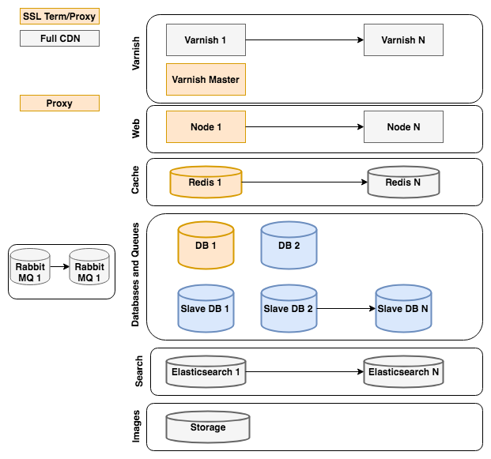
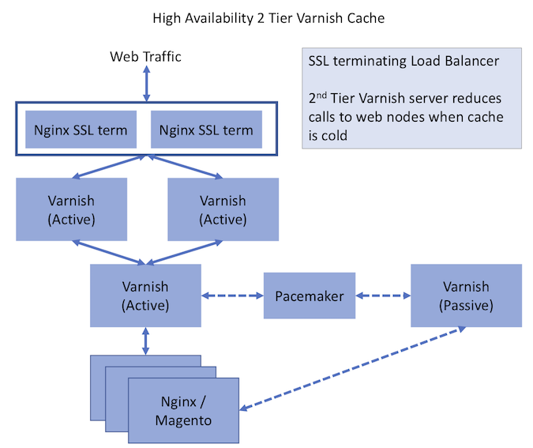

# 参照アーキテクチャ

このトピックでは、リソースが他のユーザーと共有されない、データセンター（仮想化されていない）で物理的にホストされるプレーンサーバーを使用するAdobe Commerce インスタンスの一般的な推奨設定について説明します。 ホスティングプロバイダーは、特にCommerceの高性能ホスティングに特化している場合、要件に等しくまたはより効果的な別の設定を推奨する可能性があります。

クラウドインフラストラクチャ環境上のAdobe Commerceについては、[ スターターアーキテクチャ ](https://experienceleague.adobe.com/en/docs/commerce-on-cloud/user-guide/architecture/starter-architecture)を参照してください。

## [!DNL Commerce]参照アーキテクチャ ダイアグラム

[!DNL Commerce]参照アーキテクチャ図は、スケーラブルな[!DNL Commerce] サイトを設定するためのベストプラクティスのアプローチを表しています。

図の各要素の色は、要素がMagento Open SourceまたはAdobe Commerceの一部であるかどうか、および必要かどうかを示します。

* Magento Open Sourceにはオレンジ色のエレメントが必要です
* グレーのエレメントは、Magento Open Sourceではオプションです
* Adobe Commerceでは、青色のエレメントはオプションです

次の節では、Commerce リファレンスアーキテクチャ図の各セクションに関する推奨事項と考慮事項を示します。

### [!DNL Varnish]

* [!DNL Varnish] クラスターは、サイトのトラフィックに対して拡張できます
* 必要なキャッシュページ数に基づいてインスタンスのサイズを調整します
* トラフィックの多いサイトでは、[!DNL Varnish] マスターを使用して、web層ごとに1つのリクエスト（最大）をキャッシュ上でフラッシュします

### Web

* トラフィックと冗長性に対するノードの拡張を有効にする
* 1つのノードはマスターで、cronを実行します
* または、専用の管理者ノードとワーカーノードを使用します

### キャッシュ

* セッション用に別のRedis インスタンスを実装することを検討してください
* キャッシュごとにRedis インスタンスを設定できます
* 予想される最大のキャッシュサイズを含めるようにインスタンスのサイズを設定します

### データベースとキュー

* トラフィックの多いサイトでは、注文/買い物かごに対してスレーブ DBとスプリット DBを使用してDB パフォーマンスを調整できます（Adobe Commerce）
* 迅速なリカバリとデータバックアップを可能にするために、スレーブ DBの使用を検討してください
* トラフィックの少ないサイトでは、DBに画像を保存できます

### 検索 {#search-heading}

* 検索トラフィックに基づいてインスタンス数を調整する

### 保存

* パブ/メディアストレージにGFSまたはGlusterFSを使用することを検討してください
* または、低トラフィックのサイトにはDB ストレージを使用します

### 推奨される[!DNL Varnish]参照アーキテクチャ

Magentoでは、標準搭載の複数のフルページキャッシングエンジン（File、Memcache、Redis、[!DNL Varnish]）と、拡張機能によるカバレッジの拡張をサポートしています。 [!DNL Varnish]は、推奨されるフルページキャッシュエンジンです。 [!DNL Commerce]は、様々な[!DNL Varnish]設定をサポートしています。

高可用性を必要としないサイトの場合は、Nginx SSL終了でシンプルな[!DNL Varnish]設定を使用することをお勧めします。

![SSL終了を使用したシンプルな[!DNL Varnish]設定](../assets/performance/images/single-varnish-with-ssl-termination.png)

高可用性を必要とするサイトの場合は、SSL終了ロードバランサーで2層[!DNL Varnish]構成を使用することをお勧めします。

を使用した高可用性の2層[!DNL Varnish]設定
